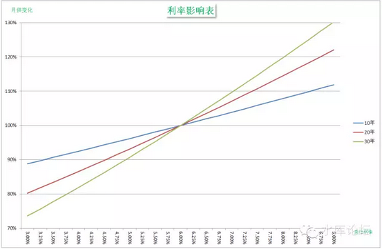
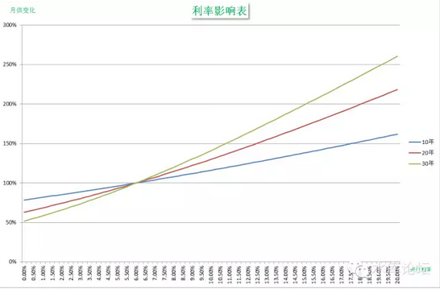

# 利率与房价的精算法 \#2270

原创： yevon\_ou [水库论坛](/) 2016-07-30

利率与房价的精算法 \#2270

利率每加息0.25%，房价下跌1%

不是30%，不是50%，是精确的1%哦。

一）学院派

学院派和实战派的区别是什么：学院派全部都是猪。

就学术文章而言，我最钦佩的是谢国忠。他的套路通常是这样的："美国经济不振，连累到欧洲出口，欧洲导致油价上涨。中国政府为了抑制通胀，有可能加息。加息要跌多少呢，跌50%"。

然后我不再钦佩Andy
Xie了，转为钦佩采访他的媒体人。这得有多大的勇气，才敢刊谢国忠专访呀。

学院派的文章，有一定的套路共性。其一个潜规则，是绝不可批评政府的经济政策。

而另一方面，下里巴人的"房型，交通，采光"，那群家伙又不懂。肥肠满脑百无一用书生。

所以，学院派的文章，基本集中在"利率，汇率，宏观财政政策"。这样，既显得高大上，又指点江山高屋建瓯。

示例一篇，最近水库上转载的文章。《**星展银行柯大任：亚洲房价将持续增长**》\[1\]

二）利率

对于学院派的分析文章，"利率"是一个至关重要的变量。一般来说，[利率上升，房价下跌。利率下降，房价上升]。

这个道理，简直就和"加息抑制通胀""加息祸害股市"一样*金科玉律*，一样蔚为*主流*。

甚至有一个"共识"的观点，香港1997年房地产市场泡沫"破裂"，是因为利率变化，联系汇率导致的香港宏观经济失衡。

我们为什么看不起学院派"经济学家"，因为他们一方面狗屁不懂，一方面却出奇地懒。懒到不愿意思考，不愿意计算。简直就是政府眷养的一条狗。

为什么呢，因为有实战经验的炒楼客都知道，利率是根本不敏感的。

让我们来看一个例子。假设某人贷款了70万元，时限二十年，享受九折利率。

则在2015年3月1日降息之前，他的利率是5.4%，月还款=PMT（5.4%÷12，240，-700000）=4775.76元。

降息之后，他的月还款额是4687.63元。

在学院派经济学家中，他们会先给你列一个20页的报告，让手下的研究生花数十个ManHour搜集数据。最后得出结论:

"*在收入比重中，房贷占比例下降，有利于内需类股票，以及房地产价格上扬*"。

这个幅度是多少呢，谢国忠一开口就是50%

泡沫全是丫吹出来的。

三）利率影响图表

我们来看一个算法。

Case
A，某人买了一套100W的房子，首付30W，贷款700000元，时限二十年，利率5.4%。月供4775.76元。

Case
B，某人买了一套101.316W的房子，首付30W，贷款713160元，时限二十年，利率5.175%，月供4775.76元。

这二者是完全等价的！！

二者是完全一模一样的，都是月供四千七，都是二十年，都是每月按时供楼。如果一个家庭是丈夫负责月供的话，妻子甚至都不会知道他们的利率！

这意味着什么呢，意味着"更高的利率"和"更高的房价"是可以互换的。你发现加息后，每个月的月供增加了。但其实也可以理解成你买了一套更贵的房子，比例大概是101.3%

在2005年时，市场上"房价压力"的情绪达到了顶峰。一群傻空天天在诅咒发梦房价立即崩盘。

当时的指望，就是"只要......就会......"，其心态和今天期盼不动产登记差不多。

当2005年十年周期第一次"加息"时，网络上一篇欢腾。典型舆论是"今天阁楼打了二两酒，热泪盈眶，想想HW政府还是关心我们的。心里面有老百姓"。

学过真正的"经济学"，学过奥派经济学，而不是马路上大卡谢安迪的我们，不由得大跌眼镜。拿出来Excel表格算一算，数据其实很简单的就在这里。

影响不到1%

基本被市场忽略。

"利率"是几乎每一篇学院派房地产分析文章必然涉及的。但他们关于"利率"的分析全部都是错的。

利率是可以定量计算的。只要你知道几个简单的算法，便可以将利率换算成房价。

上表我们贴了一张图。贴了6%附近的利率换算变化。我们可以得出：

1）这基本是条直线

2）每加息1%，十年期月供增加约4%。二十年期7%，三十年期10%

3）拉到极限，也就一次年轻人加薪。

你即使把利率拉到9%，这是不可思议几十年未遇一次，而且要花好几年时间慢慢地加上去。

但月供幅度也就+15%，小年轻一年的加薪幅度就补回来了。房贷总是越还越轻的。

另外还有一张大图。利率范围从0%\~20%的。更大尺度中，依然是近直线关系。

四)利率的分析

目前市场上的利率分析，他至少有几点是错的。

1）夸大了利率的影响

2）混淆了"平均利率"和"一年期利率"的概念。

3）忽略了首付

在我们的分析中，利率对房价的影响，大约局限在±5%之内，但到了媒体的嘴里，却成了±50%

很多订阅财经杂志，但事实上什么也不懂的白骨精，于是就阵亡在媒体的"引领"之中。

在这里，奥地利学派经济学，和主流洗脑经济学，又一次拉开了差距。

首先，即使不考虑定量计算，纯理论学术，"学院派"也是错的。

学院派混淆的第一个错误，是长期利率与短期利率。

2003年巴曙松大谈"加息降房价"，引人侧目。在他的头像旁偷偷加上注解。后来这家伙果然去翻译《21世纪经济学》了。

因为2003年时，其实是减息。

人的一生，房贷漫长达十几几十年，往往会经历二至三个"加息""减息"周期。

如果简单的讲央行今天加息，今天减息，并没有太多的意义。因为今天减了，明天就会加。

真正有意义的，是"二十年期平均利率"。又或者是市面上十年期国债曲线。

在美国，则是固定利率贷款。

通常这个利率波动幅度，要比"一年期"利率变化缓慢得多。

其次，即使考虑"十年期国债利率"，他仍然有价格波幅。其震动幅度，会有上下二个点。

但这±2%的幅度，并不足以引起房地产市场±50%的波动。

如我们图中表格换算，如果取二十年期贷款为主流，则口诀是"1：7"。

±2%的利率波动，最多会引起14%的房价波幅。

但是这个14%，仍然不是最终的输出。

房贷有首付，假设我首付三成，贷款部分只剩70%，则贷款的受影响幅度，就要打七折了。

而中国的首付是多少呢。在上海北京这样的大城市，大约是58%。以全国范围，则是65%。

也就是说，售楼处打开大门，六成人是付全款的。想不到吧！所谓"房地产影响金融安全"，纯属捏造与谎言。
 

当买100W的房子，65W是首付，35W是贷款。则贷款的波动，对全局的影响，要进一步缩小。

最终结果是14% \* 35% = 5%

利率对房价的影响最大上限不超过5%，这就是我们的结论。

四）   社会资金成本和心理影响

有人或许还会说，利率的调整，还会影响到社会资金成本供需关系。至少，KFS的成本就上升了。

其实，央行对于利率的调整，应该是"零效应"。他不改变任何生产关系。

因为我们把所有学术的东西都抽走了本账号不讲，所以你只要记住这个结论就可以了。

还有人说，即使哪怕你书呆子坐家里铅笔纸计算出来，加息对于房价的影响微乎其微。可是我们还有CCAV，还有舆论媒体啊。通过在市场上造势，煽动恐吓民众的心理。也可以让他大跌个三五成。

你要硬扯到群众心理学上，那话题真是没底了。

我们只想回答说，"心理影响"从根本上说，他是为零的。从哪里赚来，到哪里回去。有恐慌下跌，就有恐慌上涨。决定事物价格的，归根到底还是供求关系。

我们对利率的评价，科学态度是"影响轻微"。而不是鼓吹房价永远涨。

当加息周期时，利率不会使得房价下跌。影响轻微。

同样道理，目前的几次降息，也不会使房价上涨。

(yevon\_ou\@163.com,2015年3月8日午)

\[1\]《**星展银行柯大任：亚洲房价将持续增长**》 http://www.shuiku.net/forum.php?mod=viewthread&tid=11396
