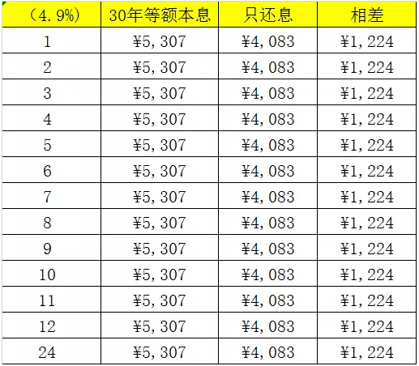
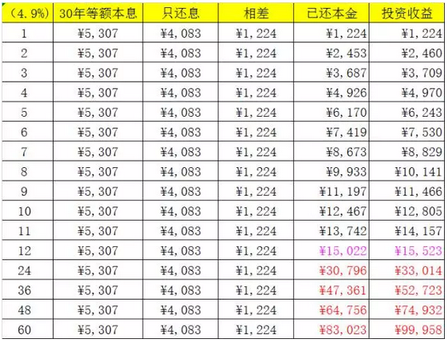
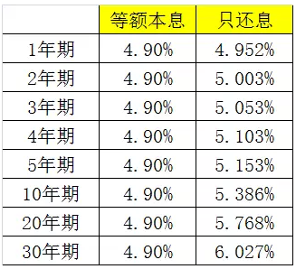
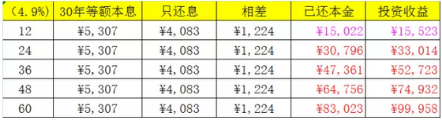
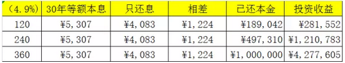
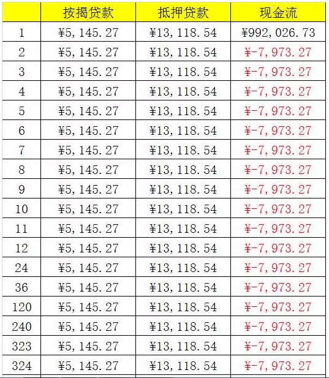
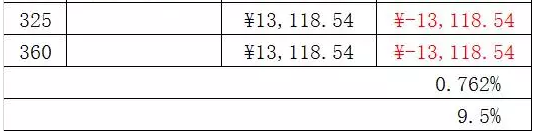
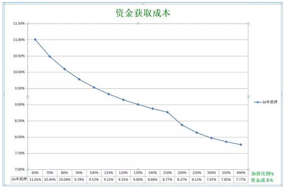
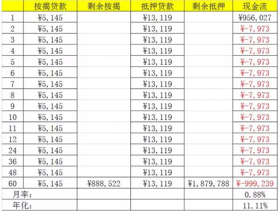
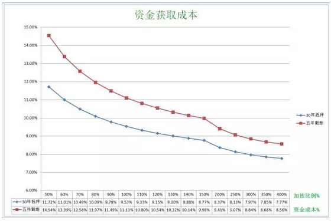

# 近期新型贷款产品精算 \#2285

原创： yevon\_ou [水库论坛](/) 2017-08-26

 近期新型贷款产品精算 ~\#2285~
============================================================================================================================================================================================================================================================================

 

贷款存在最优解。

 

 

一）新产品

 

水库的贷款精算数篇，诸如《[贷款选择的精算法](http://mp.weixin.qq.com/s?__biz=MzAxNTMxMTc0MA==&mid=2651014883&idx=1&sn=195e342e92a5635858be302d98541683&scene=21#wechat_redirect)》~\#2280~等，写于2016.7月。

近期，上海市场不断创新，又涌现了一系列的"新型贷款产品"。

 

这些新贷款产品的优劣如何，应该如何选择比较。值得我们再写一篇精算法。

这些贷款产品主要有：

-   还息不还本贷款

-   还息，年末还1%贷款

-   还息不还本，前置手续费贷款

-   还息不还本，每年（3年，5年）过桥贷款

-   30年期抵押贷款

-   30年期抵押贷款，前置手续费

 

 

 

二）还息不还本

 

首先我们讲述一个概念，"还息不还本"好不好。

 

之前《[贷款选择的精算法](http://mp.weixin.qq.com/s?__biz=MzAxNTMxMTc0MA==&mid=2651014883&idx=1&sn=195e342e92a5635858be302d98541683&scene=21#wechat_redirect)》~\#2280~中，我们曾经讲到，贷款这种事，是严格存在"最优解"的。

别听《理财周刊》垃圾杂志，文科生小编的乱写。啥狗屁"等额本金/等额本息"各有千秋。

 

事实的真相是，等额本息就是好。

所有贷款产品中，最优解就是"30年期等额本息"。没有质疑，没有但是。只有数学。

 

 

贷款的好坏，关键看：还得越少越好。

我们来看一串数字，每10000元借款，月供：

-   30年期等额本息：53

-   30年期等额本金：68

-   20年期等额本息：65

-   20年期等额本金：82

-   10年期等额本息：105

-   10年期等额本金：124

-   10年期抵押本息：116

 

2016年之前，所有的贷款产品之中，最好的是："30年期等额本息"。每10000元借款，每月月供53元。

 

在一个剧烈通胀的时代，还得越少，就意味着你有更多的子弹，可以投入下一笔交易。

而且随着水库中人"收入证明"越发吃紧。[收入证明也是一项稀缺资源，低月供容易审批。]

 

 

 

如果你数学很好，你还可以仔细看53这个数字。该数字还可以划为二部分；

-   利息部分：41元

-   本金部分：12元

 

从理论上，你的"月供"还可以再降低。降低到每10000元借款，月供41元的地步。

 

因此，2017年新出现的"只还息不还本"贷款，是比"30年期等额本息"更优异的贷款。

 

等价于"3000年等额本息"。

 

 

 

三）定量计算

 

在小密圈（最近改名为：知识星球）里，最近一直有人问我："银行提供二种金融产品，应该如何选择"。

 

"只还息不还本"，是一种比"30年期等额本息"等优异的贷款。

可是具体优异多少呢。

我们列Excel表来看。

 

 

还是以贷款100W元为例。

 

第一个表格十分简单。

"30年等额本息"月供5307元。

"只还息不还本"月供4083元。

每个月相差1223元。每个月都是如此。

 

 

如图，第二个表格信息更加丰富。

当我5307每月，苦苦月供12个月之后，系统显示你一共"还清"了本金15022元。

 

而假设这"每月1223元"我拿在手里，并且去做投资。

投资回报预估为12%，每月1%（很高了）

则12个月之后，我会拥有15523元。多了500元。

 

如果按照100万元本金，多赚500元，相当于0.05%.

也就是"只还息不还本"相当于年化利率4.85%

 

 

我们仔细观察这个表，发现随着时间推移，二年，三年，"只还息"的威力渐渐显现。而且时间越长，威力越大。

具体的计算，牵涉到Goalseek，十分麻烦。我们直接贴答案；\[1\]

 

 

五年期"只还息不还本"产品。哪怕5.15%利率，也和你4.90%等额本息一样划算。

只要银行给我\<5.15%，还息不还本就更划算。

 

或者说，差别0.25%/年。

 

 

[值得注意的是：]

如果拖长到30年，则"还息不还本"将远远跑赢"等额本息"。

6.03%还息不还本 = 4.9%等额本息

4.90%还息不还本 = 3.28%等额本息

 

 

 

四）变种

 

单纯的"只还息不还本"产品很少。还有二个变种；

 

-   只还息不还本，年末还1%本金

-   只还息不还本，前置手续费

 

这二个东西的具体精算法，如果写成Excel，足以绕得你头晕。我们就简单地说一下"估算"的方法。

 

 

"只还息不还本"的优势在于，他每年可以"节省"大约本金1.5%的资金，捏在手里，另外去做投资，从而获得远远超过4.9%的回报。

日积月累，当有奇效。

 

每月1224元，每年15022元。

这一块的节约并不大，每年也就1.5%

因此，如果按照银监会要求，部分银行产品，必须每年"回本"。 

-   到年末还1.5%，则优势被拉平。和"等额本金"几乎完全相等。

-   若年末还1%，则优势被抵消2/3。

 

  

对于"前置手续费"的产品。我们看这张表。

 

可见，"只还息不还本"产品，第一年"只省"了500元。

第二年一共省了2200

第三年一共省了5300

第四年一共省了10100

第五年才省了17000

 

因此，这里面的"利益"是非常非常微薄的。

不值得付任何手续费，付费就是亏损。

 

 

(当然，30年后，这数字挺大的)

 

 

 

五）过桥贷款

 

过桥的成本远远高于想象！

 

和"只还息不还本"相伴随的，是"过桥贷款"。

有很多家银行，开出来的条款如下；

 

-   平时只还息不还本。

-   每12个月（36,60），彻底还清本金。再借出来。

 

 

首先，我要提醒各位："过桥"的成本，是非常非常高的。

"过桥"在财务上，体现为巨大的"[针刺效应](http://mp.weixin.qq.com/s?__biz=MzAxNTMxMTc0MA==&mid=2651015001&idx=1&sn=862c91111a6a44fc7f593eb8948753f7&scene=21#wechat_redirect)"。

 

过桥不是信用卡，3\~5W的随便凑一下就可以。

面对300\~500W的大额资金吞吐，任何人（尤其多军）都不可能放这么多的"低效"现金在身边，坐等贬值。

 

 

因此这笔资金，就只能靠"拆借"。尤其是借助多军内部的拆借网络。

譬如20W一笔，在微信"拆借群"里，向30个人筹集。

 

多军目前的拆借利率，均衡在万四左右。

而银行的放款，远远慢于预期，甚至处于一种"不可控"的状态。

 

过桥最大的风险，时间往往会失控。

 

虽然银行都拍胸脯保证"7天放款"，但一般建议至少预留14天。

按照万四的规矩，0.04%\*14=0.56%

已经半个点的成本上去了。

 

 

而过桥真正的风险，还是"进去就不出来了"。

这事银行也常做的，银行某些时候和流氓无异。

 

凡是遇见这种情况，企业家基本就要跳楼了。

中国从80年代开始，无数的民营企业家破产跳楼。其中绝大部分并不是因为"经营不善"。而是因为银行"过桥了，不放出来"。

 

《人民的敌人》\-\-\-- 大风厂

 

久而久之，甚至形成了"谈之色变"的风气。江浙的小老板，彻底抗拒银行贷款，宁愿找民间借贷。

不是不愿意付息还本。而是银行实在"声名狼藉"，比高利贷大耳窿还不如。

 

中国的民营企业贷款，全部都是一年期的。到了年底就要还进去，过桥次年再借出来。

对于生产力是巨大的破坏，平白折腾，毁家败民无数。

多年顽疾，因为"不可说"的原因，始终不肯取消。

 

 

当我们谈论到"过桥贷款"时，水库上的态度是极为清晰的:"一律不要"。

你不需要介绍具体的利率，条款，细微款项。

一听说是"过桥"，一律都是垃圾，一律不要。

 

 

但也有某些情况，有时候网友问，"只还息不还本，五年到期续期"

"只还息不还本，三年到期续期"。

在这些情况下，偶尔我们也会回答"好的，可以"。

 

那么，是不是因为"过桥"巨大的成本和风险，可以分摊到五年，三年，使得其看上来不那么可怕？

 

全错。

 

我们首肯"五年过桥"产品的唯一原因，是：五年内你会把房子卖了。

对于咨询的客户，我们会观察他的思路和选筹。

如果五年之内就会把房子抛了，那自然也就没有过桥的什么事。

 

再重复一遍，过桥的主要风险是：

"无信誉，不可控"。

 

 

 

六）30年期抵押贷款

请先阅读《[[截断和再抵押]](http://mp.weixin.qq.com/s?__biz=MzAxNTMxMTc0MA==&mid=2651014912&idx=1&sn=42f1eacd72da0e7e87280d55f206937f&scene=21#wechat_redirect)》

在水库之前文章《[截断和再抵押](http://mp.weixin.qq.com/s?__biz=MzAxNTMxMTc0MA==&mid=2651014912&idx=1&sn=42f1eacd72da0e7e87280d55f206937f&scene=21#wechat_redirect)》~\#2330~中，我们说到"裂变的阈值，大致是贷款Ｘ３，最好是4倍"。

 

这其中最大的损耗，其实是把"30年贷款"截成"10年期"的抵押贷款。年限缩短，腾挪余地急剧减少。

 

2017年起，市面上逐渐出现了大量"30年期抵押产品"。在新的金融工具刺激下，对于"裂变"的阈值也大大降低了。

 

 

我们依然用Excel列表。

假设原有一笔100W元，85折，剩余年限27年的贷款。

裂变成为100+X元，1.4倍上浮，30年期抵押贷款。

请问X和"实际利率"之间的关系是多少

 

（本例中，取加按一倍：X=100%）

 

如图，第一列的公式是：PMT（4.9%\*85%/12,324,-1000000）

第二列的公式是：PMT（4.9%\*140%/12,360,-1000000\*(1+X)）

 

现金流第一行是：100W\*X + 5145.27--7215.20

以后每一行都是: 5145.27 -- 7215.20

 

最后针对"现金流差异"那一列，拉一下IRR。

 

将不同的X=50%，60%，70%，80%.........依次代进去。我们得到如图：

 

我们分析这张图标，他大约在1.8倍时，综合利率跌破10%

2.3倍时，跌破9%

4倍时，跌破8%

 

因此我们的建议是，贷款增加到2.3倍，可以加按。

 

 

 

七）30年期抵押贷款+5年截断

 

最后，我们再来谈一个更务实的问题。

 

假设某人从按揭贷款"截断"为抵押贷款。但是他不持有30年，预计5年左右就要抛售。

而且还付了1.8%的"贷款手续费"。

请问这种情况如何计算。

 

这个Excel很复杂，但却是很符合"事实环境"，群众需求很大。

因此我们再计算一次。

 

（本表示例，X=100%）

 

这其中最主要的区别，是第一行，最后一行。

第一行算法是： 100W\*100% -200W\*手续费 +5145 - 13119

最后一行的算法是： 5145-13119 +888522-1878788

 

 

我们观察这张图，在"手续费五年分摊"的大前提下，平均资金成本增加了大约1%

基本上"红线"总成本都要在10%以上。

 

 

 

八）结语

 

本篇知识点比较多，我们概括总结一下：

 

1）低月供节约收入证明

2）"只还息"比等额本息更好，约降息0.25%

3）"只还息"如果有附加条件，则好处消失。

4）"过桥式"贷款一律不要

5）30年期抵押，贷款放大2.3倍，就可以截断

6）短炒手续费实战，资金成本+1%

 

 

（yevon\_ou\@163.com，2017年8月25日午）

\[1\] Excel\--\>单变量求解\-\--\>15522减15021的差值为0，求解利率。

 

 

今天有广告，非常巧，是一个贷款类广告。

框内是广告区域，照例不背书。欢迎广告投放。

