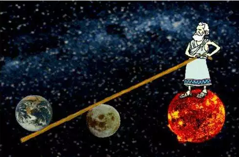
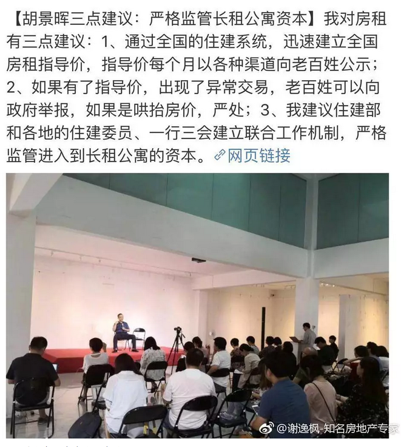
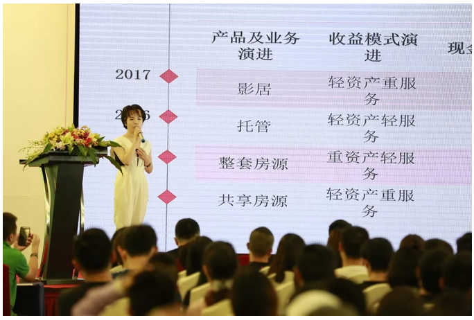
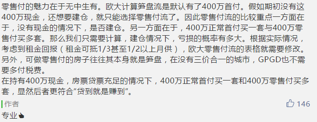
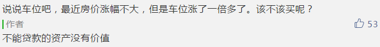
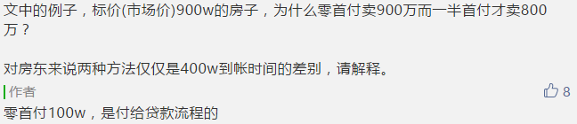
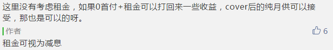
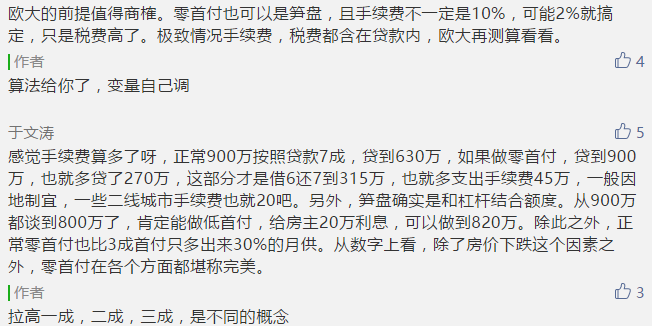
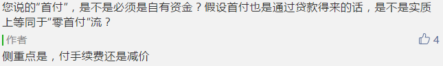

# 杠杆与笋盘哪个更重要 \#2295

原创： yevon1ou [[水库论坛]](/) 2018-08-20

**杠杆与笋盘哪个更重要 ~\#2295~**

 

时机最重要

 

 

一）前言

 

今天晚上如果要追热点的话，理论上应该写"房租"。

例如上这张图：

唉，世界上怎么会有这么蠢的人。

不仅蠢，而且坏。从大脑到心脏都坏透了，堪称新时代的人渣。

 

-   房地产调控的事，从来没有人问"房东"的感受。

-   你抓住中介盘问不休，我也真是服了。

 

难怪5i5j越做越差，每况愈下。

高层都是这种人。智商徘徊在僵尸与丧尸之间。

 

可是哥哥刚提笔想写，长叹一口气。

再叹一口气。

算了，咖啡御免。

 

"长租公寓"这个话题，已经有奥派同仁布尔费墨，菁城子挡在前面。

珠玉在前。就不用我再堵枪眼。

俺还是"斗长命"吧。

 

因此，今天我们不追热点。我们普及数学。

 

-   布尔费墨《[[那些关于房租的假话和蠢话]](https://mp.weixin.qq.com/s?__biz=MjM5NjkyOTcwMw==&mid=2649659271&idx=1&sn=5ee056ebca76ebd061f8460c90af1ff6&scene=21#wechat_redirect)》

-   菁城子《[[最近，房租为何大涨]](https://mp.weixin.qq.com/s?__biz=MjM5ODc2ODA0Mg==&mid=2653091009&idx=1&sn=9dfdb3c178098fba97e2878577e50f32&scene=21#wechat_redirect)》

 

 

 

二）精算

 

今天静下心来，做了一些测算。

 

测算的数据，是地产圈长期以来，争论不休的一个话题：

"零首付流派"划算，还是"笋盘流"划算。

当我遇见选择时，是应该尽量追求杠杆，还是尽量追求折价？

 

 

这个问题，定性来说，我们心里有谱的。

定性的说：

-   假如涨幅较小，笋盘流划算。假如涨幅较大，"零售付"划算。

-   便如同二条曲线，在某处相交。

 

但是，定量的计算，我们从来没有做过。

静心算了一下，结论颇为有趣。

 

 

 

三）零首付流派

 

假设有一套房子，价值900W。目前有二种算法，请比较：

1）首付0W，贷款1000W，手续费100W。

2）首付400W，贷款400W 

 

第一种办法，是"杠杆最大化"。

第二种办法，是笋盘压价。净支出只有800W。

 

这二种方法的盈亏平衡点在哪里。

哪一个因素，对收益影响最大。

 

这一类的数学，十分简单。

只不过没有人系统地"教科书式"计算过罢了。

 

我们可以列出这样一个表：

  月数   月供     剩余贷款
  ------ -------- -----------
  0      0        -10000000
  1      -68169   -9976748
  2      -68169   -9953391
  3      -68169   -9929929
  \...   \...     \...

 

这是"零首付"流派的现金表。

首先，你会惊讶地发现：

零首付流派，其实并不是零现金。

 

 

"零首付流派"还是需要支出现金的，而且金额还不低。在某个时刻，甚至比老老实实"笋盘流"支出的现金更多。

 

因为"零首付流"名义上，你完全不需要首付，得意洋洋。

但在实战中，一旦你完成了"交易"。几乎很快，你就要开始付月供。

 

而且因为你是"零首付流"，你拉高了总价，进行了更大量的贷款。

包括贷款和手续费，会压得你喘不过气来。

月供远远超过正常流派。

 

  月数   月供     剩余贷款
  ------ -------- -----------
  0      0        -10000000
  1      -68169   -9976748
  2      -68169   -9953391
  3      -68169   -9929929
  \...   \...     \...

 

你看表格中，买一套价值900W元的房子。

但是月供却要付68169，一年需要8.2W，相当于房屋总价的9%

 

如果你一张完美的"零首付"单子，拖上了三年。

则你仅仅还月供部分，就花掉了房价的27%

 

 

我们内部戏谑称"零首付流派"，叫它-100+10X

意思是说，什么事情也没做，你先亏100万。

此后，由于你零首付（一成首付），杠杆高。涨幅可以Ｘ10.

 

"零首付"这个流派：

-   如果房价不涨，你就死定了。

-   如果房价微涨，你就小赚。

-   如果房价大涨，你才大赚。

 

进一步的计算回报率，我们可以列出这张表：

  月份         现金流     现金流     现金流
  ------------ ---------- ---------- ----------
  0            0          0          0
  1            -68169     -68169     -68169
  2            -68169     -68169     -68169
  3            -68169     -68169     -68169
  4            -68169     -68169     -68169
  5            -68169     -68169     -68169
  33           -68169     -68169     -68169
  34           -68169     -68169     -68169
  35           -68169     -68169     -68169
  36           -68169     -68169     -68169
                                     
  年末负债     -9093643   -9093643   -9093643
  期末估值：   9500000    12000000   15000000
  售房所得：   406357     2906357    5906357
                                     
  净收益：     -2047725   452275     3452275
  IRR月：      -14.32%    0.90%      4.33%
  IRR年：      -84.35%    11.29%     66.22%

 

这是一通36个月的还款表。

-   第36个月，你还欠银行9093643元。

-   假设卖房可得950W，1200W，或1500W元。

-   对应利润-205W，45W，345W

-   年化收益率-84%，11%，66%

 

更为直观一点，我们可以做出这个图： 

 

图表的意思是，一套"零首付"900W的房子，如果持有五年，房子涨到1400W，则你的年化回报率是12.50%

 

咦，似乎也不高啊？

 

 

 

四）笋盘流

 

我们进行第二套算法。"笋盘"流派。

 

假设一套900W的房子，被你以800W买到。

首付400W，贷款做得不好，只能贷400W。

过了三年，分别还是售900，1200，1500W，请问回报率多少？

 

  月份         现金流     现金流     现金流
  ------------ ---------- ---------- ----------
  0            -4000000   -4000000   -4000000
  1            -27268     -27268     -27268
  2            -27268     -27268     -27268
  3            -27268     -27268     -27268
  4            -27268     -27268     -27268
  5            -27268     -27268     -27268
  33           -27268     -27268     -27268
  34           -27268     -27268     -27268
  35           -27268     -27268     -27268
  36           -27268     -27268     -27268
                                     
  年末负债     -3637457   -3637457   -3637457
  期末估值：   9000000    12000000   15000000
  售房所得：   5362543    8362543    11362543
                                     
  净收益：     380910     3380910    6380910
  IRR月：      0.22%      1.54%      2.45%
  IRR年：      2.68%      20.14%     33.63%

 

画成图表，则更加直观一点。

实线是"零首付流"，虚线是"笋盘流"。 

"笋盘流"几乎一直都在盈利线以上。

三年涨+40%，或者五年涨+64%以上，则笋盘流被"零首付流"收益超出。

 

 

哥哥盯着这个图表，左看右看，左看右看了半天，最后得出一个结论。你知道是什么：

"零首付流"毫无价值。

 

为什么，因为你看看这个图表。"笋盘流"已经非常完美了。

以三年计算，笋盘流已经提供了+20%年复合回报。

作为"稳健投资"，每年有+20%很不错了。

 

 

而"零首付流"要到三年涨幅+40%之后，收益才能反超。

之前一直是巨额亏损。

亏损，呃，俺不能接受亏损。

 

对于绝大多数的投资者而言，收益率+40%以后，+60%还是横财，带来快乐有限。

而亏损的"巨额风险"绝对不可以接受的。

 

 

从风险喜好角度，是不是该把"零首付流"给毙了。 

（在8.18的影居活动中，罗尼大声呼吁，"零首付流"过度进取，风险重重。她说得对不对？）

 

 

 

五）超短期

 

哥哥手贱，我又测算了一个"一年期"的回报率。

然后我默默给自己写了四个字："以上全错"。 

真的是，令人印象深刻的............超级曲线啊。

"零首付流"的回报曲线，一骑绝尘，远远向着4000%走去了。

 

我们之前看"三年期，五年期"的回报率比较，"零首付流"并没有特别优势。

因为零首付也要付月供，三年填进去了27%的房款。

 

但是"一年期"的比较，则非常惊人。甚至远远打爆了表格的上限。

在整个标量中，最重要的真是"时间"。

 

如果你追求短期快涨，大涨前夜。则应该追求杠杆。

如果你持有时间较长，则应该追求笋盘。

 

关于"杠杆和笋盘"的争议，最应该问的，是你预期要持有多少年。

越是确定在"大涨前夜"，而且涨了就可以抛现，一年以内，就应该选择杠杆。

 

 

众所周知，水库的主要手法是"大面积，低单价"。而且流派倾向于长持为主。

我们去到一个新的城市，往往会期待一个十年的雪坡。

水库主要的审美观，还是侧重"淘笋"，而不是"拼命加杠杆"。

 

蓝色水库：亲，我有一个问题咨询你。

蓝色水库：同一个小区有二种车位，一个价格16W。一个价格32W，但可以贷款50%。请问哪种好。

Yevon\_ou：............

 

 

 

六）关于风险的把控

 

对于风险，我想很多人都误解一件事。

所有的风险，都是边际风险。 

 

譬如说，一个人有2000W净资产。然后他跑到CQ，全款"零首付"买了一套房子。

你说他"风险"么。CQ人都要吓傻掉了。日夜担心。

 

但是你说"安全"么，对于一个有2000W净资产的人来说，多加一套80W的房子，算什么风险。

 

哪怕他少付了24W首付，说不定他自己的主力仓位。三个月月供就十几万了呢。这半年下来，总负债还是减少的呢。

 

 

对于绝大多数人来说，他的"底仓"是不动的。京沪深大型的，高价值的物业，想动也没法动。

 

"不动如山"。如果你90%的仓位，都是稳岻如山岳的。

那么你10%的先头部队，刀磨得再快，又有什么关系呢。

 

几乎所有的多军，都缺乏现金。而自己的债务，每个月都在减轻。

把少量"高能"的先头部队，磨得尖锐一点，又有什么关系呢。

 

你看到的全力一刀，其实并不是全力一刀

 

对于我们来说，"锐刀"亦无非一种财务工具而已。

你肯不肯多出10%的手续费，"借900W，还1000W"。

 

类似的决策，是与否，唯一的影响因子，也仅仅是数学。

和道德无关。

 

 

你的父辈们，连贷款都没见过。背一点点贷款，吓得夜不能寐。

但经历过的人都知道，这都是很小，很安全的事。

 

没有坐过云霄飞车的小孩子，不用惊吓的哇哇大叫。

 

 

 

（yevon\_ou\@163.com，2018年8月20日丑）

