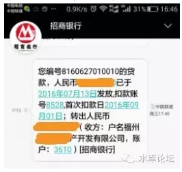

# 网签和贷控 \#2310

原创： yevon\_ou [水库论坛](/) 2016-08-04

网签和贷控 ~\#2310~

 

抑郁症又犯了，更新会慢点。

 

事在人为

 

 

一）网签

 

城市分二种，一种是有网签的。例如北京，上海。

另一种是没有网签的，例如深圳，南京。

 

 

网签几乎所有的条文都不重要。因为网签有一个规矩，它可以加"附加条款"。

也就是你可以在附录多打几页，这几页是不用上传的。

 

在"附页"中，你可以约定"原文第十五条作废，以本条为准"。

"原文第十七条作废，以本条为准"。

 

 

网签中真正起决定性作用的，而且不可被附页替代的。主要是第一第二页。也就是：

1）买家姓名

2）价格

3）贷款金额

 

只有这三样信息是不可更改的。其余的付款方式，交房时间，违约条款，装修保留等等，全部可以"以附件为准"。

只有这三条信息，交易中心+银行+税务所，是统一口径的。

 

 

也就是说，凡是实施了网签的城市，不可以做阴阳合同。

-   你报什么价，就要按什么价交税。

-   你交税什么价，贷款就贷金额七成。

-   你想做高首付，就要借六还七

 

 

二）城市的差异

 

城市之间，有很大的差异。

一般来说，越是往南，"改革开放"的春风越是吹拂大地。越是繁荣自由商业化。

越是往北，"管制"越严重。权力肆虐，商业化程度低。

 

 

相比之下，深圳的网友，就要比上海幸福得多。

因为深圳是"非网签"城市。其核税价格，可以写低到20万元/套。轻徭薄赋。

 

因此"凤姐变冰冰"流派，最初兴起于深圳。而上海虽然有老公房之王，却依然以长持收租为主。

深圳还有一个bug，以企业名义买卖，不受限购限制。而且有"营业税豁免条例"。那简直是短炒的天堂了。

 

 

问题一：深圳核税价和过户价，可以不是同一个价格。是否意味着巨大的战略优势。

 

答：其实也不是很大。

因为"高评"一般是一种稀缺资源。哪怕没有"借六还七"肉疼，你也不可能把价格无限写高。

一般就写高成110\~115%，非网签的优势相当于二成首付。

 

 

问题二，请分析一下北京市场。

 

答：北京是最可怕的市场。因为北京是一线城市中，迄今唯一征收20%所得税的。

二手房几乎完全无法交易。

 

以一套北京的学区房为例。当年老人家房改获得，成本10W。现在售价1000W。

则差价所得税你就要交200W。

 

算上营业税，契税，总交易费用高达270W。或者说总价的27%。

或者说"写低交易"的话，是"付三得四"。

 

 

因此北京市场是严重的写低市场。能写多低写多低。完全贴着下限走。

一般有些历史年头的盘，网签过户价只有实际价格50%

贷款只有30%

现金耗用巨大。杠杆无法生存。堪称炒楼客的墓地。

 

目前北京普适行情，房屋买卖时，下家要结离婚。

上家也要结离婚。

"净身出户"，然后再熬到满五唯一。然后上家才挂牌卖房子。

这段子都能进德云社了。

 

 

问题三，请分析一下香港市场。

 

答：香港市场极度不友好。

 

香港人第一次买房，按金额阶梯，契税1\~4%（一般你看得上眼的，都是4%）

非香港人非第一次，一律"双倍印花税"。即契税8%

然后如果你是大陆人士，或者以企业购买，还要加"特殊印花税"15%

 

也就是大陆人去香港买房子，契税要交23%

当然有人说KFS补贴23%，对于这种智商充值，俺就哈哈。

 

 

更惨的是，在23%的基础上，香港银行还不提供金融支持。

目前香港房贷利率在1.75%的确是不假。

但问题是金融管理局出了"指引"。

-   700W以下物业，最多贷60%

-   700W以上物业，最多贷50%

-   第二套住宅，最多40%

-   非自用物业，最多40%

 

也就是说，我在支付了23%的契税之后，香港金管局贷款40%给我，还假惺惺地说"防范风险"。

前二天和香港的谭叔有一阵对答，写道了香港衰退的原因。有兴趣可参阅《与无政资谭叔的对答》\#F580

 

 

 

三）贷控

 

随着"零首付精算法"高评接踵而来的，是"贷控"。

 

举例来说，1000W的房子，贷款700W。

可是你写高成1100W交易金额，贷款770W。

这时候你给上家的首付300+770=1070，就产生了"贷控"的问题。[\[1\]]

 

 

贷控有AB二种解决模式。

无论哪一种模式，关键是上家的人品。贷控迄今不是100%完美的手法，人品至关重要。

 

 

A模式是230+770.

你给上家230，贷款发放770。款清。

 

这种A方案，有二个问题。

-   上家比较吃亏

-   首付收据不足

 

在整个流程中，上家是有风险的。他等于款没有收足就进交易中心了。

但实际操作中，A方案是主流的。占了80%以上。

 

A方案实施的首要前提，上家必须是一个诚实本分的人。

因为经过TG几十年的弱民教育，5060普遍是"大锅饭"一代。是老实本分的一代。

 

在这样的情况下，"下家"表现得有进攻性，上家往往宁愿吃哑巴亏。惯于被领导而不是领导。

你再嘴巴甜一点，诉诉苦家里人如何不容易。

颜值高的主动哭晕。哭晕在上家怀里。

 

一般上家也就应允了。230+770是很常见的模式。

而且卖房通常都是赚钱的。无非赚多赚少的问题。上家心态很好。

 

 

至于银行首付收据，更加不是问题。

绝大多数情况下，信贷员会帮你处理完毕。

实在不行，你让上家转回你即可。

 

甚至在跨行汇款时，账号写错一位。让汇款被弹回来即可。

 

 

 

四）B类贷控

 

比较棘手的，是B类贷控。

B类贷控是：300+770-70=1000

 

也就是说，你首付300W是付足的。

等贷款下来之后，让上家再还给你70W。

 

 

这种主要发生于上家比较搞，比较斤斤计较，比较老阿姨不好说话。

19%情况下，B类贷控也是风险可控的。

首先，你要看上家的职业。如果上家是"认认真真上班"的，最好是公务员，教师，白领之类有体面的职业。

则你几乎一点风险都没有。这样的人最怕你去公司里闹，而且他们也不会贪图70W。

 

你反过来想一想，1000W的房子都卖了，业主贪污你70W干什么。不就是小数点么。

有产者有恒心。

 

 

比较麻烦的，是小业主，企业主，社会上的混混，尤其是欠了一屁股高利贷需要卖房的人。

这个时候，就涉及到了C类贷控。

 

 

 

五）C类贷控

 

真正麻烦的，不是A类，也不是B类。

因为1000W的房子，最后为了70W的零头。B类阿姨也不会贪你的。

 

真正麻烦的，是C类贷控。占1%

C类贷控并不是买卖中产生的。绝大多数情况下是源于"药单"。

 

 

朋友zhifei有一阵子读"经济学"读僵掉了。他问我，既然"风险分析"已经如此发达，企业资信报告随处可见，为什么社会上还会有坏账。

我冷冷地嘲了他一句："你100W卖部机器，现在有个山西人出120W要买。"

"前提是必须120天付款，而且该企业有资质风险。请问你卖不卖"。

Zhifei若有所悟。

 

这个世界所有的坏账，全部都是源于贪婪。

风险本身就是利润的一部分。那些哭诉"诚信不足"的企业，也完全不值得政府拯救。

同样道理。炒房客一切的痛苦烦恼，都源于"药单"的超额利润。

 

 

如果你见到一套妥妥一千五百万的房子。只卖你1000W。

超值超笋。一见就喜欢。

可是这套房子里面，内含600W的私人借款。而且房主的个人信用口碑也不佳。

如果你想买这套房子，你就得先垫600W进去。

 

你先喝一口敌敌畏[\[2\]]，体会酝酿一下其中的苦味。

然后含着泪把这单子做完。

 

 

遇见这种情况，一般最好的办法，是去社会上找专业的"担保公司"。

三教九流，有这样专门的"贷款公司"。收费大约每个月7.5%

让房东和担保公司签合同。你别卷进去。

这是最省力的。多军老了，真心懒得解药单。

 

 

只有极偶然的情况下，"担保公司"不能介入。你要自己解药单。

这样的情况下，你的现金流其实是：600+770-370=1000

 

你先垫他600，押着他去把私人借款还了。把抵押证解开。

然后你交易过户，银行贷款770。

最后你要从他手里，再抽回370。

 

抽回370，而不是70W。这就是一个很大的数字，并且发生了"质"的不同。

如果为了7%，别人不会使诈。

如果为了37%，很有可能道德风险。

 

 

C类贷控解决的方案，首先你要和信贷员关系很熟。

信贷员必须精确地告诉你"放款"的日期。例如星期三的下午。

 

你押着上家，到银行里去办一张借记卡。

把网银，手机银行，U盾转账之类限额全部都开好。

一般过户之前，上家都愿意配合你的。

 

 

这里面最核心的一点，虽然身份证只能是上家的。但是"预留手机"可以是你的。而且网银所有的短信验证，都是你的手机。

等到信贷员通知"放款"的那一个下午，你就约好了上家，在银行的附近找一间茶舍"喝喝茶"。

 

大家聊聊欧冠杯赛，奥运金牌，气氛好得不能再好。

等银行放款时，他会有短信通知。

因为挂钩的是你手机，保持着高度警惕，"叮咚"一响，第一时间把资金"网银"转走。

 

 

根据我个人的经验，更好用的是lakala。在淘宝有售，50元/个。插在手机上的。

只要你接到了"放款短信"。你可以立刻刷借记卡"信用卡还款"。

诸如中信蓝卡，浦发，民生，华夏之类信用卡，溢缴款都是可以无损取出的。T+1工作日。

 

拉卡拉的好处，是你不用开电脑。不用等可怕的中国移动短信验证。

刷刷哗二下，转账走最快。

整个流程可以压缩在26秒之内。

 

注意说明一下，银监会要求"一阶贷后管理"。也就是放款后，第一次转账汇款，必须给监管部门报备。

所以你不可以网银直接转入下家借记卡。最好是同学和远亲。

 

 

C类贷控的风险是什么呢。风险是"借记卡支付渠道"实在是太多了。

上家完全可以凭身份证去挂失，要求换新卡。

上家可以凭身份证去更换登记手机，更换网银密码。

所以放款当日下午，你要请上家一起来茶馆喝茶。当着面看着。

 

 

另一方面，资金划拨，有超级网银。

这都是后台隐形的。不知不觉之中，卡内资金就被全部抽走了。

 

当然，很多银行网银可以查询"对外协议"，所有的超级网银都可以掐断。

但是支付渠道实在是太多了。你可以挂在支付宝，微信上面"快捷支付"。还有资金自动归集协议。

还有无数无数我们不知道的渠道。

 

所以我们还要"斗快"。

搞定信贷员，确保第一时间知道"款到卡中"是非常非常重要的。

款一到，你马上就抽走。26秒之内，我就是比你快。

 

 

 

总结性的来说，迄今为止，我们所有的"贷控"，没有发生过任何一笔坏账。

但是贷控始终做不到100%无风险。

 

事在人为，无差别人类劳动。

 

 

 

（yevon\_ou\@163.com,2016年8月4日午）

 

 

[\[1\]]如果交易中心核税价高于实际价，则应该不惜一切写高。免得浪费税钱。

[\[2\]]戏言。敌敌畏剧毒，0.00001%足以致人致死。建议以咳嗽药水代替。
