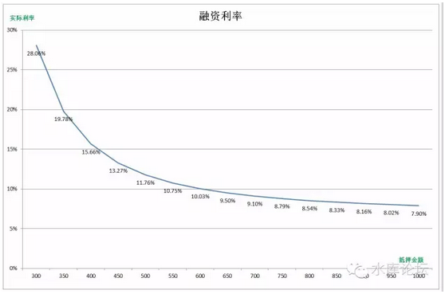

# 截断和再抵押 \#2330

原创： yevon\_ou [水库论坛](/) 2016-08-07

截断和再抵押 ~\#2330~

 

抵押贷款之所以重要，是因为绝大多数人对它的使用都是错误的。

 

 

一）劣质贷款

 

95%的人，对于抵押贷款的理解和使用都是错误的。

 

对于绝大多数人，他们认为的"抵押贷款"是什么。

他们认为是一种"劣质贷款"。

 

 

好比我正常的"按揭贷款"申请不到。无论是法拍还是药单流，我无法通过正常的渠道，申请30年期按揭贷款。

因而我不得不申请抵押贷款，这是一种退而求其次的做法。

 

对于很多人来说，抵押贷款就是一种劣质贷款：

           按揭     抵押
  -------- -------- ---------
  年限     30年     10年
  成数     70%      50%
  利率     P\*80%   P\*120%
  手续费   无       2%

 

可见，抵押贷款全面较差。只有无可选择的时候，你才会尝试抵押渠道。

 

 

很多人沾沾自喜，觉得自己手中的资产"高度优化"。

每一单都是70%极致贷款，七成七折三十年，完美无瑕。

 

因此"[抵押贷款一二三](http://mp.weixin.qq.com/s?__biz=MzAxNTMxMTc0MA==&mid=2651014908&idx=1&sn=7fcf1537987d7e7fd5df0ac296ca0240&scene=21#wechat_redirect)"一文，根本不足重要，也不值得细看。

 

这样的想法，大错特错！

 

 

 

二）截断

 

抵押贷款真正的用法，应该是把你的按揭还了，重新再抵押。

 

 

为什么，为什么要把优质贷款撕掉，换成劣质贷款。

答案只有二个字："成数"

 

请再回忆一下我们的说法，我们[对于利率完全不敏感]。

对于费率，费率其实就是利率，对于费率也不敏感。

只有"成数"，成数才是至关重要的。

 

 

一笔按揭贷款等你办完了以后；好比当年你买了300W的房子。贷款210W。

这还是主人足够Smart，竭力[尽贷]的情况下。

过了二三年，越供越少。你的贷款可能还剩190W。

 

可是这时候你的房子呢。如果以6年为一个周期的话，则2000年三百万的房子。到今天普遍市价都要800W以上。

190 / 800 = 23%

 

 

然后我问你，一笔23%的按揭贷款，和一笔50%的抵押贷款，哪个更划算呢。

答案还是抵押贷款。

哪怕利率高点，费率高点，月供高点，装修公司买字画折腾到想吐。

但还是按揭划算。

 

 

所以，这时候你就要做"再抵押"。用业内的术语叫做"截断"。

把30年期超优质按揭贷款给截了，重新抵押出来。

 

 

三）再抵押精算法

 

截断什么时候做，怎样的情况下才划算。

 

这需要非常详尽的精算。水库论坛之前有一篇《再抵押精算法》，可以去看一下。

http://www.shuiku.net/forum.php?mod=viewthread&tid=13024

 

 

我们用如下模型举例；

-   假设之前"按揭"贷款金额为200W，利率八折，剩余25年。

-   假设抵押贷款借X万。利率1.2倍。贷10年。手续费1.5%

 

              现金进      现金出
  ----------- ----------- ---------------------------
  第0个月     X\*98.5%    -2000000
  第1个月     10,468.59   PMT（4.9%\*1.2/12,120,X）
  第2个月     10,468.59   PMT（4.9%\*1.2/12,120,X）
  第3个月     10,468.59   PMT（4.9%\*1.2/12,120,X）
              10,468.59   PMT（4.9%\*1.2/12,120,X）
              10,468.59   PMT（4.9%\*1.2/12,120,X）
              10,468.59   PMT（4.9%\*1.2/12,120,X）
              10,468.59   PMT（4.9%\*1.2/12,120,X）
  第119个月   10,468.59   PMT（4.9%\*1.2/12,120,X）
  第120个月   10,468.59   PMT（4.9%\*1.2/12,120,X）
  第121个月   10,468.59   
  第122个月   10,468.59   
              10,468.59   
              10,468.59   
              10,468.59   
  第299个月   10,468.59   
  第300个月   10,468.59   

 

 

在第一个月，你可以获得抵押贷款X，再扣除1.5%手续费。

好比X=400的话，手续费6W，实际到手394W。

而你还要"还掉"原有贷款200W，实际仅获得194W现金。

 

在月供方面，原本每月10468.59元的月供不用还了。

但是改为新的每月=PMT（4.9%\*1.2倍/12月，120期，4000000元）

这个数字是44167.54

 

将"现金进"和"现金出"相加，即可以得到我们的净现金流。

然后IRR拉一下，就可以知道真实利率。

  现金进      现金出       差异
  ----------- ------------ ---------
  3940000     -20000000    1940000
  10,468.59   -44,167.54   -33699
  10,468.59   -44,167.54   -33699
                           -33699
                           -33699
                           -33699
                           -33699
                           -33699
                           -33699
                           -33699
  IRR：                    1.22%

 

因此，"按揭200W升级成抵押400W"，你这么做的事，实际成本是月息1.22%

折合年率15.66%

 

 

这里面的计算比较"理工男"。因此我们就不展开数学细节了。

直接来给答案。

 

-   假设"原按揭200W，抵押出来250W，300W，350W，400W，450W，500W......"，求各级的真实利率是多少。

我们有如下图：

 

四）再抵押的分析

 

看回上图。他告诉我们几个道理。

 

1）抵押至少Double起。

 

如果你原有的"按揭"是200W，则你"截断"换成抵押，至少应该是400W。

在这个位置，"利率曲线"下降得非常快。

一下子由28%，降到了15.66%

 

我们知道，15%基本上是"老派多军"比较能接受的一个利率。

所以你"抵押换按揭"，至少要贷款金额翻倍。这是起步线。

 

 

2）比较理想的是Triple

 

翻三倍。如果原有按揭是200，则"新抵押"追求600W。

 

我们可以看到，翻三倍之后，整个"利率曲线"就进去了一个相对平缓的区域。

这个时候，哪怕静候四倍，五倍，你的"实际利率"下降得并不多。

 

三倍之后，200-\>600之后，实际利率已经跌破了10%

一般我们建议，3倍之后，就可以开始考虑"截断加按揭"。四倍则是非常建议。

 

 

五）心算法

 

"截断再抵押"因为涉及的年限很长，复利很大。所以不能用简单的心算法。

 

心算法如下：

-   抵押的利率是1.2倍，4.9%\*1.2=6%

-   手续费1.5%分三年摊销，每年0.5%

-   原本按揭利率8折4%，现在变成6%，有2%的差额。如果是三倍的话，分摊0.66%

-   总成本6%+0.5%+0.66%=7.2%

 

可见心算法的误差是非常大的。要以电脑IRR为准。

 

\* 另外"截断再抵押"，如果你想好三年再截断。利率又会再高一点。

 

 

六）抵押的再抵押

 

一种比较不伤身体的，是"原有抵押贷款"的再抵押。

 

好比你上手就是"法拍药单"流。当初买来时，就没能办成按揭贷款。而是申请的劣质抵押贷款。

则你再过了三五年，重新申请抵押一次，那是任何心理负担都没有的。

 

 

因中国银监会禁止"二按"。所以一般操作中，都是"先还旧，再借新"。

你需要自己筹措一笔资金，把原有的贷款还清。然后重新抵押出来。

 

市面上有几家号称"二按"的银行，实际都是打擦边球的。

 

好比你在兴业有一笔抵押，你想"再抵押"。

则银行可以提供"一条龙"服务。但必需在同一个银行做。一按二按都在兴业。他可以帮你把旧的先还了，再借新的出来。

你就不用"垫资"过桥资金了。

抵押证始终一张。

 

 

知道了"再抵押"的用法。一个好处，是当你做"法拍药单"流时，不再那么地心疼了。

原本以为是"30年期"持续地弱。在卅年的时间内，我利率始终比你贵，还款始终比你快。

每当想起这事，心都一阵阵绞痛。

 

可是现在你明白了，不管任何贷款，每过五年都要重新"截断\-\--再抵押"办一次。

相对来说，前期办得不好的事，就没那么地痛了。

 

 

 

七）再抵押的负担

 

"金额加大，年限拉长，月供降低"。

 

"再抵押"不一定增加你的负担。做得好的话，甚至借得一笔钱的同时，月供还会减少。

 

 

因为涉及到月供的，主要是你"[剩余年限]"数量。

好比一笔120W元的贷款，分十年还，每个月13250元上下。

等你还了五年了，还剩68W的时候，你每个月也是月供13250元。

 

 

而如果我们向银行申请"再抵押"。

把这68W元Convert成一笔十年期贷款，月供立刻降到7590元。

 

如果我们申请"加按揭",加按揭到98W元。

则你平白获得30W元现金，而且月供10902元。比原先还少。

"现金和月供"都优化了。

 

 

如图：表中的情况4，比情况2"全面优化"。

        贷款金额   剩余年数   月供
  ----- ---------- ---------- --------
  1）   1200000    10         -13250
  2）   687359     5          -13250
  3）   687359     10         -7590
  4）   987359     10         -10902
  5）   1500000    20         -10643
  6）   1867482    20         -13250

 

所以持续不断的"再抵押"。是极大化[优化]你的财务结构的。

没事你也应该去不停地"再抵押",这样你就可以看见你的月供不停往下降。很快负现金流的缺口就被填平。

 

尤其是当市面上有20年，30年期的"抵押贷款"时。

你应该把手中所有的"剩余年限"很短的贷款全部都截掉，全部都改换成20年期抵押。

 

你仔细计算一下的话，这样你可以获得几百万的现金，而且你的月供还降低了。

 

你想象一下，由情况2升级成情况6，是什么概念！

 

 

 

 

八）再抵押的回血期

 

如果是按揭换抵押，一般我们要求三倍：贷款金额Triple

如果是抵押再抵押，一般Double就够了。

 

 

但是我们想一想，什么样的情况才可以Triple。

假设一套100W的房产。当你最初买入时贷款70W。

 

如果要Triple的话，就要210W，而抵押一般成数是市价五成。

也就是你这个房子要400W。

 

100W-\>400W，你这个房子要涨了四倍，你才可以开始"再抵押大工程"。（最好五倍）

在上海北京深圳这样的市场，四倍涨幅往往也需要五至六年，或者更久。

 

 

而当你开始抵押之后，"抵押截断再抵押"，大家五成对五成。

房价翻倍就可以。

这一般需要三四年。

 

再抵押如抽血，你每次去医院献上200cc的血。你不可以马上再抽，要修养生息一段时间。让身体慢慢恢复。

 

 

所以，每年买一套的话，你需要六套房子至少。

循环往复，工业革命的车轮轰隆隆地开始了。

 

 

 

（yevon\_ou\@163.com，2016年8月7日午）
