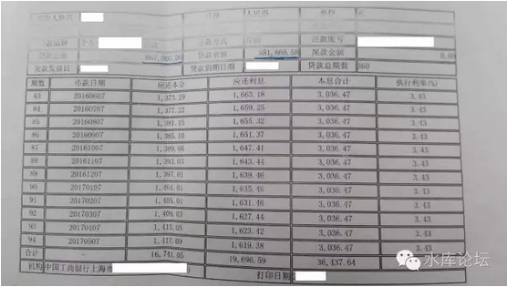
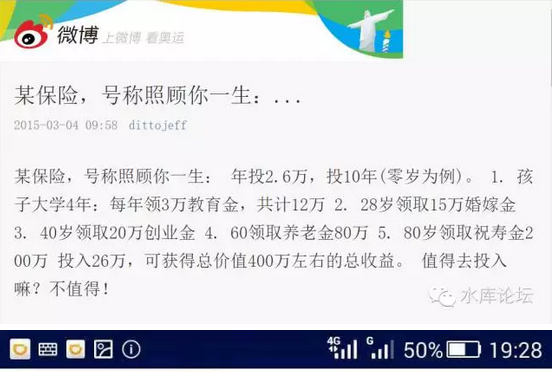
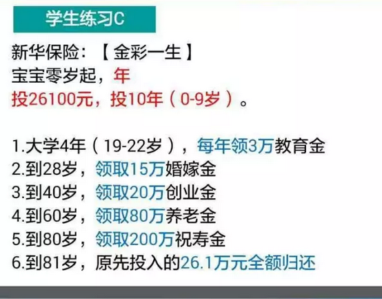
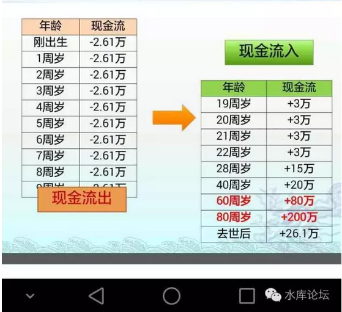

# 一些基础财务函数 \#2370

原创： yevon\_ou [水库论坛](/) 2016-08-21

一些基础财务函数 ~\#2370~

 

基础知识

 

 

> 一）月供pmt

 

等额本息月供应该是多少。

网络上立刻有无数无数人，打开所谓的"搜房网房贷计算器"。

 

你这样小白，一辈子没有出息。

月供的正确方式，应该是打开Excel。

 

 

输入： pmt (利率，期数，金额)

其中，第一个参数"利率"，指的是月利率。

一般是4.9% \* 90% / 12

-   国家基准利率4.9%

-   九折优惠

-   除十二个月

 

第二个参数，"期数"。

-   如果贷款十年，就输120

-   贷款二十年，输入240

-   贷款三十年，输入360

 

最后一个是贷款金额。

 

举例来说，贷款100W元，月供：

=pmt( 4.9%\*90%/12,360,1000000)

=5013.52元

 

 

一般而言，我们有一个"速算数"。

-   30年期是5

-   20年期是6.2

-   10年期是10

 

 

好比有人说，他月供2W。

那我们立刻可以推算出。他的贷款是400W。

因为每10000元月供50元，所以2W对应的就是400W。

 

 

同样道理，如果你从银行贷一笔350W的"抵押贷款"出来。

则你的月供就是1.1%

38000元左右。

 

 

还有人问，"那么等额本金应该如何计算"。

对不起，我们不和傻瓜说话。

 

 

> 二）实际支付利息

 

不管你用的是哪一种贷款方案。实际支付利息是不变的。

 

取出你的对账单，用"贷款剩余金额"乘以"当前利率"即可。

例如这个例子中：

581869.58 \* 3.43% / 12 = 1663.18元。完全符合。

 

 

> 三）加权利率

 

假设一个人名下有很多笔贷款。则你应该列一个如下图般的表格；

             金额      利率    月利息
  ---------- --------- ------- ----------
  按揭贷款   581870    3.43%   1663.18
  抵押贷款   3500000   5.88%   17150
  信用卡     200000    4.20%   700
  个人借款   300000    12%     3000
             4581870   5.9%    22513.18

 

可见，他为了458W资金成本，每个月支付了22513元利息。

 

因此我们可以算出他的"加权资金成本"。

22513.18 \* 12 / 4581870 = 5.90%

 

 

> 四）总月供

 

总月供和总利息不是一回事。一般来说，月供要比利息高一倍都不止。

其中一半是利息，一半是本金。

 

对于月供，借银行大家一般是没有歧义的。直接用PMT计算即可。

信用卡融资，我们默认为不还本的。

私人借款，介于不还本和还本之间。老同学的私房钱一般是永续债。

 

如上表。私人借款我们默认为12个月后减少一半。

             金额      利率    月息       月供
  ---------- --------- ------- ---------- ----------
  按揭贷款   581870    3.43%   1663.18    ¥3036.47
  抵押贷款   3500000   5.88%   17150      ¥38,646
  信用卡     200000    4.20%   700        700
  个人借款   300000    12%     3000       15500
             4581870   5.90%   22513.18   ¥57,883

 

可见，每月要筹措资金57883，其中22513是利息，三万多是本金。

 

 

> 五）平均贷款年限

 

知道了"平均利率""总月供"，才可以计算"平均贷款年限"。

 

公式是：NPER (利率，月供，借款金额)

 

如上例，他的"平均贷款年限"是 NPER(5.9%/12，57883，4581870)

答案是67个月。

五年半多点。

 

\* *

*也就是这个人的财务结构。*

*和借你一笔458W，67个月，5.9%的利率，等额本息贷款。*

*二者是完全等价的。*

 

 

基本上每一个多军，都应该算一下自己的"平均借款利率"，"总月供"。

然后再算算自己的"平均借款年限"。

 

这是一个很重要的数字。如果不出意外，绝大多数的（6套以上）多军，该数字都应该在"8年"附近。

而且这个数字，还在以每年"-1"的速度。在飞快递减。

 

 

也就是说我们的贷款是高度"劣质化"的。

这个数字越高越好。借银行千难万难。

 

 

> 六）月供的难题

 

我们整天被月供折磨得死去活来。

 

虽然《[长线负债率](http://mp.weixin.qq.com/s?__biz=MzAxNTMxMTc0MA==&mid=2651014727&idx=1&sn=b64eae1b2a0b201fd8676aa3286849e4&scene=21#wechat_redirect)》，多军的负债率普遍不超过25%

可即使如此低的负债率，依然压迫得我们喘不过气来。

每个月的大还款日，都是一剧鬼故事。

 

其核心原因，并不是我们借得太多。

而是还款年限太短。

 

 

我一直渴望中国能推出西方国家类似的"合并账户借款"。

从2004年开始做这个梦，做了十几年，反而遥遥无期。

 

所谓"合并账户借款"。是指银行给你一个借款户口。

然后他把你"所有债务"合并起来。

无论是银行房贷，消费抵押，信用卡，甚至个人借款。都合并起来。

 

 

银行给你批一笔3000W元的总贷款。

其用途非常之明确，就是给你"清贷款"。

直接划拨，打帐到你指定的贷款账户，把你街数卡数全部清掉。

 

整合成一笔3000W元的整数，借款三十年，八折利率。每个月付一次按揭。

这样的贷款，名义上没有任何变化。

但实质却是天差地远。

 

他其实是把你一篮子"劣质化"的贷款。整合成了一笔"30年八折"的优质按揭贷。

对于这样的金融产品，简直做梦也要流口水。

 

 

此类的产品，在香港市场早已烂大街。天天电视轰炸"AE邦民财富"。

可是国内就是没有。

等了十几年，越发遥遥无期。

 

 

 

> 七）还清贷款

 

你需要多少年才可以彻底还清贷款？

 

把NPER中的"月供"，再加一点。譬如再加二万、三万你的"工薪收入"。

例如NPER（5.9%/12，57883+30000，4581870）= 46.5

这样你只需要四年不到，就可以彻底还清债务。

 

 

你可以自己尝试一下，在NPER函数中，通过输入

NPER（利率，总月供，总负债）

NPER（利率，总月供+20000，总负债）

NPER（利率，总月供+50000，总负债）

来享受一下"早日还清"的幻想。

 

 

当然，真正的多军，都是追求NPER显示结果：FALSE的。呵呵

 

 

> 八）短期债务比例

 

信用卡和私人借款属于"短期借款"。

 

短期借款比例越低越好。如本例中是10.9%

一般要低于10%

高于20%会出问题。

 

 

你要尽量用"中长期银行贷款"替换掉短期借款。

优化债务结构。

并降低融资成本。一般每年"融资成本"降低0.5%是老派多军追求的目标。

 

 

> 九）自住房比例和空置房比例

 

RT

小学二年级数学题。

 

 

> 十）IRR

 

IRR是算"不确定现金流的回报率"。

好比有一笔投资，第一个月赚2W，第二个月亏3W，第三个月赚4W，第四个月亏5W.........

 

IRR最好的用处是："算保险费"。

揭穿保险公司的条款，非常有用。

 

例如水库论坛上有一篇《新华人寿 金彩一生》的保险分析文章。

人生三大关键，教育，工作，养老，全都给你想到了。你看，是不是一张保单保一生。

而这样的保险产品呢。我们用IRR拉一下，回报大概是4.88%

 

 

IRR的用法如下：

 

           现金入   现金出   总计
  -------- -------- -------- -------
  第0年    2.61              2.61
  第1年    2.61              2.61
  第2年    2.61              2.61
  第3年    2.61              2.61
  第4年    2.61              2.61
  第5年    2.61              2.61
  第6年    2.61              2.61
  第7年    2.61              2.61
  第8年    2.61              2.61
  第9年    2.61              2.61
  第10年                     0
  第11年                     0
  第12年                     0
  第13年                     0
  第14年                     0
  第15年                     0
  第16年                     0
  第17年                     0
  第18年            -3       -3
  第19年            -3       -3
  第20年            -3       -3
  第21年            -3       -3
  第22年                     0
  第23年                     0
  第24年                     0
  第25年                     0
  第26年                     0
  第27年                     0
  第28年            -15      -15
  第29年                     0
  第30年                     0
  第31年                     0
  第32年                     0
  第33年                     0
  第34年                     0
  第35年                     0
  第36年                     0
  第37年                     0
  第38年                     0
  第39年                     0
  第40年            -20      -20
  第41年                     0
  第42年                     0
  第43年                     0
  第44年                     0
  第45年                     0
  第46年                     0
  第47年                     0
  第48年                     0
  第49年                     0
  第50年                     0
  第51年                     0
  第52年                     0
  第53年                     0
  第54年                     0
  第55年                     0
  第56年                     0
  第57年                     0
  第58年                     0
  第59年                     0
  第60年            -80      -80
  第61年                     0
  第62年                     0
  第63年                     0
  第64年                     0
  第65年                     0
  第66年                     0
  第67年                     0
  第68年                     0
  第69年                     0
  第70年                     0
  第71年                     0
  第72年                     0
  第73年                     0
  第74年                     0
  第75年                     0
  第76年                     0
  第77年                     0
  第78年                     0
  第79年                     0
  第80年            -200     -200
  第81年            -26.1    -26.1
  IRR：                      4.88%

 

其中，每一行代表当年的"现金流"变化。

但是每一行都要，哪怕空白，也不能漏掉。

 

到了末尾，用IRR (D1:D81)拉一下，就有了结果。

在我们之前《[截断和再抵押](http://mp.weixin.qq.com/s?__biz=MzAxNTMxMTc0MA==&mid=2651014912&idx=1&sn=42f1eacd72da0e7e87280d55f206937f&scene=21#wechat_redirect)》，也有IRR的应用实例。

 

 

有几个朋友说，自从知道IRR后，世界变得开眼晴朗。

立刻把身边的金融产品，全部用IRR算了一遍。看看哪些是好东西，哪些西贝货。

 

 

 

（yevon\_ou\@163.com，2016年8月21日午）
