# 浅谈现金管理入门 \#2380

原创： yevon\_ou [水库论坛](/) 2016-08-24

浅谈现金管理入门 \#2380

原文写于2013年3月28日

上次在anjia24发了一个帖子，是关于借钱的：http://www.anjia818.com/thread-8823-1-1.html

 

到第11楼时，guoyang看不过去了，他提出了一个问题："为什么每月1%，到了6个月反而成了5%了，那岂不是长借利率更低？"

 

对此，我的回复是"短借永远比长借利率高。借款这种事，月息1%，六个月5%，三年就只有年率8%"。

 

为什么呢，为什么和银行市场化国债利率曲线不一样呢。我们从现金管理入门说起。

 

一）现金曲线图

首先，我们要画一张图。典型的曲线如下：

图1：

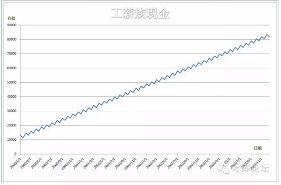

 

这是一张锯齿形的图片。

譬如说，你每个月有6000元的工资收入，然后逐渐花掉50%。这样，在曲线上，就反映为每个月出粮的那一天，存款直线上升，然后缓慢下降。

 

当然，每个人的现金流量表并不相同。有的人初始的时候，就有一大笔存款，有的人初始时为0。有的人事业上升很快，显示为收入的迅速增长。有的人加薪很慢。有的人，或许还有意外的大笔收入。譬如中彩票，遗产，或者父母赠与。而对于不同的年龄段，生命周期，曲线也多不同。退休人士是一条直接向下的曲线，而50岁人士则是先涨后跌。

图2：

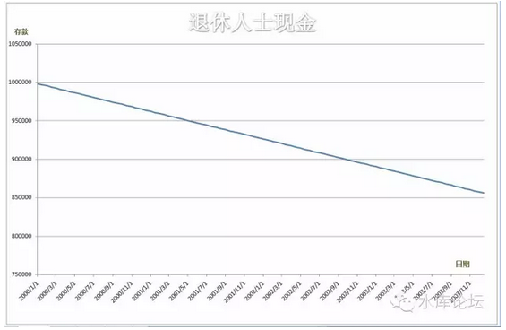

图3：

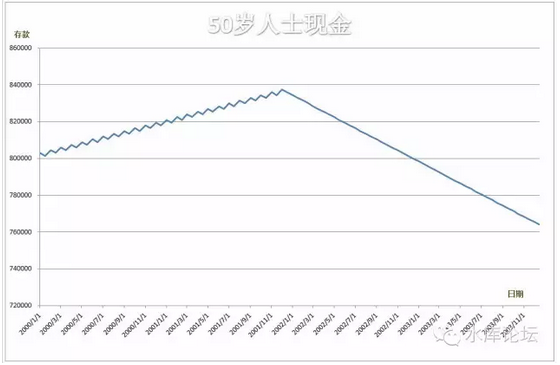

不过，图形的形状并不是我们重点。甚至精确度和可实现性，也不是我们的重点。

 

二）消费

 

好了，现在我们来看第二节：消费。消费意味着什么。

 

消费在图形中，表现为如图的长方体。

图4：

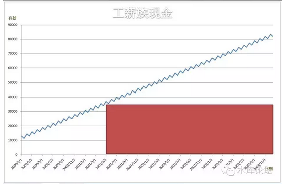

这句话意味着，假如我在2001/05消费，花了35000元买了一个戒指。那么我就"永远"失去了这笔钱。红色的方柱，是一直画到图表的尽头的。也就是在我人生永恒的未来，这4000元都被花掉了，再也不会回来。

 

可见，消费是十分伤身体的。其表现为图形被"挖"去了巨大的一块。

 

 

在人的一生，我们要满足多种财务目标。具体点来说，譬如理财经理长谓的买房、买车、子女读大学、出国旅游、大宗消费等等。

 

当我们有众多消费时，在图形上，就表示为一根又一根的长柱子。

图5：

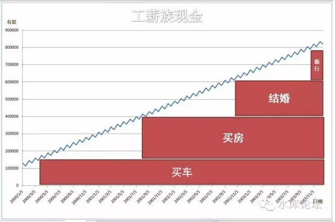

 而我们所谓的"现金管理"。其实就是在给定的"曲线"下，塞入一根又一根尽量多的柱子。

 

 

三）优化

 

观察图4，我们发现，这样的曲线，其实非常不适合"塞入"一根又一根柱子的。

 

那么，什么样的曲线，才适合塞入一根又一根柱子呢。简单点说，我们更倾向于如下的图形：

图6：

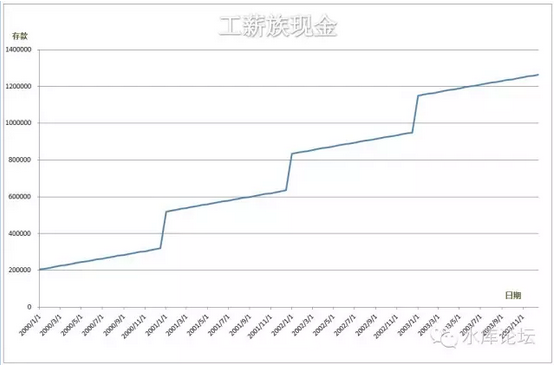

这样的收入现金流量表，显然要比图4，图5，都能塞入更多的红色柱子。

图7：

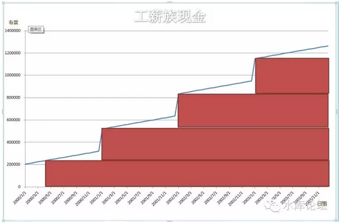

好了，现在我们说说，炒楼的意义是什么。

炒楼的关键，就在于："在尽早的时间，买入尽可能多的房子"。

 

反映到图形上，你的柱子要尽可能地长，而且要尽可能的粗。

 

但通常情况下，你的现金，都是象图4这样形状的。所以你就需要轻微地"扭曲"图形，进行优化。

 

 

四）借贷

 

我们看回图4，如果你想"尽早尽多"地买入03年的房子，你需要是如下一个图形。

图8：

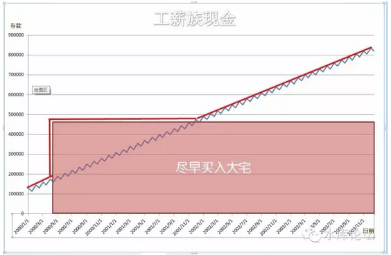

显然，这个图表超出了你的能力范围。

为了"尽早尽多"买入大房子，你需要的现金流量表，不是如图4一样的蓝色线条。而是如图8中的红色线条。

 

那么，我们该如何实现目标呢。答案就是：借贷。

 

如图9：

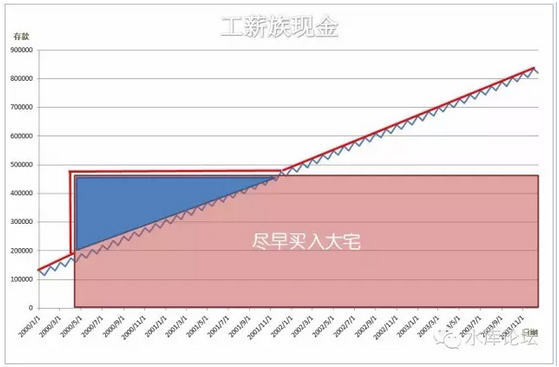

这张表告诉我们几个道理：

第一，你是借得起的。图中红色大宅的现金顶峰消耗，在480000元左右。而你的终身储蓄，可以达到90万元左右。所以，尽情大胆地借吧。

第二，借款顶峰在28万元左右，此后慢慢减少。

第三，借款的利息是\...\...\....就是蓝色的面积。

 

这是很重要的三个结论。随着每个人的现金流量曲线不同。可能并非一条直线上坡。

但哪怕无论再复杂的曲线。道理都是一样的：

1）你的最后一年现金，决定你能负担多少。

2）蓝色阴影最高部分，决定你要借多少。

3）蓝色面积大小，就是利息。

 

譬如有一个怪人的现金流；

图10：

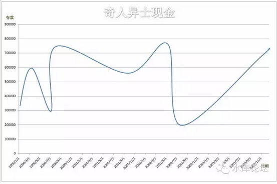

我们给他设计的买房方案：

图11：

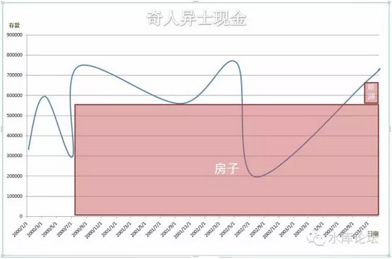
\
图12，需要借贷的部分。

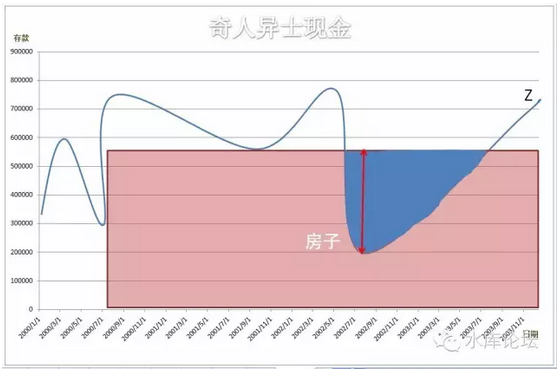

分析和解释：

1）买房子，金额最多不能超过Z点。也就是750000元。

2）你必需筹一笔借款。金额最大时，就是图12中红色箭头，约30万元。时间则是蓝色的宽度。大约是1年。

3）该借款支付的利息 = 利率% \* 蓝色面积。

 

这个利率是你能借到的利率，按每人脸皮厚度与水平不同，从4%，8%，12%，24%，48%不等。

 

 

"现金管理调度"的大方向就是这样。所谓管理，就是往你的现金表里面，塞进去一根又一根尽可能"又粗又早"的红色长条。

对于纯洁的小白领，人生的"现金流量表"可能很简单。纯洁得如同一根直线。

 

但对于某些擅于折腾的人士，现金流量表则可能很复杂。复杂到象图10一样，简直在花天书。

但我们要的是原理。

原理就是，在图10这样的图形中，适当地借贷一部分蓝色面积，花一个最大"尽早尽多"的红框。

而你付出的代价，就是"融资利率\*蓝色面积"。这部分成本该如何控制，该如何权衡。能否贪心把红色花得更大一点，就看你自己的决断了。

 

 

五）短借

 

捎带花一点笔墨，回答guoyang的问题。突然发现那个帖子是2012-02-29写的。真是浮云苍狗，世事变幻太快了。

guoyang的问题是："为什么每月1%，到了6个月反而成了5%了，那岂不是长借利率更低？"

 

我们来看一个图形：

图13：

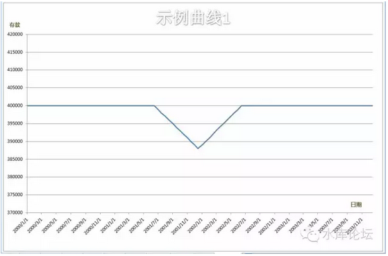

对于这样的曲线。我们要截一个"又长又粗"的红柱子，十分简单。基本如下图；

图14：

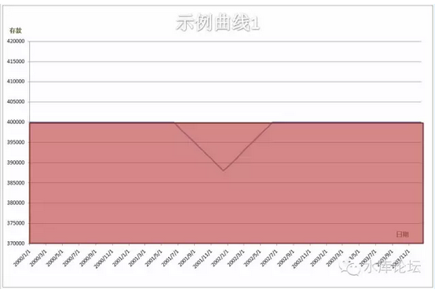

我们会尽全力去做一笔投资。然后当中的一个小小三角缺口，用借贷和借款利息去填补。

 

好了，我们再看一个图形。

图15：

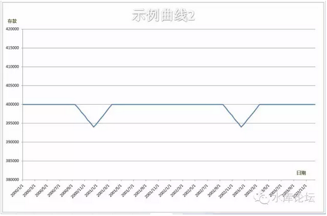

答案是一样的。填二个缺口去补，筹二次临时借款。

 

然后，我们再来看一个图形。

图16：

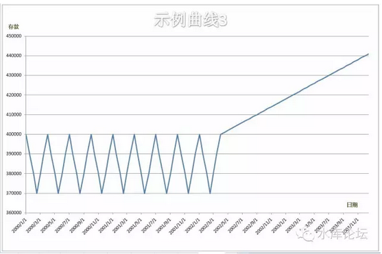

这样的图形该如何规划呢。答案就是图17，而不是图18。

图17：

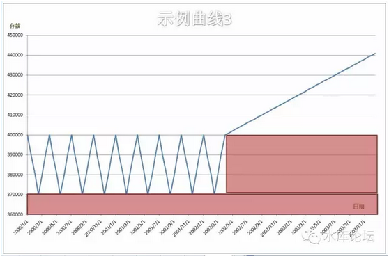

图18：

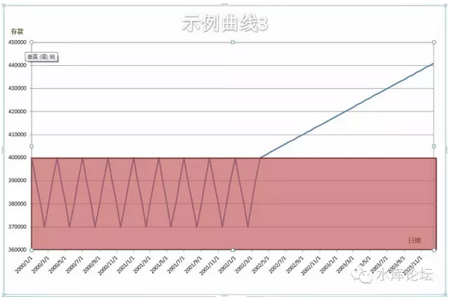

为什么呢。因为一个二个缺口，我可以去借钱，可以去筹款，可以克服暂时的困难。

 

但是，一百个缺口呢。一百个缺口，我应该是"有多少钱，办多少事"。

所以，正确的画图方法，应该是象图17一样。当锯齿许许多时，我就干脆买套小点的房子，量力而为。

 

短借和长借的区别，关键在于用途不同。"短借"是为了克服暂时的困难的，我自己99%的资金已经有了，只需要借你1%的资金，填补现金流量表上的缺口。我可以承受很高的利率。

而"长借"，没有人99%的本金都是借来的。完全靠别人的资金做生意。这样的融资成本会高得无法忍受。而最终你所有收益都付利息，你是在为金融资本家打工。长借若借钱，必需低于社会平均回报率。

 

"短借"是拿来补缺口的。只有当我们需要的时候，我们才开口借要。

 

 

六）实战

本篇文章，因为照顾到许多入门网友，写得极为浅显。因为图片篇幅太大，占了许多地方。

 

接着我们说一下实战应用。我们的实战原则是："一支铅笔"。

这话什么意思，意思就是花了这么多的图表，弄得这么庞大宛如教科书般，其实全都是废话。

 

没有任何人，可以真正花出自己的现金流量表！

这既是徒劳的，也是毫无意义的。我们的原则就是，"一支铅笔"。实战中的现金流量表，必需简单得可以用人的手工，用一支铅笔，纯粹凭自己的心算，在A4纸上面画出来。

 

实战中的"现金流量表"，必需非常非常简单。简单到你可以手工涂鸦般随手画出。

你完全不需要精算，别做傻事。你只需纯粹凭感觉，在未来的3\~5年中，我有哪些收入，有哪些支出，有哪些可以融资的渠道，有哪些大额的进账出账。

然后你凭手工，铅笔白纸在A4纸上描出自己的曲线。

然后你再算算自己的目标，怎样啃，啃一套多大的房子。再低头看看曲线，哪里有凹槽，有缺口需要填补。

于是你心里有数了，在什么时候，需要融一笔多大的资金，融多久时间。便可以把自己的现金烫平。

 

 

 

(yevon\_ou\@163.com，2013年3月28日子夜）\[1\]

 

\[注1\]：上篇《一些基础财务函数》\#2370中，有一个数字算错了，已更正。感谢网友golo先生的提醒。
