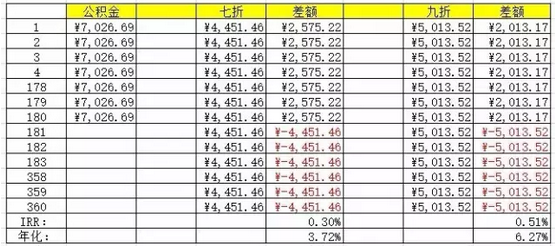
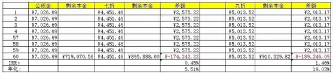
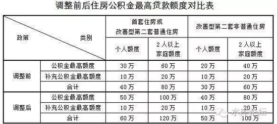

# 公积金的用法 \#2480

原创： yevon\_ou [水库论坛](/) 2016-09-13

 公积金的用法 \#2480
==================================================================================================================================================================================================================================================================

公积金最好的用法，就是不要过度关注。

 

 

 

一)贷款的野望

 

\#2460，\#2470这二篇，都是几年前写的。

它其实控诉了"50%月还款规定不合理"。

 

或者说，"只要银行批得出来，这笔贷款就没有问题"。

什么房贷的风险率，面对着全世界最严厉苛刻的审批制度。可以说，"只要银行肯批，就一定能四五年内全额还完"。

 

 

紧接着一步，应该是写："既如此，合理的房贷/月薪比，应该是多少呢"。

50%你说不合理地少。

60%

70%

80%

90% ?

 

别停住，脑洞应该继续打开。不打开不算破三观。

100%

110%

120%

130%

140%

150% ?

 

 

这个数字的回答，才是我们应该"有意识规划"的财务目标。

但今天早上想一想，"中阶篇"不讲这事了。移到后面高阶再讲。

 

今天我们继续讲很幼稚，很弱智的技术。

 

 

二)公积金

 

水库论坛写到\#2480，也有二百多篇了。

有心兼细心的读者应该会问："为什么没有公积金"。

你仔细地看，从头到尾，二百多篇，连"公积金"这三个字都没有提到。

 

 

公积金是一种更便宜的贷款。

长久以来，从2000年\~2011年，我们一直速算，公积金大概比商业贷款"低一码"。也就是0.25%左右。

 

好比目前基准利率4.9%，但是有大量存量客户，上海土著，都是拿的"七折贷款"。

4.9%\*70%=3.43%

这和公积金3.25%就差得不远。优势仅有0.18%

 

 

从2012年开始，事情有所变化。

因为当时的秀相"宏观调控"。他把利率从7折重新又抬上去了，渐渐地恢复了八五折，九折的口径。

但是原有的"七折客户"，你又不能改合同。否则岂不是要闹翻天。

 

因此利率出现了"双轨制"。

-   七折用户：3.43%

-   九折用户：4.41%

-   公积金户：3.25%

 

从这个角度讲，因为2016年新办的贷款，基本上都是"八八折""九折"。

所以还是要比公积金贵1.16%，算是个不小的数字。

 

 

 

今天水库写到了\#2480，可是绝口不提公积金。

在当年可不是这样的。

 

2001年我刚刚入行的时候，"公积金"是绝对的大头。

当时，几乎所有的《理财周刊》，那些骗死人跳大神的"大师"们，传授的"买房10大技巧"。

开篇第一句话，讲的必然是公积金。

他们把公积金看得如此重要，以至于忘记了买房。

 

 

不仅仅是学术界，而且民间亦是如此。

能借公积金的，就绝对不借房贷。

最好是不贷款，实在实在不行，就仅仅只贷一次公积金。

 

 

在2001年时，全上海房贷公积金余额400多亿元。而商品房贷款仅有300亿元不到。

当时，公积金单笔贷款的上限仅有10万元。补充公积金3万元。

 

-   许多人就是为了用满这10万元，所以他们只买一套14\~15W的小房子。

-   为了符合公积金贷款条件，而推迟一年二年买房。

-   为了使用"组合贷款"，而使得整个流程很慢很慢。

-   一辈子只贷过一次10万元公积金，就成了"认房又认贷"的第二套。

 

许许多年以后，他们才认识到，这是多么惨痛的错误！

 

 

 

三)公积金的价值

 

公积金最好的用法，就是根本不要去用它。

 

 

为什么，因为这涉及到几个麻烦；

1）金额太小，蚊子肉有限

2）公积金可能反而更贵

3）贷款规划

4）其他用法

我们依次来讲这几个问题。

 

 

首先，我们来回答"蚊子腿到底值多少钱"。

别的理财网站，都总是说"公积金利率低"。但是这个低，到底是多少低。定量计算，只有水库有这个算法。

 

见《[利率与房价的精算法](http://mp.weixin.qq.com/s?__biz=MzAxNTMxMTc0MA==&mid=2651014882&idx=1&sn=c6e6949ad3dabaa5d2ad1d8648875041&scene=21#wechat_redirect)》\#2270，任何利率优惠，都可以折算成房价。

以100W元3.25%公积金贷款为例:

PMT (3.25%/12,360,1000000)=4352.06元

 

而对于普通商贷：

PMT (3.43%/12,360,977670)=4352.06元

PMT (4.41%/12,360,868066)=4352.06元

 

也就是说，97.76万元七折房贷，等价于100万元公积金。

你忙了捣鼓了老半天，其实也就省了2.23万元。

前几年公积金还要收大几千"担保费"，那就更鸡肋了。

 

 

对于九折商贷来说，100万元公积金，等价于86.80万商贷。

相当于省了十三万多。那还值得一做。

值得注意的是，这13W要靠三十年才能赚回来。

如果你五年截断的话，大概只赚了1/3.

 

 

四)更贵的公积金

 

在某些情况下，公积金甚至比商贷更贵。

这主要是因为公积金中心，长期一条非常不合理的规定，"五年以上二手房，公积金贷款仅限15年，而不是30年"。

 

补充更正，2015年新政，改为：

-   20年以上楼龄，只能贷15年。

-   6\~19年楼龄，贷35-N年。

 

我们还是以15年举例做表。精算15年和30年的巨大差距，哪怕你利率低一码，都无法弥补。

 

（1000000元贷款，公积金15年，商贷30年）

这个结果是令我们震惊的。

-   你只要达到3.72%的理财收益，七折卅年就比公积金更划算。

-   你只要达到6.27%的理财收益，九折卅年就比公积金更划算。

 

所以说，有时候就算你求着我贷公积金。

我也是不要贷的。

 

 

 

我们再来看一个图。还是15年对比30年。

只不过第5年"截断"掉了。房子卖了或者贷款Re-finance之类的。

在这张图表中，结论就稍有不同。

 

七折贷款保本线是5.51%，这还是一个很低的利率，说明纯商30年非常佳。

但是"九折卅年"就不行了。

其"保本"利率要达到了19%

 

长期的力量无法释放出来。

如果想好了5年就抛。"15年公积金"还是比"30年九折商贷"要优。

 

 

 

五)纯公积金

 

综合之前二论，我们得出结论；

 

1）公积金可以小赚几万，但不多

2）某些场合还不如纯商贷

3）为了公积金耽搁交易流程颇不值得。捡芝麻丢西瓜。

 

其实这里面有一个bug，该bug前二年可行。

4）纯公积金贷款，不检查二套。

 

 

也就是你第一套做纯商贷。碰也不要碰公积金。

第二套做"纯公积金"。看清楚，是纯公积金。组合贷款不行。

 

 

如果是纯公积金的话，则它可以把你当作首套处理。

如果是"组合贷款"的话，就不享受这个优惠。

 

因为公积金系统是"分立"的。公积金系统，甚至连"贷款审核部"也没有。

当你申请公积金贷款时，他们甚至都不会去拉你的征信。

 

公积金贷款有且仅有一二条准则；譬如

-   贷款不超过余额40倍

-   缴交年限满12月

 

这二个条件都满足了。他们就一定贷给你。

哪怕你征信一塌糊涂，失踪违约十七八次。行为也不符合国家政策。

 

但公积金中心不管这些。他是一个"分立"的系统。

甚至往大处说，公积金是政府与国民的一个契约。你每月存8%的工资进去，就是为了买房子用的。

现在公积金中心找借口刁难你，说你征信不足。不贷给你，这事在法理上讲不通。

 

 

言归正传。因为你第一套"纯商贷"。

第二套"纯公积金"。

则公积金中心是一定贷给你的。而且享受最优惠利率，最优惠条款。不上浮。

 

唯一的缺点是，上海的公积金额度实在不高。

(2016年1月版)

按照这个标准，"纯公"实在买不了什么房子。

或许北京等城市，公积金限额比较宽松。

又或许是对某些高首付的小白有用。

 

 

六)公积金的提取

 

登录www.shgjj.com，输入你的身份证号/手机号，就可以查询你的公积金余额。

也可以外挂在建行网银中。

 

 

如果你公积金余额很高，高过了月供很多倍。则我们给你的建议，你做好的做法是"提现"。

提现，把十几万现金提在手里。

这是比"年冲""月冲"都更好的做法。

 

许多人不知道。"公积金余额"其实是可以提现的，尤其是第一条；

提现条件；

1）新产证六个月之内，凭产证提现

2）死亡

3）放弃国籍

4）满60岁退休

 

一本产证，如果你没申请"公积金贷款""组合贷款"的话，你就可以申请"全额提现"。

哪怕有商贷，一样可以把公积金全部都取出来。

 

其具体的办公地址，在黄浦区金陵路/云南路。金陵路569号。

凭房产证，身份证去。有可能要办张建行借记卡。

新产证六个月之内。

 

 

当你一次性把公积金由十几万清为零了。此后，随着你的工资，它又在每月几千几千的增加。

这笔钱也不要浪费。

公积金是可以冲还房贷的。

 

具体的做法，是找到你银行办房贷的信贷员。

在银行的电脑系统中，输入操作你的公积金扣款账号。

他这里面的管理极为宽松。你不仅仅可以扣你的公积金，还能扣你LG的，你爸爸的，妈妈的，岳父的，岳母的，儿子的，女儿的............

不上产证者，不能提现，但可以扣。

 

 

基本上一笔房贷，全家公积金扣光。

凭着你的贷款买房，就把全家人的死钱变成了活钱。角角落落。

 

 

 

（yevon\_ou\@163.com，2016年9月10日）[\[1\]]

[\[1\] ]篱笆上一篇旧贴《公积金年冲月冲精算法》，没什么营养，算的都是蝇头小钱。http://www.libaclub.com/t\_113\_5990009\_1.htm
