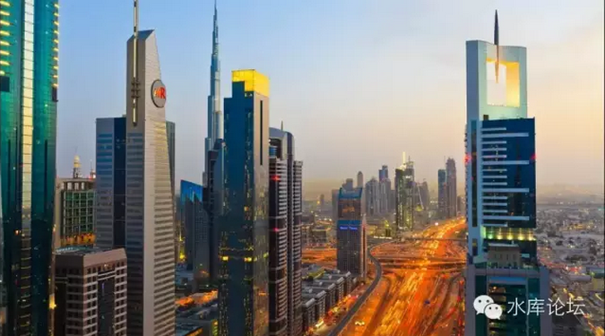

# 上海楼市的三分天下 \#250

yevon\_ou [水库论坛](/) 2015-09-22

上海楼市的三分天下 ~\#250~

上海的房地产市场，是严格地分割割裂成三个独立的，互相矛盾的市场。

彼此的口味喜好，价值体系，完全不同。

当二波人擦肩而过时，互相看了一眼对方的房子，"垃圾"。

一）血脉与文明

上海的房地产市场，是严格地分割割裂成三个市场的。它们是："本地人，外地人，外国人"。

在本篇\#250之前，我们用了大量的篇幅，来介绍Marketing（210\~240）。

那是因为，只有具备了Marketing的基础概念，你才能更好的看懂看明白这个章节。

"绝对价值"这件东西并不存在，1000个人眼中有1000个哈姆雷特。一件艺术品之所以值钱，并不是它本身的画法笔锋多么牛强。而是因为有人喜欢它，并愿意为之付费。

在Calgary
Museum中，讲到印第安文明时，引用了一句话:"我们只会捍卫那些我们钟爱的，我们只会钟爱那些我们了解的，我们只会了解那些我们熟悉的"。

一个太阳神的雕像，在印第安部落中可能是无价之宝。而在欧洲白人眼中，只不过是一块木头。

当欧洲人把印第安人杀光，当再没有一个继承人。太阳神雕像的价值一落千丈，随随便便就扔在博物馆遗址里。

中华民族曾经创造了灿烂辉煌的文明。可我们文明的价值，流淌在华夏儿女的血脉之中。

"清明上河图""春江花月夜"，一旦中国人被杀光，这些文明的价值就再也没有人懂得欣赏。而只能流落到考古学者的故纸纪念堆里。

中国政府一直没让国民知道的事，在很长的时间内，中国的艺术品，中国画根本不值钱。很多名家的作品，甚至明清的真迹，在欧美市场只能拍卖出200美金。

而在最近的十几年内，中国艺术品价值扶摇直上。由西洋油画的几百分之一，上升到几分之一。

其背后，是中国国民的崛起，以及中国买家的钱包的实力。

扯得远了，回到我们最初的话题。所谓"价值"，这其实是一件很主观的事情。*而不是马克思主义所谓的客观的内蕴的价值*。

一套房子值多少钱，关键看它背后喜欢它的那个人。以及这个族群的实力和兴衰。

很不幸，目前的上海房地产市场，真实是分裂割裂成三批人，三种价值观。

三股势力此消彼长。

二）大城市的特殊性

上海的房地产市场，严格地分割成三个独立市场，"本地人，外地人，外国人"。

凡是不涉及这一点的房地产分析，那么他大体上就是错的。

真正令我惊讶的，是我们见多了天马行空的"大师论道"，动不动跌30\~50%的，可就是没一个人说过楼市的微观结构。

"本地人，外地人，外国人"这样的三维结构，是只有特大城市才有的。

严格地说，全国只有2.5个城市，是真正具有三维结构的。

只有北京和上海，才具有成规模的"外国人"影响力。其中北京是首都，上海是经济中心。

只有在省会城市，或者副省级计划单列市，才会有"外地人"这回事，二维。

到了内地三四线城市，它只有"本地人"一个类别。

看似很简单的道理。可是在实务分析中，却会遇到非常大的麻烦。

譬如说"房租"。

目前所有对租金回报比的分析，基本上都是错误的。只有"外国人"存在的地方，才有高房租。月租30000\~50000RMB以上阶层，客户几乎全是外国人。

所以你去同样很高大上的一个地方，例如南京，南京星河湾一套房子1000多万，你再要找租客，租金回报就完全不能和上海比了。

因为只有"上海北京"，才有外国人这个消费群体。你同样GDP的城市，同样高档的房屋，客户群可能1/10都不到。

而本地人呢，本地人不租房。

你只有本地人的城市，譬如上饶。你再好的房子，都是没有租金收益的。因为本地人不需要租房。

你这个城市没有外国人。就只有Low End的一些民工宿舍可以做做。

对于房地产市场，Marketing分类这是一个巨大的话题。我们可能要花费十章以上的篇幅，才能把整个道理讲清楚。

本篇仅仅是一个总纲，先启一个介绍开头。

三）实力的此消彼长

大约在2003年时，全上海最贵的板块，最贵的房子是哪一处。

这个问题大概已经很少有人答得出，猜得出。

答案是镇宁路板块。

其大致的位置，是在静安与长宁的交界处。标志性楼盘是东方剑桥，东方雅苑，嘉里华庭等等。

在2003年时，南卢湾房价基本都是6000以下，大热点的徐家汇刚刚冲向10000，浦东联洋根本不入流4000\~5000。川沙唐镇是无人区。

而镇宁路的房价是14000。

十几年以后，今天镇宁路的房价大约是70000\~90000/m，他虽然仍然是高档奢华之处，但已绝对不是遥遥在上。

为什么会发生这种情况呢。

因为镇宁路的主要买家，主要客户目标群，是"海外老华侨"。

而老华侨是怎样一批人呢，是昨日黄花，日暮西山，逐渐被扫进历史的尘埃堆中去。

在过去15年中，中国CHINA才是全球发展最快的经济体。按数字GDP增长三十倍左右。

土著们的收入都上去了，所以土著聚集地闸北，普陀可以涨。

而以老华侨为主要目标，主要客户群的板块则增长乏力。

这个道理同样可以解释古北、碧云的前世今生。我们会在之后的篇幅中逐步展开解释。

四）存量与增量

外来人口是这样一种角色，他们在质量上超过上海的普通市民，在数量上超过上海的本土精英

\-\-\-\-\-\--yevon\_ou

外地人 \< 上海人 \< 外来精英 \< 上海精英

如果我们要列一个不等式，大致可以得出以上顺序。

上海是全国最繁荣发达的一个省。就总体素质而言，上海人超过内陆的任何一个省份。

可是你要把"上海人"和"外来人口"放在一起看，又不能看了。

因为能漂洋过海，到异国他乡做移民第一代的，无一不是最优秀的人。

只有在整个村庄，整个县城，整个内陆省份最棒的那些人，才会外出打工，才会人口移动，才会来大城市定居。

等于这群人是"外省精英"。

他们在平均素质上，超过了上海本地人。

而在数量上，超过了上海精英。

"上海精英"其实是很恐怖的一群人，他们不仅比移民有更好的组织资源，而且有时候智慧和疯狂都不遑多让。他们唯一的缺点，是人数太少了。

毕竟1000个人产生一个精英。上海一千万人中产生的精英，实在无力与内陆18省庞大的人口基数抗衡。

按照官方的人口统计数据，上海目前大约有1400W土著和900W外来移民。

可是，你别忘了，外来移民基本上都是18\~60岁之间的适龄劳动人口。而土著还要包含老弱残幼。

在工作岗位领域，劳动力人口早已经是50%:50%比例。在新增婴儿人口，土著或许还要输掉49%。

言归正传，说回房地产市场。

土著的人口虽然众多，但土著是不需要买房子的！

或者说，土著只有十分微弱，每年约+1平米的"改善需求"。

而外来人口，则有赤裸裸的每人35平米的"居住需求"。

外来人口虽然仍在人数上居于劣势，可是在购房的需求上，他们是绝对的大头，占了75%的需求以上。

所以在新开盘楼盘设计中，必须充分考虑到YP们的想法。甚至整个设计就是围绕着YP们做的。

以致在房地产市场，YP的呼声占了绝对大数。让人以为地球就是围绕着他们的审美观运转的。

而一旦房子售出，成为二手房。你就进入了存量市场。

上海的存量市场，一般认为有7亿平米。每年2000W新增供应，宛如一滴小水滴。

在存量市场，你就是和这7亿平米进行着博弈。

游戏规则完全不同。甚至你就成了小众群体。

增量和存量，这是完全不同的二套玩法。本篇是纲目，之后会有详细的篇幅展开。

五）市场的进一步细分

市场还可以进一步细分，至少可以再分出六个小类。

               外国人   本地人   外地人                 
  ------------ -------- -------- -------- ------ ------ ------
  楼市客户：   欧美     港澳台   本地人   土豪   屌丝   民工
                                                        

对于外地人，在其内部至少还可以细分出：

-   土豪，温州商人

-   屌丝，大学生白领

-   民工，初中以下文化

在外地人共同的特性之下，这三种人群，又再有巨大的不同。

根据各个群体重要性的不同，我们会逐步展开分析。

当然，下二篇我们首先会分析最重要，也是我们最熟悉的群体：

-   屌丝小白领

（yevon\_ou\@163.com，2015年9月21日夜）
