# 凤变冰入门 \#2560

原创： yevon\_ou [水库论坛](/) 2016-10-11

凤变冰入门 ~\#2560~
===============================================================================================================

凤姐变冰冰，关键在凤姐，不在冰冰。

 

 

一）凤变冰

 

"凤姐变冰冰"这件事，关键是凤姐，不是冰冰。

凤姐占70%因素，冰冰占30%

 

 

因为买东西是甲方，卖东西是乙方。

你再好的东西，想要卖出去。终究是求人，买家稀少。

赚钱都是跪着的。

 

所以我们利润的来源，70%来自于"凤姐"。

最好的要求，是上手上家的房子"彻底的破，彻底的便宜"。

 

 

最好是走道里堆满了杂物，地上全部都是煤灰。简直没有落脚之处。

走进去一看，房间里一股恶臭味。灯光晦暗无光。

房间狭小，木制腐朽，铁窗铁锈漏风。

门窗，铰链，玻璃都坏了。热水器打不亮。房东也是看得灰心丧气。

 

 

这些都不重要，重要关键的是，你把价格降下来。

因为你是凤姐，所以你把价格降下来。降到标准市场价的八折，七折，六折。

"您说您是不是挂了很久呀"

"坦白说吧，除了我，根本没有别的买家"。

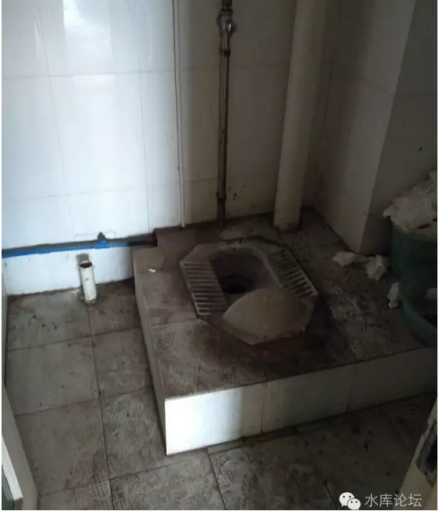

于是呢，您再便宜点吧。

我们的利润，70%出自于凤姐。你必需"买入"时就远远低于市场价。所有的利润，在买入的一刻就已经产生。

此后，只不过是价值的恢复。

 

毕竟，体验"冰冰"，愿意为冰冰买单的人，只有30%

远远的少。而且不是我们所可以控制的。

 

 

 

二）原始社会

 

凤变冰，拿到了产证。移交交接入户之后，第一件事你要做的是什么。

敲，敲成原始社会。

 

 

对一套"凤姐"的老破小，原则上是把一切都扔光。任何的东西都不要留。

新手们容易犯的一个错误，是愿意保留一下"有用"的东西。以节省再装修成本。

例如埋墙电线，水管，可以复用。

厨房卫生，有二个脱排油烟机，刚买的，连包装纸都没有拆呢。

 

错，全扔，全部都扔掉。哪怕是没开封的也扔掉。"断离舍"

否则他会干扰你的设计思路。

 

 

我们的要求是，彻底敲成原始社会。恢复到石器时代。

整个房屋，最后就只剩下一个光凸凸的水泥骨架。四边框梁。

问：原房东打了许多"吊柜"。密密麻麻的，从天花板上一路下来。可以放许许多多的衣服。

请问要不要敲。

答：敲，敲光。彻底打成原始社会，水泥框架。

 

再问，房东有隔断，原本的一室户隔成了一室半，多了一个小房间。请问要不要敲。

答：敲，敲光。彻底打成原始社会，水泥框架。

 

 

那么，为什么要做得如此彻底，如此绝情呢。

其中一个很重要的原因，是"材质"。

 

你要知道，凡是卖给你的"凤姐"。大多数都已经装修了有十几年岁月了。最早的甚至可能是80年代装修的。[\[1\]]

而"装修建材"，在这些年有了很大的进步。

 

 

为什么"老破小"给人看起来，总有一种单薄破旧的感觉。

其很重要的一点，是80年代用的建材不行。

 

当时，材料是预制板，木材是三夹板，而且普遍质地疏松。

哪怕较好的材料，经过十几年的时间，也早就被蛀空了。

 

 

最为严重一次，有一次操刀老公房。等敲成"原始社会"，装修师傅都哭了。

因为他的整堵墙，卧室的整堵墙。并不是用水泥做的。

而是用黄泥做的！

 

就是黄土高原上的那种黄泥，拿一点抹平了涂在墙壁上。

在上海买套老房子，居然还住进了黄土窑洞去了。

 

 

所以你干脆全部敲光。彻底恢复到最基本的水泥架子。

我们并不要求你"七成新""五成新"的房子。反正我们也是要全部都敲光的。

我们干脆就要你最丑最丑最丑的房子。[你把价格降下来]，反正我们也要敲光。

赢利关键在凤姐。凤姐一定要便宜。

 

 

然后呢，在"石器时代"的基础上。我们做第一次加固。

类似于80年代的建筑质量，整个阳台都可以塌陷。水泥外墙上一条条裂缝。

而现在我们用高质量水泥全部都帮它补上，固本培元。良心实业。

 

 

 

三）江湖规矩

 

讲几条潜规则。

1）如果你的小区，不是90年代"彻底不管"那种新村。则你需要到物业办一个登记装修手续。

 

物业会告诉你夜晚不许开工不许扰民，节假日要休息云云。

同时问你收300\~400元的"装修管理费"。

这笔钱属于苛捐，但一般建议你认怂。强行争执并没有太多的意义。

 

 

2）一旦你开始敲墙，你会产生惊人的建筑垃圾。俗语说"2000个麻袋"。

这些水泥碎石，因为数量太大。已经不能简单地堆放在小区垃圾桶。

一般物业会给你推荐一个附近的垃圾场。也或者有专业收建材的。总之会产生一笔费用，有心理准备支付。

 

3）在某些物业小区，"敲墙"这个行业甚至是被白完省人垄断的。

也就是你在本小区装修，敲墙只能由"物业指定"施工队。

 

他们的收费会比外面高150\~200%，原因你懂的。

具体的对策，建议认怂。或者坚持自己弄，但塞点金帛。

 

 

3）一旦装修开始，装修师傅会塞给你一张单子。要求买20吨黄沙，20吨水泥。此后还有。

 

价格不贵。每一包也就是几十元的意思。

这里面的潜规则是，黄沙水泥的用量，是完全无法统计的。业主也不可能站在旁边看师傅花几小时搅拌水泥。

 

所以"黄沙水泥单"一般就意味着师傅的小费和外快。

这笔钱业主一般是认了，打入总工资。羊毛出在羊身上。

只有最愚蠢的书呆子才会斤斤计算。

 

 

以前曾把御用装修师傅，介绍给安家群的一个小妹。

过了一个月，师傅打电话过来哭诉，"你那个学妹，她神经病的"。

"我用了几卷电线，她用卷尺一个个房间量的。最后算数出来说我多用了200米"。

 

我冷静地吸了一口气，"镇静，镇静，这就是她迄今嫁不出去的原因"。

 

 

 

四）水和电

 

敲完了原始社会之后，接下来的工作是排线。

 

根据俺这么多年的惨痛经验教训，我的建议是："任何一段墙壁，都必须有电源插座"。

任何一段，而不是任何一面。例如插图：

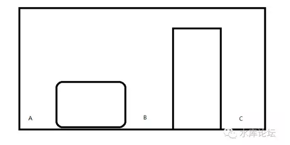
\
这是一个典型的房间。有一个柜子和一扇门。则你在A，B，C三个点，都必须留出电源插座。这就是"一段"的意思。

 

 

最近比较幸运的是，Wifi技术的进步。以往是"四类插头"。

-   电源

-   网线

-   电话线

-   有线电视

以前的布线原则，要比现在麻烦得多。而现在只有电源是必须的。

每一段都要。

 

 

如图。象这样的户型。则ABCDEFGH都至少要有一个电源插头。

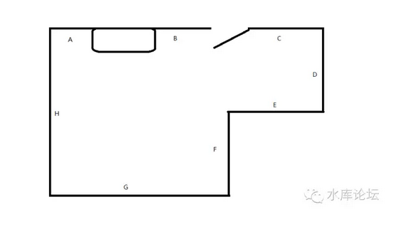

对于水源。我们的建议是，"凡是有下水的地方，都要装上水"。

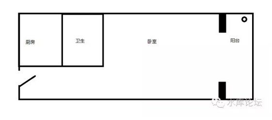
\
 

如图，这是一种很典型的"一室户"户型结构。在阳台上有一个下水，原本是给你放洗衣机的。

但是你设计的时候，很可能洗衣机改在厨房/卫生间里了。

 

这样的情况下，你仍然应该"预留"冷热水管道，一直通到阳台上。

哪怕暂时不用，以后改建成一个洗手台。也是非常具有小资情调的。香薰SPA。

 

 

 

对于别墅类装修，则是应该记住；

"任何一个露台，都要预留冷热水龙头"。

 

任何一个二楼三楼露台，都要预留上水。

我之前还犯了错误，只留了冷水。

后来终有一天，我把阿姨赶到了露台上去洗衣服。再给她建了一个洗衣台。

于是阿姨抱怨没有热水，后悔莫及。

 

 

水电隐蔽工程是最难改的。应该预留尽量大的余量。

每一"段"墙壁都至少有一个电插头。

每一个阳台都连接了冷热水。

 

 

 

五）卫生间

 

如果给我一次机会改户型的话。我会把厨房卫生改大。

 

因为卧室再怎么说也有16平米。16平米其实和14平米，居住体验相差不是很大。

但是老公房普遍的厨房卫生小。6平米改成8平米，感觉就好很多了。

我宁愿把墙往卧室方向推一米。

 

 

对于卫生间，"凤变冰"几乎所有的套路，都取消了浴缸。

因为浴缸占地方，而且1.5米的浴缸非常丑。大浴缸你又用不起。

 

在传统意义上，"浴缸"主要是家里的老人使用。甚至有一些髦髦老人完全无法站立，而是要坐在浴缸里。由小保姆浇，浑身冲淋。

 

但是你想，"租房子"的都是些什么人。

租房子的从来没有七旬老人。以年轻人和大学生为主。

因此"凤变冰"流派，全面取消浴缸。

 

 

淋浴房具体的设计，要看室内户型。

一般90cm的尺寸是下限，120cm就已经很舒适了。

另外说一句，250元/米的淋浴房，和800元/米的进口货，在使用上没有任何差异。

 

 

对于面斗和马桶，如果你要省地方的话。你可以做成墙排水。

不过墙排水要预先埋管。一旦定下了，就不可以改为直排。

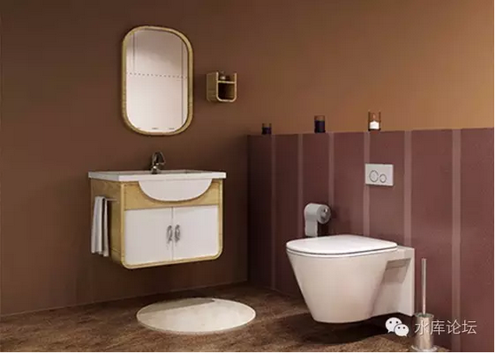
\
很少用，易坏。

 

 

如果你真的卫生间非常非常小。还有一个办法:可以把马桶做在淋浴房的里面。

极限情况，我计算过。只要2平方米。

淋浴房+马桶+面斗，放置三件套。

 

 

卫生间另一个元素，则是镜子。

如上图那镜子，不推荐。太小。镜子要尽可能大，半身镜。镶一圈镜框可以极大增加IB格。

 

当然，哥哥的变态是有限的。我还没有做到在淋浴房里面装镜子。

 

 

 

六）厨房

 

任何一个有过装修经验的人都知道，那些所谓的"大面积视觉"，例如地板和油漆，其实都是不耗钱的。

烧钱的地方，主要是厨房和卫生。

多一个卫生间，就是上万元。

 

 

厨房主要是台面贵。算法是（上柜+下柜+台面）\*米数。一般每米在2000\~8000元之间。

这一方面的成本，哥哥水平低，我也想不出办法省降下来。

 

然后厨房也是三件套。煤气灶+脱排油烟机+消毒柜。

我的建议是，把消毒柜取消，换成洗碗机。

虽然贵了一千多元。但这笔投资是非常非常值得的。

 

 

厨房装修中一个诀窍是，某些时候你需要移动煤气管。

按照正规的法律，煤气管是不可以动的。

但是你可以申请让煤气公司派一个技工上门，然后你懂的。

 

 

某些极简风格倾向于做"开放式厨房+电磁炉"。

对此，俺持保留态度。

中式炒菜封闭房间还是需要的。哪怕不为租客着想，也要考虑哪一天你再出售。

 

 

 

七）吊柜

 

好了，现在我们进入到了房间里面。

前面说过，把旧房东的所有吊柜。所有悬挂在天花板上，密密麻麻的掉漆木柜全部都砸掉。

 

但我们是否还需要重建呢。

答案是不需要。

 

 

因为吊柜主要是储放衣服。进一步则是被子和冬衣。

在以前，你的上一手业主手里。他们都是"自住"。

自住，尤其是老人自住。老人的生活物品就会越来越多，越来越多。

 

"断离舍"哪一件也不肯扔，哪一件大衣也不肯扔。

最终东西只能越来越多，越来越存放不下。相应的则是一个个的悬空柜子。

老人们甚至还抱怨柜子不够用。这些是她们的性命根子。

 

 

但是，你站在"凤变冰"的角度上想。凤姐变冰冰的主要对象是什么，是租客。

租客会不会带了二大集装箱的东西入住。不会。

最多就是一个手提箱。

 

所以租客不需要你密密麻麻的"悬空柜子"。这绝对是视觉污染。而且对生理，心理，造成了非常不好的压抑感觉。

我们的建议是，全部敲掉。不再恢复。

 

 

同样道理，还有六门大橱。

大橱存在的理由，同样也是放衣服。

如果让你妈妈设计户型图，布置房间，则她优先第一位，首先想到就是大橱。

大橱甚至比女人的床更重要。没有大橱，她们就活不下去。

 

 

然而在"凤变冰"的大前提下，大橱应该被坚决的淘汰掉。

首先，租客不大会有这么多的衣服。他就是一个皮箱。

其次，即使租客有，房东也没有责任义务要帮你买大橱。

 

进一步考虑目前的租赁市场，大学生的情侣合租现象越来越普遍。

对于大学生来说，他们甚至连长衫都没有。连一件像样的西装都没有。

要什么大橱。

 

 

因此，最多配一个二门衣柜就够了。也不用占用耗去整整一面墙。塞在角落里就够了。

我们并没有能力"点石成金"。没可能35平米装修出70平米的效果来。

关键是取舍。

 

你把密密麻麻满天悬空的柜子都敲掉。

把大橱的地方空出来。

整个房间就显得大了。

 

 

 

八）卧室

 

鉴于目前的家庭关系结构，我不是很喜欢"一室半"的户型设计。

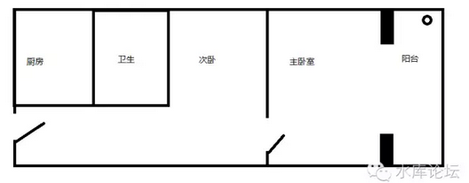}\
如图，这和图3有点象。只不过是把房间中间隔断了。

加了一堵墙，就变成二间了。

一个主卧，一个次卧。

 

在"自住"需求中，次卧一般是家里有80岁的老人。

又或者是18岁以下，还没有考大学住校的小孩。

 

这样的分割，多了一个房间。但是次卧的采光非常差。黑灯瞎火。

主卧的面积也小了很多，感觉很不舒服。

 

 

在"凤变冰"的做法中，你要想到。

-   首先，一对夫妻带着80岁老母来租房子。这样的租客是不存在的。

-   其次，一对夫妻带着17岁大孩子来租房子。这样租客也很少见。

 

就算是外来人口苦哈哈夫妻，小孩子也往往是五六岁。年龄还小。

真的要孩子十七了，还没有买房子。混得这么差的非常非常少见。

 

 

所以，我宁可恢复成图3这样的户型。

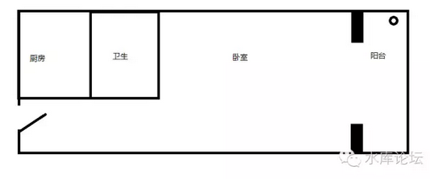
\
这样的户型，你一推开门，直接可以看到日光和外景。哇的一下，心情感觉很舒畅。

另一方面，卧室的面积显得大了很多。你这房子很有性价比。

 

 

还有一个好处。有很多次是"二男""二女"同学关系，合租一套房屋。分摊租金。

这样的情况下，他们喜欢"标房"，放二张床。

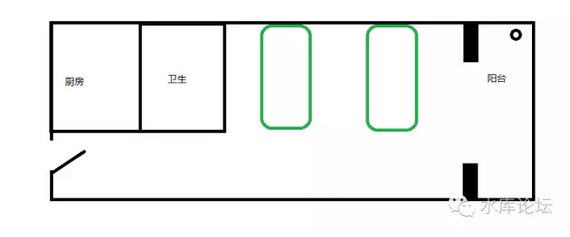
\
这个市场也很大。至少比一室半大。

 

 

 

九）整体视觉空间

 

走出了精致小巧的厨房和卫生间，讲讲我们的卧室大空间。

虽然厨房和卫生间是最耗钱的。但是能不能顺利出租，能不能租出一个好价钱，关键还是看"视觉大空间"。

 

 

前面已经说过了，为了视觉上的好看，我们不惜放弃一室半，而追求光照大统间。

除此之外，你还有许多事情可做。

 

1）追求视觉大空间

 

原则上，我们应该是"毛坯交房"。即在房屋装修完，保洁做完。最后招租的时候，房间里应该是没有任何家具的。

 

你放了任何家具，感觉上都比没有家具屋子要小。

你最多用手比划比划，这里放个床，那里帮你买个茶几。

甚至茶几也可以让租客自己上淘宝买二手。临退房时带走。

 

房间里干干净净，不要有拖鞋，茶杯，毛巾，纸箱，这是最基本的要求。

老人们管理房屋，很容易犯的一个错误，就是喜欢把毛巾乱扔。

 

他们不知道天平处女座的强迫症，要的就是"完全没有任何杂物"。

 

 

2）乳胶漆

 

现代化的油漆，远远比80年代的建材要好。

尤其是一些油漆，号称"宽景"。特点是墙面特别光滑，使得视线无法聚焦，眼神游离，而觉得空间更大一点。

 

采取一色纯色的墙壁背景，能显得你的房子又干净又宽敞。

 

基色一般是乳白，象牙白。选择蓝色天花板或者绿色一面墙需要很大的勇气。

 

 

 

3）大色块

 

尽量采取大色块的底色背景。

 

反面典型是80年代的拼花地板。

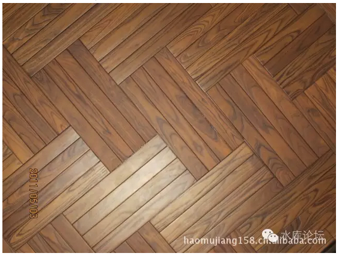

小碎木拼花地板，它表面几乎永远都是凹凸不平的。

对于光线反射，明暗不一。哪怕是刚装修的房子，看起来象旧的一样。而且还积灰。

 

 

80年代时，工业能力薄弱。只有一些边角碎料拿过来作地板。

而今时今日，除了一些怀旧的土财主。在主流出租市场用旧木头就是自杀。

 

小碎木不如长条的整木地板。

我个人喜欢，实木地板不如玻化砖（后面讲）

 

 

4）光源

 

亮点，亮点，再亮点！

对于光源，没什么好说的。只有一个字："亮"

 

 

我们要知道，来租你房子的，租40平米老公房的。绝大多数都是穷人，要么就是青春痘大学生。

对于他们来说，烛光如织的欧式酒吧情调，是没有意义的。

 

对于很多穷人，他们上一套房子可能还是住在一室半的"次卧"。或者北间地下室，受够了阴暗潮湿的味道。

 

 

对于整体光源设计，象我们这种简单粗暴没有艺术细胞的流派。就只有一个字："亮"。

你必须很亮，足够的流明。亮到照射每一个角落。

 

而且亮和白光会显得你的房间更大。越是亮的反光，越是显得房间大。这和镜子是同样的原理。

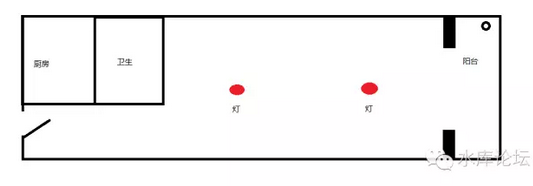
\
我们观察户型。有时候对于这种长条形的户型。我们甚至会做二组顶灯。

 

这种完全违背设计美学的做法，其实是为了给房间每个方位充足的照明。用最廉价的方案，将流明塞入每一个角落。

 

 

吸顶灯不贵。买一个OPPLE也不过一百多元。

而其他的花俏的吊顶，射灯，牛眼灯，雾灯，全部没有应有的效果。

客户来看房时，你甚至都没有机会打开。

 

 

 

十）地板的选择

 

对于我来说，我的作风风格（当然不被其他多军认可）。在于哥哥非常地喜欢用[玻化砖]作地板。

 

只用砖。完全彻底不用实木地板。

哪怕你在卧室里，脚底下也是砖。一寸木头都没有。

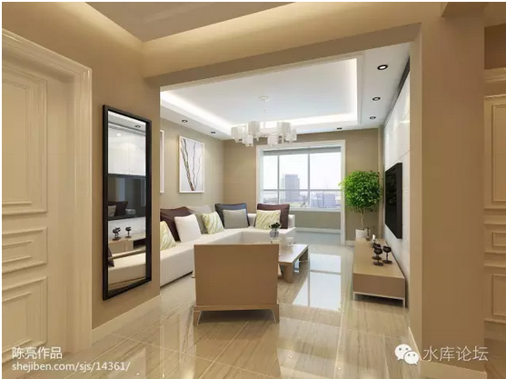

为什么，卧室用地板，不是卅年主流么。

几乎每一户每一个人都觉得，卧室地板，天经地义。

 

我们来比较一下；

       地板     玻化砖
  ---- -------- --------
  春   无所谓   无所谓
  夏            优胜
  秋   无所谓   无所谓
  冬   优胜     

 

 

上海的夏天，十分炎热。一旦到了36°，更是热得你走投无路。

而在这个时候，玻化砖有着非常大的优势。

 

想象一下，赤脚走在石头上的感觉。

现在很多年轻人Party喜欢腻坐在地板上，看电视打Wii，这个时候玻化砖都很舒服。

 

 

事情的反面，是冬天。

冬天地板要比玻化砖更缓和一点。

 

但是我们反过来想，你是怎样的居住情况。

"人均面积狭小，人口密度很大"。

在40平米范围内，很有可能要住3\~5口人。

 

 

人本身就是一个巨大的发热体。三五号人挤在一起，本身就已经热得让你难受。

而且真的等你住进来。这么小的房子，连家具带行李，地面上铺得满满的。"投影面积"空地应该不多。可能也就留几条走路的缝。

这样的情况下，你几步一跨，跳到床上。又有什么怕冷。

 

 

而且在老破小的大前提下，玻化砖有几个好处。

1）千年不腐不朽

 

80年代的老破小为什么可怕。你刚买入手的时候，为什么人类无法踏足。

主要是木头烂了。

 

木头是无法经受岁月的侵蚀的。随着时间推移，木质品会越来越颓废，越来越衰败。除非你全部黄花梨。

 

你受够了木头的摇摇欲坠。所以你改石材。过了十年，你这地面还是如新的一样。

还不长白蚁。

 

 

2）美观

 

80\*80的大面积玻化砖。其美观远远超过长条木地板，更远远超过拼花地板。

大块大面积的均色，能给人极强的视觉冲击。

现代工业对传统农业的胜利。

 

4）易于清洗

 

5）不怕渗水

 

对于老破小房屋。哪天屋顶暴雨了，或者隔壁邻居的漏水渗过来，是常有的事。

更何况还有白蚁蚊虫和甴曱。

 

 

根据我自己的实战，玻化砖替代地板的效果还不错。无论租金和转售价都创了新高。

不过多军内部就我一人喜欢用砖。诸人一致反对板砖无数。

 

\* 顺便说一下，劣质廉价的瓷砖主要是四角不平。

 

十一） 梦想改造家

 

前二天，微信上有一篇文章刷爆了屏。

《那些被爆改过的房子曾连续刷爆朋友圈，然而他们的后续惨状却是\...》[\[2\]]

 

 

对于梦想改造家，俺莫名其妙却想引用"科罗廖夫"老师文章;

《歪门邪道终非正途：昙花一现的天钩航空母舰》[\[3\]]

文章中的最后一句话：

 

天钩航母就像搜房网站里推荐的30平方米的小蜗居也能装修出100平使用空间的那些装修方案，只适合忽悠没住过更大房子的。

 

 

为什么这么说呢。因为"梦想改造家"他整部片子就是错的。根本就不是那么回事。

在真正的内行人眼中，是可笑的。乃至是可耻的。

 

 

"梦想改造家"其具体套路，和我们说的"凤变冰"其实是一脉相承的。

其主要思想，也是把房间撤空。

本来乱糟糟的东西，全搬空，统一色调（统一榻榻米），自然就显得好看了。

 

 

但是，那些被抛弃的衣服被子瓶瓶罐罐，并没有"断离舍"而消失。

等摄影师一走，老人们自然又重新捡回来，把房间塞得乱七八糟。

其境界，甚至还不如水库细分自住市场和出租。

 

 

另一方面，"梦想改造家"值得被人诟病的，是他大量地使用"折叠件"。

譬如翻起来是个柜子，翻下来就是床。

叠起来是张桌子，晚上吃饭还是床。

 

 

在我们所有的设计方案中，绝对不要使用折叠件！

在任何一个方案中，绝对不要使用折叠件。这是没良心的做法。

 

为什么，因为非常容易损坏。

任何一个稍有装修常识的人，都知道移门比拉门省地方。尤其是小型40平米房型，更可以省2平米开门位置。

 

可是几乎所有人都使用拉门，甚少移门。为什么。

因为移门很容易坏。其导轨，悬空，被小孩熊孩子蹬二下就坏掉了。

 

 

同样的道理，翻叠的床从卓别林"摩登时代"开始，就仅仅在电影作品中存在。

实际生活中非常少，几乎没有任何一个建材市场卖这种产品。

 

为什么，因为很容易坏。

你150斤的重量压上去，每天翻转三四次。只有非常傻大黑粗的铰链才承受得住。而铰链受得住，木材受不住。

连接口会裂。

再有你想想，床有时候还会摇。

 

 

象"梦想改造家"这样的设计方案，本身就是不靠谱的。

本身设计师就是博眼球，没有做的长期居住打算。

 

哪怕你找一个女文青住进去，而不是老阿婆。最多二三年，它的设施还是会一件件坏过去的。

歪门邪道是没有用的。只有市场上千淬百炼的传统做法才能活得下去。

 

还是那句话：只适合忽悠没住过更大房子的。

 

 

 

十二） 风格与亮点

 

前面的1\~10节，我们介绍了"凤姐变冰冰"的一些基本套路和做法。

还有这第12节，按照惯例，四个大字："以上全错"。

 

 

凤姐变冰冰是有固定套路的。基本上拿到40平米的一居，一室半，翻来覆去就这几种户型。

我们拿到了手里，也都象是梦游一样。敲光，然后埋水电管。然后做地板和油漆。

 

有时候御用装修师都已经如此熟悉。他甚至不用你指令，自己就会知道该如何开始干活买料了。

 

 

 

但是，光有这些是不够的。你还需要"做个效果"。

好比一大片白色延绵的墙中，突然升起了一朵嫣红的玫瑰。

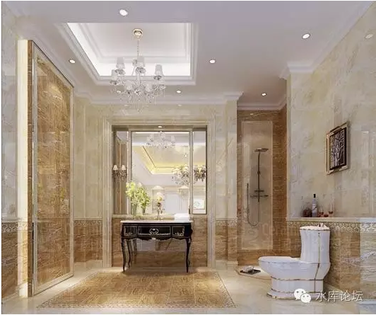
\
 

千篇一律的作品令人厌倦，同时租客也缺乏热点。

所以我们在90%的基调工业化完成的同时，还要花10%的精力，来"做个效果图"。

 

 

效果的定义，十分广泛。有很多种选择。

如上图。它马桶的背后挂了一幅画，这就是一个"效果"。花砖腰带，都是"效果"。

相代替的，你可以在淘宝买几十个欧式镜框。做一组"镜框墙"。

又或者是拉二条木板横档，散乱堆几本书在上面。

找瓶花，有条叶子，垂下来。

 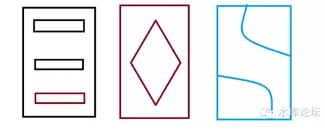

再譬如说，你看它的屋顶，有个吊顶。垂了一个水晶灯下来。

做个吊顶，也是"效果"。

 

 

我们装修房子，追求"极简主义"。

极简的另一个曾用名，咳咳"最省钱"。

一般情况下，我们不做吊顶。甚至连屋角四框的边也不勾。

不勾也能出租么，何必浪费钱。

 

 

但是你连续操作十套房子，有一套做了画框，有一套做了镜框，有一套做了横栏书架。

有一套做个镜子，聚拢一束光。从圆环中射进来。

 

 

本套也不妨做个吊顶啊。挂盏灯，挂盏稀奇古怪的灯。

至于吊顶式样，更是随便画了。师傅基本上石膏板都能做出来。

 

再譬如说，你看它左边的这扇门。鎏金堂皇，煞是漂亮。

出租屋自然不会用鎏金烫金门，不过磨砂玻璃，也能变很多戏法的。

 

你可以喷塑，做背景墙。

甚至可以把电视机装在天花板上。

 

还有人在软装上动脑筋。找一些有机关的家具。

角落里放个酒柜，放个壁炉。

自动连接Wifi，连接手机App的门锁。不交租就滚蛋。

 

戏法人人会变，各看想象力不同。

 

 

一般来说，我们的任何一套"凤变冰"房屋，都会绞尽脑汁做1\~2个"效果"。

效果不用多，真的做了三个五个，那也没人看。

 

但一二个"效果"是必须的。每一套房屋都是独一无二的。都是特别匠心。都有特殊的风格在里面。

 

这样，租客住得舒心。

你也会一辈子记住这个小猪仔。

 

 

 

（yevon\_ou\@163.com，2016年10月10日暮）

 

 

 

 

\[1\]人性最灰暗一点，就是那些房主明明知道弄一下几万元。就可以光亮许多。

可是他们就不愿意弄。 

\[2\]《那些被爆改过的房子曾连续刷爆朋友圈，然而他们的后续惨状却是\...》http://mp.weixin.qq.com/s?\_\_biz=MzI1ODAyNjcxMw==&mid=2651717523&idx=1&sn=81201a4bcd8340d81837e86a99fce15f&chksm=f1f72225c680ab33cb7e959111c52eca4cb893496350fab27ff87173ebf9d46d8f6bcc02014a&mpshare=1&scene=1&srcid=0927e3IJXRGye1ihP86p1r5o\#rd

\[3\]《歪门邪道终非正途：昙花一现的天钩航空母舰》http://www.toutiao.com/a5231994971
