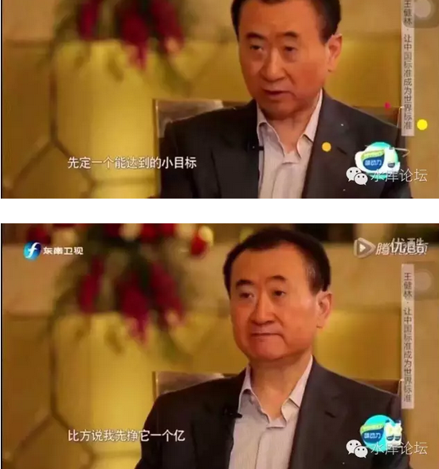

# 浅谈炒楼2N定理 \#2570

原创： yevon\_ou [水库论坛](/) 2016-10-13

 浅谈炒楼2N定理 ~\#2570~
======================================================================================================================================================================================================================================================================

 

\* 原文写于2013.07.16，本文为彻底改写版 \[1\]

 

 

千里之行,积于跬步

 

 

一）小目标

 

前二天在微信上有人问我：

"老大，你最近的几篇文章都很好。每一篇单独都很精彩"。

"可是总体来看，总有点东一榔头西一榔头的味道。框架散漫，体系无存"。

 

我回答说有啊。从\#2380开始的十几篇，看似讲了借钱，流动性，乌云，装修。

但其实我们全部串联起来，是为了这篇"浅谈2N定理"做准备。

 

 

什么叫做2N定理。

就是每一年买2套。

 

 

我们来看一下，国民老公他爸最近提出了一个"小目标"。

 

 

"小目标"怎么达成呢。

对于各行各业来说，无论你是工程师，建筑师，会计师还是警察，"小目标"都仿佛是一辈子无法企及的高峰。

 

 

但是，对于炒楼这一行。"小目标"并不遥远。

前二天，有一个菜鸟，傻乎乎地跑上来问。"欧绅的分答，500元一分种，这钱也太好赚了吧"。[\[2\]]

我冷冷地给他算了一笔账。

 

1分钟500元，一小时30000元。

每月172工作小时，合计516W元。

一年6192W元。

 

过去一年，普遍认为上海楼价涨了20000元/平米。

折合3100㎡

 

 

也就是说，如果你上海的"二斤房产证"超过了3000平米。你一年之中，赚的钱就大概率超过六千万。

所谓国民老公他爸的"小目标"。对职业多军来说，也不过二年的事情。

 

而3000平米算不算很大的数字呢。

汗，群里不知道1/3的人有没有。

 

好了，现在问题只剩下一个。

如何积攒你的第一个3000平米？

 

 

二）奋斗

 

在我们很早的文章《[向上爬
\#3220](http://mp.weixin.qq.com/s?__biz=MzAxNTMxMTc0MA==&mid=206545656&idx=1&sn=3aefae067586f6dba726a16ddaaeeceb&scene=21#wechat_redirect)》（又名：怎样才能改变你所处的阶层）

 

其中，我们吐槽了大陆的"奋斗剧"。

-   前20集主角是穷学生和屌丝，酸气冲天。

-   后20集主角是创业成功事业有成，A10几百号员工左拥右抱众星拱卫。

-   中间5集呢，中间5集是空白的

 

水库论坛，承诺会告诉你"中间5集"是什么。

会告诉你爬阶的具体步骤。

怎样从一个A7的穷屌丝，翻身成为A9左拥右抱。

 

 

你要赚"1个亿"其实很容易。

最简单的话，你买京沪深"一亿"的房产。过了二三年房价翻一倍。

你就赚了一亿。

 

问题是；

1）你没有1亿本金

2）你不确定会再涨翻倍

 

关于2我们就不讨论了，这也没什么好说的。反正是脑袋吊在裤裆里，拿命换来的。

任何一场对于风险的赌注，都是拿命去换的。你不愿意冒险，你就不用看下去了。

 

 

对于1，"如何筹措一亿本金"。大而化之的心灵鸡汤，新华书店里面的"理财宝典"，只要25元一本。天知道25元/本的书记能教你哪些营养。

而我们是Marketing出身的。受专业的科班生训练。

 

对于专业的Marketing管培生来说。他思考问题的第一步，就是Break Down

-   我要赚一个亿

-   赚1E细分成：拥有3100平米。并且静待三年涨幅

-   我要攒3100平米

-   问题细分为50平米\*60套

 

因此，我们就拥有一个更详细的目标；

-   我要拥有50平米的老破小，拥有60套左右。

-   然后随着上海房地产的大船一起上涨。

 

 

当然，各有流派不同。前二天写"[凤姐变冰冰](http://mp.weixin.qq.com/s?__biz=MzAxNTMxMTc0MA==&mid=2651015136&idx=1&sn=6a26f814fc7006f64410109f707b7c11&chksm=807211f3b70598e51c14a13b5658fc6d84295bfc95b47ef3b54b5f02eb65c3ed29d61e25a7ba&scene=21#wechat_redirect)"，写顺手了。所以用50平米老破小举例。

你也可以是100平米标准二房\*30套。

 

 

如果是"大面积低单价"流派。甚至仅仅需要250平米\*12套就够了。

任何人一眼就看出，"大面积低单价"对于"小目标"，有更强的逼进火力。

十二套还是比较好操作的。咬咬牙，某人今年已经买了七套顶复了。

 

当然，大面积流派的缺点是流动性不行。账面好看，出货需要很久漫长的时间。

但肉烂在锅里。先发财，我慢慢变现不急还不行么。

 

 

言归正传。对于一般的"普通市民"。我们的要求没有这么高。

3100平米是"职业多军"的玩法，职业多军都是一帮疯子，和正常人的世界距离比较远。

 

对于普通老百姓来说，假设8000-\>60000，则平均每平米赚五万。

一般来说，按照目前的上海物价，社会风气以及平均丈母娘行情；我们粗浅地认为，"财务自由"这条线设在4000W人民币左右。

 

算下来，4000/5=800，你大概需要八百平米。

等你积攒到八百平米。我们就认为你是"业余选手"通关了。

而800平米，相当于50平米老破小的16套。

或者100平米标准二房的八套。

 

例如著名的内环最美丽"财上海"，按照可怕的蛛丝马迹小本本党们推算。

其身价大约在杨浦580平米，七至八套左右。

 

 

 

三）2N起步

 

十几年前，大家都很穷。

时光回溯到2000年，当"游戏开始"时，每个人都是0积分。

哪怕职业多军，当时也只有1\~2套。

 

这是很悲哀的一件事，你先要积累巨大的头寸。然后才可以享受头寸升值的收益。

第一个100万，永远比1亿-\>1.1亿要困难得多。

 

 

当你积攒了1000平米，2000平米，3000平米。

你要每年赚1000W，2000W，3000W，只要坐在家里博对大势就可以了。

可是你又哪来的1000平米呢？

我们几乎用半生的心血，耗费在"建立头寸"上面。

 

 

这就是2N的意思。

理论上，你需要16套五十平米老公房。

可是实际上，房子又不会从天上掉下来。你还是需要一本一本房产证去攒。

用最简单的算术，每年攒二本。八年之后你有16本。

 

==\> 但是你一定要起步，走二万五千里长征路。

如果你坐在家里抱怨，永远也不会多一本房本。

 

"你怎么会有16本房产证的"。

"去年我14本"。

"你怎么会有14本房产证的"。

"前年我12本"。

 

 

我们几乎耗费了十年的心血，才积攒起"满身军大衣，全是房产证"。

然后你看着一年升值几千万，羡慕不已。

 

前面九年的斑斑血泪，你怎么看不见了。

 

 

 

四）雪坡的长度

 

对于穷人，真的是很惨很惨很惨。

 

对于富人，如果你"看对了"走势。你满仓扑上，只要一二年的大牛，就足够你赚得翻翻。

可是对于穷人，你是从"一穷二白"开始的。你可能要先经历十年八年的"2N爬坡"，慢慢积攒十六本。然后再指望一年大涨，赚得满嘴流油。

 

因此穷人需要一个长得多的雪坡。

可能需要十年，甚至十几廿年的大牛市。才能翻身跨越阶层。

 

 

 

之前旧篇"浅谈2N定理"写于2013年。而多军圈内喊2N的提法，还要更早。可能在2008以前。

 

对于2013年的房地产市场。它要比现在"健康"得多。

当时的价格，大约在4/3/2，虽然也不便宜。但至少是物有所值的。

 

 

2016年今天的房地产市场，8/5/3都已经打不住了。很有可能在10/8/5左右。

因此任何一个人，看到"2N定理"，想问的第一句话是"雪坡还有这么长么"。

 

2N是一场长期规划。

普通的中产家庭，如果想积累16套老公房（1000平米），真的要十年人生，十年节俭，十年赌注，一家一当全部都扑押上去。

 

 

你花了十年建仓，十年之后，才慢慢开花结果。

十一年之后，你才能享受"每一年升值1000W"的无比美妙畅爽。

可是，十年之后，房地产还是牛市么？

 

 

关于这个问题，我们有二个回答。

第一个回答，是"永胜不败"之法。

 

2005年参加91facai聚会的时候，大家纷纷攘攘讨论"理财发财"的思路。

当时分为二派。

一派是传统的理财派。认为"定期定额"投资股票。根据[证券教科书]巴拉巴拉是"永胜不败"的收益。

另一派则看好房产。认为房地产比股票更有希望。

 

哥哥冷眼旁观了一个小时，最后到总结发言时，我站起来说，

"其实我有一个绝对发财的办法，永胜不败，绝对没有任何亏钱的可能"。

 

 

诸人一起跌破眼镜。天下竟有这等奇事。你这个是违背"地心引力"的呀。

投资的事，风险双刃剑。有输就有赢。要何等胆子，才敢说"永胜不败"。

于是所有人凝息静气等我发言；

哥哥清清嗓子，"定期定额投资房产"。

 

 

定期定额，每年买一套。

你如果上过任何一个"股票培训班"，有一丁点证券基础知识的话。则经纪人都会推荐你"定期定额定投"。

每个月固定从工资里凑一笔钱出来，定投金融市场。

 

定期定额的好处，真的说也说不完。

它在数学算法上很巧妙，接近于二阶微积分求微导幂函数指数曲线重心外移。

只要市场"长期向上"，则定期定额的赢面极大。哪怕遭遇香港97大跌。只要你是从91年开始定投的，你也没有任何亏损。

 

 

"房地产"传统概念，很多人都以为一辈子供一套房子。一套房子供一辈子。

所以从来没有人想到过"定投"的。

但是你把"定投"和房地产结合起来。每年固定买2N。则你的赢面更大。跑赢现金和定存几乎是99.999%的事。

 

 

第二个回答，是"雪坡未尽"。

在"陈兜兜很厌世"公众号里，她写了一段话。关于为什么要如此鸡血地"买房子，抢房子"。

 

陈兜兜说，"我知道它在过去十年涨了十倍都不止，不假"。

"可关键是它还可以涨一倍啊"。

"无论它涨了十倍二十倍，只要它能再翻一倍。这一倍就等于你20倍"。

 

 

这话说得，实在再牛强不过了。

对于房地产，我们持相同的态度。

从微观上看，2017\~2018必然是"涨"年。宏观由微观组成，Break
Down之后我看不见有任何微观迹象明后二年会下跌。

既然2017\~2018是"涨"年，那你就不要辜负。

 

 

从长远来看，"京沪深"一线楼市的"雪坡"，至少可以看到250000/m。

廿五万之前，没有必要太过于悲观。

哪怕它涨了二十倍，它还可以再涨一倍。一倍抵二十倍。

 

                   

 

五）结语

 

最后有人问，"老大，你讲了那么多"。

"你还是没有告诉我们'中间五年'是怎么过呀"。

 

 

"奋斗"电视连续剧的中间五年，从A7变A9，您还是没有说细节呀。

这一篇是"浅谈2N"定理开篇。

此后的五篇，就是第一年，第二年，第三年，第四年，第五年。

 

 

 

 

（yevon\_ou\@163.com，2016年10月12日晨）

 

 

 

\[1\]《浅谈2N定理》http://www.shuiku.net/forum.php?mod=viewthread&tid=11285

[\[2\]]《今天看到一个帖子，说可以1元偷听欧神的分答，我不禁感慨》http://www.shuiku.net/forum.php?mod=viewthread&tid=48505
