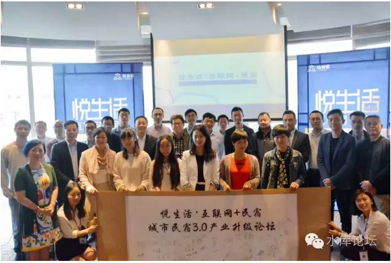
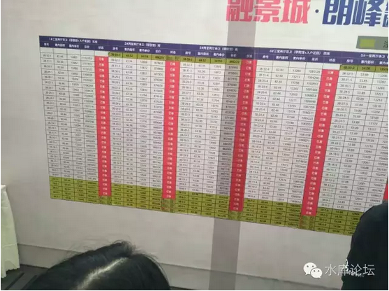
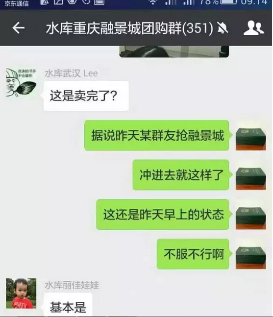

# 九套十套山穷水尽 \#2620

原创： yevon\_ou [水库论坛](/) 2016-10-29

 九套十套山穷水尽 ~\#2620~
======================================================================================================================================================================================================================================================================

 

人类的一切智慧包含在这四个字："等待"和"希望"

 

\-\-\-\-\-- 《基督山伯爵》最后一句

 

 

一）坏消息

 

我们有二个消息，一个坏消息，一个好消息。

-   好消息是，我们马上要通关了。只要撑过了这一关，下一篇就是《2N之通关》

-   坏消息是，再也撑不下去了。

 

 

在之前四篇，我们介绍了2N如何筹措资金。大约每年400W的献血投入。

2N的过程，同时也是"自我压榨"的过程。通过对自己的不断逼迫，人到了绝境时，潜力是无穷的。

 

平时你以为自己无论如何不会透支信用卡，不会开口向别人借钱。

可是走投无路时投降是很快的。迅速地，你就发现生活被水库弄得乱糟糟。多军们一起抱团取暖流泪吃烤串。

 

 

现在，我们来到了第五年。第五年的任务，还是2N。

-   我们要买第九，第十套。

-   继续融资400W。

 

 

这个400W的融资方法，小伙伴们屏息静气，齐排排拿了小板凳坐在台下。

"信用卡，信用贷"都用过了，资金成本都到12%了。你还能有什么办法。

我们的答案是：

 

没有办法！

 

台下跌落一片。

 

 

 

二）没有办法

 

没有办法？俺中文不好，书读得少，你不要骗我。

"没有办法"，你究竟想表达什么意思。

 

 

"没有办法"的意思，就是真没有办法。我再也变不出400W的现金来了。

第九，第十套的通关方法，主要是"幸运"。

 

 

在烟雨江南小说"狩魔手记"中，到了八阶以后，帕瑟芬妮有一次升阶机会。

她可以选择攻防大师，也可以选择魔法潜伏。

但帕瑟芬妮最后选择的，却是神秘学领域的"幸运"。

 

幸运，本身就是一种实力。

帕瑟芬妮此后又升级成"超级幸运""超越幸运"。

十阶神秘学领域"超越幸运"实在是NB。到最后全书的人都死了，就她一个主角活了下来。

 

 

言归正传，对于我们"炒楼学"第五阶的能力，也不是任何按部就班的能力。

-   第一阶：自有资金

-   第二阶：亲友资金

-   第三阶：信用卡

-   第四阶：融资借贷

 

而第五阶的做法，不是任何已知的技能。而是让你"动脑创新"。

唯有创新，才能进步。

 

 

 

创新包括哪一些呢，我们简单的举几个例子。

A）某男，家里拆迁。赔了二套房子，轻松完成今年2N任务。 

B）买彩票，中了500W。扣除税后净得400W。

C）码农公司今年上市，发了400W期权横财。

D）工行给你批了张400W的黑金卡。

E）遇见笋盘且零首付机会，轻松完成2N

F）股神

G）做了笔外贸小单子，赚了几百万。

H）投资了乐视体育

I）你妈给你拿了块地（快递）[\[1\]]

 

这其中的每一件事，都不是虚构。都是生活中切实曾发生过的事。

 

 

 

三）创新驱动

 

炒楼是一件高度"创新驱动"的事。之前，那里并没有路。

因为多军前辈们披荆斩棘，于是才有了路。

 

 

关于信用卡"空当接龙"的整条科技树，都是从我手里始创的。

2008年，因为救著名的作家"孔二狗"，我当时也没现金。便虚空借力了八十万。

孔狗狗是救下来了，俺自己却麻烦了。一个半月后如何还卡？

 

穷则变，变则通。逼得跳墙了便想出了《[空当接龙](http://mp.weixin.qq.com/s?__biz=MzAxNTMxMTc0MA==&mid=2651014760&idx=1&sn=3082d0dd2433468e0663480e7478c7f0&scene=21#wechat_redirect)》。

这些故事，都写在了《秦时明月汉时霜 \-\-\-\-- 我的租客孔二狗》

后来据说他去了北京。再后来据说拍了电影《三体》

 

 

信用贷，二押，神灯民间抵押，及时雨垫资等金融产品。则是由西点，乐赫，融融等组织摸索完成。此外深圳A久等亦有分享贡献。

如果我们回头看2001年多军初起步时，这些科技树都是没有的。21cn的时代在不断进步中。

 

 

 

当我们回首历史里程时，我们清晰地感受到；

"那些坐办公室的，真是一群懒虫"。

那些坐办公室的，以为他们天天去上班。而事实的真相是，他们处于"脑睡眠"状态。

 

因为他们每天做着接近重复，千篇一律的事情。

虽然各自挂着"经理"，"VP"的抬头。可是他们的工作，是高度限定没有创新的。

公司本身，也不可能允许你有创新。

大型公司，条块高度划分。如果一个中低级职员走了新路，则同事间还如何协同合作？

 

 

 

而炒楼不同。炒楼这一行，处于"日新月异，层出不穷"的状态。

炒楼接近于单干。一个松散的联盟，互相之间互助资源。

这使得炒楼业具有非常大的自由度。各自摸索新思想闪耀生辉。

 

每隔几年，"炒楼业"就会发生巨大的创意和变革。每过几年，就是一条新的科技树分叉生长。

 

如果我们列一个时间轴的话，你可以看见这个行业天翻地覆的变化。"创新"和"幸运"的说法所言不豫。

2007年，凤变冰

2008年，信用卡科技

2009年，并发式购买

2010年，破限购

2012年，信用贷萌芽

2013年，民宿萌芽

2014年，OPM

2015年，微信群

2016年，团购

 

"凤姐变冰冰"本来是一个很小众的团体。因为职业炒家本身就不多，炒家中偏老破小流派又不多。老破小中乐衷于跑短差而非收租的，更不多。

而时至今日，"凤变冰"已经成为一个烂大街的流派。几乎每个人都会来玩二手。你不把房子收拾得漂漂亮亮的，你都不好意思卖楼。

 

 

再譬如说，"法租民宿派"也是一个很小的流派。无论是加工的原料，还是永嘉路的老外租客，都不是一个人数很大的团体。

但是此后的历史发展，Airbnb逐渐变成了一个旅行者的目的地。就连普通的小资文青，去上海也喜欢住几天民宿享受情调。

 

从法租到民宿，这个市场就大了十倍都不止。

而多军内部的演化，从最小的一二套小打小闹。变成了大批次的十套八套拿房，流水线经营民宿，招聘助理员工。

更进一步，一些民宿派多军集资成立"基金化"运作。搞"禾舍短租"。在迪斯尼/法租界拿了100多套房子。

 

（受到浦东区政府创业肯定）

\
在横向的人际关系，人与人的联系方面。也获得了众多进展。

OPM，Other People's Money，俗称代客理财。是一条完全独立的科技树。

西点由孟庆国老师于2014年建立，在OPM领域取得了巨大的进展。和上海多军会面之后，也是相见恨晚。

 

2016年一股新的动向，则是"团购"。我们的量，大到了甚至可以包下一幢楼。

这些例子说明的是什么呢。说明我们是不停在"变"的。

如果你按照水库的操作手册，先一级资金，再二级资金，再高利率资金.........

照本宣科，按照教科书手册来做。

则其实你是"不变"的。

 

这就完全违背了我们的本意。违背了多军的精神。

多军就是认为这个世界不完美，缺乏效率。我们才执意于改变世界的。

 

 

 

对于炒楼这一行，一定要用"创新精神"。我们是一个高度创新，高度变化，急剧变革的行业。

很快又会有新的科技树冒出来。

第九第十套一定要靠"神秘学"的力量完成。这才符合我们2N锐意进取，生生不息的精神。

 

我不清楚"未来科技"会是什么。有可能是团购，有可能是众筹，有可能是代持。

但无论是什么，一个持续创新的行业，就是旭日初升！

 

 

 

如我们所说的，从第一第二套，第三第四五六七八；

一直到第九，第十套，那就是第5年。

 

对于那些尸位素餐，活着如行尸走肉，25岁就看见75岁未来的人来说。

五年或许不算什么。五年之前，五年之后，他的生活都没有任何变化。

 

 

但是，对于职业多军，对于我们的精神和面貌。

五年间隔，这就是天与地的区别。当年买汤臣一品，现在买周浦一品了。

五年之前，微信还没有出现。卡扎菲还是上校。德国也没有难民。

林心如还没有嫁给霍建华，乔布斯还没有死，西红柿还在唱红歌。

现在，你和我说五年之内没有任何机遇。这可能么！

 

 

四）结语

 

按照我们目前的科技树，我们只能介绍到1\~4阶。

前八套是可以照本宣科的，第九第十套就要靠"创新"。靠冥冥中不可预测的力量，这才叫"把每一分每一毫力量都用上"。

 

 

当然我们这个行业发展很快。各种新应用层出不穷，眼花缭乱。

或许十年之后后人整理第二版《炒楼秘笈》，就是1\~12套自然通关。第13\~14套需要创新。

 

 

不过这个不重要。因为2N很快要通关了。孩子们要长大了。

 

 

 

（未完待续）

 

（yevon\_ou\@163.com,2016年10月29日午）

 

 

 

 

\[1\]刚妈妈打电话给我说："我今天帮你拿了块地"。我突然一顿，长久以来的一个念头顿然冒了出来！我就知道我其实是隐形富二代！之前的贫困都是家里为了磨砺我！现在时机终于成熟了！他们终于肯让我大显身手了！看了一眼电视上报道的道琼斯指数，脑海闪过那些经济学的知识，投资的大方向已经了然于胸，于是我强忍住内心的激动，用尽量平和又不经意的语气问到："哦，哪块地？"，"顺丰快递"......
