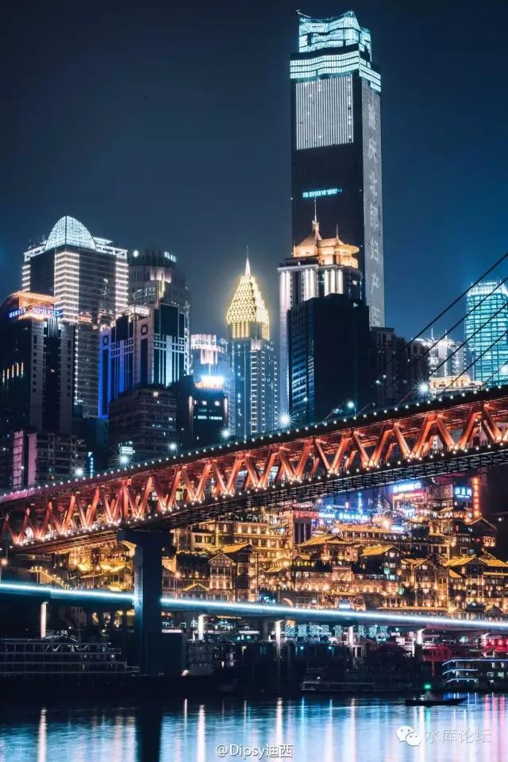
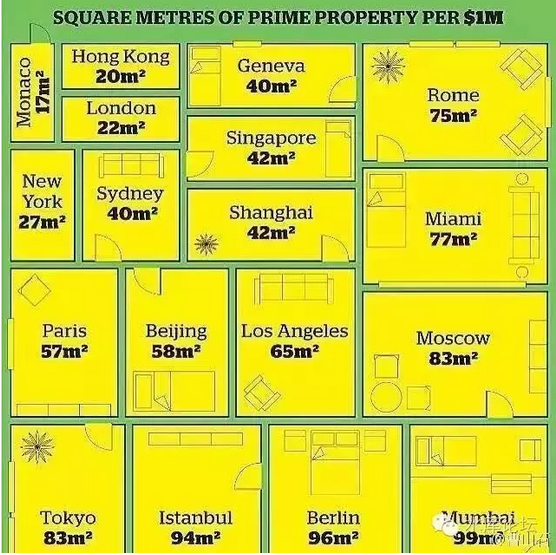
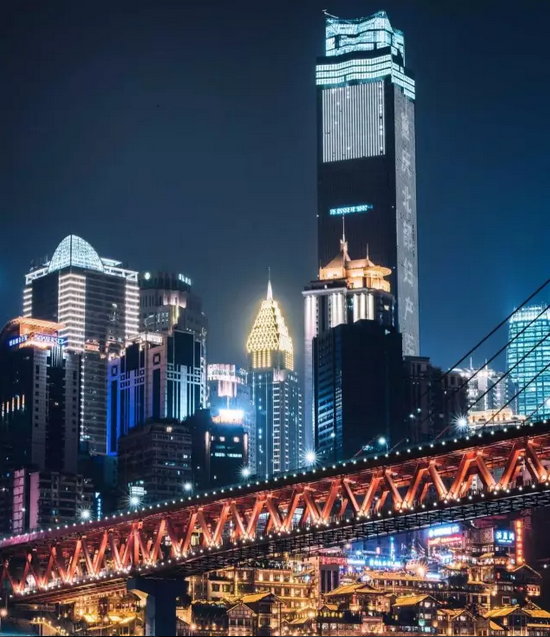

# 《下一站·重庆》序言 \#2640

原创： yevon\_ou [水库论坛](/) 2016-11-02

}
=======================================================================================================================================================================================================================================

《下一站·重庆》序言 ~\#2640~
============================

 

卅年的雪坡

 

 

一）2N

 

我们用了巨大的篇幅，来介绍"[2N定理](http://mp.weixin.qq.com/s?__biz=MzAxNTMxMTc0MA==&mid=2651015141&idx=1&sn=63f17628cbcf2fbfdafac93d4f077392&chksm=807211f6b70598e0716fd897fc53c1de95e7c9d8dfe58d9bf5feb94d0555ebb8e8532613bc08&scene=21#wechat_redirect)"。作为"炒楼资金卷"的总结。

 

其中，2N的第一二三四五年，就写了五篇。

而围绕这五个阶段，信用卡+私人借款+贷款截断等技术细节，则写得更多。

合计约有二三十篇。

 

 

但是，2N写完之后，却有人说"这是完全无用之物"。

为什么。因为上海的雪坡可能已经不够长了。

 

穷人翻身，千难万难。

你要从A7增长到A9，你需要一个漫长的财务奇迹。

首先2N要"蓄势"。给你一段很长的时间，慢慢建立十套仓位。

建仓之后，再需要"雪坡"。让这整个轮子滚起来。第六年要能接上循环。

 

涨幅要足够覆盖你扩张成本。一圈之后，才能一化二，二化四，四化八。

跨越阶级，成为富人。

 

 

 

可见，2N是一种对于"生存环境"要求十分苛刻的稀有植物。

我们常常说，"在过去十六年中，连押十六把大，把把都押赢"。

这是一个惊人的概率。哪怕你从事别的行业，有这么高的准确率，也是非发财不可。

 

 

但是，接下来的问题是，"上海的雪坡可能不够长了"。

因为如下几个原因：

1）牛市已经持续十六年

2）上海目前房价，已经到了8/6/4的高位。离No.1只差三倍。

3）租金已跌至1.5%

4）政府已开始非饱和性供地。

 

我们一般认为，剩下的雪坡还有"十年，3倍"。

这点涨幅，跑短差是够了。但是2N式长距离滚雪球法建仓却不够。

逐个逐个分析。

 

 

 

二）雪坡

 

上海的房价，目前离全球最贵的城市还差300% [\[1\]]

 

假设我们"脑洞大开"。假设京沪才是宇宙中心。

-   北京上海的房价，不仅仅能"逼近"宇宙第一贵，而且可"超越"宇宙第一贵。

-   我反过来比它贵三倍。

 

 

这样的话，京沪房价应该是：80/60/40

其单位是：万元/平米。

 

 

你仔细看这个数字，其实它也就比现在的价格贵10倍。

相对于Ten bagger，那些被过去贪婪喂饱的人。十倍还不够慰际饕餮嗜血的心灵。

过去十六年涨了十六倍，人心已疯狂。

 

而从另一方面，"全球第一贵"城市，比伦敦香港贵三倍的城市。

你可以想象么，实体经济支撑得住么。

你认为雪坡还剩多少？

 

 

 

三）租金

 

另一个不可持续的数字，则是房租。

 

当我2001年刚入行的时候，上海的房租回报，大约在6%左右。

当年一套52W的黄浦区二房，我们的期望房租是2800。有价有市。投资房地产是一行稳健的回报。

 

 

可是到了2016年，同样的这套房子，已经涨了16倍左右。市场价至少要800W以上。

而租金涨得不多。大约不到四倍。目前在9000\~10000左右。二房。

这样算下来，租金回报仅1.5%

 

这个数字同样是"不可持续"的。

 

 

 

业内分析人士，常常对欧美的"金融市场"感到绝望。

 

因为金融市场的60%是债券。国债远远要比股市大几个数量级。

象欧洲的股票市场尤其不发达。德国的75%金融业务都是债券市场。

目前德国的国债收益率是多少呢。-0.18%

注意是负数，红字负利率。

 

 

在《美国时代的终结》\#F530一文中，我们曾经解释过1980年代美国金融市场的特大牛市。

当时，美国的长期国库券利率，从11%一路下滑，最终下滑到千禧年间2%左右。

任何稍有债券常识的人都知道，这是多么大的债券牛市。

 

另一方面，则是股市"估值中枢"的上移。

长期以来，整个1970年代，美国股市都是维持在7\~8倍左右市盈率。最棒的公司。

而此后，到了美指冲万点时，主流P/E已经到了15\~20倍。

 

 

这些事情都是"不可重复"的。

债券的收益率，从11%降到2%，从而带动债券账面价值上扬。这是"竭泽而渔"。

你不可能再降九个点。

下一代人怎么办。

 

目前的业内金融人士，谈到欧美市场。都是极度的悲观。

因为"收益率"已经不能再跌了。所有的Bond都在高位。

 

而买家却没有了。欧美严重老龄化。年轻的在工作的白人没有了。

所有的人，都是手持卖出的老年人。

 

你未来20年每年回报"-0.18%"的债券，抛盘谁接啊！

连中国政府都不会买。

 

 

闲扯远了，回到我们的话题。

上海的房租，从6%一口气降到1.5%

这个过程，也是不可重复的。

 

你不能想象，如果进程不变，未来房价再涨16倍，房租仅涨4倍。

则租金回报率跌到0.4%，每一年！

 

"雪坡"不长了。

 

 

四）非饱和性供地

 

从2016年开始，政府"非饱和性供地"。

当然，前几年也有收缩土地供应。从2013年开始任志强就骂紧缩了。

但从来没有像今年做得这么彻底，这么坚决，这么煞根。

 

 

"非饱和性供地"另一个反面，意味着"物非所值"。

如果你是真金子迟早要发光的，你就不需要管制。

 

 管制的原因，因为周浦的土地不值得100亿。

上海的土地，也不值得5000万元/亩。

从纯农业价值，或者纯工业价值，六级地段100万/亩足够了。

 

 

政府开始"非饱和供地"，意味着房价被高估。

就好似香港一样。香港2/3的土地，被划为郊野森林公园。而仅有1/3的土地，用于市民居住开发。

如今香港政府把人民逼到这个地步。厨房和厕所在同一个房间。这是无论如何说不过去的。

 

香港并不缺土地。缺的是政治和压迫。

"[既得利益集团](http://mp.weixin.qq.com/s?__biz=MzAxNTMxMTc0MA==&mid=2651014536&idx=1&sn=6d9e3de7db49560874e8433029599246&scene=21#wechat_redirect)"高度在意他们手中的物业价值。整个中产阶级绑架了社会，要求政府不能新推出任何土地。以维持他们"已购买"的物业价值。

 

这对于穷人，对于"未上车"的港灿。是非常不公平的。

上海目前也面临同样的问题。正如水库论坛，视上海楼市为"下半场"。

从基本面讲，上海的房价，并不值得"外环10W"，1000W元/套的。

而是政府"非饱和性供地"。强行把这个价格托上去。

 

 

我们知道，"供需关系"永远成立。

"非饱和供地"的后患无穷。

而且人心贪婪。目前要求的不仅仅是"维持"，甚至更进一步是"要涨"，要猛涨。

这就意味着，未来的供地数量。必须比2016年更加削减。

 

终有一天，哪怕你供地为0，天价高的价格体系80/60/40也维持不住。

那就会有麻烦了。

 

 

 

五）中年楼市

 

我们对上海楼市并不看空。正如我们所说的"2017\~2018都是大涨年"。

 

在"分答"上我们再三强调，对于未来二年继续看好。虽然没人可以预测未来，但是2017\~2018有极大概率都是继续上涨年。

为什么，因为我们和那些"泛泛而谈，大而化之"的宏观经济学家不一样。

我们是"微观"的。职业，专业，敬业。

 

 

大风起于青萍之末。每当宏观大趋势来临之前，必然有无数微观异动。

明崇祯朝崩溃之前，一定先经历万历，天启的折腾。把财税底子消耗一空。然后才能岁寒四起，无兵无将。

 

 

同样道理，如果你观察目前上海楼市的话。微观的迹象非常明显；

1）纸币泛滥

2）拍地价格远远高于房价。

3）KFS普遍财务健康，负债率降到最低

4）家庭部门普遍财务健康。负债率极低。

5）筹码高度分散

6）处房情结严重

7）购房面积处于下行轨道。但是仍未到底

8）限购限贷使得购买力被压制

9）惯性

 

如果不发生"小行星撞地球"之类异常事件。我们想不出"廉价抛盘"在哪里。

市场上有哪一个力量是"下行"的。有哪一股力量是制造"廉价抛盘"的。

没有，一股也没有。

 

 

对于一个真正浸润在市场的人，他是不相信"宏观经济"。甚至不存在宏观经济的。

因为宏观是由无数的微观组成的。假如我把100个微观切面全部都观察了了解了。则我肯定比所有的宏观师，都更了解宏观。

 

所以我们非常看不起那些张口就吹的"大格局分析师"。一会上天，一会落地。

一会要涨30倍，一会要跌30倍。

这些都是瞎蒙来的。骗大力丸的。

 

 

如果你学过Marketing，你习惯从Break Down的思路去研判问题。

把问题切开，分为微观几个层面。各自状态怎样。

则微观很健康。上海楼市，目前处于典型的"中年楼市"状态。

 

"中年楼市"意思是，锐气不再。疾病暗伏。有乌云

通过秀相无数次不合理的宏观调控，市场又没有充分交易，充分换手。

上海楼市，终究是有一点"扭曲"的。有不合理的暗疾。

 

 

但是，有暗疾，不代表它不涨。

有扭曲，有错误。不代表全局的败坏。

有缺陷，有残缺。不代表完美主义的骂娘。

 

"上海楼市"中场过半。

如《[泡沫分水岭](http://mp.weixin.qq.com/s?__biz=MzAxNTMxMTc0MA==&mid=2651014645&idx=1&sn=33bb9bb2ab1c2576cf001e84d8255aaa&scene=21#wechat_redirect)》一文所说的。

-   2000\~2013为上半场，价值回归。

-   2014\~2026为下半场。有泡沫，但是还没有破。

 

 

上海楼市目前处于"中年，壮年"的状态。

如果最终目标是"2025年，250000/m"的话。

则我们还有"十年，3倍"的涨幅。

 

身体还很壮，还没有到"老死"的状态。

 

 

 

六）下一站

 

回到我们的标题。本篇是《下一站·重庆》卷的序言。

 

我们要开始关心重庆。是因为"上海"这片雪坡有可能不够长了。

当然，上海楼市离"老死"还有很长的距离。

 

象香港这样的城市，才叫做百业糜烂，无药可救。

我们几乎是眼睁睁地看着HK沉沦。看着这个城市扭曲，扭曲，再扭曲。直到把整个城市供地压缩到零。任凭泡沫经济淹没东方明珠。

上海还没有到"老死"的状态。但整个城市，已经在丧失生命力，青春不再。

还剩"十年，3倍"。

 

为此，我们必须从现在开始。准备下一个Ten bagger，准备下一个茧。

未来是哪里，未来是重庆。

（yevon\_ou\@163.com，2016年11月2日午）

 

 

 

 

[\[1\]] Monaco是个很小的城市。一般全球第一贵市场以香港或者伦敦举例。
