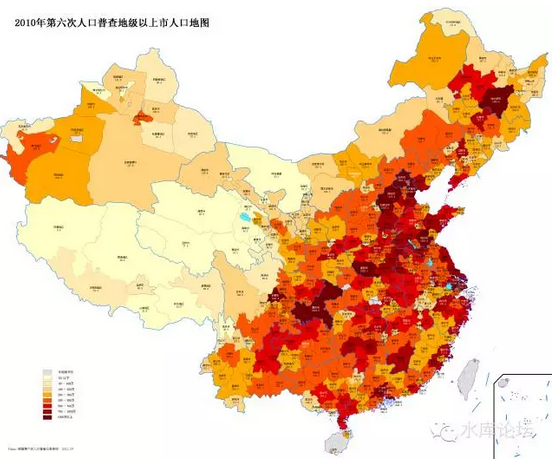
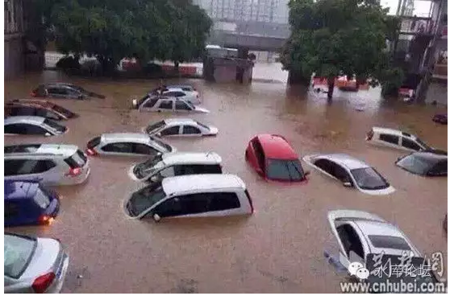
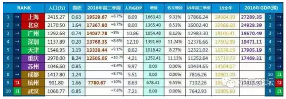
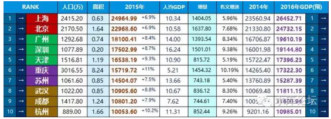
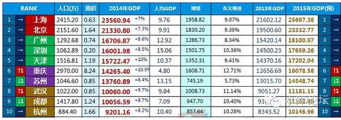
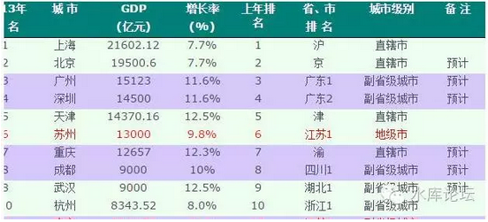
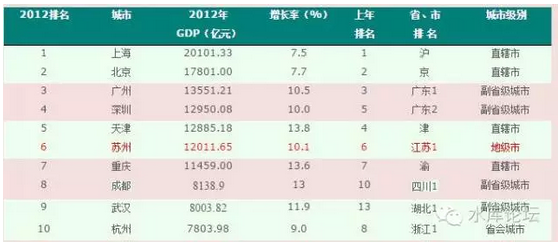
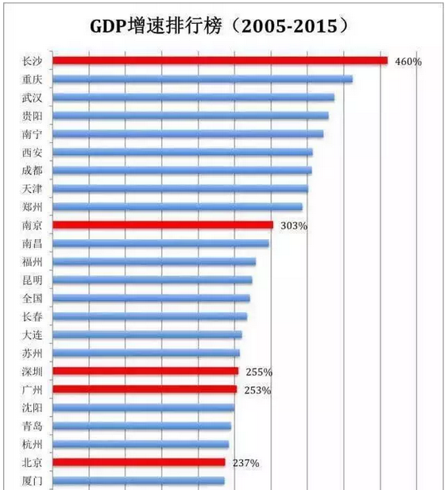
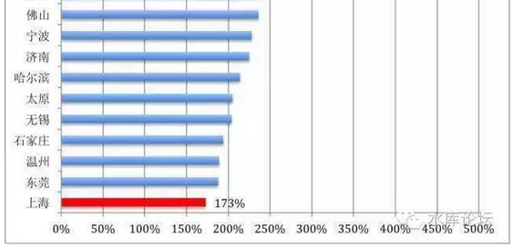

# 《下一站·重庆》上 \#2650

原创： yevon\_ou [水库论坛](/) 2016-11-02
===========================================================

}
=======================================================================================================================================================================================================================================

《下一站·重庆》上 ~\#2650~
==========================

重庆的经济数据，很不正常。

 

 

一）二线城市

 

如果你厌倦了"超一线"城市昂贵的房价，并且认为，博100000元/平米的房价，还要博它涨。

还要博它涨二倍，三倍，十倍，是一件很无聊的事。[\[1\]]

 

同时，京沪深麻烦的"限购""限贷""营业税"等措施，也让你心烦意乱。觉得心力交瘁，生无可恋。

则你把目光投放到"二线城市"。

二线城市，有几个好处。

-   一是房价较低，风险较低

-   二是交易简便。

 

对于二线城市，你有几个选择；

1）长三角城市群（15个）

2）环沪，环京，临深

3）中部郑州、武汉、长沙

4）西部重庆、成都、西安

 

哪怕你不考虑东北，西北等很"冷"门的城市。也不考虑昆明，南宁等边境上的城市。

也不考虑厦门，青岛，大连这三颗副省级明珠。

 

仅仅是在中部，我们就有郑武长三个城市，西部至少还有重成西昆四个城市。

请问你该选哪一个。

 

答案丝毫不出人意外："以上全错"。

当然是一个也不选。

 

 

 

二）集聚化

 

为什么。因为你不能说服我，"二线城市会比一线好"。

 

 

"只有大城市，才有房地产"。

在过去的十六年，其实是大城市的十六年。

 

只有北京，上海，深圳，才获得了最大最满意的涨幅。不仅仅百分比涨赢，而且流动性更好。一二手差异也较少。

而在内地二线城市买房子，真心不怎么赚钱。

 

 

本地本身的涨幅就少。北上深涨了十六倍，内地可能就三四倍。

而且内地"一二手"市场严重割裂。二手房呈现恶劣的"有价无市"状态。贷款估值也很不友好。

你真的进入实战，二三线城市损耗非常厉害。远远赚不到理想中的升幅。

 

 

前天[《下一站·重庆》之序言篇](http://mp.weixin.qq.com/s?__biz=MzAxNTMxMTc0MA==&mid=2651015216&idx=1&sn=97469f3c6465a10b292bfe74afb57ed6&chksm=80721e23b7059735a454fb02ded0b397857082089b79ae976e2bcdb3155aeec83c0d2cde5856&scene=21#wechat_redirect)发出了以后，网友们纷纷留言。

纷纷问，杭州有没有前途，合肥有没有前途，太原有没有前途，西安有没有前途。

更有甚者，问的最多的是"成都和重庆选哪一个"。

为什么是重庆？

我的回答是：统统不感兴趣。

 

无论南京，杭州，合肥，宁波，苏州，无锡，武汉，郑州，长沙，青岛，大连，厦门，福州，南昌，成都，西安，昆明，海口。

无论哪一个二线城市，我全都不感兴趣。

 

"既然你可以深耕一线，你干嘛要去泡二线"。哪见过练功等级越练越回去的。

 

 

 

而且对于我们这样的人，"海外投资"渠道都是通的。

别人梦寐以求的"换美元出国"，对于我们来说，就是聊聊微信这么简单。

全世界最安全的地方，大概是澳洲南部。无论多大的世界大战，墨尔本基本是不会涉及的。

真要打到南回归线了，直接投降便是。

 

 

除了澳洲之外，加拿大，美国，伦敦，西班牙，新加坡，香港，大阪，迪拜，几乎每条线我们都是通的。

如果我们想"跨地投资"，全世界一流的城市，大部分都可以去。

也不是非盯着你"中国二线"不可。

 

 

所以，在我的眼里，以上诸多城市只分为"重庆"和"非重庆"。

因为重庆的经济数据，他非常非常地不正常。

 

 

 

三）重庆数据

 

我们先来说几个数据。

 

刚从武汉回来的人，肯定对于"挖半城"印象深刻。武汉这个城市基本已经成为地雷站了。每隔十步必有一坑。几乎所有的路面地皮拉开重缝。

但是这些活花了很多钱么。

"拉链工程"花钱不多。按照武汉官方数据，所有的市容整洁，一共才花了130亿。

 

 

如果你订阅《财经》之类大路杂志的话。

你一定有印象《财经》花了好几个专辑，痛斥湖南省的"高速公路大跃进"。

据说是湖南"丧心病狂，寅吃牟粮"不计后果的大扩张。

 

其一共花了多少钱呢。4000亿，五年。整个"十三五"计划。

平均每年投资还不到800亿。

已经被誉为"地方政府不可承受之重"。无论如何一定会财政破产。

 

要知道，这可是一个省。一个省之内六横七纵，连通十几个地级市。

拉了上千公里的高速公路。

2015年[全中国]高速公路总投资8000亿元。

 

 

进一步，川藏铁路。

从成都入川，翻越横断山脉，最终到达拉萨。中国最后一条战略大铁路。

可参阅《建设川藏铁路有多难，这51张图片告诉你答案》[\[2\]]

 

无论从任何一个标准讲，川藏铁路都可谓"国之神器，生死动脉"。

这样一条铁路造价多少呢，1900公里，2000亿。分八年建成。

 

 

再举个例子，上海目前拥有地铁线路617公里，366座站台。

按照每公里5亿元的造价，则上海地铁的总成本大约是3000亿元。

这也是廿年积累。非一朝一夕之功。

东方明珠，闪耀璀璨。[\[3\]]

 

 

好了，我现在告诉你一个数字。坐直了，别趴下。

每一年，投在重庆这块土地上的资金是：

1,000,000,000,000

一万亿！

 

 

一万亿。

一夜之内，你可以造出：川藏铁路+整个湖南省的高速公路+上海地铁

上海的全部地铁，全部14条地铁。

一年之内，全部修好。

 

 

别说你东方明珠多么璀璨，基础交通四通八达。

你20年的积累，重庆只要一年的时间，就可以全部造完。顺带还修二条川藏铁路，再修一个省的高速公路。

 

而且，这并不是说重庆"固投"了一万亿。

他说的是：每年投一万亿。

 

 

每一年！从很早很早开始，至少从2005年十年之前。

每一年，投10000亿下去。投在重庆这片小小的土地上面。

每一年，高速/铁路/机器/大桥，10000亿新的财富，浇灌在这片土地上。

四）重庆之增长

 

 

中国一年的总GDP，大约在50万亿人民币。

这其中，还有很大一块是消费。老百姓是要吃粮的。

 

 

所以"一个城市投10000亿"这种事情是有的。但是极少，仅限于部分"特殊城市"。

象武汉，长沙这样的省会城市，您自请苦哈哈吧。你想要修1800KM高速公路，自己筹钱去跪。

 

 

重庆的"数据异动"，始于很久以前。

在过去十年，一共只有1.75个城市，获得过如此特权。

-   一个城市是重庆。他几乎持续了十年，每年中央投10000亿"小灶"。[\[4\]]

-   半个城市是天津。天津人当权的时候，投了五年。

-   1/4个城市是合肥。最近二年，合肥开始获得一万亿投资。[\[5\]]

 

最近因为众所周知的原因，合肥获得了特殊的重视和发展。合肥已经连续二年获得了近10000亿的超常规投资发展。投资额占GDP的130%

合肥一跃从一个默默无闻的三流省会城市，成为了"长三角规划"中心城市。

 

 

但是，始终，从头到尾，一直获得中央"皇恩浩荡"亲爹小灶的。唯有重庆一家。

  **6大城市固定资产投资规模**                                   
  ----------------------------- ------- ------- ------- ------- -----------
                                2013    2014    2015    合计    占GDP比重
  北京                          7032    7562    7991    22585   35%
  上海                          5648    6016    6353    18017   26%
  深圳                          2391    2717    3298    8406    17%
  广州                          4455    4890    5406    14751   29%
  天津                          10121   11654   13066   34841   75%
  重庆                          11205   13324   15480   40009   94%

 

如图。重庆的"固定资产投资"=上海+广州+深圳。

考虑到重庆的GDP远远不如三城累加。其"投资密度"可谓惊人。

纯以"固投"排序。重庆是中国第一城。

 

2015年，重庆市"固定资产投资"15480亿。

什么四万亿，什么大洪水。什么世博会，亚运会，奥运会，统统不够看。[\[6\]]

 

 

 

其中最惨的，是深圳。

我们看见，深圳的"固定资产投资"最少。只有二三千亿。修几条公路地铁就没了。

 

这说明深圳是一个"活在虚拟世界"的城市。

当然，"轻资产"的模式，也可以增强生产力。

例如微信，映客，AR等技术的发展。使得屌丝可以活在"VR头盔"里，一样嗨到高潮。

 

但是"现实社会"始终是需要的。你也不喜欢你出门就踩一脚泥，天然气管道老化，整天拉闸限电。

一脱下头盔，就从穹殿回到群租屋。

"实体经济"你的固定资产投资上不去。纯粹靠"虚拟世界"YY，一味发展IT。终究也不是长久事。

 

 

 

也有人问，重庆的"固投"这么多。是不是都造房地产啦。

 

  **10大城市房屋供应量**                                                                 
  ------------------------------------ ---------------- ---------------- -------- ------ --------
                                       商品房施工面积   商品房竣工面积   房地产          
                                       总面积           住宅             总面积   住宅   依赖度
  北京                                 1.31亿           6315             2632     1378   18%
  上海                                 1.51亿           8372             2647     1589   14%
  深圳                                 4978             3157             360      202    8%
  广州                                 9346             5760             1511     981    12%
  重庆                                 2.9亿            1.94亿           4630     3186   24%
  南京                                 7084             4775             1449     1064   15%
  杭州                                 1.11亿           5926             1665     1070   25%
  苏州                                 1.13亿           7939             1653     1275   13%
  沈阳                                 8341             5869             1037     769    18%
  郑州                                 1.08亿           7256             1077     670    27%
  （单位：除注明的外，均为万平方米）                                                     

 

如表。请记住黄市长一直说的："房地产投资不超过25%，要控制住"。

所以重庆至少有75%的投资是工业方向的。这样还有11000亿。

 

 

 

实实在在的大把金钱，洒在这片土地上。

无论你是造路桥道隧，还是造水泥厂，钢铁厂，汽车厂。终究是会对GDP产生拉动作用。

其结果，就是重庆的GDP排名不断上涨。

 

 

如图。原图已截短。

（2016年）

（2015年）

（2014年）

（2013年）

（2012年）

\
 

如果你有数据恐惧症。看见密密麻麻的数字就头晕。则你只要看旁边的"增长率"就可以了。

 

在2012\~2016的每一年，重庆的增长率，始终都是Top 10中最强的。

这也使得重庆的排名不断上升。目前已经挤掉了苏州，排名第6.

 

 

在中国所有大城市中，纯以GDP而论。大约分三个梯队。

1）京沪，遥遥领先

2）广深津渝苏

3）成都武汉南京杭州青岛......

 

 

在12500\~14000亿GDP这个梯队之中，重庆和广州的差距已经不大。大约还剩12%。若一切顺利

-   2018年重庆GDP会排中国第五位

-   2023年重庆GDP会超过广州

 

所谓"北上深"，或者"北上广深"。

设想一下，某一天，中国GDP第三大城市是重庆。变成了"北上渝"。

你会是什么表情。

 

 

看十年累积大图。则数据更明显。

\
（\* 长沙GDP较小。而且有长株潭一体化影响）

 

 

当你衡量一个区域时，常常会用到"首位度"的概念。

其具体的算法，是No.1/No.2

排名第一的城市，除以排名第二的城市。看看老大有多大。

 

 

对于成渝的争论，这是根本无需讨论的。

2012年：重庆/成都=140%

2016年：重庆/成都=149%

 

可见，重庆的经济总量，远远领先于成都。二者几乎不是同一个数量级的。

而且这个差距，还在不断拉开。

如果西南有中心城市的话，那就只能是重庆。

 

 

 

五）结语

 

 

重庆目前每一年的固定资产投资，和整个德国差不多。

这是实实在在的财富堆砌。"改造地球"

随着公路，铁路，隧道，大桥等基础设施的建设。每一个项目，都会使城市变得更美好。

而汽车，电子，化医，材料等机器设备的投资。使得GDP稳步增加。

 

 

重庆哪里来的每年10000亿。

重庆为什么要投每年10000亿。

为什么是重庆。

 

这是一个巨大的谜。因为谜，我们才感了兴趣。下篇再讲。

 

 

 

（yevon\_ou\@163.com，2016年11月4日晚）

 

 

 

 

[\[1\]]当年在天涯有一个长期置顶贴《杭州楼市每平米12000，欢迎到杭州来创业》，2004年。http://bbs.tianya.cn/post-house-1662-1.shtml

[\[2\]]《建设川藏铁路有多难，这51张图片告诉你答案》http://www.weixinla.com/document/77872091.html

[\[3\]]至于杨浦，闵浦等大桥。造价就便宜多了。可以假设为25亿/条。

[\[4\]]《2015年重庆固定资产投资增长17.1%》http://www.cq.gov.cn/publicinfo/web/views/Show!detail.action?sid=4058936

《2016年上半年重庆固定资产投资增长12.5%》

http://www.askci.com/news/chanye/20160719/10290943455.shtml

[\[5\]]《2015年合肥投资总量突破6千亿元，居省会城市第5位》

http://ah.anhuinews.com/system/2016/03/07/007249679.shtml

[\[6\]]《罗思义：抛弃中国模式是自杀》http://www.guancha.cn/LuoSiYi/2013\_08\_12\_165212\_s.shtml

这篇三观有问题，不过图表做得还不错
