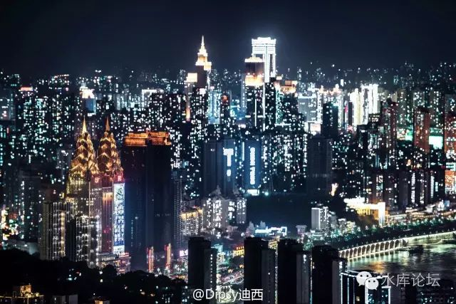
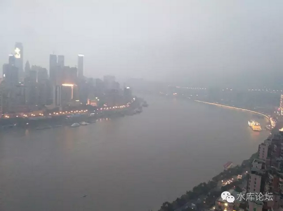

# 我对重庆的态度 \#2680

原创： yevon\_ou [水库论坛](/) 2016-11-17

 我对重庆的态度 ~\#2680~
=====================================================================================================================================================================================================================================================================

 

三件事：做实，投机和双城记

 

 

一）佛言

 

佛界，幽冥，座前。

 

他静静地漂浮在虚空中，视线从黑幕一直延伸至无穷迹的尽头。无色无相，不净不垢。

"你想获得什么"。

"财富，很多很多的金钱"。

"你愿意付出什么"。

 

 

这是一个[很重要]的问题。如果佛祖每天接受99999个祈愿，则几乎每一个人都祈愿发财。但很少有人会认真想过，"我愿意付出什么""我愿意放弃什么"。

所以他们通常都不发财。

 

 

很多很多年以前，你非常穷。非常非常非常地穷。

实在是太穷了，实在是太苦了，实在是穷怕了。

 

在某一夜的虚空中，恍惚间你做过这样的梦。

当佛祖问你时，你如何回答。

 

 

我们的回答是，"我祈愿拥有财富，而愿意放弃财富所衍生的功能"。

相应的，我们写下了\#550\~570的《[价格三篇](http://mp.weixin.qq.com/s?__biz=MzAxNTMxMTc0MA==&mid=400843201&idx=1&sn=136663aca45745f53d2fae1722ae372f&scene=21#wechat_redirect)》。从任何一个角度讲，这三篇的重要性都不遑多让。

 

 

因为我们实在是太穷了。我们许下的心愿，就是一个"小目标"。例如先赚到一亿。

而赚了一亿之后，哪怕你有"重重限制"。例如这钱只能看不能用，天天依然咸菜泡饭。

但我愿意啊。我不在乎啊。你先把钱赚到，其他一切的[附加条款]可以再谈。这世上为了脱离贫困卖肾卖眼角膜的不在少数，多喝几年咸菜粥算什么。

 

凡事皆有代价。

学会付出代价，才是成年人的标志。

神魔皆以血饲。[\[1\]]

 

 

 

在我们的《价格三篇》中，我们描述了这样一个模型。

1）本金A

2）变成价值2A，但"流动性"非常不好的资产

3）变成2A

这样一种玩法，被我们称之为"搭桥"。

 

 

2016年，对于京沪深的多军，是一个"丰收之年"。

一般估计，以一个"资深"多军为例。仓位1000平米，楼价涨了二万，则一年净赚2000W。

 

一年赚2000W，这是一个非常非常惊人的数字！

大致你估算一下，相当于一个300人的中型制造业工厂，或者一家30桌的中型酒楼，或者一家100人的写字楼公司。

 

但是你的生活有所改变么。严格地说，没有任何改变。

因为一套房子，无论是价值800W，还是价值1000W。

你晚上不是一样住么。

无非一张床，六尺位。墙纸或许更老化一点。

 

对于"炒楼"这一行，赚钱真是非常快的。

尤其是"大面积，低单价"流派，再赶上一个楼市大牛市。

赚钱，躺着拨拨算盘。

1000乘以2，今年赚了2000万。

 

 

 

但是，真当你财富达到了一定数量级，你所思考的，就不是怎样"尽快赚钱"的问题。

你问佛祖哀求，尽快给你一亿。

佛祖给了你1E，剩下的，则是其他问题。

 

这其中最主要的，是把资产"做实"。

 

 

 

二）做实

 

什么叫做实。

 

世界上最泡沫，纸面上涨最快的。其实还不是京沪房地产。

而是"初创公司的估值"。

 

 

 

你一家成立一年多的公司，最多的销售额也就三四千万。

但是你对外报价"估值"，你就敢喊十亿。

 

具体操作中，你会找一家财团。拿出1000W现金，真金白银认购你的1%股份。

你看，有价有市，岂不是个个都是创业精英，亿万股东？

 

而实际情况呢。这1000W资金怎么回事。呵呵呵。

 

 

 

当我们谈论"IT泡沫"时，当年硅谷的玩法，基本套路例估值无限上涨。

而且硅谷很大，有很多个基金。

的确有可能是1000W入股1%，纯粹是天使风投基金，不认识的。

于是这个说服力就更强了。

 

但是，虚的始终是虚的。如果你的销售额只有几千万，你怎样维持"十亿"的估值呢。

哪怕击鼓传花能撑一段时间，何时鼓停呢。

 

 

这个时候，就牵涉到非常关键的一步："由虚变实"。

我拿30%股份出来，幻化成30000W机器设备。俺就不是"皮包公司"了么。实打实的总爷。

 

 

 

在美国，最主要的手法是："并购"。

登峰造极案例，是AOL并购时代华纳。

在香港，则是李泽楷鲸吞PCCW。

 

在一年的时间内，盈科的股票可以从1元拉升到28元。

这时候我拿股票和你"换股"。

 

打七折，20元一股，十亿股收购你的公司。你卖不卖。

打六折呢。

打五折呢。

打四折呢。

............

 

 

很多公司考虑再三，于是就肯卖了。

他并购的很可能是一家PB=1，PE=10的实体公司。

 

  （亿）   净资产   盈利   市值    PB    PE
  -------- -------- ------ ------- ----- ------
  科网股   1        0.1    100亿   100   1000
  实业股   10       1      10亿    1     10
  合并后   11       1.1    110亿   10    100

 

可见，"并购"之后，科网股的PB，PE都大幅下降了。

而且赢利增长10倍。这样，他又可以在资本市场讲故事。继续维持"高增长，高估值"神话。

 

 

美国这股"扯高\-\--并购\-\--虚化实"之风，起于1970年代。

其主要的套路，就是"股价无限上涨"\-\--"虚高的股票换取实物资产"\-\-\--"股票继续上涨"。

 

最出名的几家，有安然，WorldCom.

没破产得善终的还包括Philips Morris.

套路概括四个字："由虚入实"

 

 

 

而在中国市场，它最主要的手法，是"增发"。

好比我股价先涨10倍。由10元拉升至100元。

然后我打八折，按照80元/股搞增发。

你跟不跟？

 

你跟的话，等于你用80元现金换我的股票。公司的净资产就"由虚入实"了。

你不跟的话，你的股份被摊薄。

过几个月大股东再增一次。

 

具体不展开了，免得砸人饭碗。

 

 

 

三）楼市

 

对于楼市，目前遵循同样的道理。

在过去几年，楼市中发财十分之容易。

轻轻松松，账面上都赚了几千万。

 

但是，你这几千万，是否真的等于小白领上百年的工资。

是否真的等于一家200人的制造业企业，远近闻名知道你是地方上"做得很大"的老板。

是否真的等于一家100人的报关或者贸易公司，其内部坐办公室的人群甚至已经分化出了政治派系和职业升迁，一起拍你老板马屁。

是否真的等于花天酒地，纸醉灯迷的游戏。

恐怕未必。

 

 

这个"账面资产"依然是虚的。尚未转化为幸福生活的实体。

你回头看看这价值1000W的房子。靠，海淀区80平米80年代的老破小，学区房。走道里堆满了杂物一股阴暗潮湿的味道。

这房子是人住的么，猪槽。

 

 

我们为什么要关注重庆，为什么要开二分仓。因为在重庆，我们要完成二个至关重要战略级的目标。

1）把资产做实

2）寻找下一程雪坡

 

 

如《价格三篇》所说，第一回合，你获得了"很虚"的一笔财富。

则第二回合，你要把它们变成很"实"的一笔财富。

第三回合，收回来的拳头才可以再打出去。再狠狠地翻几番。

 

 

 

四）投资和投机

 

极具讽刺意味的是，如果你要赚钱，你恰恰应该留在上海，而不应该远航重庆。

因为的确是上海涨得快，快过重庆。

 

 

好比当年你看"科网股"泡沫，那些什么都没有，纯粹就是泡泡和概念的科网股。

可是人家就是涨，还涨，不停地涨。

 

而你手握一大把"大蓝筹"，无论是GE，Exxon，Boeing，CITI，人家就是不涨。蓝筹股打死也不涨。价值和投机不匹配。

 

在这个情况下，如果你劝说别人"把科网股抛了，买入蓝筹"。

那是不赚钱的。

也要被人骂死的。

 

 

一般情况下，"价值和投机"并不匹配。

有些东西，明明是虚高。你也知道1.5%的租售回报比极其不合理。

可它就是会涨。而且涨得欢。

2017，2018，极大极大的概率，依然还是暴涨年。

 

 

这就构成了我们对重庆极为复杂的心态。

一方面，我想远航重庆。恨不得把所有的80000元/m的房子都抛了，全改成8000元/m的房子。

这样，我是"价值"在手。由虚入实。从此可以畅享实体财富带来的富豪感觉。

 

譬如说，你抛掉上海十套内环线。就能买入重庆整整一幢楼。

 

 

另一方面，则是我深深的知道，"重庆楼市"仍未启动。而上海楼市，正处于"万马奔腾"的状态。

 

速度是一个连续量。其背后，是加速度的增减。是渐变的。

绝不可能突然由静立到奔跑，奔跑到静立。别听文科生小编瞎扯。

 

 

上海楼市既然已经跑起来了，那么他下一年，下下一年，仍然可能是大涨年。

有人把楼市比喻作为火车。"启动/刹车"都殊为不易。但一旦动起来，就会一直向前跑。

 

而重庆楼市，依然处于"冷寂"状态。整个市场尚未有大涨蠢蠢欲动。

重庆楼市的启动标志，应该是他有了第一个单年+50%（甚至+100%）。那他就会有很多很多个+50%

 

 

这构成了我们极其复杂矛盾的心态。

好比一个"科网股"赚了几十倍的大亨。他急切地渴望切换到大蓝筹股。只有买入AE，IBM，才能保护他的财富。

另一方面，则是他的理智告诉他，"还要涨，还要涨，既然要涨，何不过二年再走"。

 

 

因此我们对于重庆的态度，嘴面上喊得热火朝天。别人问我推荐，我一般说重庆是未来，重庆是中国最有希望的城市。

但是另一方面，我们的主力依然在上海。

 

我们在重庆的正式大规模建仓，依然没有开始。

即使买了几套，也是属于试水，免得一无所有心中遗憾。

按资产论，可能连总资产的3%都不到。

 

重庆是未来，而不是现在。

 

 

 

五）套利与套险

 

在我们《[套利与套现](http://mp.weixin.qq.com/s?__biz=MzAxNTMxMTc0MA==&mid=208330229&idx=1&sn=c53a252759546844868e645600bbe15b&scene=21#wechat_redirect)》\#3120中，我们说道，赚钱的方法有二种。

1）一种是套利。高抛低吸。

2）一种是套险。先确定它绝对不会跌，然后叠加尽可能多的杠杆。

 

 

每一个人的投资风格不同，流派不同。

对于我派而言，重庆是我最喜欢的资产类型。

 

首先，它不能跌。

虽然对于重庆的议论纷纷。也有人质疑巴郡供地庞大，人民贫困。以及[最最重要]一点：不涨就是不涨。

 

但是，有一件事，是任何人都无法否认的。

重庆下跌空间不大。

 

在中国所有的直辖市，乃至于所有的十大城市之中。重庆是绝对的价格洼地。甚至低于衢州等一些五线城市。

其二环附近，8000元左右的单价，尤其安全。

我们不要求你涨，但首要任务"下跌无空间"。

 

 

其次，重庆有上涨空间。

哪怕其他任何条件不变，颜值就是正义，低价就是真理。

以我们最近观察的几个项目，8000元\*80平米，大约是65W元一套。

 

这个总价控制得非常好。在全球通货膨胀，国内纸币泛滥，"2020收入倍增计划"等大背景之下。

我们认为，塞给重庆人民200W/套房子。是绝对没有问题的。

 

重庆人负担得起200W的房子，乐观一点300W也可以。

他们有这个购买力。

 

因此60\~70W总价这个区段的房子非常看好。分分钟都可以涨三倍。

重庆楼市，就象是坐在一个火药桶上面。哪怕没有特别利好，他也随时开涨。

 

 

 

最后，重庆有机会打"暴击"。

"下跌无界，上涨有望，暴击想象"。

 

暴击是什么概念。有人说是二倍，有人说是三倍。

做人需要想象力。真正的暴击是什么。是20倍。

 

 

今天，重庆房价8000，北上深粗略算是80000，也就是相差十倍。

万一"暴击"的话，为什么不是重庆换北上的房子，一套换一套？

 

如果历史的走向，按照我们最不希望的一条分岔。

长期抗战的话，很有可能一套重庆，换三套京沪。

六）结语

 

整个1990年代，人们讨论的是上海·香港"双城记"。

1930年代上海是"远东第一大都市"。

此后上海衰弱，香港崛起，成为"东方明珠"。

 

整个1990年代，上海人热切地讨论着，上海和香港，这二个"双城记"。应该是同等体量的城市。上海和香港应该相提并论。

 

 

对此，香港人完全不屑一顾。

整个1990年代，香港楼市从1991年至1997年，一共涨了四倍。最终97终结时，楼价约100000元/平米。

而上海呢，楼市彻底萎靡、颓废、不振。开发商跳楼逼债破产。

1999年约3500元/平米。

 

二者相差30倍。而且一个牛市，一个熊市。

如果有商人90年代初听信"双城记"，抛弃香港物业来到上海炒楼。

恐怕输到裤子都不剩，哭到眼睛哭瞎。

 

 

可是，上海有没有资格和香港比肩呢。

有的，一定有。

此后的二十年，是上海的传奇，香港的沦落。

回首看来，90年代反而是上海发展最快，小灶最多，吸收营养最丰富的长身体阶段。上海追上香港，是注定一定肯定的。

 

 

下面这张照片，是我在重庆南滨路亲手用低像素手机拍的。

这是一座伟大的城市，目前正汲汲成长着身体。"重庆·上海"也是双城记。他最终会追近或者追平。

重庆楼市给人的感觉，生机勃勃，就象是二十年前的上海。

应该还不到大涨前夜的2001年。

但是快了。我唯一不确定的，是1997还是1999年。

 

 

(yevon\_ou\@163.com，2016年11月16日晚)

 

 

 

 

[\[1\]]其实是最近想写一篇小说，以神魔为背景。我一向最讨厌中国的yy小说，不小心划破了小指，立下了血誓，于是宇宙最强神魔"地狱邪神"就成了你的召唤宠物。

你以为最强神魔吃饱了撑的，划根手指，来和你缔结不平等合约。

真实情况是，"神魔"皆是非常精明的商人。凡事皆有代价。你借来的每一分力量，"她那时候还太年轻，不知道所有命运赠予的礼物，早已在暗中标好了价格"。

\[2\] \#2674目前刷不出来，别刷了。
