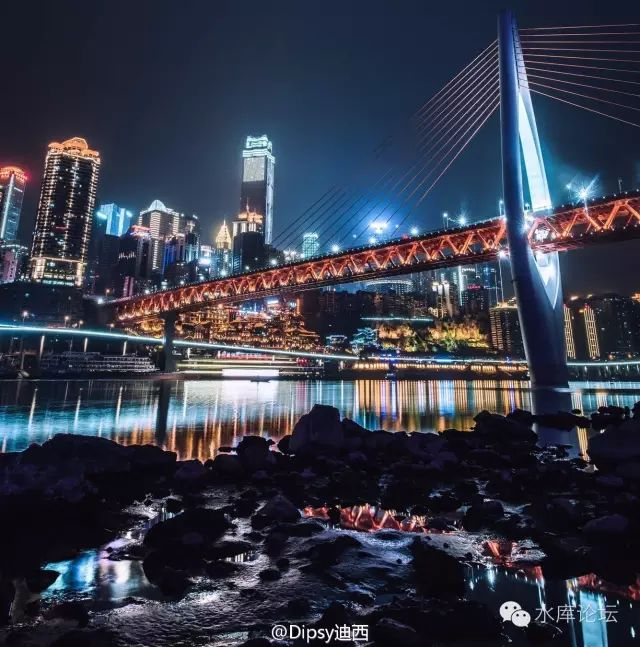
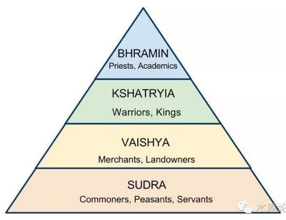
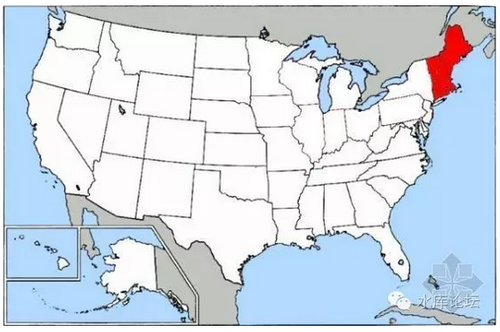
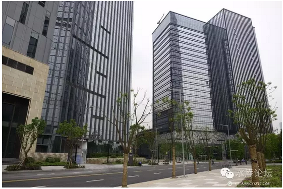
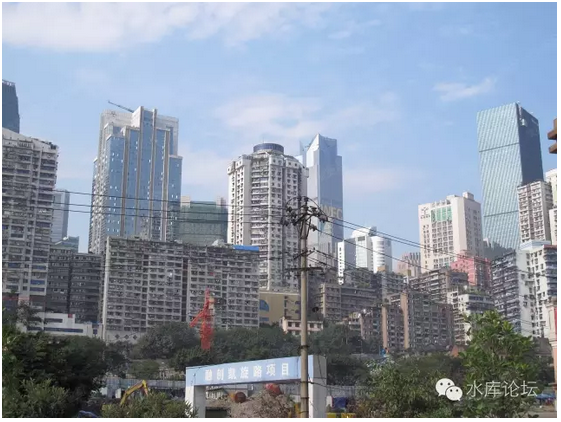
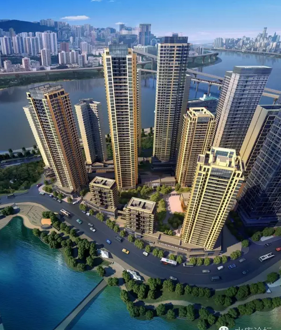
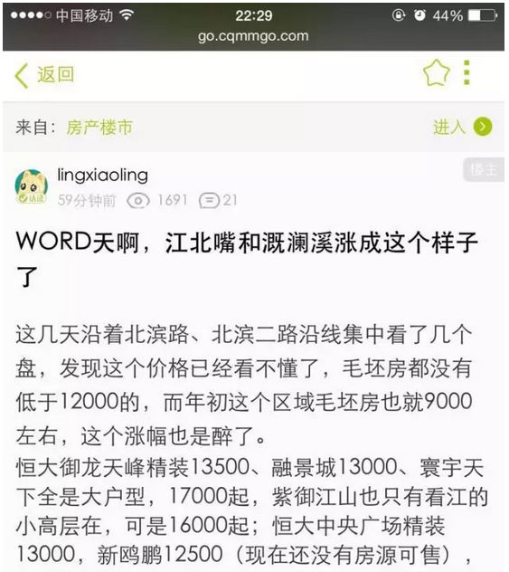
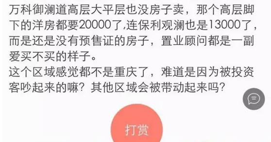

# 婆罗门的世界 \#2690

原创： yevon\_ou [水库论坛](/) 2016-11-18

 婆罗门的世界 ~\#2690~
=======================================================================================================================================================================================================================================================================

 

二分世界

 

 

一）印度的婆罗门

 

很多人都知道印度的"种姓制度"。

只不过中国的教科书，向来教书只教半句。

\
事实的真相是，"高等级"族姓例如婆罗门、刹帝利，他们和印度的"贱民"并不是同一个民族。

 

 

大约公元BC1500年时，雅利安人入侵印度，成为了征服者。并且在印度定居下来。

而印度原生的土著，在血统上属于"黑矮人"谱系的罗毗荼人，则变成了被征服者。

仅在南部德干高原仍保持着独立。

 

时日久而久之，就形成了"种姓制度"的分化。

所谓的"婆罗门"，其实指的是雅利安人。

而那些首陀罗、不可接触之贱民，则往往形容非洲难民般躲在树林里的土著。黑矮人的后裔。

 

"婆罗门"坚持不和低等级种族通婚。是因为他们本来就不属于同一个民族。

征服者文明人，当然也没什么兴趣和非洲刚果部落通婚。

 

参考阅读：《印度，世界文明的贫民窟》[\[1\]]

《番外，聊一聊印度神话》[\[2\]]

 

 

在传统上，"上女"嫁"下男"是绝对禁止的。被视为家族的耻辱，一般情况下不大可能发生。

但是，"下女"嫁"上男"在某些情况下依然可以发生。并形成了一条社会流动的通道。

 

印度"婆罗门"和"贱民"的区分十分明显，阶级地位相差巨大。婆罗门以大约2%的人口，垄断了近70%的政府公职。

因此"低阶层女子"嫁给婆罗门的需求十分旺烈。而她们的父亲，很有可能是很有钱的商人。

 

 

这就形成了"竞争"，并逐渐发展成了"竞价"。

这就是印度"嫁妆"习俗的由来。印度女子出嫁，往往要准备非常丰厚的嫁妆。甚至超过一个家庭十年积蓄。

最初的时候，起源争夺极少数的"下女嫁上男"名额。而此后，则逐渐弥漫开来成为整个社会的风俗。[\[3\]]

 

 

因为"嫁妆"实在太贵重。很多女性倾其一生，都难以积攒出能够出嫁的费用。

这就衍生出了"借贷"。

有许多女子，要向全村的人借钱。才能凑起足够她们出嫁"上男"的婚礼费用。

婚后，随着并入高种姓家庭，用男方的收入来偿还贷款。

 

 

这就是印度"烧死寡妇"风俗的由来。

因为一旦丈夫去世，尤其在没有子女的情况下，"低种姓"女子是非常容易被踢出高等宗族的。

这就意味着她没有了收入，没能力还贷。

 

而"债权人"怎么办。债权人反正收不回钱，最合理的做法，是把她烧死。

不仅仅出了心中一口怨气，而且给"后人"留下一个榜样。

好好侍奉你丈夫，关心爱护他的健康，尽快安排还钱。否则这就是你的下场。

 

 

因此印度"烧死寡妇"的风俗，是有着极其合理的逻辑推理的。

我们见到很多中国人，都会讲这个段子；

-   印度长老，"烧死寡妇是我们的风俗"。

-   英国保民官，"好的，大英帝国的风俗是，谁烧死寡妇，我们就绞死谁"。

 

但其实在这个段子里，真正不尊重"习惯法"的。反而是那个英国人。

 

 

 

二）美国的婆罗门

 

兴致所至，岔开讲一段无关的话。

在现代生活中，"婆罗门"在美国俚语中还有另一重含义。即指美国的WASP。

 

White Anglo-Saxon Protestant：新教徒的盎格鲁撒克逊白人

 

 

除了最近20年的IT和硅谷崛起。可以说，长达200年的历史中，WASP就是"贵族，上流社会，统治阶级"的代名词。

 

美国的上流社会，基本全是WASP。当年缔结《独立宣言》的56名议员，美国的几位国父，清一色的全部都是WASP。

 

在整个摩登时代，鎏金时代，你现在回头看[秀兰·邓波儿]的电影。电影中出现的大亨，企业家，钢铁石油银行巨子，清一色的全部都是WASP。

 

WASP就是上流社会，WASP就是统治阶级。WASP就是权力与财富的代名词。

 

 

 

WASP居住在"New England"，美国地图的东北角。

从纽约\-\--费城\-\--波士顿一线。这仅仅是地图一角，但却聚集了最多的村庄，财富，工业，和最多的总统。

 

在美国历史上，Virginia是绝对的总统大户。一共49位中，仅弗省就出了8位。

其次是Ohio 七位

Massachusetts 六位。

可见，中南部省份，基本就没位置了。

 
在漫长的200年历史中，所谓的"美国政坛"，其实就是"New
England"一角独大。

通常总是东北党内几个大佬，闭着门开会。决定了一个总统人选。

 

然后从"新英格兰"总部发通告给各州，各郡的支部。一层层下线党员。

中南部各省的人民，往往连"总统候选人"长什么样子都没见到。

反正大佬叫我们怎么投，就怎么投。跟着党魁做就行了。

 

比较著名的，美国人评选的"历史最差总统"。譬如1921年的第29任：哈定（Harding）

哈定能够当选，他是小字辈。纯因为党内共和党大佬觉得他"长得比较有总统样"。[\[4\]]

 

 

这样的局面，一直维持到了1959年。

因为那一年，发生了一件惊天动地的大事：电视机发明了。

 

电视机发明了，使得人们可以第一次，实时的，近距离的，立刻就知道获悉正在发生的事。而且可以获得电视台的评论。[\[5\]]

 

传统的，等待远在天边的新英格兰"党派首领"做决定，然后再一级一级下发的流程，彻底崩溃了。

 

 

"电视机发明"之后，每个人都有了自己的主意。每个人都有了自己的主见。因此"代议制"逐渐瓦解，"一人一票民主制"开始兴起。

 

 

19世纪古典年代，绅士们曾认为"民主"是一头可以被驯服的野兽，无知的选民互相抵消，10%的中坚份子决定结果。因此放心地任由帝国从"共和制"转向"民主制"。

选举权不断扩大。

 

-   绅士们没预料到此后无线电广播的兴起，使得罗斯福获得了巨大的权力，破坏了宪政。

-   电视的兴起，共和党大会土崩瓦解。

-   移动互联网+社交网络的兴起，白左民主彻底成了大怪兽。

 

当选民不再相互抵消，有了自我意志。"民主福利"就成了大怪兽。

 

 

 

1960年，政坛小字辈，而且还是爱尔兰人+天主教徒的肯尼迪，挑战当时的原副总统卡特。

但是肯尼迪极为英俊，师奶杀手。

 

卡特花了整整半年的时间，一个一个州赶过去，参加了500场集会。使劲地对每一位粉丝呐喊握手。

肯尼迪什么事也没干。躺在总部保养皮肤。

 

等到上电视辩论时，卡特不停地打哈欠，眼袋耸拉，手掌颤抖。因为握手太多。

而肯尼迪显得光彩照人。帅得一塌糊涂。

 

帅得一塌糊涂，帅得一塌糊涂。

台下师奶尖叫一片。

 

 

最终大选计票，肯尼迪以0.2%的微弱优势意外击败卡特。爆出了政坛大冷门。

成为非WASP系统选出的首位电视总统，直到最后被暗杀。

 

 

 

三）重庆的婆罗门

 

唠唠叨叨，嗑唠就写了2000字。人老了，老年痴呆真是没办法。

我们再讲回正题。"重庆的婆罗门"。

 

 

对于重庆楼市的分析，我们收到很多读者留言和评论。他们都犯了同一个错误。诸如；

"重庆不如成都有前途，巴国不如蜀国富庶"。

"房价这么贵，重庆本地人买不起"。

"没有高薪职位"。

"选盘完全不符合重庆人偏好，这房子将来卖给谁去"。

 

 

照我说，对于以上诸种言论，回复就只有四个字："以上全错"。

为什么，因为"回帖不看贴"。你还是没读懂我们的逻辑。

 

我有说过，让"重庆本地人"接场么。

我有说过，是因为看好巴地本身的资源和富庶，地下的矿藏石油么。

我有说过，需要照顾土著的感情么。

 

 

请让我们再回忆一下，我们看好重庆的理由是：□□□□□□□□（此处删去N个字）

最理想的状态是，全国数百万的精英官员和土豪人士，拖家带口，哭爹叫娘，带上全部的金银细软。哭着喊着冲进重庆。

 

 

我们举了"婆罗门"和"首陀罗"的例子。

我们看好重庆，绝对不是看好巴郡的土著。而是看中全国的大饼。

 

在我们看来，重庆的原住民，就类如同罗毗荼人，不值一提。

而涌进重庆的全国英豪，千千万万的官员和富商，才是神仙中人。

 

 

常凯申打了八年抗战，川军是死伤最重的一支军系。累计牺牲350W士兵，按人口比例一寸山河一寸血。

可是常凯申的五大军团，十大将领，高层中层集团，有几个是四川人。

 

没有，几乎没有。

其基本盘，永远是"黄埔系"和"浙江系"。

 

对于川人来说，凯申政府一样象是一个外来统治集团。川人只不过是卖命的，永远是中下层。

婆罗门另有其人。

 

 

对于重庆，我们的看法是一样的。

如果历史按照我们预想的运行。则掌握这座城市的，绝对不会是"土著"。

而是从全国四面八方迁徙过来的，英雄豪杰，封疆大吏。

 

 

 

四）二分市场

 

在《[上海楼市的三分天下](http://mp.weixin.qq.com/s?__biz=MzAxNTMxMTc0MA==&mid=211999175&idx=1&sn=d8155bcb894e1866c55d9f4c784ec437&scene=21#wechat_redirect)》一文中，我们曾经写到，上海楼市由三股力量组成。其人口，偏好，兴衰趋势全不相同。

-   本地人

-   外地人

-   外国人

 

 

同样道理，如果预构我们心目中的重庆楼市，则他应该是"二分天下"。

-   本地人

-   全国官僚（婆罗门）

 

因此对于重庆楼市，我们建议采取"二头向外"的策略。

-   买进的时候，只买外来土豪喜欢的楼盘。

-   卖出时，只卖给外来土豪。

 

 

举个例子，同样是一手楼盘。"重庆翠湖天地"就要比"白象街"好不少。

咦，白象街不是在解放碑。最最最好的地段。

而重庆翠湖天地在化龙桥，以前寂静无人。论地段要差不少。

 

（重庆企业天地）

（融创白象街，号称重庆第一豪宅）

（白象街，外景。红色打桩机在建位置）

看这二张图，差别就很明显。

白象街没有前途。不仅仅是白象街，整个渝中区，解放碑商圈，都没有前途。

 

 

因为"外来婆罗门"不需要和你住一起。

你这个热闹而繁杂的商圈，充满了重庆小面，洞子火锅。

 

可是"外来婆罗门"不喜欢这个。

他们懒得和土著混在一起。懒得和遍地杂货店混杂在一起。

他们宁可到郊区，或者城市近郊。划出一片土地，建立一个"完整划一"的国际社区。

静静地聚集在一起。和土著们划区而住。

 

"融创白象街"是土著们心目中最好的楼盘，但绝不是我们的。

 

 

（重庆天地全景）

当"重庆天地"和"白象街"二个项目选择时，我几乎第一时间就选定了重庆天地。

因为他符合我的要求：整体规划，拆迁干净，统一建设。

 

 

拆得干干净净，不要让我看见任何棚户。

不要任何流浪贫民，在我身边晃来晃去。

什么地段价值，我不在乎。土豪们有得是钱，大可以再堆一个商圈。

 

土著和土著玩，土豪和土豪玩。

"婆罗门的世界"，二个世界。

 

\* 翠湖的缺点，仍然是太贵了一点。如果再便宜2000元，就是一个完美的选择。

另一个"统一开发，拆空干净"的社区，则是融景城。

 

[利益披露]：

本人不拥有"重庆翠湖天地"任何物业。未接受任何广告赞助。

不过小妹妹和嫣大姐买了几套。

 

 

 

五）结语

 

在当年《[小众市场](http://mp.weixin.qq.com/s?__biz=MzAxNTMxMTc0MA==&mid=400180733&idx=1&sn=6f6d43444fdadaf55a8265641e4e9114&scene=21#wechat_redirect)》一文中，我们用了巨大的篇幅，嘲笑"台巴子"台湾人来上海买贵货。

台湾人聚集在上海，主要是买仙霞古北地区。这是中环外的一个社区。而当年的价格，却比市中心还要贵几倍。

 

 

在上海人眼里，台湾人是"愚蠢的，可笑的"。

这群没文化的高山巴子，根本不懂地段，乱买贵货。最后砸得头破血流。

 

 

好了，现在我们要做[同样的事了]。

我们正成为曾经我们最讨厌的那群人。

 

当上海人浩浩荡荡地杀往重庆，沿着嘉陵江、长江二江交汇。

将所有的一线江景，无敌江景，南滨路北滨路江北嘴，所有所谓的CEO盘，统统扫得干干净净。

重庆人笑得打跌，"巴子，一群上海巴子"。他们到底懂不懂地段啊。

重庆人有好得多的选择。他们可以买照母山，买大学城。或者到二江新区买联体别墅。左右住的都是同僚和科长，形成了一个本地公务员权与贵的社圈。

重庆人觉得他们聪明无比，绝逼上海人买贵货。

 

 

而事实的真相呢，我们从来没打算"卖还给你"，亲。

我们从来没打算，第二棒的接手人群，会是重庆土著。

我们也对于"土著聚集区"。对于照母山，大学城，江北土著别墅社区毫无兴趣。

 

 

我们的目光，是下一批移民者。

如果真的有行情。则未来涌入的，是大大小小各地地级市的领导。每一村的土豪。

从山西煤老板，山东当官的，东北戴金链子的，广西蓝瘦香菇的。

 

对于这些土豪，他们没兴趣和解放碑的破房子杂处。"一揽清"的重庆天地，融景城等楼盘，才更合他们心意。

如果还带点江景，就更能卖溢价了。

 

什么，重庆人不在乎江景。

亲，说了多少次了，我的目标客户不是你。

 

 

 

那么，还有人问，为什么当年台湾人炒古北。炒到最后破产了，灰溜溜地十年不涨夹紧辟谷回台湾。而"上海的婆罗门"，挟资金和产业优势，却是一笔好生意呢。

 

这里面有二个原因。

1）古北房价远远虚高。至少贵了三四倍（2000美金），这是输的决定性原因。

 

而现在上海人在重庆挑选的楼盘，尤其倾向于把沿着朝天门码头，核心大转盘里里外外的江景房搜刮一空。

这些房子虽然"小贵"。但也就贵一二千的样子。少买个包就回来了。

2）台胞后继无力

 

台湾人改革开放初期最NB，此后和大陆人差距就不断地在拉近。

第一波台湾人来上海时最有钱，以后越来越难以夸富。最后反被上海的竞争力超出。

其表现为上海的市中心房价涨了16倍，而古北几乎蹒跚。

 

但是对于重庆，力量对比并非如此。

我们只是第一批。如果预料成功，后面有二批，三批，一百批山西人金链子。可以赚非常非常多的钱。

 

 

如果预料错误。那也没什么。重庆核心地带的豪华江景房，它依然可以涨。

哪怕你供地再多。核心区域的好房子就这么几幢。这个价位怕什么。

 

 

 

（yevon\_ou\@163.com，2016年11月17日午）

 

 

 

[\[1\]]《印度，世界文明的贫民窟》

https://www.zhihu.com/question/36129534/answer/96495350

[\[2\]]《番外，聊一聊印度神话》https://zhuanlan.zhihu.com/p/20779242

[\[3\]]象《三傻大闹宝莱坞》里，拉加姐姐出嫁的主要障碍，就是男家要求一辆小轿车。

[\[4\]]按照奥派的观点，哈定其实是个不错的总统。他虽然不干活，可是他也不捣乱啊。

[\[5\]]《电视70年简史:发明者被称为疯狂电视之父(图)》，见其中1963年关于肯尼迪遇刺的那段。http://tech.qq.com/a/20100327/000097.htm

 

 

2016.11.27 我受《人文经济学会》委托，在清华科技园有一场演讲。题目是《中产阶级如何保护自己的财富》

在北京的朋友可关注。

主讲：**欧成效（yevon\_ou）**

主题：**中产阶级如何保护自己的财富 **

入场票价：**500元**（人民币）

主办：**人文经济学会**

**时间：**2016年11月27日（周日）下午
15:00-17:00 **地点：**北京中关村东路1号院，清华科技园，国际会议中心
