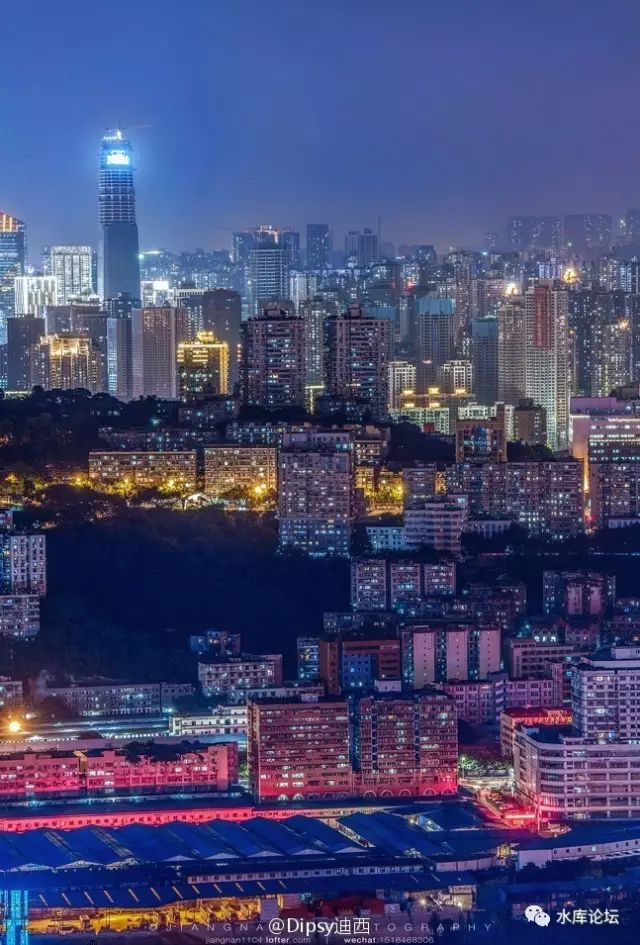
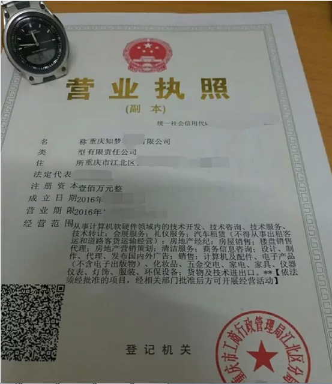
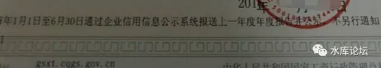
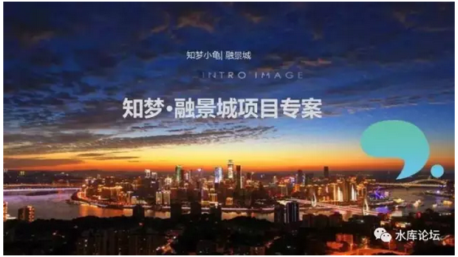

# 重庆实战手册 \#2710

原创： yevon\_ou [水库论坛](/) 2016-12-15

}
=====================================================================================================================================================================================================================================

重庆实战手册 ~\#2710~
=====================

 

谈一些务实的事。

 

 

问题一，重庆限购么

 

答：目前不限购。

但是我建议你要买尽快买。因为一旦市场氛围稍为好转，直辖市重启限购，也是分分钟的事。

 

也就是说，如果真的有利好或者大行情，他是不让你建仓的。

你来不及建仓，直接门关掉。

 

尤其是目前重庆市政府已经明显对"三无"份子：无户籍，无社保，无就业的纯炒家，表示了很大的恶意。

 

 

问题二，重庆限贷么

 

答：目前重庆市的贷款政策是；

 

-   完全纯白纸贷票，首付20%，利率85折

-   有贷款已结清，首付30%，利率85折

-   有贷款未结清，首付30%，利率第一年1.1倍，第二年可转85折。

据说月供8000以内不用流水。

 

问题三，传说中的并发式购买是什么。

 

答：这是黑科技。一般不适合在公共场合讲。

 

"并发式购买"指的是，银行每一次拉取你的征信报告。该报告有一个月的有效期。

如果你在"一个月"内并发，则□□□□□□□（以下省略N字）

 

 

具体的操办，绝大多数售楼处都会给你指引。资深房产中介也可教导。

一般认为可并2\~3套。4套以上技术难度颇大。

但是这始终是一个"擦边球"的做法。稳定性并不可靠。

 

最近11\~12月接近年尾之际，银行保守收紧。原有承诺的单子都会出很多纰漏。

而到了明年1月初大放水际，并发又会比较容易。

 

顺便说一下，重庆契税也有优惠政策。首套房减半。

这里面的诀窍是，各区不联网。

 

 

问题四，是买一套大的，还是N套小的。

 

答：倾向于N套小的。这里面有二个原因。

 

1）纯以单价而言，重庆大户型比小户型贵

2）小户型舰队以往是做不到。

 

 

各位，在北京、上海、深圳等地。我们不是不想买"一手扑克牌"，而是根本做不到。

在北上深，你要面临非常难得的"限购"问题。限贷查得也比较严。甚至还有房产税的困扰。

 

 

也就是说，我们并非不想"一手扑克牌""一列小炮舰"。而是我们根本就做不到。

而在重庆，这是一个非常好的机会。

 

这是一个非常好的历史窗口。

在这个窗口之内，价格很便宜，城市有潜力，未来有希望。

而且还不限购，几乎也不太限贷。

在这样的环境下，如果你有机遇能建立起"一列小炮舰"。那你就去建吧。

 

 

相对于"一套豪宅"和"十套小房子"。

十套小房子，在各个方面都有更强的优势。包括但不限于：

-   更低的"总价约束"

-   更高的涨幅

-   更高的租金

-   更分散的风险

-   拆散一套救命

长期的惨痛经验告诉我们，数量比质量更重要！

 

在上海，通常大户型单价比小户型低，而抵消掉了小户型的优势。

但在重庆，优上加优。

 

 

问题四，重庆二手房市场旺盛么。

 

答：极不旺盛。一二手交易大约是2:1

 

他更为严重的还有二个问题。

1）重庆有酸雨，外墙损毁很快。几年的楼就显旧。这点和2001年上海很象。

在重庆，哪怕非常光鲜的一手CEO。五年楼龄后都不受欢迎。本地人倾向买新盘。

 

3）重庆有猪队友。KFS持续抛出笋货，价格被大业主压制。

譬如重庆翠湖天地，1\~5期的二手挂牌都在11000左右。而罗康瑞卖的六期也不过11000/m（建面）。理由是集团财务紧张。

 

不过好消息是，上周h请王健林吃了顿饭。私底下说，"您呀，大学城的土地款该付了"。

"我偷偷告诉您啊，等您这批款付了。我们的地价就要提+50%"。

 

这里插播一段信息。

 

（上海市）
11月，全市300万元以内房源成交占比61.9%，较上月下降1%；300-500万元房源成交占比22.8%，较上月下降0.3%；[500万元以上房源成交占比15.3%]，较上月回升1.3%。三、挂牌量大幅上升近7%，多数为持平报价，其中挂牌价有变化的，下调比例大于上涨比例。

 

我们仔细观察这段数据。关键词在："500万元以上房源成交占比15.3%"。

 

传统意义上，上海被认为全中国二手房流通性最好的城市。甚至全球房地产交易金额最大的城市。

上海每年成交金额1.4万亿。二手和一手的比例是：300%:100%

 

 

但是我们仔细观察Marketing细分。500W以上成交的物业，仅占六分之一都不到。

这意味着什么呢。我几乎可以说，"一手房"全部都是500W以上的么。或者一手房开几个300\~500W的房源，头都被抢破了。

 

也就是我们真心观察"次新房"市场，500W以上的市场，二手还是卖不过一手的。可能成交连一半都没有。

 

上海"流通性"好，主要指的是老公房。300W以下的物业大量成交。

据悉全市二手房成交，平均面积仅为60平米左右。

 

 

 

问题五，那为什么这么多批"上海购房团"飞重庆，主要买的还是一手房。

 

答：这里面有三个原因。

 

其一，重庆实在是太便宜了。

如果你最终的目标是100000/m，那么，今天你是按照8000/m，还是6000/m入的货。有区别么。

 

没有区别。"买到就是赚到"。有这份闲情逸致好好优化，你不如多买几套。

多买一套，你就赚几万/m。

细心优化，省下2000元/m。

 

 

其二，一手房贷款比较方便。

众所周知，重庆市政府和重庆银行，对于二手交易设置了很多障碍。把购买力往一手赶。

其中一条，就是二手很容易"估不足价钱"。

 

而我们买楼普遍都是"高杠杆"的。8000元/m，一套房子65W，首付可能仅仅才13W。

你干嘛要优化13W的使用呢，你干嘛不优化52W的贷款呢。

 

尤其是一手房的"并发"式比较容易。不展开了。

种种技术原因，一手房还是有买一手房的意义。

 

其三，客场劣势

 

 

问题六，请解释"客场劣势"。

 

答：我们生活，工作，居住的这个城市，称之为"主场"。

跨越操作另一个城市，称之为"客场"。

客场具有重大的劣势。所谓"过江龙战斗力打七折，过海龙打三折"。

 

为什么。因为炒楼学的入门第一课，就是"看房二百套"。

看房二百套，你自然从一个什么都不懂的菜鸟，成长为什么都淬炼过的老手。

看房二百套，你再也不会"犹豫不决"难以判断。而是会杀伐果断，捕猎出手。

 

 

"客场"最大的问题，是你无法"看房二百套"。

如果你每次仅仅是坐飞机过去，五星级酒店待上三天。

那只够你签字完成相应法律手续。了解整个市场是远远不够的。

 

对于我们"主场优势"来说，他主要分二个阶段。

1）初级阶段：淘笋阶段

你需要有大量的时间泡在一个城市。每个周末骑着小车出去，把板块和街道一条条扫过去。心静下来，看足够多的200套房源，最终对整个城市"审美规则"通盘了解。

也能淘到"七折笋盘"。

 

 

2）中级阶段：人脉阶段

买房并不仅仅是买到就可以了。他还牵涉到无数的具体操作。房票用哪一个名字做，贷款用谁来做首套。

如果贷款资信流水不足的话，如何和银行沟通包装。评估价估不足怎么办。你需要一个贷款中介。

 

此外，还有装修，招租，维修服务，民宿，凤冰等一系列手法。

也就是说，你需要御用中介，御用贷款中介，御用装修师傅，御用情报小密探，友情售楼处大姐，地产公司打折老总............等一系列的人脉关系组合。

 

在一个陌生的城市，这些资源都是没有的。使你的战斗力大大打折扣。

我们最近在推"重庆管家"服务。就是想把基础设施做好。

 

 

 

问题七，什么是"管家公司"。

 

答：这是随着水库团购而出现的一种服务类公司。最初的倡议，可参见《关于"重庆管家有限公司"的设想》\#F800

 

水库上的人，办事能力是极为惊人的。

从11月25日至今，短短的三周时间。涌现的已有三家。

 

（微信联络人：redearturtle）

由于一切的新事物，都在飞速发展之中。

新涌现的"职业炒房团管家公司"，其服务能力如何，态度如何，解药单能力如何。

目前也还都是未知之数。

 

但想必二三年之后，这个业态能坚持下去的话。会有非常好的管家活下来的。

 

 

问题八，就板块而言，你看好哪类地段

 

答：我倾向于环线边缘。

 

如果你看过去16年上海楼市的走势。他的大赢家，其实是"城乡结合部"。

对于每一个波段，每一个轮次。如果你始终站在"城市边缘"。你就是大赢家。

 

 

譬如2000年开发徐家汇，2003年开发莘庄，2005年开发联洋，每一次开发，都是"都市核心区"的外延。

而到十几年以后，你回过头来看。在最初的时候，徐家汇是不折不扣的郊区。和法租界静安区不能比。接近1：2的价差。

时至2016年，二者之间的价差已几乎消失不见。

 

也就是当城市成长时，他的"核心区"会变大的。在"城乡结合部"变为市区的一瞬间。它的涨幅是最大的。

 

 

因此，前二天有人在"分答"上咨询我。说想去买朝天门码头，最好的位置豪宅CEO盘，20000/m单价。我觉得不妥。

 

假设重庆的目标极限价位是100000/m的话，你现在20000入手，也不过才五倍雪坡。我们甚至都看不上眼。

 

 

我比较倾向的，是在环线附近。现在还属于"比较偏"的地方。

相应的，价格也不贵。你把一切都打到"低成本"里面去。

 

我最倾向的，是8000元/m（建面）这个档次，地铁沿线。离渝中区六站，九站，十二站地铁均可以。

附近周边，存在巨大的空地。政府有能力大片开发。

但又和主城区连成一片，不至于形成鬼城。

 

这样的地方，找个干干净净的楼盘，干干净净的小区。

五年之后，自然有很大的收获。

 

 

对于面积区段，我最喜欢的是80平米（建面），2/2/1.

这样一套的总价，就是8000\*80=65W。

首付约十三万。

 

因为你一套65W的房子，要涨到200W。那是非常非常容易的。

哪怕以重庆土著现有的收入，稍加挑拨，买套200W的房子也不显得吃力。

房价涨三倍，以首付计算，就是十倍。

 

 

很多人去买李嘉诚的珊瑚水岸。珊瑚水岸的缺点，它剩下都是一些大户型。动辄200W/套。

房子都是好房子，看朝天门灯火无敌江景。

但是200W/套，翻三倍，就要涨到600W/套。

 

这个总价，对于重庆还是太高了。

绝对不如200W的房子好走。

"炒楼"始终是一门克勤克俭，克制自己欲望的行为。

 

（以上基于"限贷"资源不是太紧迫的情况）

 

 

问题九，为什么你推介过融景城

 

答：融景城的好处，它完美地坐落于我喜好的区段："8000\*80"

我去看融景城的时候，主力户型是9000\*80=72W。这个marketing定位很好。

 

同时，融景城位于江北嘴和观音桥之间。又是大型成片集中开发社区，适合婆罗门。

观音桥是重庆目前最大的商圈。

江北嘴是建设中最高档的CBD。

融景城本身整齐划一，很干净，很整洁。这个定位就令人很满意。

 

但此后融景城被上海人疯狂团购了200套。KFS杀红了眼，号称下一期要开到2W。

我就兴趣不大了。

 

 

问题十，那下一期关注什么楼盘。

 

答：还有几个8000的盘在看，在观察。

我其实没什么时间飞重庆。

"重庆战役"尚未开始。

 

 

问题十一，重庆会复制上海的地产逻辑规则么。

 

答：大概率会的

 

首先，为什么我们对于上海楼市的预测这么准。过去十六年中，连续押了十六把大，几乎把把押中。

因为我们有深刻的香港生活背景。上海今天所发生的一切，无非1980年"香港地产"曾经历的一切的翻版。

"日光之下，并无新事。已有之事，后必再行"。

 

 

因为生产力的发展，规律总是一样的。产业结构的升级，顺序也是一样的。甚至包括政府卖地的逻辑，人性都是一样的。

无论香港，上海，重庆，都经历了一个轻工业---\>重工业---\>服务业---\>金融业---\>泡沫化的过程。

 

 

在服务业向金融业转化的过程中，会有大量的资金，堆积在这个城市上。

或者学术上说，M2拼命增加，可是CPI就是不涨。

这些钱哪去了，涌入了资本市场。

 

而房产本身具有"财富属性"。

一旦房子可以涨，可以升值，持有房产可以赚钱。

那么房子就会继续涨，更加升值，人们就会购入更多的房产。

火车头一旦跑起来，惯性就会很足。

 

 

另一方面，从微观上讲，政府的逻辑也是一致的。

无论是香港，上海，还是重庆。

政府都喜欢拍地，都喜欢弄新区。都喜欢搞西九龙开发计划，新界北开发计划。

 

因此，如果一个人经历了解完整的香港楼市。对于他浸润上海楼市，就会如鱼得水。

而一个人经历了完整的上海楼市，再去看重庆楼市，就会有一种脉络分明的感觉。

无非是把历史，往后推了二十年。

 

 

问题十二，你说了这么多，我还是没搞懂"重庆厌恶二手房"该如何破。

 

答：呃，这其实归入下一篇《二线城市的切入点》。

几篇后再写。

 

 

 

（yevon\_ou\@163.com，2016年12月14日午）
