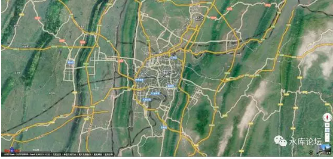
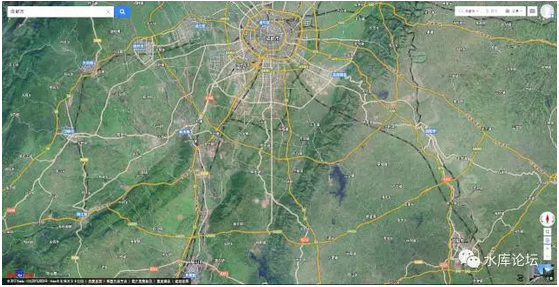
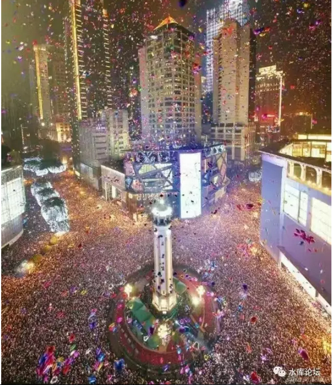
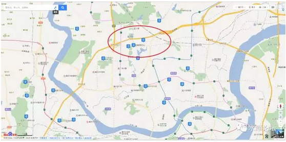
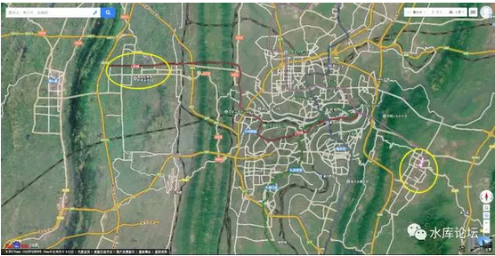
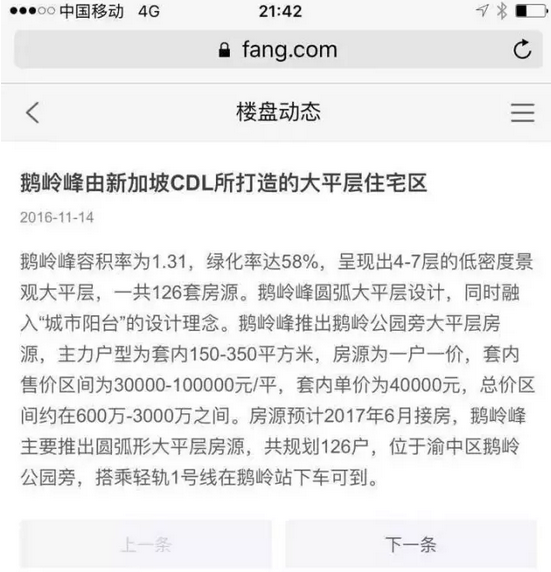
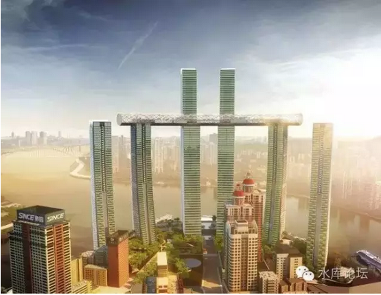

# 

二山夹平原

 

 

> 一）地图

 

之前那篇《重庆楼市地段分析》写于2012年。

因为是旧文，所以也没有推送。

 

五年之后，大的框架基本符合预期不变。

就细节而言，这个城市又生长了不少。我们对重庆也愈发熟悉。

因此需要补上一篇。《重庆楼市地段分析》的2017版。

 

 

首先，我们来看一幅地图。

在"百度地图"之中，最令我着迷的，并不是"道路指航"那一个界面。

百度地图最棒的，是切换到"地球"的底纹。

这时候显露出来的，是山川地貌。城池关隘。

有时候，我常常可以痴迷地对着"山川地貌"版看，一看就是一个下午。

 

 

平时许多你百思不得其解的问题，在"山川地貌"版本，顿时显露无疑。简直象打《三国志》一样简单清晰。

张任为什么要在雒城迎击刘备[\[1\]]。诸葛亮为什么只能前进到五丈原。

石家庄在什么位置。

 

这些东西，你看"行政地图"。或者柏杨版史书，是没有任何概念的。

但是你看"山川地貌"版。顿时一目了然。

 

 

 

让我们看回重庆的"山川地貌"版。

重庆的地形，宛如斑节竹林。

 

南北方向，一共有七道大型的山脉。把"巴东"地形分割得支离破碎。

而重庆市，坐落在其中最大的一块河谷。同时也是二江交汇之处。

 

 

所以重庆市最西侧，就远到"沙坪坝区"。

沙坪坝再往西，你就要越过大山。这也是一个行政区：璧山区

但是一般就没什么人了。

 

南岸再往东，他也是一座山脉阻拦。被称之为"南山"。

因此南岸的腹地很小。目前已接近山体极限。

 

南岸区往南，有一个狭窄的瓶颈。

过了瓶口，则是巴南区。

 

 

 

有了这些最基础的地形概念，我们可以很容易得出以下结论：

 

> 1）和北京上海等平原城市不同，重庆是真缺地。山城。
>
> 2）重庆的发展方向，只有向北和向南。
>
> 3）要不就翻山

 

 

 

> 二）北部新区

 

熟悉重庆市的朋友都知道，在H的任期内，他孜孜以求的始终是"三北新区"：江北，渝北，新北。

 

基本上，所有的城市套路都是一样的。

 

几乎所有的城市，政府都热衷于"开发新区"。政府拥有最多土地储备的地段，最优先倾斜发展。

而人口密度很高，发展成熟，土地都已卖完的老城区。从来不是开发热土。

 

新区一路向北。在偏远的地方拍出地王。价格和传统市中心相差无几。通过"地王效应"，拉动房价涨价预期。

新区爆炒，以坑害新房癌为主要手法。

 

 

这一套手法，我们冷眼旁边。

从上海浦东开始，逐渐蔓延全国。

新房癌的屌丝小白领，是智商税的主要缴纳群体。

 

 

象成都的话，成都是"一路向南"。

"天府大道"一口气向南延伸30KM。甚至雄心勃勃地想要开发黑龙潭。

你看成都地图的话，他是一个极其可怕"盘丝洞"的形状。

直挺挺的"一根棒"天府大道。

让人对南五环的房产彻底丧失信心。

 

 

 

而且奇怪的是，在"新房癌"的帮衬之下。"成都南"的房产还卖得不错。

15000,20000,25000价格甚至一路"升值"往上走。

南四环的房价，卖得比市中心还贵。

 

对于"新房癌"缴纳的那些"处房税"。我们只有四个字：

"撒油娜啦"。

您自己玩吧。咱们不掺和。

 

 

 

同样道理，重庆的房产，在过去十五年H任期之内，他是"一路向北"。大力开发三北新区。

我不知道水库读者有多少人是"实地考察"过三北新区。反正我去过，去过之后"心都凉了"。

 

 

昨天是跨年庆祝，解放碑人山人海。

任何人看了这张照片，都会感到由衷的窒息。以及无穷无尽的商机。

人口就是力量，人口就是一切。

 

可是如果你去江北新区呢。

这一带实在是没什么人。

拿机关枪不好说，反正拿步枪的话，估计扫不着人。

 

 

北部新区的人气稀落，新建办公楼无穷无尽。而且大多空置。

最令人惊异的，价格还很贵。几乎和渝中区90%价格。

反正也就四个字："撒油娜啦"。

 

 

 

> 三）发展方向

 

我们这个流派，注重价值投资，厌恶价格投机。

我每天都在想；

"房地产会不会崩溃"

"我会不会破产"

"哪一套房价会大跌"

 

我们不喜欢新区投机！

 

我们不喜欢"成都城南"的房子，你炒得再高我也就冷眼旁边。

我们也不喜欢"重庆江北"的房子。你再多的利好，利好兑现后才是个渝中。

甚至我们都不喜欢浦东。这是浦西帮和浦东帮的严重分歧。

 

 

但是呢，我们又忍不住**偷机**。

最好是政府即将开发，有大规模投入。但是价格还是"[极便宜]"~（划重点）~价格。有热点有小白，有冲头。

这就需要钻研。

 

 

重庆的好处是，重庆的地形决定了，他是"二山夹一平"。峡谷中的平原。

别的城市发展，有东南西北等各个方向。因此很难预判。

而重庆的好处是，他东西已经到头了。

 

通过地图，我们可以清晰地看到；重庆其实只有三个发展方向。

一个是向北。就现在的三北新区。一直可以造到机场。

 

一个是向南。包括沙坪坝的西南方向和南岸巴南。

区别是，西南腹地还很大。

东南腹地较小。

 

一个是跨山。目前6号线的终点站"茶园"，1号线的终点站"大学城"。如图中二个黄圈的位置。

我们有理由认为，"跨山"之后，茶园和大学城会成长成"离岛飞地"这样的区域性中心。但很难和主城区连接起来。

 

 

 

> 四）水库的选择

 

知道了地形，因此在水库中人的选筹中，我们主要倾向于几个方向。

 

> 1）二江三岸

 

无论是江北嘴北滨路，弹子石CBD，朝天门，南岸南滨路。

水库中人的第一选择，是"CBD中的CBD""核心中的核心"。这样极小的一块区域。

因为重庆房价实在是太便宜，而我们目光远大。

如果未来我们的预期是100000/m，那么现在15000或者10000/m有区别么。没有区别。

反而是"房票""贷票"之类的，更为瓶颈。

 

 

尤其是越是"顶峰"的东西，越有"稀缺性"。

如果你注定了把目光投向于"婆罗门"的市场。那你何必去关注什么茶园。

 

"稀缺"的东西，是呈指数级数减少的。

既然要买，而且底盘便宜。那就买[最最最好]的。最核心的地段，最棒的江景。

 

 

 

> 2）南岸

 

如果要往内陆去点，离江2KM以上。则水库中人，相对更喜欢南岸区。

这其中最重要一个原因，是"便宜"。

 

 

因为江北大旺，观音桥，江北嘴，弹子石，都是热炒的版块。

至于江北新区，就更不提了。价高质次。

 

 

当上海人跑到南岸一看。"价格合适"，大约比江北，渝中等区域便宜20%左右。

"生活舒适"，南岸人口密度和商业都已经很成熟。

"发展有潜力"南岸的腹地虽然没有正北，西南广大。但是"四公里"地铁站是一个束瓶。

 

以后茶园或者巴南的居民，去往市中心，都要从南岸区经过。

相当于莘庄入市区一定得经过"徐家汇"。

因此也是一个不错的选择。

 

（经重庆网友提醒更新：渝北区的人口增长很快，人口远远更为有利） 

我们比较避开的，是；

 

1）鹅岭峰

 

重庆海拔最高的区域。品质规格也做得很高。

但是，价格！

 

价格40000/m，坑爹呀。更有某房产机构，组织了上海团购推销。

这个明显是坑上海人的。坚决回避。

2）海客瀛洲

朝天门的魔幻型的地标型建筑。

原因也是一样的。35000/m预计。

太贵了，不符合投资客的原理。

 

 

3）渝中半岛

 

坚决不看好渝中半岛

 

 

4）涨价后的部分楼盘

 

融景城被上海团团购了500套之后，KFS大喜若狂。

2016.8买的8000/m建面，1月份KFS号称下一期要开20000/m

 

对于这种房子，也没什么兴趣。

 

 

 

> 五）H的离职

 

最后，插一点点删帖的风险，讲一下H的离职。

 

《童大焕:QF若有此奇术，应该做北上广深三省总督以镇房价》[\[2\]]

 

 

对于这件事情分析上，童是正确的。

全国的房价风起云涌，经秀相二届，费尽心机也压不下来。

难道你还以为H比星空更厉害。

 

事实上，H是一个极其无能的庸人。

关于"明星"的所有言论，都是包装出来的。以掩饰其背后更大的棋盘。

 

 

H一直在"亏本"卖地。

他能把"房价/地价"压下来，再于他能承受几百亿千亿地亏。

具体，不说了。

 

 

2001年，一秒邀H入渝，任第三号人物。

拍着肩膀说，"你好好干，干得好给你升xxx"。

十五年之后，他升职了没有。有才能没有。别的同年同级同届人士目前什么级别。

 

 

H从来都是一个小人物。

他既不能做到什么，也不能影响什么。刘璋的那个评语，怎么说来着。

 

 

 

（yevon\_ou\@163.com，2017年1月1日晚）

 

 

 

\* 近期花了极大的心血写《军事》系列七篇：\#F810

呕心沥血，篇幅又大，规格又长。

写完了之后也没人看，又不涨粉。累死我了，以后不写了。

 

 

\[1\] 见马伯庸的《文化不苦旅：重走诸葛亮北伐之路》

[\[2\]]《童大焕:奇帆若有此奇术，应该做北上广深三省总督以镇房价》http://www.shuiku.net/forum.php?mod=viewthread&tid=54222
