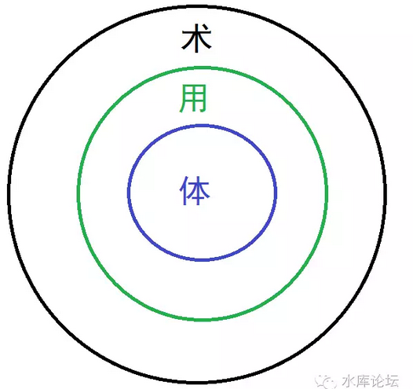
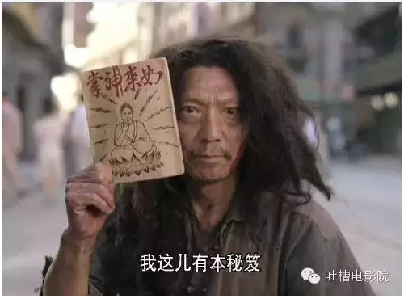
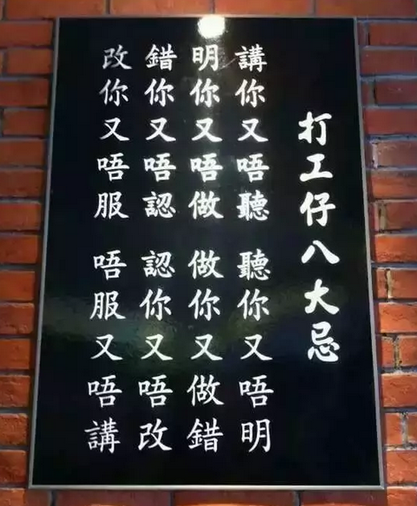

# 《楼市秘籍》速成法备注 \#2770

原创： yevon\_ou [水库论坛](/) 2017-01-12

《炒楼秘籍》速成法备注 ~\#2770~
===============================

少年，我看你骨骼清奇，面相不凡。我这有本武功秘籍............

  

 

一）速成

 

水库《[速成篇](http://mp.weixin.qq.com/s?__biz=MzAxNTMxMTc0MA==&mid=2651015408&idx=1&sn=f4e471d469c4d50ab072d3879af2ccac&chksm=80721ee3b70597f5a47bd472c5b70e96f9910613003e58ceaf0c57d001d5e11c7128887d0cda&scene=21#wechat_redirect)》这个标题一出来，顿时有人一拍脑袋。原来还有这好东西。

 

这事好呀。你说水库论坛从2015.2月，前前后后也写了二年多了吧。文章累积不下百万字。

200多篇文章，如果要看，得几天时间。看得累呢。

 

你说，如果可以浓缩到1000个字。

您早说嘛。

俺就不看正文了。只看速成版。一千个字岂不是三分钟就看完。

 

 

 

为此，我们先要解释一下"速成"的意思。

什么叫做"速成"。真正按照严格意义上讲，是没有"速成"这个说法的。

 

人类的社会，经过千淬百炼。真正能够保留下来的那个方法，一定是最有效率，最迅捷的方法。

此所谓"正道"。

 

而其他所有的"速成"方法，无一例外，都是有各种各样的缺陷的。

就好比你要学知识的话，老老实实地念完四年本科。这才是最踏实的。最踏实的才是最迅速的。

而如果你要"一年，二年"就毕业。则多半是技校，大专。

 

 

我们今天说的水库"速成卷"。其实是通用件和专用件的区别。

学问之道，分为"体、用、术"。

"体"为根本。奥派和经济学的大道理，才是演化以后一切的基础。

而大道理并不能转换成"钱"。有时候你看"体"，洋洋洒洒写了几十万字，可是没一款能帮助你赚到钱。

未免显得十分屈闷。

 

 

"速成篇"，则是侧重于"术"。

基本上世面上所有的"速成"，讲的都是"术"的道理。任何教你快速赚钱的方法，多半是一门手艺。

一个熟练的技工，三五天就可以上工了。而培养一个大学生，却需要四年。

 

 

"体"和"术"有什么区别呢。

区别就在于"通用件"和"专用件"的区别。

 

学习"术"的人，好比一具专业刨螺丝钉的机床。你让他加工螺帽，则效率极高，成本也节省。

哪天你想加工一个曲轴，他就完全不能胜任了。

 

 

我们的时代在变迁，社会在变迁。更要命的是政府也在变迁，环境和政策一天一个样。

这导致我们今天学的"整套手法"，到明天可能就没用了。

好比第24，25条。我们说我们需要"二张房票"。其中A用于凤变冰，积累原始资金。B用于大面积低单价流派。

 

这就是11.28"新政"之后的新改变。

在之前，只要"首房无贷"，没有贷款记录也是可以认首套的。

你只要A一缕房票就够了。

 

 

 

如果说这还属于"小改动"的话。

则随着"水库"的普及面不断提高。目前市场上"[凤变冰](http://mp.weixin.qq.com/s?__biz=MzAxNTMxMTc0MA==&mid=2651015136&idx=1&sn=6a26f814fc7006f64410109f707b7c11&chksm=807211f3b70598e51c14a13b5658fc6d84295bfc95b47ef3b54b5f02eb65c3ed29d61e25a7ba&scene=21#wechat_redirect)"也越来越难找。

 

凤变冰的特点，在于凤姐，不在于冰冰。

凤姐才是你可以赚取的利润。而冰冰溢价少，最多使你卖得快一点。

随着水库大军越来越多，凤姐都快被挖光了。洼地也是越来越少。

 

整个逻辑链上，"凤变冰"也属于很重要的一环。

失去了凤变冰，资本原始积累如何走。[如何获取家人的信任](http://mp.weixin.qq.com/s?__biz=MzAxNTMxMTc0MA==&mid=2651015162&idx=1&sn=deb819ce8de024453f19f5b414847863&chksm=807211e9b70598ffda556c62cbc3326e28a6fe734297c36168acc6c8b891aefe6b16551b3223&scene=21#wechat_redirect)？

 

 

 

这些东西，光靠一篇"速成篇"是无法回答以上问题的。

1000个字可以速成。但速成的是"专用件"。只能用于[特定时期特定场合特定人群。]

 

而只有把"体，用"都学会了。从头开始学，把基础打好。[把整个逻辑讲透。]

当外部环境变了，你可以自己[顺着逻辑推导。依然有对策。]

这样100万字的阅读，才算是没有白费。

 

 

 

二）小抄

 

速成篇的第二个问题。在于我们一直有一个梦想。

 

在《射雕英雄传》里面，铜尸陈玄风盗得半部九阴真经。

他放在哪里都不放心，最后把原文毁了。刻成刺青，缝在自己的胸口。

后来被人皮剥下。

 

 

八卦读者看到这里，不由得会问。"在古代又没有打印机，您最小用几号字体"？

人的胸口皮肤，面积十分有限。在这么小的范围内，你怎样抄下半部《九阴真经》。能写多少字。

结论是，很少，不到1000个字。

 

 

当我们读大学时，我们就心怀一个梦想。读了那么多的武侠小说，哪天让我也撞见一本《武林秘籍》。修炼了以后，变得贼猛贼猛老牛逼滴。

睡在上铺的兄弟，偷偷地凑了过来。拿出一本发黄的手抄本，"少年，我看你骨骼清奇，面相不凡，必是一代学武奇才"。

然后你接过，对着昏暗的灯光一看，是这本；

《水库论坛》如果是"炒楼秘籍"的话。则我一直想出一个"速成手抄本"。

字数不要多，就1000个字左右。足够刺绣刻在陈玄风的胸口。

足够做成小抄，在大学生之间流传。

 

所以才有了\#2760这个"速成版"版本。

经过的大幅的简化，凡是讲宏观调控，讲[经济学原理](http://mp.weixin.qq.com/s?__biz=MzAxNTMxMTc0MA==&mid=205864469&idx=1&sn=0b04583f8b94361c7a52f260bb7ccae1&scene=21#wechat_redirect)dT\>0的，一概不要不录取。

最终勉勉强强凑了1009个字。

 

 

但其实还是很偏向"用"的。介于"用、术"之间。比较偏向[蛮理论化的。]

因为，真正要写"速成版"的话。终极格式我只要43个字就够了。

 

"七成30年按揭，去买上海康城一楼带地下室的户型。按照2017年1月的价格，闭着眼睛买。即买即赚"！

 

 

 

三）工作

 

好了，现在我们具体展开，"速成篇"66条究竟都写了些什么东西。

 

 

首先，你需要一份工作。

工作，绝对不是让你去赚工资的。更不是让你去拼搏升职加薪。

 

事实上，既然是"速成版"。则时间是非常宝贵的。一般在36个月内就要结束战斗。

36个月，靠工资，那是根本攒不了多少钱。升职提干也就是小组长，毫无意义。

 

 

"上班"的主要用途，是为你交四金。

交四金有非常重要的意义。尤其是当申请房贷，信用卡时，会有很大的加成。

你只要有一份体面正当的工作就可以了。工资无所谓。

 

 

"上班"的第二个含义。是结交一群"小姐妹"。或者"小兄弟"。

赚钱再快，也比不上申卡。

对于一个初出茅庐，刚刚踏上社会的年轻人。如果他要靠"工资\-\--积蓄"赞起人生的第一个150W，那可能需要五六年，甚至更长的时间。

 

而办卡的话，体制内人均130W，体制外人均80W。

也就是你那群小姐妹，一个个都是人形金矿。只要你挖掘得好，四五个朋友一凑就是300W启动资金。

 

 

四）流水

 

一般银行的需求，让你打六个月的流水。

上海最近四季度管得十分紧，甚至要求你打十二个月的流水。

 

 

无论如何，你在公司里得待六个月。

在这段时间内，你也不会闲着。

 

一件可以做起来的事，是"养流水"。

你要严格地做到"收支二笔账"，甚至可以说，同一家工行开2张借记卡。

 

 

其中，所有的"支出"走一张卡。譬如月供，还信用卡，分期付款。

所有的"收入"走一张卡。工资，房租，定期收入。

这样，等信贷主任问你要"流水"时。"收入卡"才会好看。

 

 

而对于"初入职场"的年轻人来说，工资不会太高。"流水"也十分难看。

这时候，你还可以"养流水"。

也就是说，每个月固定有一笔23456.78元的进账。放在卡上，暂时不要取走。

每三个月可以集中取走一笔60000.

 

 

按照谨慎的原则，银行应该集中监督你"工资"项目下的每月定期收入。

但我们实战体会，只要你每月固定日期，非"工资"类目其实也很有用。

 

另外一个黑科技，有某二家银行，如果你汇款的时候"备注栏"写工资。

则等到你去打存折簿时，他显示也是"工资"。

具体不展开，免得洞塌。

 

总而言之，你的流水得养起来。等哪天真用上贷款时，谋而备就可以用。

 

 

 

除了流水之外，另一个可以养的是"社保"。

社保的时间，每年的纳税证明，都可以养。

 

当你看见职业炒家唰唰唰地"万箭齐发"时。

其实人家二年前就开始准备了。

 

 

 

五）扫街

 

在这六个月内，除了养流水，另一个可以做、必须做的事情是"扫街"。

天底下本没有捷径，也没有速成法。

一切都是无差别的人类体力劳动。

 

 

我们一般的要求，是"[看房200套](http://mp.weixin.qq.com/s?__biz=MzAxNTMxMTc0MA==&mid=2651015157&idx=1&sn=7c2911db2032cbeba607fc8c70dc3e1b&chksm=807211e6b70598f03c1a5dd247dea26c3fd281ea1ee0f68f7d35e8c0efe892a3498925dd1ef9&scene=21#wechat_redirect)"。

对于一个小白，你会有太多的疑问。说了你也不听，听了你也不懂。

在这样情况下，我们给你的建议就是"看房200套"。

你不用违嘴，自己去看房二百套。

 

随着你皮肤被晒黑，脚底被磨破。晚饭今天没有吃，明天没有吃，后天忘了吃。

你自己会涨经验值，会有实战心得体会。

 

二百套是告别"粉耳朵"的唯一方法。

"谋而寡断"是男人最令人厌恶的品质之一。

"杀伐果断"是可以后天学的。其最佳的办法，就是长期泡在第一线。经历足够多。

 

 

 

六）人脉

 

培养二个御用中介。培养一个御用贷款中介。

 

就好像我们在《[信息不对称是伪科学](http://mp.weixin.qq.com/s?__biz=MzAxNTMxMTc0MA==&mid=2651015322&idx=3&sn=458b83fb16bc48016e763526e1d60205&chksm=80721e89b705979ff1c3a3189cec1c172c59b251a1416c08bb9940bb5fbcaf16cf10e8bd2bd7&scene=21#wechat_redirect)》一文中所写的。凡事皆是资源。

信息不是免费的。

 

 

 

七）信用卡

 

大约"四金"社保交三个月以后，征信系统已经有了足够记录。这时候可以开始[申办信用卡](http://mp.weixin.qq.com/s?__biz=MzAxNTMxMTc0MA==&mid=2651014740&idx=1&sn=109ed5aaa66bb2495311ec553c16209b&scene=21#wechat_redirect)。

 

因为银联偷偷地规定了"个人总授信"有上限。

因此办卡有很多的讲究。

 

-   [工行卡最优先](http://mp.weixin.qq.com/s?__biz=MzAxNTMxMTc0MA==&mid=2651014825&idx=1&sn=85198c4c0ee101b2503d02cc9b0f6c2f&scene=21#wechat_redirect)

-   [56天卡优先](http://mp.weixin.qq.com/s?__biz=MzAxNTMxMTc0MA==&mid=2651014817&idx=1&sn=ab34b9cc700422660c90e2ba666d730a&scene=21#wechat_redirect)

-   继续办付费白金卡

 

当这些卡发下来以后，你还要进行"养卡"。因为到了后期，你是根本没有精力干养卡活的。

 

你要为每张卡刷50笔小额消费，笔数要多，商户要杂，类型要全面。

这样你的信用卡统计报告才会好看。

 

 

最后则是开始请小姐妹吃饭。

真心诚意地告诉她们你要炒房，要借她们的名字办信用卡。[不要撒谎。]

 

 

 

八）凤变冰

 

好了，差不多到了四五个月的时候。你手里卡也有一些了，房子也看了100套了。对市场有了初步的了解。

这个时候，你要"实战"一把。

 

 

纸上得来终属浅，真金白银才是赚。

我们对于"[第一笔交易](http://mp.weixin.qq.com/s?__biz=MzAxNTMxMTc0MA==&mid=2651015157&idx=1&sn=7c2911db2032cbeba607fc8c70dc3e1b&chksm=807211e6b70598f03c1a5dd247dea26c3fd281ea1ee0f68f7d35e8c0efe892a3498925dd1ef9&scene=21#wechat_redirect)"看得极重。对于第一单，赚钱多少和年化回报率完全不重要，权当练手。

 

关键是"赚"。一定要赚。哪怕年化回报只有10%

但你无论如何不能亏。切记，切记。

买房的第一套，第六套，第十六套是最重要的。

 

 

具体的操作，反正你买房之前，可以有二到三个月的漫长时间可以扫楼。

只要你看的房子足够多，你总是可以找到笋盘。

 

"凤变冰"，关键是凤姐。

利润是在买入的一刻就已经产生。关键要成本远低于市场价。

 

 

 

对于第一单，第一次"[凤变冰](http://mp.weixin.qq.com/s?__biz=MzAxNTMxMTc0MA==&mid=2651015136&idx=1&sn=6a26f814fc7006f64410109f707b7c11&chksm=807211f3b70598e51c14a13b5658fc6d84295bfc95b47ef3b54b5f02eb65c3ed29d61e25a7ba&scene=21#wechat_redirect)"，你不用追求高利润。

只要能摇摇晃晃地把"整套流程"走完即可。

 

我们的目的，也主要是让你熟悉了解"买入\-\--装修\-\--卖出"的整套流程。

知道是这么回事即可。

 

最后，你盘算利润。利润很薄。

但是再薄再薄，只要能跑赢定期存款利息。也足以让人精神大振，"发现一条财路"了。

 

 

在第一套的基础上，一般我们建议你再做第二轮"凤变冰"。

和第一轮的青涩相比，第二轮无疑会少走许多弯路，少交许多学费。利润大为增加。

挑战一下获利的上限。

 

 

此后，还可以做第三，第四轮。

"凤变冰"本身不是一个成功的流派。炒房客动辄谈论500W以上的利润。以"凤变冰"单趟20W的利润，足足要做上几十笔。所以，不必留恋。

 

凤变冰，主要是三个目的；

1）小规模实战几回。涨涨经验，交交学费。

2）赚100W启动资金

3）给家人竖立一个赚钱的印象

 

 

 

九）富二代

 

在这里，就可以看见我们和口含金匙"富二代"之间的区别了。

 

我们通篇的文章，假设的主人公，都是"赤手空拳来到上海，无存款，无人脉，无资源"的三无人士。

你很能干，很拼，想出人头地。但22岁时一无所有。

 

 

对于这样的年轻人，你才需要"信用卡"+"凤变冰"这二条科技树。

-   信用卡可以通过"[空当接龙](http://mp.weixin.qq.com/s?__biz=MzAxNTMxMTc0MA==&mid=2651014760&idx=1&sn=3082d0dd2433468e0663480e7478c7f0&scene=21#wechat_redirect)"的方法虚空幻化出几百万。尽管苦不堪言。

-   凤变冰获得100W启动资金。并获得家人的支持。

 

 

不管是谁，起步的时候都不轻松。你没有爹可拼，你就必须更拼命。

你从0起步，你就必须冒更大的风险，吃更多的苦。

值得欣慰的是，炒楼相对来说，还算是轻松的。

 

 

 

十）多核

 

我们一般认为"凤变冰"赚不多。一年时间循环四次，也不过赚100W左右。

信用卡办200W。

 

如果"凤变冰"失败的话，此路不通。

那你就办300W信用卡咯。无非是更辛苦，更痛苦，更风险一些。

 

 

 

当有了这些启动资金，赚到第一第二笔钱的"示范效应"。

你才可以回到家族里"满地打滚"。

 

获得你整个家族，全面的，多族裔的支持。

这会使得你的实力大大增强。

也是很关键的一步。

 

 

当你满血满魔浑身披挂，再次回到战场时。

凑家族之力， 你应该会有500W信用卡+500W资金。

这会使得你的战斗力大大加强。

 

然后你再按照"[航母编队](http://mp.weixin.qq.com/s?__biz=MzAxNTMxMTc0MA==&mid=2651015069&idx=1&sn=b35d79dd91b1687a1b2dd0546841fcc3&chksm=8072118eb705989858d6d3c1cc7e15c24761a5a1af465c213729490c50b44757fbc3866f1d90&scene=21#wechat_redirect)"。按照：

-   成长型/防守型

-   收益性/流动性

-   长期项目/短期项目

-   大型标的/中小型

 

和所有的财务类"教科书"一样。以资产配置的眼光搭建你的整个资产包。

 

 

 

十一） 筑巢引凤

 

以上所有的事情全部都做完了。无非也就是"蓄势待涨"。

 

好比我所有的准备工作都已经做完。

手里的600W现金，变成了"2000W房产的三成首付，-1400W负债"。

 

在这个时候，有一个最最最最最关键的步骤：

房价必须大涨！

 

 

 

理论上来说，600W现金和"2000W房子的三成首付"。在会计上是等价的。

而二者的唯一区别，在于"房价是否按照预期大涨"。

 

筑巢引凤，如果房价没有大涨。则你死光光。

简直是埋坑自己躺。

 

 

而房价会不会涨呢，这不是"术"里面的问题。

而是"体"里面的问题。

是基于奥派经济学，货币经济学，宏观调控，土地政策，人口大数据等一系列分析的结果。

要把"房价是涨是跌"道理说清楚，就是1000000字。

 

 

因此这是"速成篇"不教的东西。

您记住结论就可以："涨"。

 

 

 

十二） 中级阶段

 

先让我建仓，把"600W ==\> 2000W房产三成首付"。

然后房价必须"如期大涨"。

万事如意，你可以进入中级阶段。

 

 

在中级阶段，钱财是来得极快的。

如果你看初级的时候，为了100W信用卡，为了20W的凤变冰利润，被折磨得痛不欲生。

而在中级阶段，眼睛睡醒就赚了几十万。

 

一般而言，上海楼市世道好的时候，2000W房子，一年可以赚600W。

也就是本金翻翻。

考虑到本金中，你还有大半不是自己的钱财。本金可能就200。

 

 

也就是只要一年的时间，你就可以；

-   脱离赤贫

-   脱离苦海

-   脱离屌丝

-   脱离小康

-   稍微超越中产

 

在水库上，常有"一年时间10000到1000万"的故事流传。

其实前半截都在建仓。建仓后楼市一冲就千万了。

 

 

 

十三） 2N

 

中级的后续做法是2N，也就是每年买二套，持续扩大。

顺着这条线，最终可以一直做到A9.

 

至于[2N](http://mp.weixin.qq.com/s?__biz=MzAxNTMxMTc0MA==&mid=2651015141&idx=1&sn=63f17628cbcf2fbfdafac93d4f077392&chksm=807211f6b70598e0716fd897fc53c1de95e7c9d8dfe58d9bf5feb94d0555ebb8e8532613bc08&scene=21#wechat_redirect)的具体做法，水库文献中已经有了详细描述。

不再赘述。

 

 

 

值得一提的是，除了[抵押](http://mp.weixin.qq.com/s?__biz=MzAxNTMxMTc0MA==&mid=2651014908&idx=1&sn=7fcf1537987d7e7fd5df0ac296ca0240&scene=21#wechat_redirect)，[截断](http://mp.weixin.qq.com/s?__biz=MzAxNTMxMTc0MA==&mid=2651014912&idx=1&sn=42f1eacd72da0e7e87280d55f206937f&scene=21#wechat_redirect)，[高评](http://mp.weixin.qq.com/s?__biz=MzAxNTMxMTc0MA==&mid=2651014886&idx=1&sn=fc7eb2dec44a760322d095087a44190e&scene=21#wechat_redirect)，[对敲](http://mp.weixin.qq.com/s?__biz=MzAxNTMxMTc0MA==&mid=2651014922&idx=1&sn=1c214c174849286499f23a2e8efecbc0&scene=21#wechat_redirect)等各项手法之外。

还有一个极重要的选项："卖出"。

 

因为楼市这玩意，也和桃子一样，存在一个"[成熟](http://mp.weixin.qq.com/s?__biz=MzAxNTMxMTc0MA==&mid=401338731&idx=1&sn=afb1238dc2b229f0ccfc71915a07d039&scene=21#wechat_redirect)"的概念。

一个地段从潜力，青涩，成长，发展；

最终会达到：成熟，过成熟，这二个阶段。

 

 

其中"成熟"阶段，该板块已达最最热炒顶峰。继续成长可能性不大。

"过成熟"阶段，该板块已炒完审美疲劳。此后只会走下坡路。

 

当手中物业接近"成熟"时，要尽早安排出售。

而物业"过成熟"时，要坚决全力抛出换筹。

 

 

譬如说，97年的田林，03年的徐家汇，04年的莘庄，09年的联洋，就属于热到巅峰而衰弱的。

2016年的大宁，唐镇，也处于"成熟水蜜桃"即将腐烂的状态。

 

 

当投资者盘算好"[出售计划](http://mp.weixin.qq.com/s?__biz=MzAxNTMxMTc0MA==&mid=401353641&idx=1&sn=81e4afbf77a73e726f0a24f624d1c980&scene=21#wechat_redirect)"，一心一意想抛时。突然遇见政府宏观调控。

那定会是非常愤怒的。

 

 

 

十四） 高级阶段

 

高级阶段，主要是守。

 

"一切附加值都不保值"，既然如此，上海二个字也是不保值的。

我宁愿逐步的按照10：1比例，把资产转移到重庆去。

 

 

 

十五） 终极阶段

 

对于终极阶段来说，富贵浮云，都是白云苍狗。

不仅"上海"二个字不保值，就连"财富"二字，本身也是[不保值](http://mp.weixin.qq.com/s?__biz=MzAxNTMxMTc0MA==&mid=207860847&idx=1&sn=c85f14f9679575b05bd0afefd9f5665c&scene=21#wechat_redirect)的。

 

财富并不能抵抗战争，政治，社会动荡。

甚至科技发展......

 

 

 

象王健林有5000亿财富，他的下一代，下二代，下三代，再要维持他在全社会的财富水准，那是非常非常难。几乎注定要降阶的。

 

相对而言，如果王健林有5000个儿子，而每个儿子均分1亿。并且散居在全国150个万达广场，全国各地。

 

则"王氏家族"堪称是根深蒂固，几乎无可撼动。

5000人的财富总量增长，也一定会超过王思聪一个人的速度。

孩子才是终极财富。

 

 

血脉的传承，就是自然界的究极意义。

而你要做的，则是让尽可能多的孙辈来到这个世界上。

 

 

 

（yevon\_ou\@163.com，2017年1月11日晚）

（Section2全阶完）
