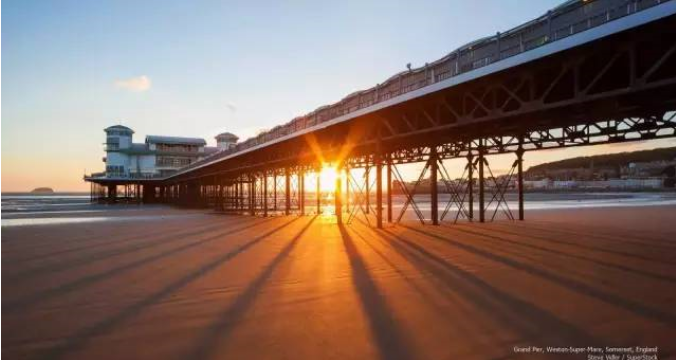

# 新城不是希望 \#290

yevon\_ou [水库论坛](/) 2015-09-27

新城不是希望 ~\#290~

很多事是一环扣着一环的。

新人，新钱，新城，为什么外地人喜欢买浦东。

一）新城

"新城恐怕是本世纪最大的浪费"\-\-\-\-\-- 政府公报

在历史上，城池的岁月往往很久。纷纷扰扰几千年，首都还是长安、洛阳。

长安城并不是一成不变的。

其中，刘邦兴建了一次长安城，所谓"汉长安"。

杨坚兴建了一次长安城，所谓"隋长安"。

这二者都是在原先的古城旁，新造的城池。除此之外，长安千年不变，秦风唐韵的古城墙今天还矗立在陕南。

那么，人类为什么不热衷于"造新城"，长安城为什么不象长脚的一样，每隔几十年就向东搬动几公里。最终一路迤逦象千足呢。

又或者说，为什么不象"盘庚六迁"，天天把首都迁来迁去。以求降低"房价物价"呢。

因为"造新城"不划算。从经济上说，是非常低回报甚至负回报的。

在哪个时代，"基础建设"都是极其昂贵的。土地需要平整，道路需要铺设，大城市还要地铁和高速立交。

此外，政府还要建配套的医院和学校，这都不是便宜的事。

当然，TG拥有可怕的建设能力，可怕的土木工程能力。据说在南海，连"息壤"这种神物都被发明出来了。\[1\]

但是，凡事都要讲个"性价费效比"。在宏观层面，经济规律还是有效的。

也就是说，TG可以集中力量打造一座城市。但是不能打造每座城市。

二）土地财政

新城有多么不划算，有一个词可以解释清楚："土地财政"。

首先，水库论坛已经有一篇文献《从来不存在土地财政
\#82》，有兴趣者可直接去微信公众号中获取。

土地财政指的是这样一种逻辑；

1）我先圈一大块鸟不拉屎的土地。

2）投入一定的基建，找二个财团作为牵头开发者

3）土地升值，卖地

4）以卖地的钱继续投入基建，土地继续升值

可见，整个流程是一个"卖地---基建"的正循环。这个循环要维持下去的关键：新城的回报率收益必须是正数。

对于新城，政府的支出部分是七通一平，公路，地铁/轨交，警察，消防，医院，学校，环卫，绿化............

对于收入，主要是"卖地"。

在任何一个行政区，大约只有37%的土地是用于盖房子的。其余的是湖泊，道路，绿化，港口，机场，大型广场。

在"建筑用地"指标中，大约33%是住宅。

（所谓的）土地财政要持续下去，关键"卖地---基建"这个环节要赚钱。或者哪怕是持平，或者小幅亏钱。那也是不得了的政绩了，"奇迹般崛起座座金山"。

可惜的是，"卖地\-\--基建"这个循环是亏钱的。造新城这事在任何时候都是一件很不划算的事情。而且亏钱亏得很厉害，搞出了[地方债]这种天文数字。

从来不存在土地财政，新城恐怕是本世纪最大的浪费。

三）巴西的地缘政治

有一篇文章，叫做《巴西地缘政治：一个新兴大国与地理条件的角力》\[2\],写得很不错。建议推荐看看。

文中说，南美洲发展不起来，和它的地理条件有很大的关系。

整个亚马逊丛林，还有Brazil国土，其实是一块巨大无比的高原。

而巴西最先接触文明世界的，是沿海岸线薄薄的一层平原地带。

Grand
Escarpment,从沿海到腹心，一下子就升高了近千米的海拔。这就给巴西极为艰难的二个选择；

1）要么就挤在极为狭小的沿海平原。形成象Rio,San
Polo这样闻之色变的贫民窟。

2）花费极为高昂的代价修建通往高原内陆的铁路。

请不要小看"基础设施"的昂贵程度。键盘国师小白领二嘴一磕，动辄就是新城新区。

按照中国2015年的物价，任何一个新城新区，如郑州新区，武汉新区这种规模，都是万亿以上的投资。而你想想，四万亿对你是什么冲击。

你必须想尽一切办法省钱，你必须想尽一切办法提高效率。这样你才能赢。

在文中，作者提到世界六大都市圈，全都是建立在平坦的冲击平原出海口。彼此之间可以共享资源。

一条沪宁高速可以让苏锡常所有的卡车在上面跑。从而极大地降低了成本。

地缘政治到今天，仍然是生命线。

贵州云南之所以穷，你不能轻飘飘说人家笨。

四）浦东奇迹

如果你熟读内部文献的话，你应该知道，有"浦东奇迹"这个提法。

所谓浦东奇迹，简直就是（伪）土地财政的翻版。

大家一直说，浦东从一片烂泥滩之上崛起。变成了一座座金山。每年贡献多少GDP和税收。目前的卖地都够收回成本了。

因为浦东的"成功"，导致了全国的"学浦东热"，才搞得到处都是新城。到处都是开发区。

事实上，与其说浦东耀眼的成功，不如说浦东耀眼的"失败"。

因为别人不会告诉你的是，一直到约2005年，开发足足十五年后，浦东都无法"自我维持"。

陆家嘴的办公大楼空空荡荡，住宅大量空置虽然售出几乎没有住人。杨高路二端马路宽阔，可是却没有任何车辆。

官方媒体不会告诉你的是，浦东开发之初，中央投了近1500亿（1990年物价）。正是有亲爹不计成本的投入，才有了金茂大厦，才有了陆家嘴CBD建筑群。

而这些投资，几乎是完全沉没掉的。\[3\]

官方媒体不会告诉你的是，当年勒令所有的金融企业一律迁入陆家嘴，所有兄弟省份每省要在陆家嘴有一项投资\[4\]

当年政府几乎是约谈般，一家家把浦西的500强企业迁入浦东。不惜因此拖累了浦西的经济。

所以，浦东新城能够成功，要靠；

1）党爸开小灶

2）浦西的牺牲

这二点都是不可复制的。在之后若干个开发区中，再没有成功。

五）浦东的末日

任何一个贴近市场的人都知道，[浦东明显地慢下来了]。

2007年深圳曾搞过一个"全面深化改革"。规格搞得很大。号称是二次创业。要在改革开放三十年的基础上，第二次腾飞，再次做到全国的领头羊。

然并卵，这么高规格的文件，没有激起任何水花。过几天就拿去擦靴子扔废纸篓里了。

为什么，1978年深圳的崛起，并不是靠深圳本身的崛起。而是全国所有的资源汇聚而成。

不论资金，人力，政策，别人不能搞的事情只有你深圳开一口子。于是一飞冲天。

这是中央的力量，不是你深圳本身自己的力量。

而你到了卅年后再喊"二次创业"。有中央呼应么，没呼应就是然并卵。

浦东的道理也是一样，2007年浦东搞了一个试验区，2013年搞了自贸区，三字套餐俺就不说了。明亮人自己擦亮眼睛。

"浦东开发"是在极其偶然的特殊历史条件下发生的。过去的事，不能被认为未来还会发生。

99%的新城会死的。你不能认为浦东未来仍会一座座CBD竖起来。而新边界的开发，也会大大减慢。

譬如说，滴水湖港区我就完全不看好。仅凭上海的力量，不知道猴年马月才能修到60KM外的郊区。

六）结语

99%的新城会失败，以鬼城收场。

我对新城的房地产市场并不看好。

浦东是个特例。但如果你更严谨的话，你应该说是1990-2010年的浦东。

2010年之后，浦东并没有小灶吃。整个游戏规则也就完全不同。

就目前的宏观大环境，"开发浦东"中央肯定是不感兴趣了。扔历史的故纸堆中。

上海市政府本身，正热火朝天开发"北四区"，资源大量集中。如果按轮流坐座的规矩，浦东也不受宠，不知道哪轮了。

这意味着，未来的年份，浦东获得的资源和固定投资并不会太多。

对于许多已经习惯了"中央速度"的人，再让他们切换到"上海速度"，"冷板凳速度"。他们会作出很多误判。

我不建议沾手浦东远郊的房产。他们会变成阳光照射不到的地方，若干年后才被人想起。

浦东已经城市化的地区，可以参与。长远来看，浦东终将泯为上海普通的一个区，别无二样。

（yevon\_ou\@163.com，2015年9月26日夜）

\[1\]《不沉的航空母舰：中国在南海的铁三角堡垒机场即将建成》http://weibo.com/p/1001603887973165845081

\[2\]《巴西地缘政治：一个新兴大国与地理条件的角力》http://www.360doc.com/content/15/0520/20/146925\_472029977.shtml

\[3\]有兴趣可以看金茂的财务报表，50亿投资，建成后每天亏100W。内部丑闻实在太多。不胜列举。

\[4\]所以才有了"开、发、浦、东""繁、荣、昌、盛"，紫金山大酒店
