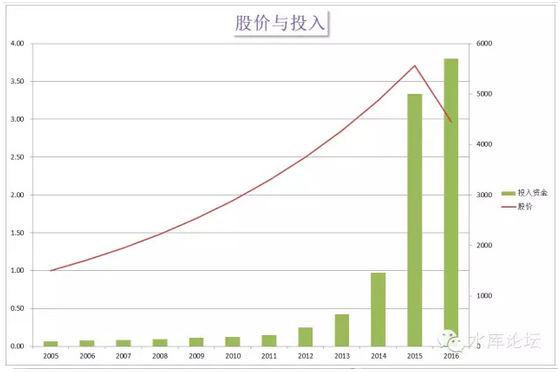
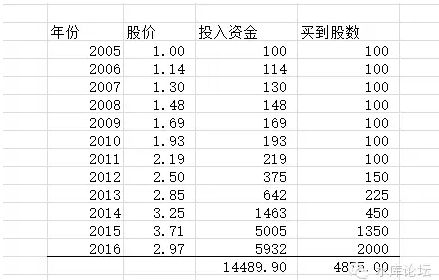
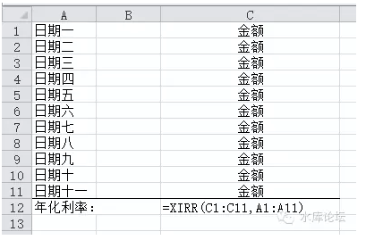
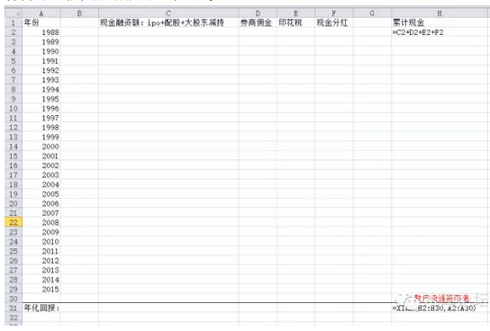
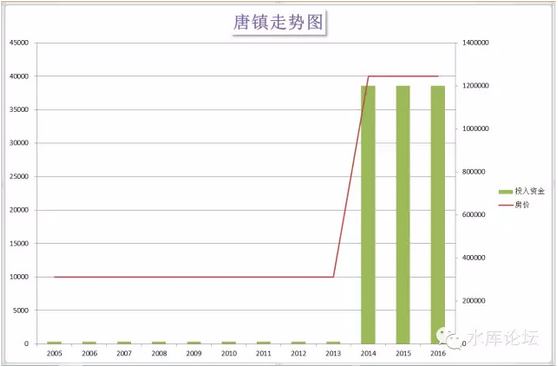

# 股市骗局（二）\-\-\-\-- 回报率 \#2920

yevon\_ou [水库论坛](/) 2015-05-02

股市骗局（二）\-\-- 回报率 ~\#2920~

迄今为止，关于股市回报率的所有文献，全部都是错误的。

\-\-\-\--yevon\_ou

一）王亚伟

大约一个月之前，微信圈疯传一篇文章《王亚伟：A股目前天时地利人和长期回报率很高》\[1\]。其中说，A股的长期复合回报有23%

当时我正在打海岛奇兵。俺LP兴冲冲地把这篇文章转发给我。我头也没回，直接说："SB"。

俺LP大吃一惊，"王亚伟哦，很有名的"。

我说我知道呀。中国公募基金第一人，易方达传奇的创始人。

但我更知道，易方达核心旗舰那个基金，是从来不开放申购的。

易方达卖给散户的那几个，后来回报都不怎么样。

但是，这些并不是重点。

重点是，我看都不用看。直接就知道他的算法是错的。整篇文章就是一个SB在忽悠一群SB。

象这种渣滓，甚至根本就不值得你停下来，少打二局海岛奇兵。

二）三重陷阱

总体而言，股市是一种智商税。炒股的人都是下九流，被人看不起。肉猪炮灰般一茬茬收割。

对于股市的回报率，他有三重陷阱。一重重套外有套，让你爬不出来。这三重陷阱是：

1）伪造数据

2）伪造算法

3）伪造估值

对于第一重陷阱，是理财顾问类陷阱。

你到新华书店去买二本"理财"类的书，其中会告诉你，1900\~2000年，美国股市的平均回报率能到12%

投资股市，构建以股票为核心的资产。是致富与保值增值的不二法门。

这一类陷阱的问题在于。他们截取的是AD.2000年的数据。

问题是，在此之后，美国Dow
Jones的指数回报就非常低。迄今15年，也不过才涨了70%。甚至都跑输了长期国债。

如果你取YTD
3年，5年，最近10年的数据，则道指的表现非常差。连带着整个"股市理财"业的基石也濒临崩溃。

我经常在微信，微博，朋友圈，看见各式各样"理财"类文章。其中无一例外，凡引用到学术或者股市回报时，皆截至到AD.2000年。

为什么，因为按照最新的数据输入，则整个学术界就崩塌了。专家们都可以切腹了。理财书籍也不用再卖了。股市也不再吸引了。

说真话，你如何去忽悠呢。

所以他们只能骗你。拿"截至到15年前"的数据来忽悠你。

关于这第一重陷阱，我们以前有一篇很长的文章《股市真正的危机》讲述\[2\]。所以这里就不再展开了。

本篇文章，会着重讲述陷阱2。

下一篇：《股市骗局（三）\-\-\-\-- 估值》，会展开论述陷阱3。

三）亏损

我们为什么讲王亚伟的文章是错的，看都不用看。

因为他的算法是错的。

王亚伟讲的是"算数平均"。即每只股票都买100股。可问题是，你不能这样算。

真实的算法是什么。迄今为止，公共媒体上所有关于股市回报率的算法，全部都是错误的。

首先，让我们来看一个图表。

这个图表完全是虚构出来的。他讲述的是一只股票。假设在2005年时，股价是1元。

此后，这只股票一路上扬，每年14%

按照图表中的红线。这是一个完美的指数上升轨迹，腾飞。

一直到2015年涨到3.71元。十年翻了三倍七。然后下一年小幅调整，跌了约20%

这只股票怎么样，在任何一本股市教科书中，这都是一只"完美股票"。

每年14%的持续增长，复合十年翻了三倍七。最近高位小幅调整，正适合吸筹买进，简直是建仓的良机啊。

任何一个股市基金经理，理财经理，都会口沫横飞。向你推荐这只稳健，难得一见的"蓝筹股"。

其中的绿色柱子，则对应你每年买入的资金。相应资金也是逐渐增长的，增长幅度设定为14%。但是最后二年略有增加。

好了。你的投资回报率是负数。

四）杀机

怎么会是负数呢？？

怎么不是负数呢。你自己再算一下。

累计十年共投入14489.90元，累计买到4875股股票。每股单价2.9722元。

最后收盘价是2.97元。你当然是亏钱的。如果算年化回报，大约是-0.09%

那么，一个如此完美的上升轨。股票日升夜升翻了三四倍。到最后怎么会是亏钱的呢？

奥秘出在了交易量上。

股市并不是一笔的投资回报。而是十几笔的投资总回报。

许多人喜欢沾沾自喜地念叨他们最成功的一笔投资。一般是第一笔，从1元到3.7元那次。

但投资是客观的。是无数现实的累加。断章取义那是心魔。

这就牵涉到股市"真实回报"的正确算法。

正确的算法，应该是XIRR函数。

XIRR是Excel的一个公式。他的格式如下；

将你一笔笔现金进出的日子输在左边，年/月/日。

金额输在右边。然后XIRR公式拉一拉，就知道你的年化回报率是多少。

五）中国股市的真实回报

中国股市的真实回报是多少。每次我看见"晨星"出品的投资建议就感到好笑。同样道理，王亚伟的23%也是狗屁。

迄今为止，市面上所有的股市回报文献，全部都是错的。

真实的回报，应该依循以下公式：

其中，按照每年投入现金，散户每年投入3000\~5000亿现金不等。若干年后，散户一共获得多少流通股市值。

IRR拉一拉，得出来的才是真实的回报值。

这个值是多少，我不太清楚。因为近期股市4500点，估计能获正值。但也不超过3%每年。

为什么我们说迄今为止，所有的股市文献，对于回报率的计算都是错误的呢。

因为迄今为止，从来没有一个学者是按照IRR法来分析的。

每年从股市总融资多少，印花税多少，总佣金多少，现金净流入多少，这些本应该是宏观数据。随手可得，每一家媒体用心转载的。

可我们面临的现况是，几乎没有人做这一方面的数据。

国家，有意无意地，似乎也在隐瞒和混淆这一方面数据。

所以我们暂时无可答案。如果有证券业内部人员，请帮我填好这个表。并告诉1988年迄今，中国股市的真实回报是多少。

参考文献《A股市场的真实回报率是负数，每年-20%》\[3\]

六）注定的输家

翻开随意二本"理财鸡汤"，简直让人恶心得想吐。

晨星评级，以无比肉麻的姿态说，1988年中国股市开场是100点。这么多年，投资股市累计可以翻45倍（4500点）。年化回报率16%不止。

真的有这么高么。那也不会有如此多的人亏损的。哪怕扣除交易手续费也不够。

真实的情况呢，在1988年100点的时候，能够买入股票的人很少。

而到了6124点，当中石油最后一轮融资的时候，现金抽血很厉害。绿色柱子很长。

正是在这样的基础下，我写下了《A股市场的真实回报率是负数，每年-20%》

股市是博弈的。

正是因为庄家准备高位配股，他才会把指数扯这么高。

如果没有傻瓜，庄家甚至都不会发动牛市。

所以回报还是负数。

[IRR走出来的回报率，就是实质的回报率]。

七）楼市的陷阱

最后，我们阐述一下，本id是一个讲炒房的账号。《水库论坛》是一个讲炒房的论坛。

那么，花费了许多的笔墨。讲IRR回报算法，和楼市有什么关系呢。

因为同样的骗局，在楼市中一样存在。

你去翻翻篱笆，翻翻天涯。蠢货一样存在。猪肉肥皂炮灰死之不绝。

在篱笆小白的嘴中，"郊区涨得快""浦东涨得快""联洋涨得快""新江湾涨得快""川沙涨得快""唐镇涨得快""仁恒涨得快""绿城涨得快"。

诸如此类的观点和认识，几乎已成了"共识"。每个人都在说，就快成政治正确了。

真实走势呢，这些板块涨得一点都不快。

如图。在漫长的时间内，唐镇都是10000/m。

但这个时候，唐镇的入货量很少。投资客也根本没有机会建仓。他甚至都没有好房子，好楼盘。

然后到了2014年时，唐镇一下子由10000/m扯高到40000/m。

在篱笆一群小白蠢货白痴的口中，唐镇就是涨得最"快"的板块。充分显示了郊区的涨幅力道无穷。

可问题是，你赚到钱了么？

没有。几乎没有任何人，没有0.01%的人群。是能以10000/m买入唐镇，然后赚四倍赢利的。

真实情况呢，是唐镇到40000/m开始放量。他在这二年之内，销售的次新房，比之前的20年累计还要多。

这不是地段涨价，这是你的成本高！

再然后呢，过二年唐镇跌20%，次新房在二手市场上，只能以32000/m获得接受。

于是买唐镇的人全部套牢，统统死光。

唐镇整个板块的回报率，是-20%。

而不是四倍。

同样的教训，一而再，再而三的发生。

在之前的岁月里，我们已经看到了新江湾，美兰湖，川沙，唐镇，碧云，联洋，浦东。

几乎每一个上述板块的楼市，都很难赚钱。都是一个"低位无量，拉高套牢"的状态。

以品牌开发商分，则最差的是仁恒，绿城，万科，中海。买仁恒河滨的人，几乎没有任何可能赢利。

这些品牌开发商，是最差的楼盘。

专业楼市投资，是一个巨大的话题。以后专题展开再讲。

下一篇是《股市骗局（三）\-\-\-\-- 估值》。

（yevon\_ou\@163.com，2015年5月2日午）

\[1\]《王亚伟：A股目前天时地利人和长期回报率很高》http://finance.sina.com.cn/money/smjj/20150330/093221841844.shtml

\[2\]《股市真正的危机》http://bbs.tianya.cn/post-develop-244920-1.shtml

\[3\]《A股市场的真实回报率是负数，每年-20%》http://bbs.tianya.cn/post-develop-263573-1.shtml 这是我很多年前写的一篇文章，核心思想是一样的。
