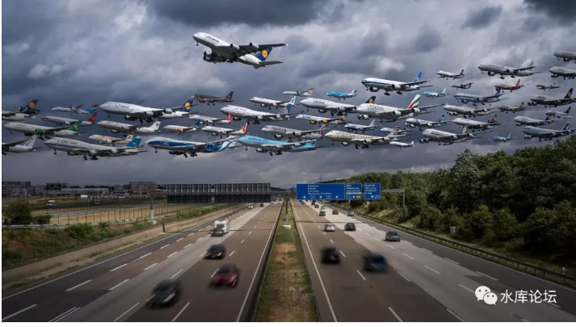
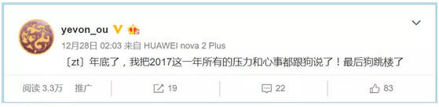
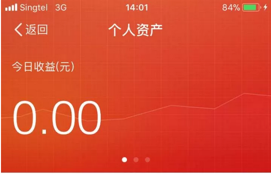
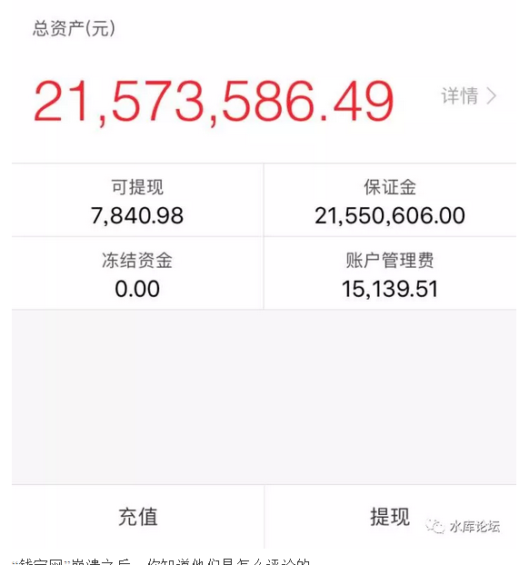
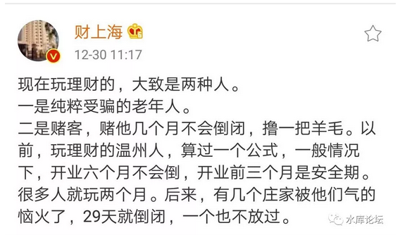

# 证券化的威力 \#2935

原创： yevon\_ou [水库论坛](/) 2017-12-31

证券化的威力 ~\#2935~
=====================

本篇为股市
==========

 

"你有多久没打开股票账户了"。

"好几个月。你呢"

"十年"

 

 

一）年终回顾

 

2017年的最后一篇文章，惯例应该是"年末总结"。

 

题目我都给想好了，还发在了新浪微博上预热。

可是我想啊，想啊。

憋啊，憋啊。撕了三卷稿。

俺那狗又从窗口跳进来了。"你烦心个\~啥"。

 

贱人就是矫情。2017对于地产，虽然是小年。可对于职业多军来说，依然赚得盆满钵满。

2016年的1/10，也是庞大而可怕的数字。

 

为赋新诗强说愁，"总结"留给其他几位小V去写吧。

今天继续讲"理财"的事。

 

 

 

二）中国股市

 

近日家母咳血，我赶回上海侍奉汤药。

因为昨天是2017年最后一个"股票交易日"，闲聊起来，最近的行情。

 

-   我母亲说，她把证券账户的密码给忘了。想登录进去看看，年终报表，登录不了。

-   我父亲说，他把开户行给忘了。忘记哪家证券公司。

-   我说，我没开户。

 

仔细想想，股票这玩意，从90\~00年代，绝对的"理财配置中心"。沦落到今天的地步，几乎无人问津。

 

昨天我问了一下，群里的五个人，有三个不知道2017年"上证指数"收盘在几点。

有一个说三千三。

有一个说3307.

 

 

但是你仔细想一想，时光回溯到十年前，情况不是这样的。

当时每天4:30，第一件事要看《谈股论金》盘后解析。到了晚上19:00，往往还要加看一场。

 

当年一个极瘦的帅哥，叫边风炜。本来是营业厅里的小弟。CBN录节目，临时叫他凑数。

没想到就成了大咖。一下子粉丝几百万。此后"出场费"，讲座费收到手软。

 

 

如果放在十年前，我一定可以说出"今日股市"的收盘点数。

不仅如此，还可以说出前二天，最近二周的主要行情。行业动态，要点新闻。

 

大概是从什么时候开始，我们整个家族，再也不关心股市。

再也不收听CBN节目的呢。

 

 

 

三）邮币卡

 

本来是一件很小的事。随口二句话，找不到股东开户卡。

哥哥向来喜欢胡思乱想，思路漂啊漂。又漂到另一件遥远的事："邮币卡"。

 

邮币卡，家里还有几张猴票。

J票系列，T票系列，小型张也屯了一些。最贵的有一联"红楼梦"。

 

如果说例子类似的话，那么家族里，是从什么时候开始，不再谈论"邮币卡"的呢。

我父亲曾经倾注了很多的心血在集邮上面，珍品也搜集了不少。现在邮票遗忘在哪里，阁楼？

 

 

中国的"集邮热"盛行于1980年代，以"猴票"为龙头带动，巨大的赚钱效应，此后的鸡票，狗票，就不那么值钱。

1990年初"熊猫"小型张发行1亿份，彻底砸死了这个市场。此后就很少听父亲再谈起集邮。

 

如果我们把"邮币卡"市场和"股市A股"做一个对比的话。

中国A股是不是正在重蹈邮票的覆辙。

 

 

在亚瑟王电影《Merlin》中，魔手莫林对抗邪恶的异教女神，始终无法取胜。全剧的最后一句话是：

"我们无法击败你，但可以遗忘你"

 

神灵依靠"信仰之力"而存活。亚瑟王时代的邪恶巫神，无法击败。

但人民可以"遗忘"你。

随着英国人普遍地信仰基督教，再没有人信仰德鲁伊。

女神黯淡于她自己的神国中，依然完美，却已无法对人间造成任何影响。

 

 

茅台近期据说创了新高。

坦白说，我不知道A股现在市值多少，茅台股价多少，P/E多少，近期行情由哪些龙头股拉动。

 

但斌声嘶力竭地拉高茅台，证监会也从不监管。

但是你无论多么波澜壮阔的大行情，我无法做空你，我可以无视你。

 

 

在我的朋友圈里，没有任何人在谈论股市，争论股市，研究茅台。

大伙关心的，都是吃吃喝喝，买房子，ofo小黄车，或者比特币之类的。

 

A股的客户基数在不断萎缩。按照2017年的数据，目前A股"月活"人数在2000W人左右。 

很多年以前，我们对这个数字没有概念。一直以为A股是"庞然大物"，惶惶不可面对。

可是很多年以后，经过了无数年互联网经济的洗礼。我们反而要问:"2000W月活"很高么？

 

你如果见过了9亿的微信，3亿的微博，腾讯游戏的1亿日活。

哪怕刚倒闭的"钱宝网"，都有500W真实交易客户。

A股的2000W人基数，很高么。

你丫不就是个大型的游戏公司么。

 

 

 

我们还记不记得"邮币卡"市场是怎么死的。

价格并没有崩溃，客户不断远去。人们将你遗忘。

 

最初的时候，邮票"热炒"，顶尖风口的时候，有五六百万人在集邮。各地集邮小组不计其数，"首日封"都能炒到高价。

 

而此后呢，邮币卡市场的死亡，来自于"用户"的不断流失。

人没有了，你这个市场，就只剩下自拉自唱了。

整个邮币卡市场，萎缩到只剩下一个"卢工"。再萎缩到卢工的一角。

 

 

同样道理，"中国股市"正在日益萎缩，萎缩成2000W人自拉自唱的一个小团体。

但斌可以把茅台拉高到697元/股，总市值8700亿。

没有问题，随便你唱。

关我屁事。我最多买二瓶茅台，零售涨一点点价。

甚至过几年，年轻人连"酱香白酒"都不愿意喝了。

 

 

当你沦为一个"小众"市场之后，你内里发生的悲欢离合，外人不需要知道。

你无论把茅台炒到多高，就象把猴票炒到无限高一样。关我屁事。

 

"股票"的用户，如风吹岩沙。

岩石一阵阵吹去，用户一层层流失。"月活"越来越少。

 

设想一下，"股市"玩到最后，如果月活只剩下200000人，20000人，200人。

那么整个股票市场，还有任何价值么。魔兽里的装备，有价值么。

 

反正你都不分红！

 

 

 

四）证券化的威力

 

知乎上有个贴：《商业史上有哪些降维打击的经典案例？》。哥哥一边看，一边笑。

https://www.zhihu.com/question/62241319

 

最近很流行一个段子，2017"康师傅方便面"，八宝粥，火腿肠的销量大减。

是什么击败了康师傅，是另一个品牌的方便面么。

不是，是"美团外卖"。

 

 

同样道理，是什么击败了中国股市。

是IPO，股改，还是八项意见。

都不是，是P2P。

（图片来自网络）

"钱宝网"崩溃之后，你知道他们是怎么评论的。

他们说，"张小雷成功地把理财软件，做成了证券软件"。

 

因为钱宝网一直有各种各样的投资项目，你可以切换了去投。

但是提钱很不友好。也不建议你提现。

 

因此你每天都可以看着存折账户，"账面"资产又涨了多少多少，钱宝网又给了你40%的回报。

硬生生地，把"虚拟资产"做出了炒股的感觉。

 

 

 

中国股市一文不值。抛去坏账累累的银行股，中小股平均PE=80倍。

任何一家年赢利二三千万的公司，一旦上市，就是百亿市值。

这样的股票，你去买，你傻呀。

 

但是，为什么股市在1990年代，可以"红红火火"，甚至成为万民瞩目的焦点呢。

因为人民真实的需求，是博彩的需求。而不是投资的需求。

[真需求]在哪里，千万不能搞错。

 

 

买股票的人，全部都是冲着"涨停板"去的。

长持分红，持有一年，红利不足0.6%，甚至连"买卖一次"的印花税手续费都不够。你傻呀。

 

虽然每个人嘴上都说"价值投资"，但股市真正的用途，是"博彩"。

每个人都是冲着博差价去的。证券化=合法的赌场。

 

 

我们知道，人民对于"赌博"的需求是非常大的。

赌博是基本需求，和"吃喝拉撒"一样，属于底层人权的。

澳门的博彩业，每年几千亿的赌收。哪怕所有人都知道，这是一个负和游戏，但并不妨碍人类兴高采烈去博彩。

 

在漫长的1990年代，"股市"是中国唯一的"合法赌场"。

进去看K线图，"技术"好的赚技术不好的钱。所谓技术分析，就是赌博。

 

IP因为唯一而集中

 

 

进入了新世纪以后，首先人们发现京沪的房子，"资产性"浓厚，凡是买了房子的人，这辈子再也不会回股市"不公平赌场"了。

其次，强二线四小虎，又开涨了。

其次，机构发现国债期货打开了。

 

再然后，2013年之后，神州大地P2P遍地烽烟。

P2P核心就是一个合法的"博彩业"。

 

每个月一个涨停板。资金放在"e租宝"里面，只要不崩盘，一年就翻翻。

问题是，你知道庞氏骗局能维持几个月么。

对于博彩"需求"我们一定要理解清楚。

 

-   首先，他是一种生理需求

-   其次，他是有限度的。

 

就象采矿一样。矿是会被采光的。

10亿国民，不会每一个人都好赌，好赌的人也有分寸，整个市场的容量是有限的。

力分则弱。

 

 

 

五）结语

 

2017年的风口，或许是Cryptocurrency（数字货币）。

数字货币的鼻祖，是比特币。比特币有强庄，一年之内，把单价由1000美金，拉高到了2万美金。

 

相应的，也带动了一批"山寨币"，跟风人群甚众。

整个"数字货币"总市值，由年初的200亿美金，暴涨到5700亿美金。

 

 

对于数字货币的估价，我态度一直明确：\$1

一美金一个。可以做成装饰品，卖给旅游纪念网点。

 

"数字货币"可以走到今天，其实质也是"不受监管的证券化"。

因为证监会实在太腐败，婆婆太多，监管太多，捞钱太多。

全世界人民联合起来，大家搞一个"交易所"。聚众赌博。

 

 

价格炒高的原因，也是因为"证券化"。

只要证券化，可以买卖，就可以博差价，就一定会兴风作浪。

天底下任何一个赌场只要能开张，就不愁疯狂。《证券法》利益太大，大过石油业。

 

所有"币圈"的人，有哪几个懂技术细节。

吹吧，还不是冲着涨跌去的。

 

"数字货币"是一个很好的试验场。正好可以看见，在彻底没有"监管"的环境中，泡沫可以成长多少倍。

因为他是"指数涨"，因此将来跌的时候，也不是跌-50%，腰斩就止步。

而是要跌去99.99%

 

 

哥哥写了这个多，总结是啥观点呢。[IP过气](http://mp.weixin.qq.com/s?__biz=MzAxNTMxMTc0MA==&mid=2651016221&idx=1&sn=e5cbba3a6ecbe429d21659db6f5501e1&chksm=80721a0eb705931888fe34ed1d620e32aa77ff9154e0adc78d342b0cee1b3bac70ab331959d6&scene=21#wechat_redirect)，[掀桌子的一代人](http://mp.weixin.qq.com/s?__biz=MzAxNTMxMTc0MA==&mid=2651016196&idx=1&sn=ecdfe9c838fdb924d9d095dd2c686f48&chksm=80721a17b7059301ffa24a916e89fceb7e62eff37b18bd617a5af77cc33e4e34d4e9f9e5412c&scene=21#wechat_redirect)。  

我对A股很悲观

随着技术的发展，赌场总是越来越多。

老赌场没人去玩的。 

 

 

（yevon\_ou\@163.com，2017年12月29日暮，别墅中）

 

 

上次次文阅读不足。

这次是赔的一篇广告，没钱收

