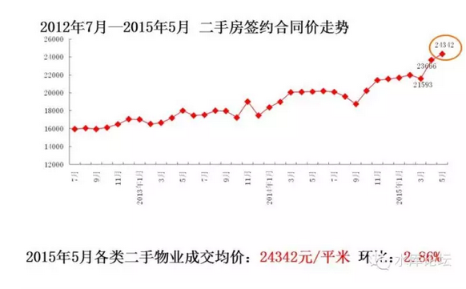
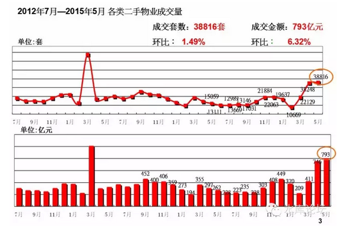
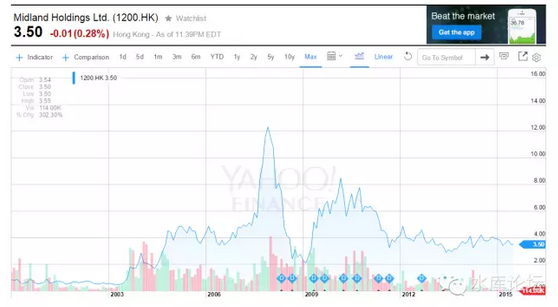

# 中介篇（一） \#2940

yevon\_ou [水库论坛](/) 2015-06-22

中介篇（一） ~\#2940~

水库论坛订阅号停了二周，因为我们花费了巨大的心血写《拜金女郎》。大约相当于八篇的篇幅。

按照流程，接下来应该继续写Marketing之楼市分类。不过纯学术的东西通常阅读的人比较少。所以我们还要写一些快"术"的实用技巧，来吸引人气。

参考文献 \[1\]

一）谎言的世界

中介这个行业，用一句话概括，就是"以上全错"。

中介是一个谎言的世界。这是一个最基础的概念。一定要牢牢记住。

中介是一个谎言的世界，谎言无所不在。从预备、接触、带看、交易、收付、收尾，谎言无所不在。每一句话他都有可能在骗你，圈套中还有圈套。

最终他用谎言构织了一张大网。这张网是如此地庞大与复杂，甚至象《Matrix》一样构成了整个幻境。让你分不清真实与虚幻。

这张网他们不仅仅对外骗，骗客户。对内他们也同样骗，骗员工，骗同事，员工骗上级，区域骗总部。

对于整个故事，因为实在太复杂，太漫长，我们需要拆成几篇篇幅。

二）成交量

中介靠何而生。靠的是成交量。

让我们来看二个舆论媒体上的典型例子：

A．我走近一家中介店，还没到门口，店员就热情地冲出来了。这说明房价就要跌了。

B．中介店门可罗雀，街上又关了二家。说明房价就要跌了。

C．中介天天在网站上鼓吹房价大涨，因为这样他们才能赚更多佣金

应该说，这三个观点都是错误的。

中介靠何而升，靠的是成交量，靠的是"量"。价格涨跌个百分之二十，对他们其实影响不大的。

职业炒家最关注的是"价"。价格波动20%，就是天与地的生死决战。而中介不关心价，他们只关心量。

"价"和"量"，这是一个很核心的基础观念。并引发了以后一些列的展开演绎。

三）中介的量

中介能走多少量。一个中介经纪人，一个月可以做多少笔成交。

我让人来猜；

最初的回答是30笔。

然后是10笔。

然后是3笔。

我告诉她是0.25笔。

你没有看错。就是0.25笔。平均每四个月才能开一次单！95%的时间在睡懒觉。

上海大约有15万名中介从业人员。分属于12000家中介店。

但是上海每年的二手房成交，仅仅只有18万套。（中介80%，手拉手20%）

也就是说，每人每年1套。

事实上，绝大多数人并不了解这个社会底层人口的运行规律。中介，快递，外卖，并列为外来底层人口的三大落脚行业。

目前，上海的中介行业，开出大约是2000元+高提成，或者3500元+低提成，二种方案。

你假设一个外地三本的大学生。在江西湖南之类没听过的大学。他们来上海可以干什么。

中介，中介是给他们第一碗饭碗。安生落脚的上岸饭。

一般中介公司，都是三个月的宽限期。第一个月培训，第二个月扫街，第三个月上班，三个月不开单自动滚蛋。

如果你说你很努力。可仅仅是运气不佳怎么办。

那也照样滚蛋。因为这说明你很霉。而在中介行业，"霉"是一个高度犯忌讳的单词。

"运气也是一种实力，而且是很重要的实力"\-\-\--李察·阿克蒙德

这三个月时间，公司是发给你最低底薪的。

那么小伙子就可以靠底薪和路边摊，撑过这三个月。三个月以后，不妨碍你再找家中介公司再混三个月。而且好歹，你也算有过"工作经验"了不是。

所以，在大上海求生存是很容易的。任何一个20多岁的年轻人，在上海都可以生存活下来。

这是中介行业的第二条规则。中介都是"素质很低"的。低门槛低素质。

那么第一条规则是什么？？？中介行业全都是谎言！！！重要的事情要讲三遍，讲三遍，讲三遍。牢牢记住。

言归正传。在中介行业，大约80%的人都是这类"学徒"。三个月期满自动滚蛋的。

在中介，怎样才能算一个资深人士？

过去的行规是，如果你能够撑满二年。你就能当店长。

没有看错，二年。

只要你能活下来二年。你便已经如此地稀缺。全上海12000家中介店，但可能店长的人数比店面少。

所以中介狗屁不懂。相对于职业炒家动辄10年以上的经验值，中介才是真正初入行的菜鸟。我常说我比你们老板的老板还要资深。

在中介这个行业，150000从业人员。

90%是菜鸟。

9.9%是二年级店长骨干。12000人每年成交4万套。人均0.25套/月。

0.1%是精英。

四）同事间的欺骗

你去和信义房产的小伙们聊聊，刚入行的小朋友，他们会和你说，"服务态度是很重要的"。

据说有一个衣衫平凡的老头子。晚上九点半，跑到店里面。时间这么晚，衣着又很普通。大家都很懒得理他。

这时，只有一个刚入行的小伙子迎了上去，耐心接待。

没想到，这个老头子是个亿万富翁。很爽快地就买了三套别墅，小伙子赚了几十万佣金。同事们羡慕得要命。

这真是一个很感人的故事。富有浪漫传奇色彩。

唯一的美中不足是，你认识的中介朋友比较多。过二天你又和德佑房产聊了起来。

德佑告诉你，他们分行里的一个小伙子。坚持到晚上21:30，结果来了一个衣着平庸的老头子............

臣信房产告诉你，刚入行的小伙子，来了一个老头子............

太平洋房产告诉你，来了一个老头子.........

永庆告诉你，来了一个老头子............

你再仔细问下去，你会发现这个老爷爷光顾了上海的每一家中介。在每家中介都买了三套以上别墅。而接待他的，永远都是一个"新入行的，热忱的小伙子"。

这是什么呢。中介的欺骗是无所不在的。对外骗客户，对内他们连自己人都骗。

这个故事的意义，就是告诉你；"老老实实加班到21:30，看见一个衣着平庸的穷老头子也要热情迎上去"。

五）中介的殷勤

回到之前的话题。如果你在中介店门口盘驻二分钟。不，盘驻30秒，然后你看见中介慌慌张站起身，跑出来了。请问这正常么。

很正常，不这样才不正常。

因为哪怕相对于那些非常非常资深的"店长"级老鸟，他们也要4个月才能成交一笔。

而许多菜鸟，很可能一辈子都没开成功过单。

这样情况下，任何一个客户都极端珍贵的。哪怕你只有千分之八0.083的购买意向，换算成四个月120天，就是100%。

所以站在中介店门口的客户，往往连0.83%的购买意向都没有的。

你能站三十秒，购买意向至少要5%。中介恐怕是要激动得浑身发抖了。

如果门口有二家中介点撑不下去了关门。意味着什么。

什么也不意味。

其一，上海的中介本来就是远远过剩。这个行业根本不需要15万从业人员，12000家店。

只不过现在佣金高得不像话，人力又便宜得不像话。市场又扭曲得不像话。才会有这么多中介街铺。

对于很多夫妻小店，三个月成交一笔就足以活下去。

其二，中介店铺具有严格的"季节性"。

很多人并不了解这件事。成交是具有批次的。

譬如2005年"营业税"出来之前的市场。当时最大的成交，发生在交房之后的第一年。

从房产商交房，到第12个月，大约会有25%的房产被交易换手。而从第13个月开始，就急剧减少。后来几年加一起，都没第一年累计换手多。

出现这种情况，有许多原因；

1）2002\~2005房价大幅上涨，至交房时往往都有60%以上涨幅。业主有获利回吐需求。

2）有大量温州购房者。

3）较低的交易成本。

所以当时的行情，一拿到产证，第一年集中成交。楼下街铺几乎80%以上都是房产中介。

而过了13个月以后，中介店面逐渐撤退。逐渐削少。最终只剩下1\~2家。以做长期持有存量客户生意为主。

我敢很负责的说，任何研究中国"房地产泡沫"的砖家，都没有提过这个现象。

再说一句题外话。很多大型中介公司的划分，都是上海分五块。

浦东，浦北，浦南，浦西，浦中。

请问，那个区业绩最大。业绩最重要。

很多人会想象中的说，市中心，内环线。也就是浦中大区。

全错。中区的业绩最少。一般只有另四区的零头，10\~15%左右。

因为市中心虽然矜贵，但人家不买卖房屋。黄浦，卢湾，静安的豪宅持有者，可能十几年都不会交易一次。

以往的绝对大户，从来都是闵行，普陀，浦东。最近因为北四区新房供应较多，宝山，闸北的量也上来了。

但总而言之，换手量最大的是新房交房第一年。哪里有新房，哪里就有交易。

六）中介的佣金

在香港，美联的股票一直被誉为"地产涡轮"。

有一种说法，买不起房子就买地产股。

想用杠杆买房子，就直接买美联。

美联是什么，美联是香港四大中介之一。中原最大，约占50%市场份额。但中原其实是一个联合体，无数兼并收购而来。

美联的份额在20%左右，但他是唯一的"地产中介"类上市公司。

为什么说买美联呢。因为美联的股价，随地产行情波动非常之大。

2003年香港楼市最低迷的时候，美联股价仅只有0.50元一股。

可是到2007年复苏顶峰时，他已经涨到了约12元一股。

可见，美联的股价涨幅，远远超过了正常的地产股，也超过了房价涨幅。

这是为什么。因为他是三重立方m³。

-   当楼市上升时，房价会张，佣金同比增长，第一个10%

-   楼市旺时，交易较多

-   楼市旺时，买家给的佣金较大方。折扣较少。

可见，他是三个正比增长，受益三次方。

当楼市上涨10%，美联（1200.hk）物业的业绩就会上涨30%，股价冲天直上。

如果你赌楼市涨，你就直接买美联。

七）美联的末日

如果我们看美联集团的股价，它在2007年冲到了最高峰，大约12元/股。

但之后又跌下来了，急跌，再也没有翻身。到目前也就是3.50元左右。

这又是为什么呢。

因为从2007年开始，香港政府陆续出台了一系列："仰望星空"政策。

比较著名的，譬如针对内地购房者的特别印花税，双重印花税，港人港地。后来追加的惩罚性印花税。

比较少被国内媒体提到的。则是贷款的限制。700W以上物业只能贷款五成，出租物业再减一成，房主人不在香港再减一成。

700W港币在香港能买什么房子。什么也买不到。

就如我们后面在《宏观调控》卷会讲到的。所有的调控政策，只会推高房价，对消费者不利。让老百姓更加买不起房。

"价"是肯定越调越高的。

但是炒楼是炒楼，中介是中介。中介和炒楼是完全截然不同的二个行业。

对于中介行业，他们最敏感的是"量"。

最敏感的是交易成本。

CY梁把交易成本搞得这么高。最高可以高达33%，那哪里还会有交易，哪里还会有佣金。

没有交易，中介死光。所以美联的股价直线下跌。

在这里，中介和炒家的利益是分歧的。他们本来就是二个不同的行业。

宏观调控之后，房价大涨。炒家虽然厌恶，但还能活得下去。

但5.5%营业税，对中介就是灭顶之灾。十万下岗由此底层。

2005年秀相加营业税，当时中原地产老板第一个跳出来，"全国人民喜迎税收上涨"。

我不由得叹息说，营业税加上去，受影响最大的就是你们中介。自干五做到如此兴奋，那所有罪也都是自找的了。

八）新童话传说

最后，我们照例用一个爱情故事来结束本篇第一节。

话说公司里某帅哥，那是长得玉树临风一表人才。在香港的黑矮岭南人人种中，绝对是一个异类。有三分金城武的味道。

他大学里谈过一个女朋友。毕业就分了。后来找了一个小明星。是香港小姐评选第四名，得过最佳礼仪小姐。

他女朋友本来是家里独女。大学毕业后又添了个弟弟。不过弟弟很小，目前仅7\~8岁的样子。她一个人辅佐父亲的公司。里里外外大姑奶奶般的打理。

故事到这里还算是正常。然后大帅哥说他和小明星分手了，实在是花得太厉害，供养不起。

他大学里的女朋友想和他复合。二个人想结婚。男人少奋斗二十年。

唯一的烦恼是，女方公司员工太多，摆酒摆不下。

我问他多少文职员工。他说香港本部10000人，600间商铺。此外还有北京、上海、广州、深圳、珠海、重庆、成都、贵阳等分公司。

我吓了一跳，问"香港上市公司，干哪行的"。

他说："中介"。

（未完待续，2015年6月22日午）

\[1\]《浅谈中介骗术一二三》http://www.shuiku.net/forum.php?mod=viewthread&tid=4890&extra=page%3D1
