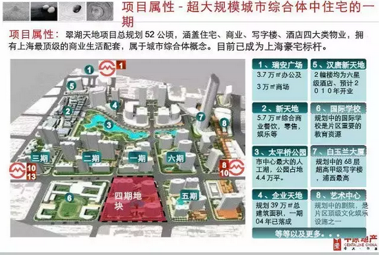
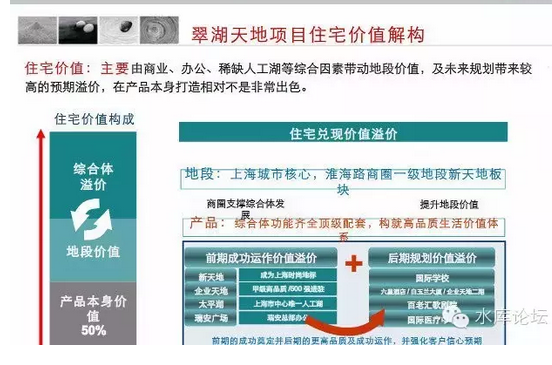

# 中介篇（二）\-\-\--房源 \#2950

yevon\_ou [水库论坛](/) 2015-06-23

中介篇（二）\-\-\--房源 ~\#2950~

在很久很久以前，中介是分为寻找房源和寻找客户二个组的。

一） 房源组

中介要促使成交。他有二个方向可以努力：

1）更豪爽的客户

2）更便宜的房源

你门店开在那里，就是等顾客上门。最理想的是进来一个土豪，看啥都便宜。

随便聊几句就下一排订单。

优质的客户就意味着金矿，人形ATM。就象温州富婆一样。

但是，中介还有一个努力方向。更便宜的笋盘。

譬如，你找套内环线的房子，只卖5000元/平米。或者找套汤臣一品，卖100万元/套。

那么，你的客户会从人民广场排到老西门，几十组人疯抢一套房子。

发掘到了笋盘，也就意味着大把握成交。意味着大把握获得佣金。

寻觅优质的房源，和寻觅优质的客户一样重要。

这是中介发展的二大方向。

二） 古典时代

很久很久以前，我们的生态圈不是这样的。

当时，中介主要和物业勾结。

每当一个新小区入住，就会有中介找上物业经理。物业处有所有业主的电话，职业，身份证。按一个行规的价格卖给中介。

另一个消息来源，是KFS的售楼组长。许多中介都会和代理行保持良好关系。

中介会顺着电话，一个个打给业主。问你想不想抛，以什么样的价格抛。

中介会小心地搜集能见到的一切信息，把每一个新的业主信息登记在小本本上。

在中介的内部，他们有明确的职业划分。房源组和销售组。

销售每卖掉一套房子，都会给房源组分佣。而且地位和金额都不低。

但是，随后的一场暴风雨，把这一切都毁了。

三） 掠夺

2006年时，上海市政府出台政策法规，要求所有的二手房挂牌。统一先登记在fangdi.com，然后才可以对外销售。\[注\[1\]\]

当天晚上，我和几个四大的P在新天地吃饭。会计师们纷纷表示支持政府的决定。认为这样可以建立一个"公正，透明，公开"的市场。避免二手房市场的价格不透明，恶意跳价等等现象。

我幽幽地说道，"几位身为四大的高级Partner，如果有一天离开了四大，你们还剩下的最宝贵资产是什么"。

几个经理们面面相觑，然后说："资历"。

"经验""工作经历"。

我冷冷地继续问，如果老板请你去，纯粹因为你的个人能力。那你最宝贵的资产是什么，凭什么说你是从四大出来的。

"你最宝贵的资产。其实是你的小本本。上面记录着你这些年接触过的客户，CEO和CFO，他们的电话，联络方式，喜好和搭讪方法"。

"信息，信息才是一个高级管理人员最宝贵的珍藏"。

同样道理，对于房产中介来说，信息就是宝贵的财富。

获取一个电话号码，平均至少需要人民币30元。

如果你要上门拍照，每一组成熟详尽的含照片数据。至少价值200元。因为这至少意味着2个员工，1小时以上的工时。

对一个业务员来说，他最宝贵的就是他的客户租户信息。对于一个公司来说，他最宝贵的就是房源信息。

"fangdi.com是一家商业机构，不是政府部门。你今天强行要求全市的中介，无偿把信息全部都登录到fangdi.com上去。你这不是抢钱是什么"。

事情的解决方案，自然是富有中国特色的幽默喜感。

信息就是财富。IP就是金钱。

各大房产公司自然不会配合，谁也不会免费地把信息共享给fangdi.com。

后来上海市政府强行规定，任何二手房交易，必须先把房源公示在fangdi.com上面十四天，然后才可交易。

于是各大中介公司，约好了客户，签好了合同。再把房源上传公示。无非多一道手续，拉长点交易流程罢了。

再之后，上海市政府也觉得无趣。Fangdi.com就这样不死不活地挂着，前几天还见过二个该公司的人。事业单位。

四） 生态的摧毁

Fangdi.com事件并没有平息。但其背后，则是对应着整个业界生态圈的破坏。

自从2006年fangdi.com时间后，各大经纪公司，不约而同地，开始削减了"房源组"的规模。

因为现在政府不找你麻烦。而你做大做强之后，始终是一个法律上的隐患。政府告你隐藏数据库怎么办？

之后各大经纪公司的做法，是扩大"销售"部分，削减"房源"部分。强大四肢而萎缩大脑。

宏观调控之后，交易量骤减。又加上一连串削减成本的要求，于是房源组越发萎缩。到今天已经微乎其微了。

今时今日我们接触的是什么，是安居客，是房多多，是Q房，是搜房，爱屋及乌，德佑在线。

他们共同的特点，一是互联网，二是海量房源。

这是一件让人完全无法理解的事情。我很难想象一家网站，如何拥有上海80万，全国1000万条房源的。

众所周知，房源是需要维护的。因为房价时时在变，房源时时在变。最多3个月，报价就会不同。有时候连房屋状态都会不同。

找到一个真实的电话，再打过去，这些都需要成本。维护一条真实的信息，每个月至少需要2\~5元。

可是，许多网站，一出手就是几十万条房源，几百万条全国。

这么多的房源，他们怎么维护的。"天下房源一大抄"。

五） 抄袭的时代

现在的网站，基本就是一个大杂烩。

你譬如某中介有个15万条的数据库。另一个中介有个20万条的数据库。拿过来拼在一起，就成了35万条房源。

再找个机器爬虫，爬在网页上一条条搜。于是数据库都成了大家拷贝来拷贝去，谁的都一样。

建立一个1000W条房源信息的大网站，可能只需要三个月。而成本几乎为零。

这样的信息系统建立起来，结果是他非常地"脏"。

房源需要维护。你不要责怪中介每天18:30吃饭的时候打你电话，但其实房源一定频率的更新是必须的。

上海楼市，大致是每个月1%的上涨速度。十分稳定。任何一个数据库，如果不更新的话，那他十二个月后就彻底没用。

最近我们看到许多用"大数据"分析房地产市场的文章。我们可以肯定地说你没用。

不是分析的方法没用。而是数据本身太脏。

"房源组"已经被解散了许多年。当这套体制，这套系统没有建立之前。你只在垃圾堆里分析，再怎么也找不出黄金的。

今时今日，数据隐藏在一线业务员的小本本里。而不是中央电脑数据库里。只有解放自由，让贩卖信息的可盈利可图，整个生态圈才会好转。

链家近期拿出4亿现金，希望能更新3000万条真房源。这无疑是走在正确的道路上。他们也被"脏"数据折磨得死去活来。

但可以预言的，他们仍然会是失败。因为他们还是轻视了这个问题，10元/条的预算根本只够完成一期工程。

整个产业的30%收入，要投入房源维护，才能差不多把房源更新到最新。

六） 安居客的时代

直到今天，篱笆上的一些小白，仍然坚持地相信，"安居客比真实价格低15\~20%","取最高的价格，差不多就是真实房价"。

这真是一个绝妙的主意。看来我只要在网页上加一个小插件，每次App查询时自动乘以1.15倍，那安居客就是精准的，完备的，一致的？

事实上，任何一个学过统计学的人都知道。如果乘以1.15就精确，所有房源"步伐一致"地矮一截。那他根本不是混乱，而是绝对的精确。

真正的混乱是什么。

有一些房源高，有一些房源低，有一些房源低估15%，有一些房源低估25%，有一些房源低估50%。问题是，你还不知道那些是低估15%，那些是低估50%的。

这才叫一团乱麻。连做反向指标的价值都没有。

小白们从来没有经营过一个企业，从来没有操办过一个实体。他们不知道"精确的错误"有多难。

如果Anjuke上所有的房源都是85%的价格。那意味着他每一条房源都得到过核实，每一个客户都打过电话，每一个跟进电话都是确实的。

所有的行政区，所有的板块，同比例同幅度的更新，同尺度的犯错。

这么精确的事情。他根本做不到。

所以实际的情况是，他有的数据低估15%，有的低估25%，有的低估50%，以至于完全没有任何参考价值。

一团乱麻。脏到尽。

七） 德佑在线

讲了这么多务虚的话，我们来点实际的。

譬如，长期抱怨中介的电脑系统完全不准。那我们来实际举例。

很多人都知道，我住在新天地复式。再熟悉不过了。

打开德佑在线www.lianjia.com，输入：\

（对不起以下内容不公开，全文请见隐匿版）

\[1\]《莫让行政公权跨越边界－－- 惊闻二手房网上备案制度》http://bbs.tianya.cn/post-house-39774-1.shtml
