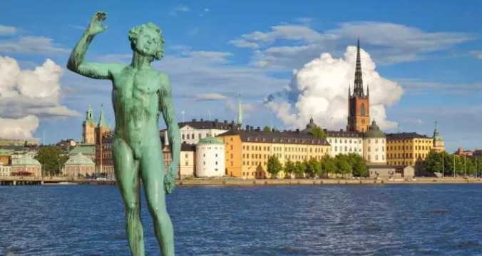

# 屌丝购房手册（一）\#300

yevon\_ou [水库论坛](/) 2015-09-28

屌丝购房手册（一）~\#300~

当一个移一代来到陌生的大城市；除了闯劲之外他一无所有。

最符合他利益的做法是什么，那就是不承认任何现有价值体系!

一）贫穷

屌丝兼具几方面的特性，例如"贫穷，野心，破坏，平庸，IB，粗疏"。

屌丝的行为，并非不可琢磨，相反很容易猜透。

利益是一切的根本。当屌丝们发出他们的呼声时，他们并非喜恶，而是为了利益。

当屌丝呼吁奔跑时，他们并非为了理想，而是为了利益。

当一个陌生的屌丝，刚来到大城市，22岁，大学文凭，一贫如洗，又穷又酸。那么，他们最容易发出的呼声是什么。那就是"不承认任何地段价值"。

因为任何[地段价值]，对他们都是一种[压迫]。

2004年时，曾有一个凯迪帖子，小年轻号召任何的地段价值，不应该"超过出租车的车资"。

作者声称，如果打车回家25元，每个月打40次。每年12000元。

那么A地一套房子，最多比B地高12万元。

最好的地段，和最差的地段，价格差不应该超过1200元/平米。

他这个说法，当然遭到了一致的耻笑。但却是有道理的。其背后，蕴藏着深刻的哲学道理，也就是屌丝不愿意为"地段"付费。

我们只会捍卫那些我们钟爱的，我们只会钟爱那些我们熟悉的。

YP屌丝，对上海毫无了解，当然更谈不上历史和喜爱。

对他们来说，房子就是一张床，拿来住的地方。甚至连生活社交活动都十分地有限。

这样情况下，他们为何要为"地段"付费。

而且，大城市的房价已经要如此之贵。动辄一套房子几百万元，而读大学收费\~屌丝骂到五毒俱全朱榕基短寿也不过三五万元。

你说，屌丝怎么会不恨房价，怎么会不希望房价降下来。

所以屌丝们的第一个呼声，就是对任何的"地段体系"不承认。

最好所有的地段都均一化，同样价钱。或者说和最差的旷郊同样价钱。

其背后真实的哲学思想，是贫穷。

二）内向

为了掩盖自己的贫穷，屌丝们想出了一整套手段为自己张目。

一个最典型的方法，是将对方贬得一文不值，将自己说得花好月圆。

譬如说，篱笆屌丝说起浦西的内环，大基调一定是这样定的；

"拥堵，尾气，倒马桶，贫民窟，涨不动，老破小"，不是爷爷买不起，而是爷爷看不上你。

而当他们说起自己住的周浦航头，则是"时尚，宽敞，环境，绿化，绝对没有化工厂，绝对没有高压线，垃圾焚烧厂纯属最无耻的谣言！"

有过一次，我和一个浦东帮吵架。对方问我："你认为老南市的房子，哪一天可以改造赶上联洋"。

我白白眼睛，"黄浦任何一套房子，都比联洋好"。

对方大吃一惊，"你说那些外墙斑斑斓斓的房子，也比联洋好？好在哪里"。

我说，"好在不象VVDR的家乡"。

中国有640个城市。如果论自然风貌，上海恐怕是垫底。

因为上海是冲击平原。既没有山，也没有海。市内连一个像样的名胜古迹都没有。

如果你要看"马路宽广""绿化成荫""山清水秀"，那你随便找一个江西，湖南的小镇，保证自然景观胜上海十倍。

没有污染，天天吃有机食品，没有交通堵塞，你根本不用来上海。

而为什么小城镇的地方卖2000元/平米，上海卖80000/平米呢。

因为上海是城市，是[都市文化]。

你来上海看的是什么，看的是人，是层层叠叠，密密麻麻的人人人人人人人人人人人人人人人人人人人人人人人人人人人人人人人人人人人人人人人人人人人人人人人人人人人人人人人人人人人人人人人人人人人人人人。

只有人多的地方，才会产生商业。只有人口密度达到千人公里以上，才会诞生复杂服务业。只有500W人口以上的大城市，才会诞生纸醉金迷。

我要的是纸醉金迷的生活，我要你山清水秀干什么。

上海最美丽的景观是"人"，是人山人海。

每一次我站在熙熙攘攘的人群中，我就感到兴奋，手心发热。因为我知道，这才是我的主场，只有在统计大数的人口中，我才能发财，经济学才能变成人民币。

全世界风景秀美的地方多了。但是大城市却有限。

大城市中心，才是唯一稀缺的地方。

只有在大城市，才有商战和风云，才有狂欢和爱恨情仇。

我又不是你们那种低级很Low的人，我要的是精彩的生活。五颜六色的一生。

只有在弯弯曲曲的小巷内，你才会接触形形色色的人。才会接触社会各个阶层。整个城市必须充分地多元化，你才能每一天都过得精彩而不同。

而郊区那些沉闷的，方块盒子状的，整整齐齐一块又一块的街区，萧瑟无边的落陌。\[1\]

那是怎样枯燥而又单调的人生啊。

日出日落，千篇一律，二点一线上班和公司。往前走五个街区，往后走五个街区，景色完全一样。这样的日子我一天也过不下去。

上海是魅力之都。他的精彩在于他象怪物巨兽城市的那一部分。而不是象外地县城"风景优美冰冷孤寂"的部分。

最后，我拍着对方的脸蛋说："知道为什么你没什么钱，而哥哥比你有钱得多么"。

"因为你太内向了。你只想过那种下了班赶快逃回家，然后躲在房间里死宅死宅的生活"。

"因为你向往孤寂，所以你赚不了钱。阿宅"

三）屌丝选房

人的童年生活，会对人的一生造成非常大的影响。

我们从小就生活在都市之中，所以我们对城市的大街小巷非常熟悉。对于逛商场，趴公车，办年货非常地熟悉。这都是日常生活的一部分。

我们可以接受老公房。我们倾向于住在市区，因为我们知道生活的滋味是怎样的。

可是屌丝是那种一只脚踏入城市，心却还在农村的人群。

他们对于城市生活，内心是有一种恐惧与隔离的。都市人的人潮与社交，让乡下娃子非常地不适应。他们宁可躲到郊区冷冰冰的水泥盒子中去，技术男死宅。

屌丝心中还有梦，屌丝是按"家乡县城加强版"在规划着自己的人生。而不是都市版。

屌丝买房子，第一点是贫穷。所以他们要往郊区买，地段是首先被牺牲掉的。

第二是梦想。屌丝要买板楼。打死也不买老公房。

因为买了老公房，你就一辈子住老公房了。这对屌丝的"出人头地梦"是一种否定。

而买板楼，"画虎不成反类犬"好歹也混个形似。谁知哪一天会旺起来呢。

其三是YY。屌丝特别喜欢买期房。幻想中的房子才是完美无缺的。现实中的任何一套房子都无法承受屌丝们的地命海心。

其四是颠覆。屌丝们创造了无数的新理论。来论证自己买的不是垃圾地段，反而是浦西人有眼无珠看不清大势。

第五是IB。凤凰男是家乡父老的期望。所以面子上的体面是一定要有的。屌丝男打死要买板楼，要买带小区的。他们要有面子的，而不是[最实惠]的。要买万科，仁恒。这让屌丝亏了不少钱。

第六是粗疏。屌丝不承认对他们的批评。

这些因素累加，答案就只有一个："超远郊新城品牌开发商一手期房精装修小户型现代生活派"。

至于这种房子赚不赚钱，那是另一篇文章需要讨论的事情。

四）颠覆之颠覆

颠覆这种事在历史上很常见。欧洲向来以宫廷油画为美，形成了非常严谨的画风。

可是1960\~1970年代，随着越战反战嬉皮士一代的兴起。年轻人大力疾呼"印象派画家"。把传统油画贬得一文不值。

印象派水平画风真的比殿堂派高么。恐怕也不见得。

这件事，你不是要听他们说什么。而是要看背后的暗线是什么。

暗线是，年轻人不承认任何现有价值体系!

既然现有的名画都在Old Money手中，那我干脆不接盘，把你贬得一文不值。

加州的地产市场，向来是以Beverly Hill比弗利山为高贵。

可是硅谷那些IT新贵崛起了以后，New Money并没有向Old Money买房子。

相反，New
Money自己找了块地。各大年轻IT精英们自己聚在一块，并宣称这是最好的地段。

凡事要看暗线。

暗线就是，既然所有Beverly Hill的好宅子都掌握在Old
Money手里，我干嘛要向你买呢。不承认任何现有价值体系!才是最有利的做法。

年轻人的颠覆是到处都有的。只要旧势力板结得太严重，就一定有人重建价值体系，另起炉灶。

只不过输赢很难说。至少目前在欧洲，印象派已经退潮。陷入"有价无市"，甚至根本没人肯买的境地。

另一场革命SCI统计分数，基本已经失败。

比弗利山时间还短。再看看结果。

当2003年联洋崛起的时候，他采取的是一种"否认一切"的态度。

联洋帮姿态之高，之趾高气扬，简直要踩到你脸上去。

"市中心一切地段都不足为道，联洋才是宇宙中心"。

他们的评估依据是，"老一派的价值体系已经过时了，上海的中心应该是依到世纪公园的距离"。

"绿化率是评价楼盘的唯一标准。联洋最佳，浦西最差。什么，崇明，呃，给我赶出去"。

"股市向好，住在联洋的基金经理是最大受益群体"。

"呃，联洋哪有基金经理，你是说基金公司里管茶水间的么"。哥哥掏掏耳朵说。

这就是外地人论坛发生的典型故事。过去十年，吵了无数架。上海人外地人外国人，真的是生活在三个星球上的人，不吵也罢。

所以，在这里，我不准备讨论联洋是不是[三流屌丝穷鬼贫民窟涨不动垃圾地段]的问题。

我想回答的是另一个问题；

\@傅蔚冈："为什么2015年唐镇猛涨，而联洋不涨"。

答："唐镇为什么要卖你面子"。

想当年，联洋以"颠覆者"的形象崛起。否定一切，打倒一切。不承认任何市区现有的地段价值。反正你只要粉丝足够多，光靠粉丝也能撑得起你。

可是，你既然是颠覆者，你就难免被颠覆。

唐镇崛起时，他为什么要卖你面子。联洋能把几十年文化底蕴的浦西都说得一文不值。唐镇干嘛要把才几年"底蕴"的联洋叫你哥。你联洋算什么东西。

当年高喊地段不可法，现在想起重申地段尊卑了，你精神分裂啊。

"下克上"从来没有善终者。颠覆者终将被颠覆。

此后浦东新开发的地块还有很多。孙桥，六里，龚路，赵行，哪一个都不会把你放在眼里。

（未完待续）

（yevon\_ou\@163.com,2015年9月28日子夜）

\[1\] 注：北京扫街百子湾有感
