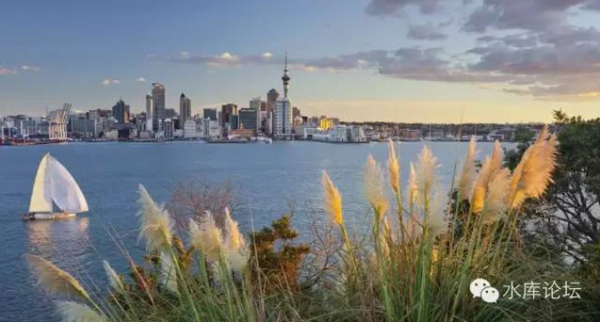
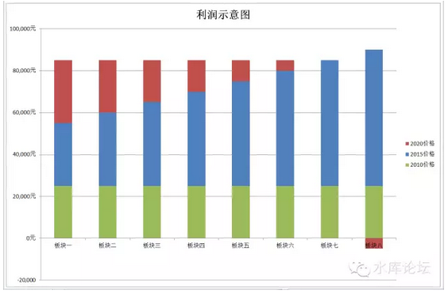

# 屌丝购房手册（二）\-\-\--以力破巧 \#310

yevon\_ou [水库论坛](/) 2015-09-29

屌丝购房手册（二）\-\-\--以力破巧 ~\#310~

英国最伟大的传奇君王\-\--亚瑟王，却不是现代英国人的祖先。

亚瑟王是Celts凯尔特人，5世纪古罗马帝国崩溃之后，日耳曼大移民。他依托长城防线，击退了一波又一波Saxon部落向不列颠岛的移民。（有据说是七次）

可是，无论亚瑟王如何英勇，武技高超，他最终无法抵挡滚滚而来的移民潮。在历史中陨落，今天的英国人是安格鲁撒克逊人Anglos-Saxon后裔。

一）买贵货

虽然我们并不同意"成本决定价格"，但我们要说的是，成本对价格还是有影响力的。

在国务院文件中，"城市化"每一个农民的估价是15W人民币。而在东部沿海大城市，这个标准要远远更高。

一般一个100W人口规划的新区，耗资至少5000亿以上。还不算"超支"部分。\[1\]

当政府花费了这么高昂的成本去建新城。等他拍卖土地的时候，"售价贵"，也就不足为奇的了。

但是，售价贵，不代表他卖得也贵。很多情况下，太贵了就根本卖不动了。于是新城就成了鬼城。\[2\]

在某些的情况下，偏贵的东西也能卖。这就成了上海浦东。

上海每年有约58W人口涌入，十五年内净增加了900W。人多了就要盖房子，城区要扩展，这是客观规律的事情。无可改变。

但是，政府选择了"非饱和供地"，也就是新供应\~\~我只卖给你浦东的土地。

-   连带着屌丝的"一手情结"。

-   连带着屌丝的"不服，颠覆"。

环环相扣，连锁反应，一起产生了"卖贵货"的现象。新移民们用了[高于公允合理价格]，买了一块郊区没开发的土地。

二）涨幅

浦东涨不动。

时至今日，我不明白为什么还有人喊："浦东涨幅快""浦东涨幅远超浦西""LZ错失大牛市"。

过去的十五年中，涨幅最高的，或许是桃浦万里板块。许多人不知道这个地方，在上海铁路西站附近。紧贴着铁路线以北，是上海著名的脏乱差地方。也完全没有任何小白领屌丝涌入。

万里的涨幅，大致是1999-\>36000，十五年涨了18倍左右。

此外，奉贤的西渡，1300-\>23000，十七倍。

宝山天馨2200-\>33000，十五倍

莘庄闵富2100-\>36000，十七倍

九亭1800-\>28000，十六倍

卢湾斜土路4500-\>55000，十二倍

联洋5000-\>55000，十一倍

源深6000-\>72000，十二倍

碧云14000-\>50000，三倍

小陆滨江18000-\>90000，五倍

这张清单可以列出很长。我们无意和你争论数字的细节，但有一点是非常明显的。"浦东既不是最强的，也不是平均强的，甚至是偏弱的"。

为什么，因为浦东的起价太贵。

"浦东起价太贵"这是一件非常致命的问题。以致于到今天都没有解决。浦东以新房为主，一手房一开就很贵，从而完全没有投资的价值。

作为职业炒家，LZ在上海各个区都有大量房产。可唯独浦东的物业很少，和浦东占全市的份额完全不成比例。原因就是浦东太贵，一直找不到低价入手点。

很多人都误解了"价格"的意义。你们所谓的涨价，并不是涨价。而是你的成本高。请看下图；

这是一张纯属虚构的示意图。其中板块一，板块二，板块三............板块八，你可以理解为完全类似的地段。譬如绕中环等半径的一圈。

在最初的时候，大家都是差不多水平。如图中绿色柱子。

而到了2015年，部分地段已经涨得非常离谱。如图中的蓝色柱子表示。

这时候，一些新入行的小白会激动万分，"你看，你看，浦东涨得快"。赶快入场。

这是涨得快么，不，这是你的成本高。

因为真正有意义的，是图中的红色部分。也就是他最终可以涨到多少。红色部分才是你的差价利润。

对于绝大多数的"同半径"板块，其实他们最终2020年，2030年的价格是差不多的。

因为建筑的工艺是有限的。甚至越晚开发的板块建筑越好。所以从来不存在"地段的逆袭"。

联洋帮最初气焰嚣张滔天，狂妄说："联洋是超一流地段，大宁是三四流地段"。可真的等大宁开发起来，远远把联洋踩在脚下。耳光三四个扇上去，还要踩上一只脚。

所以，如果最终"2020年价格"大家都是差不多的话，那么，蓝色部分越小越好。

任何付出都是成本，在侵蚀着你的利润。如果你起价太高，你就完全没有利润。

按照浦东目前的规划，道路，土地容积率等等硬件因素，我们不认为浦东未来会有任何特殊之处。

浦东目前的起步价太高，就严重侵蚀掉了"投资浦东"所可能的利润。

当你荒郊野岭，秋风瑟瑟的一块小区，要卖到繁华已成熟完善市区的价格。何必呢。然后你和我说"涨得快"。你脑子有病，那是别人抢你的钱抢得快。

三)一手房的陷阱

浦东的另一个致命缺陷，绝大多数的人都没有提及；

让我们再回顾一下小白领的购房需求："超远郊新城品牌开发商一手期房精装修小户型现代生活派"。

请注意其中的"一手期房"四个字。这是非常非常重要的。

小白领喜欢买一手期房，这是我们都知道的。

可是这句话的反面呢，反面则是"他们买的房子，非常非常地不保值"。

为什么，让我们再想想上海楼市的"三分天下"。当你卖出的时候；

-   外国人是肯定不买浦东远郊的。

-   上海土著看不起浦东远郊，"垃圾地段"不值那个价。

-   只剩外地人喜欢浦东远郊，可是外地人喜欢什么，喜欢"一手"房！

那么，谁来买你的浦东远郊[二手]房呢？**逻辑悖论**啊。

你这房子，卖给谁去呢。如何保值呢。

这是非常现实的问题。事实上，流动性真正不好的，是森兰，滴水湖，周康航头那些远郊房。甚至包括张唐川。

篱笆上的小白领，天天都在喊"老公房根本卖不掉""老公房没有流动性"。

"郊区新房才有流动性""我喜欢的房子别人才会喜欢"。

这充分反应了一个论坛，可能整体的全面的舆论都是错的。

实战多军的真相是:老公房才是三天必走的高流动性产品。郊区新房才是一买就套，套了出不来的赔钱货。

而谁在买老公房呢。那是一个屌丝们看不见，也看不起的庞大群体："民工"。

一旦你以很不低的价格KFS处买入一手，谁来接你的盘呢，你倒是说说。

外地人连市中心5W的盘都不肯接，他为什么要接你外环外5W的盘？外地人买一手盘的。

我对卖给小白领的"精致"远郊房完全没信心。我只对卖给"民工"穷人远郊房有信心。

~\*\ "处房情节"以后另有文章展开。~

三）人口比例

外来人口和土著的关系，一般有三种模式；

1）外地人力量和人数都十分少。

这一般符合"改革开放"之前，在计划经济下，只有少量的干部和技术人员可以改变城市。

这种情况下，新人口会被土著们"同化"。所谓入乡随俗，新移入人口，必须接受土著们的喜好和价值观。按照土著社会的游戏规则行事，否则他们就会处处碰壁。

一般情况下，我们可以认为这个速度是1%。也就是每年可以同化土著人口1%的新人口。

2）外来人口，远远超过原住民。

这种情况下，外来人口占80\~99%，本地原住民成为少数。

其典型的例子，例如改革开放之后的东莞，深圳，珠海。

在这种情况下，土著无法同化外来人口。

而外来人口，会按照自己的喜好，建立起这座城市的地段估价体系。具体的模型很难说，视移民原人口是湖南四川江西安徽，表现为千奇百怪。

而土著则被边缘化，也没有人关心土著的原有喜好偏爱。

3）土著和外来人口势均力敌

这种城市，原本规模就已经很大。土著不可能占5\~10%的绝对少数。

而外来人口同样庞大，甚至达到每年50\~60W人的规模。

更为严重的是，外来人口的涌入是持续的。每一年50W，十年五百万，廿年1000万。市场份额不断增加。

这种城市，呈现出更加错综复杂的局面。

其典型的代表是北京、上海。

过江龙丧失30%战斗力，过海龙丧失70%战斗力。

我们用了整整三篇的篇幅，来描述外地人初到上海犯的错误，买贵货，屌丝们的肤浅不耐和草率。

可是，在这场新区和旧区的较量，屌丝和本地人的角力中，究竟谁会是赢家呢。

答案是毫无悬念的：肯定是外地屌丝。

北京上海最终也会"沦陷"。

四）屌丝无敌

世界是你们的，也是我们的，但归根到底还是屌丝的。

\-\-\-\-\-- *yevon\_ou*

我们都知道屌丝犯了很多错误，他们买贵货，糟蹋钱，很多大学生高受薪人士，一辈子的收入五六百万，或许最后就换了一套廿五公里远的二室一厅。

可是，你要看清楚屌丝们的力量来源。屌丝的力量，来自于他们的劳动与工资。这是绝对的
"增量性"力量。

工资就是力量。哪怕他使用不当，打了个折扣，可力量还是力量。

如果一个人乱花钱，可只要他每个月还有工资进来。他最终是无敌的。

目前，本土户籍的人口增长率接近停滞。而屌丝移民还在不断增长中。

总有一天，上海人口比例，会由现在的1500W:900W变成1500:3500，上海成长成为一个五千万人口的大城市。

而这其中，七成是新增移民。整个城市的地段，喜好，价值体系，也将由屌丝们说了算。

只要屌丝们在劳动有工资，他们就掌握了"钱的入口"。最终世界将强迫着围绕他们转。

因为你无论多大的智慧，多巧的技巧，你仍然无法和每个月一千亿，每个月一千亿的工资相抗衡。

所谓"以力破巧"，在绝对力量面前，任何谋略都是无用的。

许多人没搞清楚"崛起"与"赚钱"之间的区别。屌丝们可以让烂泥湾变成陆家嘴，北蔡镇变成世纪公园，川沙变成迪斯尼。这个叫崛起。

可是整个过程中，屌丝们没赚到钱。这个叫赚钱。

今天很多回帖关心的都是崛起，而我真正关心的是赚钱。

*屌丝投资不赚钱，和屌丝最终统治世界，这根本就是二回事。不矛盾。*

作为一个浦西土著，我眼睁睁看着外地小白领拿着很高的工资，撒花银子般的投入到坑子项目。宛如飞蛾扑火燃烧自己，点亮浦东。

我能为自己赚取更高投资回报；

却无力对抗大势。

（yevon\_ou\@163.com，2015年9月28日晚）

\[1\]任何大型公众基础项目，譬如水坝，铁路，机场，都有"超支"的潜规则。也就是，如果一开始你报上这样的预算，议会根本通不过。5000亿的工程你只能先报2000亿，等开始施工了，再不停喊意外追加预算。这已是现代政治博弈的你懂的。中国三峡大坝的最终费用，是立项时的20倍。

\[2\]参考水库论坛回帖，http://www.shuiku.net/forum.php?mod=redirect&goto=findpost&ptid=32498&pid=634638
