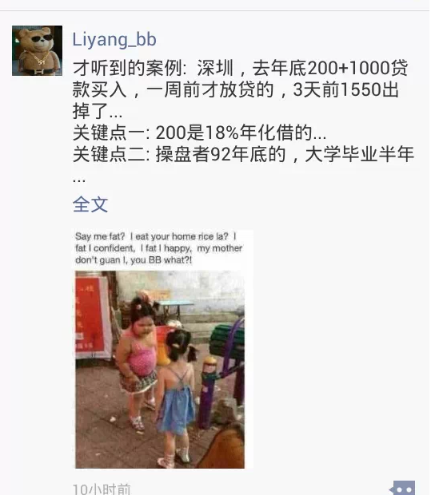

# 套利与套险 \#3120

yevon\_ou [水库论坛](/) 2015-05-28

套利与套险 ~\#3120~

按照顺序，这一篇应该是顺着《职业炒家》序列，继续讲温州炒房团。

可是今天早上，朋友圈里一篇92年的大热。

所以，今天我们换个话题。

一）做外汇

大约2003年的时候，我在玩外汇保证金。

这是一个中国人完全陌生的市场，如果各位有闲，不妨听我详细讲讲。

譬如今天5月28日，EUR/USD=1.0906，你可以注意到，他精确到小数点后4位。

这0.0001，万分之一，称为一个点。英文是bp。

意思说，你拿一万欧元，就可以换10906美元。

每一个bp差1美元。

打开财经频道，理财周刊，我们经常可以看见分析师推荐居民们外汇理财的。一般的，分析师会和你讨论美元、欧元、日元哪一个更强势。

然后继续举居民实例。某湖北山西的大妈，会在镜头前乐呵呵和你说，自己在1.20时将欧元兑成了美元，现在扣除手续费已经赚了10%，笑得象朵花似的。

看过了这些案例，你只能够叹息，中国人目前是全世界最大的养猪场。在这个猪圈里，你理财如果能升值，如果能保值养老退休，那才是真的没天理了。

为什么，因为国际保证金市场，根本不是那么回事。

其差距，是M1A1和T34坦克之间的差距，是坦克与步兵之间的差距。是AEGIS
Cruiser与小米加步枪之间的差距。

二）外汇保证金

当年我做外汇保证金，用的是400倍的杠杆。国内的商品期货是几倍杠杆，三倍还是五倍，不是很清楚。

400倍杠杆的意思，假设我投入的资金是50W美金。那么我最终可以掌控的资金是2亿美金。

如果你投入2亿美金，是什么概念。

以欧元为例，1.0906变成了1.0905，那么涨跌就是USD 10000。

外汇市场的波动，一般如同人类心电图一样。中午较清淡的时候，每秒就是一个点。

然后你就看见价格浮上浮下。1.0906-1.0905-1.0904-1.0906-1.0907-1.0903

你的心情也随之起伏不定。赚一万，亏一万，赚一万，亏一万.........

哦，是美金。每一秒钟，赚\$1W，亏\$1W，赚\$1W，亏\$1W .........

这并不是行情好的时候。到了晚上21:30美国开市。二分钟之内会决定方向。那基本就是100点的起伏。

也就是说，每天晚上的21:35，会决定你\$100万美金的输赢。

当然，我自己从来没有玩得那么大。每一秒10000美金。

但一张单子几万美金，还是有过的。

三）保证金的优势

和实盘相比；保证金期货有巨大的优势；

1）交易成本低。中国的银行目前一般收0.24%的手续费，简直是丧心病狂！保证金普遍小于0.01%

2）本金成本低

3）双向买卖

4）交易时间长，6天24小时

5）品种多。小币种。甚至包括HKD/USD。

但是，以上并不是重点。和笨拙的实盘相比，期货真正的优势在哪里。

在于"时间"。

熟悉外汇实盘的人都知道。如果你看准一个行情，譬如欧债危机，譬如希腊债务违约。然后你看跌欧元。

从你看跌欧元，到你最终获利。当中要间隔多久的时间。

答案是很久。

外汇从来不是一个波动剧烈的市场。每天1%左右的涨跌，属于正常。而要走出一段15%以上波澜壮阔的大行情，至少需要二到三个月。全年冲二次就算不错了。

所以外汇是一场长期寂寞的事。你捂个大半年，看法绝对正确，最后也就赚了10%。

有这份闲情，直接去做做理财不是更好。你知不知道手里的现金，在这闲置的半年之内，浪费了多少利息。

而外汇保证金放大的什么，放大的是时间。

以一个标准的外汇市场为例；

-   每一秒，0.01%

-   每一天，1%

-   每一年，15%

可是，如果你把这个数字，（不用400）放大20倍吧。

当你从晚上21:30看盘到次日凌晨3:30，在外汇市场，这是1%波动，很普通的晚上。

可是在保证金市场，这就是20%的波动，足足一轮完整的行情!

在保证金市场，放大20倍。一个晚上就是20%完整的一波行情。

人心浮躁。在我们这个时代，人人都想着赚快钱。六个月就想上市。三年就想有百亿美金估值。

股市哪怕天天涨3%，八个月涨了200%，可许多人仍然觉得"不过瘾"。他们希望快点，再快点。最好每个晚上都是传奇。

现在的年轻人，90后，85后，充满了热血。他们不在乎一个市场"正和""负和"的基础。他们只希望拼搏。

能拼搏就有希望。哪怕较渺茫的希望，至少也是一条出头之日。中国彩票欢迎您。

保证金每天晚上6小时。当你开始玩保证金以后，你就会发现，天天都是"大行情"。每一天晚上，都是20%的输赢。保证你玩得痛快，畅意人生。

民智未开。

当你玩过保证金以后，你对国内的任何"金融"产品都不感兴趣。什么期货绞肉机，呸，三倍五倍的也能叫绞肉机。股市，太慢，每天赚3%也能叫赚钱。

即使澳门的赌场，你也不会进去。因为外汇是一项综合了政治，经济，数学，文化，心理学等等因素的综合科技。相比之下，纸牌游戏就显得小儿科，小孩子玩的了。

在我的人生中，外汇保证金无疑起到了很大的作用。影响了个人的情绪与风格。也使得我这辈子都不会再赌博。

而且，"缩短时间"是一场极好的训练人的方法。

众所周知，培养一个人，尤其是培养一个交易员，使其具有良好的交易心态，既不要命又怕死都要命，这是极难极难的事。往往要经历了二个牛熊循环，彻底破产二次，才能说一个人稍微成熟。

如果你想在股市上培养这个人，那么你要让他经历2001年牛市-2002年大熊市，2007年牛市-2008年大熊市。

可见，培养一个人往往需要十几年的时间。

但是，外汇保证金却是一个加速器，一个诡异的外挂。

在保证金的世界里，每天晚上六小时，就是20%完整的一个波段。

你肾上腺素狂飙的六个小时，就可以学会无数东西。"山间才一日，世上已千年"。

你的成长是火箭速度。

最后，说几句披露的话。

1.  除了最后的900美金，本人已不持有任何保证金账户。

2.  我用的是全球最大外汇交易商。www.fxcmasia.com

3.  福汇的开户是在：[香港中环皇后大道中100号1楼]，凭护照就可以开户。携现金去即可。

四） 套现与套利

"水库论坛"是一个专业讲房产的订阅号。不是讲外汇保证金的。

前面用了这么大篇幅，其实是想说，这些年中保证金账户学到的体会。

"*到了一定阶段之后，你关注的就是套险。套险比套利更重要*"。

什么叫套险呢。譬如你投入50W美金，保证金账户400倍。最高可以帮你扩大到2亿美金！

你拿2亿美金去买EUR/USD，买他涨或者跌。每秒1万美元。涨得话就是每秒赚\$10000美元。错的话就是每秒亏\$10000，亏死你。

在这样一个游戏规则之中，你问我如何可以赚钱。

"*方向比速度更重要*"。

你不需要告诉我，EUR/USD最终能走到哪个部位。希腊恶化，欧盟解散，欧元跌到0.80，你赚二千万美元。

乌拉，是挺好，但这故事我也就是听听。其实我并不关心。

我真正关心的，并不是欧元最终能到多少。梦想中的赢利空间有多大。我并不关心"套利"。

我真心关心的，是下一秒，欧元是涨是跌。

我关心的是"套险"。首先你大方向要对，我是赚钱的。在赚钱的基础上，赚多赚少再说。

在投资模型上，关键要看你对这件事有多"确信"。

-   如果小微确信，我可以投10W美金，小幅尝试（每秒涨跌10美金）。

-   如果我基本确信，我可以投100W美金

-   如果我极度确信，相信得不得了，我可以下1000W美金的单

如果我极度确信。譬如我确切地知道，德国总理明天会被枪杀。欧元会崩溃式大跌。那我就敢建立极大的头寸。

而这个头寸最终会跌到哪里，欧元会跌到多少，我不知道不Care。

这就是"套现与套利"的区别。在这个世界中，你首先要确立的是涨跌，然后是"确信"的程度，然后才是头寸的大小。

五） 大头寸的力量

说回篇首那段微信。

这个微信，讲的是一个92年的小朋友，半年之内赚了350W的故事。

这个故事告诉我们的是什么。如何筹高利贷的故事，炒深圳房子的故事，家庭有背景的故事？

不，都不是。

这个故事告诉我们的是，"大头寸的力量"。

在这个例子中，该小伙赚得其实并不多。买的也不是笋盘。按比例看，其实才30%升幅都不到。

可是他最后让人瞠目结舌，疯狂转载的原因是什么，是350W的净利润。

净利润怎么来的，来自于他"庞大的头寸"。1200W\*30%，就有了350W。

可是，怎样才有庞大的头寸呢。

这里面牵涉到二个问题。

-   一个是融资的问题。

-   另一个则是"套险"的问题。

融资当然是一个问题。可社会上，更多的是90%的富人，他们有这个能力，有许许多多金领厂长小老板，他们有能力"200+1000"买房子，比那个小伙更有实力得多。

可是他们不敢。

为什么，因为风险。

套险和头寸是一对孪生子，有了低风险，才有大头寸。

只有你知道低风险（老鸟），或者你确信低风险（鲁莽），你才会去建立大头寸。

这就是"套险"的奥义。

五)与楼市的联系

说回与楼市的联系。本文的编号，是\#3120，也就是"天诛"系列中的一篇。

凡是楼市中讲到天诛，那都是针对16套以上的资深高手。讲的都是高级的玩法。

当高手们达到"天诛"阶段时，他们普遍的都会发生"心魔"。注\[1\]

心魔的折磨，当你拥有4000W\~5000W资产了以后。资产的起伏，相对于工资，就变成绝对大头。

4000\~5000W的资产，如果每年涨跌13%的话，大约相当于500W以上人民币的赢利。

这笔金额之大，一个跌停，你十几年的工资都泡汤了。

当高手们达到16套，4000\~5000W资产的时候，他们其实面临一个很确实的困境。

-   如果想要继续发展，指数上升，那你一定要保证很大的头寸。"大头寸的威力"

-   他们不能承受损失。哪怕10%的下跌，都会带来400W的痛苦。

在这个时候，一般的解决方法是什么呢。

是套险。

也就是说，你建立一些头寸，"套利"上升的空间虽然不确定。

但是"套险"优笋安全，100%不会下跌，赚多赚少的问题。

只要你确信他们不会下跌，你就敢建立更大的头寸。[并且以头寸上的规模，覆盖掉涨幅上的不足]。

凡是你玩到"天诛"以后，套险会越来越重要。你所关注的，不再是异军突起的黑马股，而是实质低估股，并加一个巨大的杠杆。

（yevon\_ou\@163.com，2015年5月28日午）

\[1\]参考文献《修真路上三道槛》http://www.shuiku.net/forum.php?mod=viewthread&tid=6713
