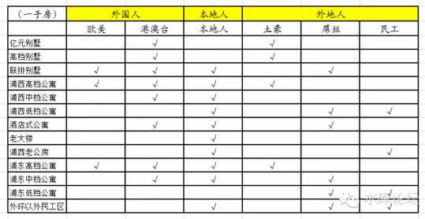
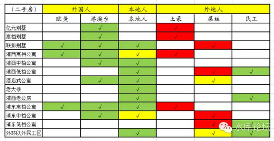

# 处房情结（二）\#340

yevon\_ou [水库论坛](/) 2015-10-09

处房情结（二）\#340

买房其实和买车一样，是一件落地打七折的事情。如何破。

一）Car Dealer

我们不可能靠"买车"赚钱，汽车是一种落地打七折的商品。几乎没有人可以从汽车价格波动中获利。

可是，这个世界上还是有一种职业叫做Car
Dealer，人家照样混得风生水起。21岁时就赚到了自己的第一个100W现金。\[1\]

那么Car Dealer是怎么赚钱的呢。说穿了一文不值；

"二手进，二手出"。

因为处房情结的惩罚一次性的。你新车买来100W，哪怕1KM都没有开过，直接挂牌出售就是70W了。

可是这个30W，是一次性收取的。

你以后再交易，不会70W变成49W。

所以Car Dealer的策略十分简单。我就只买二手车。

70W买进，或许过二月此款车型热销，升值到75W，不就是赚了么。

对于职业炒家，道理也是一样。

我们只在二手市场之内混了。虽然这个市场比真正的房地产市场小很多，但养活几个人还是没问题的。

职业炒家的任务，就是只买进二手房，或者那些几乎没有处房溢价的一手房。（即那些媒体宣称一二手倒挂的房产）。然后，卖出二手房。

这样，就规避了处房情结的损失。

二）市场的畸变

如果说，我们的回答就是"二手进，二手出"。那么我们的回复是很水的，骗稿费的，低层次的。

我们想要进一步告诉你的，市场在这时候发生了"畸变"。

为什么，因为这就是Marketing专业人士和普通人思维方式的不同。

市场是多维的，复杂的，有机的。

对于普通人来说，规模缩小300%，或者扩大300%，他们以为就是简单的加减乘除。

可是对于Marketing专业训练人来说，他立刻就知道不对。市场是不会同比例尺度缩小的。

我们知道，"二手市场"是"一手市场"的约30%，以上海为例，会买二手房人撑死是总人口的30%。

但市场缩小至三成，我们把客户分为外国人，本地人，外地人三类。其客户群并不是等比例缩小的。

             外国人   本地人   外地人                 
  ---------- -------- -------- -------- ------ ------ ------
  楼市客户   欧美     港澳台   本地人   土豪   屌丝   民工
                                                      

首先我们会有表一：

其中打勾代表购买。譬如亿元别墅的主要客户群是：港澳台籍和各地土豪。

要说明的是，这是一张大致示意的表格。请勿精确追责。

譬如港澳台对酒店式公寓，本地土著对浦东中档楼盘，这二条兴趣均只能说一般，勉强51%。

我们对十三种房产的分类也不是太精确，本地人也没有细分为富中贫。总之这是一张粗略示意的图表。请勿过度解读。

然后，我们会有表二；

表格的意思，是这些打勾的部分，会不会买二手房。其中；

-   绿色，完全不在意。或者愿意买二手的客户，仍然有50%以上。

-   黄色，部分在意。20\~50%

-   红色，非常在意。20%以下

如果我们观察这张图表，大致可以得出以下结论；

1）有三个类别完全不在意一手二手区别的。他们是外国人和民工。

2）低档房产、老公房和民工区，不在意一二手区别。\[2\]

3）重灾区主要是外地人，其中土豪区全灭，屌丝接近全红

这张图意味着什么呢。意味着地雷阵。

三）地雷阵

地雷是什么，地雷就是红色区域。

红色代表着一二手不匹配。在一手或许是一个很大的市场，有很旺盛的购买力。可是到了二手，就完全没有人买。

红色区域意味着，一旦你买进"落地"就要打折，而且打很深的折扣才能出来。所以完全地不保值。

以重灾区：浦东中档，浦东低档房产为例。

他本来的客户群就很少。沿二号线从科技馆，世纪公园，龙阳路，张江，唐镇，川沙。

最前面的一段能接一些港澳台住客。M2地铁最后面一段能接一些民工的购买力。

但整个中间部分，几乎全部都是"屌丝"撑起来的。密密麻麻，一个又一个社区，一个又一个板块，住的全都是"心比天高"的高学历小白领。

但是这些人，是"处房情结"最厉害的一批人群。

浦东的开发，明显的呈现开发一片，成熟一片，再开发一片。每一次都是把某地块炒热，价格充分地炒到喉咙口。

然后呢，然后热度不维持了！政府开始炒下一个板块，丝毫没留给你业主继续热热热升值的余地。

四）炒家的地雷阵

身为职业炒家，你只能在绿色的格子上生存。

也就是说，你只能做某几类的房产，针对某几类的客户。并准备相应的英文，人脉，社交网络。

对于某些红色部分，其起价太高。接盘者寥寥。甚至有可能象"土豪买房子"一样\-\-\-\-\-\-\--任何土豪都是不买二手房的，所以任何土豪买的房子都不保值。

在我们之前一篇文章《上海楼市的三分天下》中，我们说道了只有在北京上海这二个超城市，才有外籍实力。

只有在省会级大城市，才会有外来人口实力。

其实你回过头看表二，表二是上海的，这几乎是你能看到"最绿的"一张表了。哪怕北京都没有这么绿。因为北京土著不如上海土著贪财务实。

如果你出了上海北京，首先"外国人"这二列巨大的绿色就不见了。

其次，如前文所说，外地省城居民，远远不如上海友善。譬如西安土著，他们就是不买二手房的。

所以你依照规格，做一张"郑州，武汉，长沙，西安"的表二。

那简直没法看了。

整张表格，会呈现巨大的红色。几乎处处都是红色。（除了最底端民工房一点点绿色）。

那意味着什么，意味着处处不能炒。

如果你去到了郑州西安，当地人不喜欢二手房。同一个地段，一手新房能卖11000，二手房最多卖5500还要卖很久。

你说还怎么炒房。

所以，炒房这一个职业，只有在特大城市的很少数几个City才能存在。

即使在北京上海，你还要精挑细选，精选在绿色板块。免踩地雷。

职业炒家只占10%城市的10%楼盘的5%购买人群，真正的职业炒家人数是非常非常少的。

五）房价不算高

2011年时，我遇见Hankook的一个新加坡高管。对方用极其倨傲的神态和我说："你认为上海楼市何时崩溃"。

我瞄了他一眼，说:"不仅不崩溃，还要涨三倍"。

为什么，我举了三个观点；

1）房型太大。二房普遍都是120平米，而不是70平米

2）处房情结

3）杠杆率太底。银行贷款平均只有楼盘总售价的28%

其中，二房120平米是2003\~2009年的主流房型配置。在我和这个新加坡人吃饭时，其实房型已经开始缩小。2011年的真实情况，主流在102平米左右。

而之后几年，这个趋势更是明显。

到了2013年，主流房型降到了二房90平米

到了2015年，主流房型降到了70平米，各位津津乐道的是89平米三房。

房型的大小意味着什么呢，意味着"行有余力"。

也就是说，你还有余力，去追逐舒适度，品味，体验，或者搞个吧台书桌之类。

当房价实在太高，高出人民的负担能力之时。人们会保留最基础的"功能"，而将其他一切可抛弃的都放弃掉。通俗点说，"能放张床就行"。

所以香港的户型越做越小。从二房600尺(55平米)，渐渐地做到现在的40平米，30平米，甚至25平米。

当这个时候，才是民不聊生。真的竭尽全力负担不起。

而上海有这个趋势。离峰顶却还有很长距离。

同样道理，"处房情结"也是一个很好的指标。

一个人可以挑挑拣拣，说明你购买力没到底。"一手房"和"二手房"，仅仅是销售渠道的不同，而价格居然可以差30%。

你如果为这个差价付钱，说明你根本就没有精打细算，根本不是"一辈子的负担"。那些臭不要脸小白领向政府哭诉，TNND滚一边去。

对付屌丝，不要看他说什么，而要看他做什么。

只要"处房情结"还存在，我们就认为房价是偏低的。而且是极度偏低的。小白领愿意为"处房情结"支付的幅度，代表着房价被低估的程度。

以及我们要提价的幅度。

\*
哦，顺便说一句，有人问我怎样才能克服处房情结。商铺不受"处房情结"影响。

（yevon\_ou\@163.com，2015年10月7日）

\[1\]水库网友MrHua的故事，参见：《如何白手起家挣到一百万？》http://www.zhihu.com/question/22590902/answer/55182189，他的个人主页是：huastory.com

\[2\]相对应的，产生了多军二大流派。"老公房"流派和"低单价大面积"流派。多军没有豪宅流。
