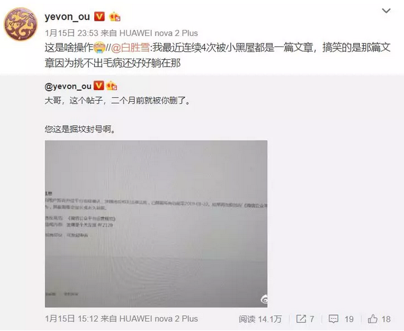
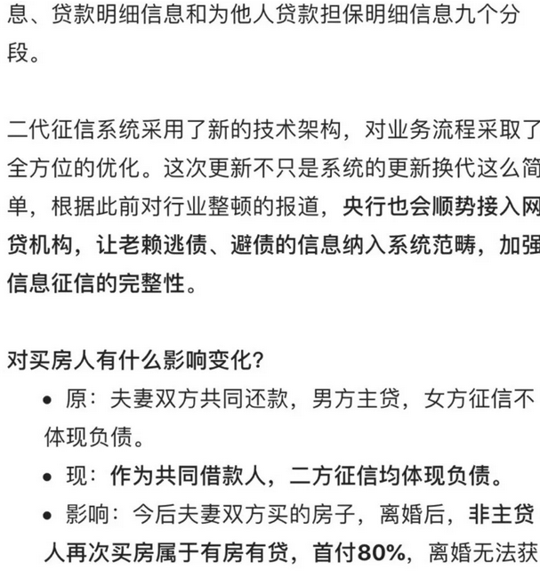
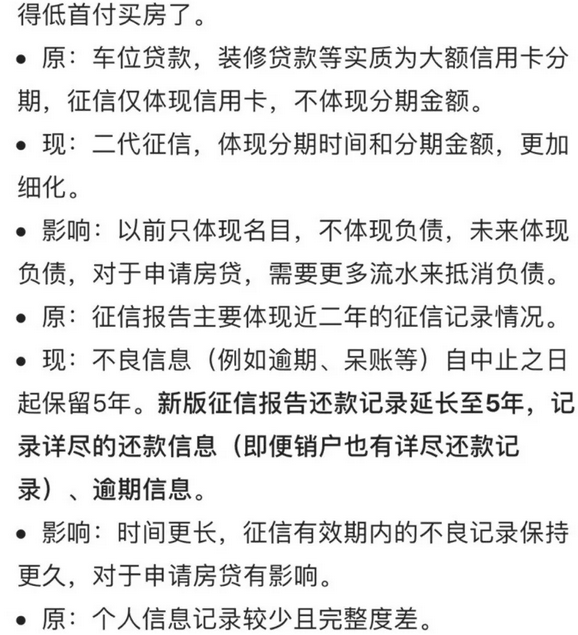
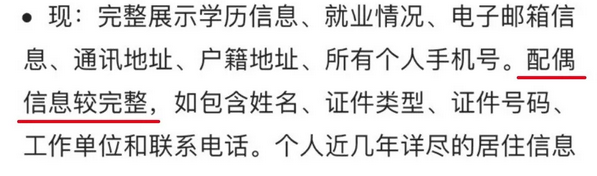
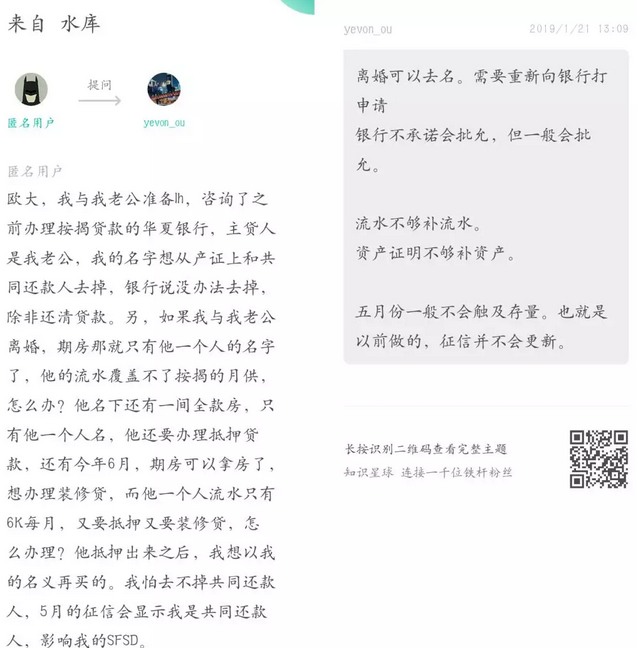
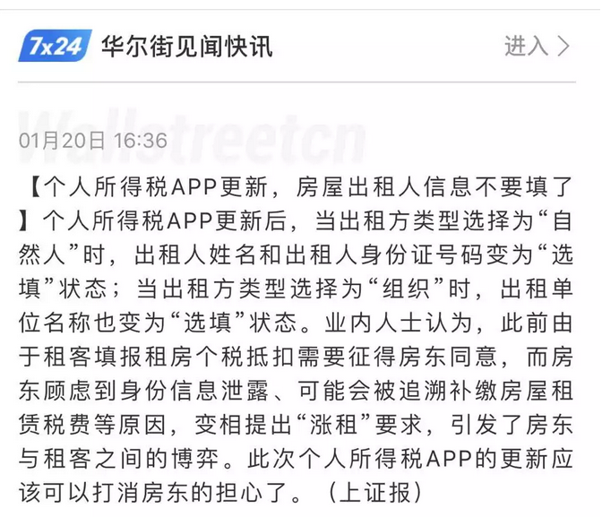

# 新版征信那点事 \#4010

原创： yevon\_ou [[水库论坛]](/)2019-1-22

新版征信那点事 ~\#4010~ 

 

 

一）前言

 

水库又被封了七天，到1.22刚刚放出来。

 

这二天小伙伴们抱头痛哭。纷纷都说活不过三月了。

据可靠消息，会会之前，会有一轮大型的封号浪潮。

象俺们这种号，民营的后妈的领养的马厩中捡来的，黑五类风中残烛

 

那怎么办呢，删帖啊。

有朋友建议，立刻开始删帖。把过去四年发过的所有帖子，删得干干净净。后台完全清空。

 

我告诉您啊。没用。

因为这次水库又被封号七天，是因为一篇旧文章\#F2120。而这篇文章，是已经被删掉的。

 

 

二个月前，尊贵的网管大人，已经发现并删除了\#F2120，封号一周。

这次不知道为什么，巡视组又查到了，于是继续封一周。

也就是说，您这是"掘坟"封号，下面还可以挖十八层。

那真是没生路了。

 

1月15日我发了这条微博之后，有一个小伙伴留言。说他为了同一篇文章，被封号四次。

考古永无止境。

 

既然这样，我觉得俺也活不过三月。剩下的日子，苟延残喘，能写几篇是几篇吧。

您也别问小号。小号多了一样封。

失联就失联了吧。

 

可惜西港的地，很多网友就买不到了。有意者请联系微信：

  ------------------- --------------------
  威哥：17072547462   紫竹：A17701646698
  ------------------- --------------------

 

 

 

二）征信

 

今天我们讲讲新版征信的事。纷纷扰扰，在水库圈内提问的人很多。

-   参贷人要上征信了。夫妻买房的洞要关上了。

-   信用卡分期，登记更严了。

 

首先我们看第一条，问一个常识性的问题，

你的参贷人信息，会不会更新到征信上。

回答是：新信息会，旧信息大概率不会。

 

这里面牵涉到一个，对于行政运转，基层申报的常识性问题。

很多房产大V，分析新版征信，都没有说到点子上。

如果你是前几年买的房子，当时是以参贷人身份参与。现在要不要急着赶五月份之前再买一套房，以免二套资格过期？

 

答案是：大概率不用担心。

因为新版征信的运作概率，很可能是"新信息新记录，旧信息不触动"。

 

绝大多数人对于"补登旧档案"没有概念。

商业银行经过二十年的运作，累积堆积的档案，卷帙如山。

这么多的合同，你要全部看一遍，就需要耗费大量的人力，物力。

 

更何况，"个人征信登记"是一件严肃的事情。如果发生大规模的信息错勘，一定会激起社会舆论。银行行长都会受批评。

 

这就意味着你在"审阅旧档案"时，必须非常非常小心。可能需要经过专业的律师，二三重的人力校对。

耗费的人力\*工时，绝对不是一个小数字。

 

 

更何况，绝大多数的银行，对于Paper
Work兴趣厥然。银监会三令五申"贷后管理"。贷款客户需要多次回访。

但是在商业银行端，往往以"本行人手不足，员工各司其职"就挡回去了。

 

本来就是么，你看一个单位里，八小时全部都忙得要死。

单位是没有闲人的。要多干活就得加人，加工资，加预算。

 

 

从行政的法则来说，我们大概率可以认为，新版征信所谓的"参贷人上记录"，是既往不咎的。

没有人有这个精力，把几十年的卷宗全部都看一遍。而且银行业内部，其实也不喜欢你翻账。

 

 

 

三）下一套

 

如果"参贷人"记录，是既往不咎，不会主动更新。

那么，会不会对"下一次买卖"，产生影响。会不会影响供需关系，会不会影响房价？

例如买一套房子，就破坏了夫妻二个人的征信。

 

好了，那么请你想一想。

水库心法中，有哪一条是让你以夫妻名义购买的！

 

你再仔细想想。水库心法中：

-   哪一篇

-   哪一条

-   哪一个场景

-   应该用夫妻双人共同贷款，一起上产证的。

 

答案是没有，从来都没有。

 

 

事情就是这么巧妙，历年你看水库这么多问题，知识星球十一万道提问。

水库的流派，永远都是"单身购买，家庭劈成二半"。

 

我们并不存在"参贷人"问题，严格的水库心法中，根本不存在参贷人。全部都是主贷人。

如果你流水不足，那你就补充流水。

 

水库遇到问题，向来就是第一句话：li

如果没有li，那么赶快li

没想好买房子，也去li

晚li不如早li，没事先办li

 

经过水库加工厂出来的，全部都是li的。

而且我偷偷地告诉你，不需要丈夫，（前夫也可以作为担保人的）。

 

 

 

四）亡羊补牢

 

再一个问题，假设你已经是"夫妻名义"申请了贷款。而且很不巧，已经输入到了新版征信中。那你该怎么办。

答案是，向银行申请，撤销"借款人"。

 

 

绝大多数人不知道，贷款合同是可以更改的

99%的老实老百姓，都以为贷款合同是一辈子的。签完永久固定。

 

甚至有部分的购房者，为了贷款利率上浮20%，或者25%，愁肠满结。动辄计算30年累积的话，要赔多少多少钱。

无良媒体小编，总是借此恐吓购房者。

 

 

其实贷款合同是可以更改的。不仅可以申请更改利率，而且可以申请更改借款人，抵押权人。

 

一般银行的要求是：

-   正常还款一年以上

-   没有不良还款记录、

-   有正当的理由

 

也就是你还款一年以后，你可以向银行申请，写"申请报告"。

恳请领导，把借款人由沈腾和马丽，改为沈腾一个人。

 

这个时候，银行要"审批"。任何一个信贷员，都不会当面告诉你"可以改"。而是说向领导申请。

但其实这个批复的概率，是非常大的。

 

 

对于银行来说，他存在风险。因为以前是沈腾和马丽，10000+8000的总收入。

如果改为沈腾一个人还款，则沈腾必须达到18000的收入。

否则就覆盖不了"月供额的二倍"。

 

而沈腾如果票房大卖，工资提升的话。这个要求，是可以满足的。

具体怎么做，就不用我教你了。

 

 

 

五）抵押权人的文字陷阱

 

银行合同中另一处文字游戏，是"抵押权人"和"借款人"。

 

请注意，这二个名词，是可以不同的。

-   抵押权人，可以是沈腾+马丽

-   借款人，仅仅是沈腾

 

抵押权人，指的这套房子，产权是谁的。抵押权人即产权人。

而借款人，谁问银行借钱。

 

如果抵押权人和借款人，必须一致的话，你就必须离婚。把马丽的名字，从产证上面撇除。变成：

-   抵押权人：沈腾

-   借款人：沈腾

 

如果"抵押权人"和"借款人"不需要一致的话。

你去掉"参贷人"的帽子，不需要离婚，不需要去名。

 

 

 

六）房租报税App

 

另一个热点话题，是"房租报税，登记房东姓名，住址，身份证号码"。

这个事件，引发了网络舆情，微博知乎雪球上无穷无尽的讨论。

水库封号期间，哥哥耐心地观察了一个星期，最后得出结论："没一个能打的"。

 

房产小V，大多是夸夸其谈。没想出任何有干货的战法。

 

 

这件事应该怎么"破"呢。

之前水库"知识星球"已经披露过了。考虑到"水库论坛"主号恐怕也活不了多久，我们免费告诉大家。

 

提供80岁老人的身份证。

 

租客如果过来问，要求房东提供身份证，产权证资料。

则你给他的，应该是你妈，你奶奶，你外婆，80岁祖母的身份证资料。

 

 

目的？房租信息联网的核心目标，是"征税"。

这是光天化日，大家都很明确的事。

 

而你把"房租"堆积在80岁老人的名下，80岁老人是不交税的。

无论任何一种算法，她们都是免税而特权的群体。

即使你偷税漏税，警察也绝不会找80岁老人的麻烦。

 

更何况，老人这么可怜，拿几千元的房租，还弥补不了最低生活费，纳税起征点。

 

 

 

第二，从"法理"上讲，你提供80岁老人的身份证，是否合法。

答案是100%完全合法的。因为这事实上是一种"转租"行为。

-   你把房子租给奶奶

-   你奶奶把房子租给屌丝。

 

转租的行为，是100%合法的。

你奶奶，也因此获得了房屋的"合法出租权"。她是绝对有资格和房客再签租赁合同的。

 

 

那么，房子给你奶奶"转租"了之后，你需不需要交税？

答案是，当然不需要。因为你没有收入呀。

 

中华人民共和国的法律，明确规定了"子女有赡养老人的义务"。

什么叫赡养老人。就是给老人吃好，住好，难得还有一些零花钱，可以买些喜欢的剪纸糖果。

 

-   因此，你把豪宅大院"免费"给老人居住，是完全符合中国赡养法的。

-   而老人呢，住得不习惯。非要把房子租出去，搬回去和街坊邻居一起热闹。这也是合法的。

-   房子租出去后，有点收入。收入由老人收了，顺便买点年货糖果。这是彻底合法的。

 

 

家有一老，如有一宝。

整个事件的结果，就是租客要求"填报房东信息"时，你给他一个80岁老人的身份证。

顺便再以加税为理由，加他几百元房租。

 

 

 

（yevon\_ou\@163.com，2019年1月22日晚）
