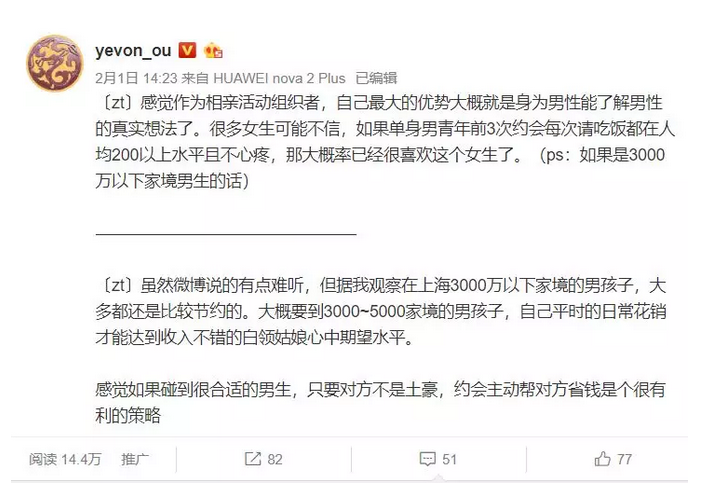
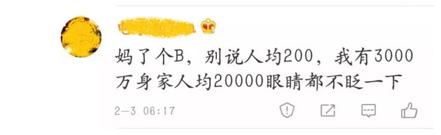
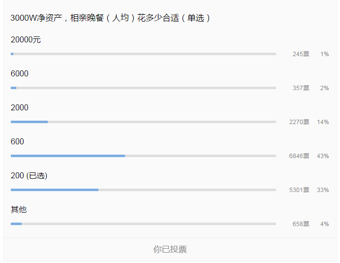
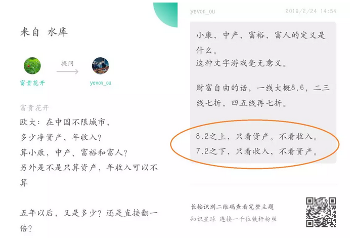

# 3000万富翁每天可以花多少钱 \#4030

原创： yevon\_ou [水库论坛](/) 今天

**3000万富翁每天可以花多少钱 ~\#4030~**

 

 

一）八卦

 

最近我在海外度假，公众号的文章，都交给了芸姨，桃军师。

俺写文章，总说我三观不正，写一篇封一篇。歇了，算了。

 

一般，除非"八卦之心"熊熊燃烧，俺是提不起精神，连夜再赶稿的。

今夜，俺的八卦之心沸腾了。 

抓狂，简直忍不住想穿过屏幕，捞起一杯水，一把浇在他脸上。

 

兄台，这就是为什么你没有3000W的原因

 

 

 

二）消费

 

一个有3000W净资产的家庭，其生活态度是怎样的。

 

例如这二天，哥哥住在海外酒店，不乏豪奢客人，携带小女伴的。

其女伴，对于富豪的"出手""阔绰"，预期应该是怎样的。

 

 

上海在80年代，有一句广为流传的俗话，叫做：

吃大户，用大户，消灭大户，最后自己变成大户。

 

在女性博弈者的心目中，3000W富人生活态度应该怎样？

例如上图说的，小男生出去"相亲"。达到怎样的排场和派头，才能让女伴"满意""体面"。

 

这个尺度与估算，不仅对于男生的修身齐家是一种要求。

对于女性，在相亲活动中精准寻觅评估男性，也是非常之重要的。

 

 

3000W身家，相亲吃一顿饭多少钱。消费的尺度，历来有二种说法：

A：20000元

B：200元 

或许还有C，折中2000元。哥哥不是很会弄微信投票，勉强搞一个吧。

八卦吧，小宇宙：

 

三）败家子

 

好了，投票结束，大家看看答案。

 

 

首先我要告诉各位的是，"花20000"这个回答，肯定是错误的。

或许有人问，你有3000W，难道2W花不起吗。

上海那么多挥金如土，夜总会一晚几万，难道都是亿万富翁花的？

抠门，渣男，直男癌晚期，为富不仁葛朗台。

 

 

花是花得起的，但是不能这样花。

因为你是"吃大户，用大户，消灭大户"的人，你没有站在大户的角度，替大户想想。

按这个速度花，3000W可以花多久。

 

-   假设每一天花4W

-   每一个月花120W

-   3000W足够花25个月，也就是二年多一点。

 

 

我们见过一些"彩票中奖"500W。见过一些拆迁暴富，一夜A8.2的人。

甚至还有坐牢赔偿杨德武。

这些人，无一例外，在三年内都挥霍完了自己的财富。

 

因为你彩票中奖，总要买辆大奔。亲朋好友打秋风，各自分掉一点。

有了钱，觉得自己是有钱阶级。要学有钱人的做派。

CEO盘买起来，红酒，雪茄，貂皮大衣。

奢靡的生活是个无底洞，你没有有钱人赚钱的能力，又不懂IB的门道，只能坐吃山空。很快空。

 

 

2000年代的时候，发生过好几起会计私刻公章，卷款潜逃。

压抑爆发，保持每天10W的挥霍速度，拉菲恨不得吃一碗倒一碗。

 

二个月后公安抓回来，千万赃款只剩二三百万。

对着镜头痛哭流涕，"人生曾经爽过，这辈子也算值了"。

这种人，都是社会底层LowB习气。

 

（水库知识星球开始续费，2019.3.1\~2020.04.18，￥5500元，最后一年）

 

 

净资产3000W，你的确是花得起"人均20000元"，眼睛都不眨一下。

但问题是，这是一种"不可持续"的做法。

 

一般适用人群，偏远农村产权极度没有保护，

又或者西域马匪的生态群内。

但凡有一点文明教化，绝不舍得这样花的。

 

大户想要积累起三五千万的身家，需要几十年的福报。

走读书这条路线的话，甚至需要几代人的接力，一点点从小县城往大都市爬。

 

而在一个败家子手里，"日均四万"二年多把祖祖辈辈的积蓄瞬间花完。

这样的行为是不可以接受的。

 

 

同样的道理，我们可以回答"海岛金丝雀"小女孩。

很多女孩子，抱着不切实际的幻想。对于实力和回报，也缺乏数量级概念。

 

她们认识一个3000W的富人，恨不得半年一年，就从"大户"身上撸1000W下来。

买车住豪宅，买包买珠宝，过起名媛贵妇的生活。

 

这种女人，并没有指望和你过一辈子。

而是冀望尽快吸干你的血。再去找下一个宿主。

富一代不傻，你才傻。

 

 

 

四）数量级

 

好了，读者又要问，"别整天吐槽了，你说个精确数字出来"。

"想要养家糊口，3000W富人每天可以花多少钱"。

 

我讲一个答案，大家拿纸笔抄下来：

0.01%，每天

 

 

关于这个答案，首先我们要解释一下"数量级"的概念。虽然这个概念是如此普遍，在我们身边无所不在。

但是几乎没有人，深入思考此事。

 

以地产人最熟悉的房地产交易为例：

-   交易成本：约10%

-   中介费用：1%

（用链家的都是SB）

 

这个"数量级"概念，衍生开来，在许许多多的场合，都有应用的解释：

  30%：致命的打击       财富本身
  --------------------- ------------
  10%：交易成本的上限   财富的迁徙
  1%：中间人费用        打理佣金
  0.1%：误差            精度之外
  0.01%：每一天的增值   小费

 

在婺剧《玉蜻蜓》中，金大娘娘烧掉了三成家产。管家就坐不住了。

因为30%是一个槛。任何机构，一旦失去30%，就很难补回元气。

会导致永久性地，规模可见地，缩小。

-30%是一个机构兴衰的征兆。

 

10%是"交易成本"的极限。

"交易"的本质，是A换成B，财富并没有减少，只不过做了更好的配置。

10%是资产"转移与迁徙"愿意接受的成本，是R的红利。

10%也是很多"税制"制订的基础。例如十一税，销售税，离岸金融的实际所得税率。

 

 

1%是中介的"数量级"。一二个百分点，请个中间人，或者FA。

中间人并不提供物质商品，仅仅进行信息和撮合。

中间人1%这个数量级，奠定了"现代服务业"，例如基金，投行，律师，中介等各行收费范围。

这类人必需要提供艰辛的服务，才可以分得一杯羹。不如R。

 

 

0.1%是误差。误差的意思，是你"不心疼"。

如果问哪一个数量级你不心疼，清松随风而过，那一般是0.1%

1000W净资产，被窃遗失1W。心疼三小时，到明天就好了。

为了做生意而产生的误差勘漏，目光视线计算之外。

"跑冒滴漏"发生在这个数量级。

 

 

0.01%是"日赚"，对于大部分的人，每天的资产收益率至少有0.01%

千分之一是"不心疼"，但会造成影响。

万分之一就是"一天的收入"了。随便花。

肆无忌惮的随手花，集中在这个数量级。

 

 

 

五）持家

 

对于富人而言，真正给予的建议，每一天花费的金额，最好不要超过净资产的0.01%

每年花费不超过3.65%

 

按照正统的欧美"理财学"操作手册，一般建议每年消费不超过4%

上流社会，遗产继承者，如果穷奢极侈，消费超过4%；

恐会导致阶级下滑，甚至耗光你的财富。

 

-   值得注意的是，4%的算法，并不是因为"国债\--股票"投资组合，回报率在6\~8%左右。也不是钱生钱，富人越富。

-   真实情况是，通胀率12%，你投资回报仅有6%，每年还要花掉4%，则你的财富正以每年-10%在缩水。用不了几年，你就会被社会洗干净。

-   真正的算法是，你要保证X%回报，然后再花掉4%，才能靠纯理财存活。算法很复杂，不展开。

 

 

如果富人抱有的是一种"长长久久"的心态。

他这3000W，还想富裕ing几十年。想传给子孙，世代都保持着殷富的状态。

他想和你过一辈子，

则这3000W，其实是不能花的。

 

他每年只能从其中抽出很小的一部分，金额大约是每天0.01%，同时谨慎理财高回报。才会不触犯伤害本金。（资产类进出一律不算，指纯消费）

-   1000W净资产，每天可以花1000元。

-   3000W净资产，每天可以花3000元。

-   1亿小目标，每天可以花10000元。

 

 

1000W富人，每月只能花30000元。

3000W富翁，每月可以花10万。对于京沪三口之家，其实也不算多。

 

值得注意的是，这100000元还包含"长期摊销"的项目。例如：

-   小孩子的学费

-   出去旅行一次

-   买部手机

-   一年一次取暖费，N天一次医药费

 

这些不是"现付现结"的东西，平摊到每一天，其实极为可怕。

按照我的估算，"长期摊销"大概可以占到你支出的50%

 

 

 

一位小帅哥，如果不巧和父母"共有"3000W，那我们算你三口之家。

其实你的净资产，还是A8.1

 

你一个月可支配的收入是15000元。

平均每一天500.

 

出去请女孩子吃顿晚餐，人均200的确是"常态"。

肯花3000请你吃晚餐的，那是没有明天的人。只准备和你约会三次，简称"渣男"。

  

 

如果一个成年男性，独立拥有三千万。最高等级，相亲市场传说中的黄金准则："父母双亡，有房无贷"。

-   则他每月可以花90000元。

-   扣除长期摊销后，每晚1500元。

1500元的预算，可以营造比较高大上的氛围。去到人均500的餐厅。符合图1说的标准。

但和京沪剩女心目中的"欧巴"，恐怕还有很大距离。电影都是骗小孩子的。

 

 

单身男性有一个亿，则他每晚可以花5000元。

供女士们参考。希望反向推算身家，以及刷期望值时，不要错得太离谱。

 

 

最后，提醒各位最重要的一句：

如果对方是水库系的，主要靠水库心法堆积房产房贷起家。

以上种种，花钱标准一律打二折！

 

 

 

（yevon\_ou\@163.com，2019年2月27日晚）
