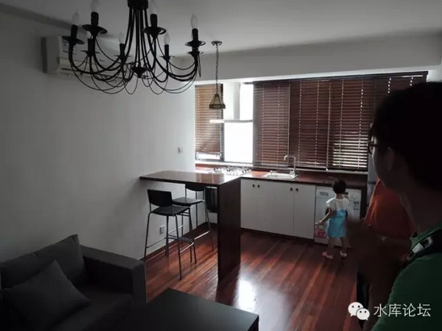
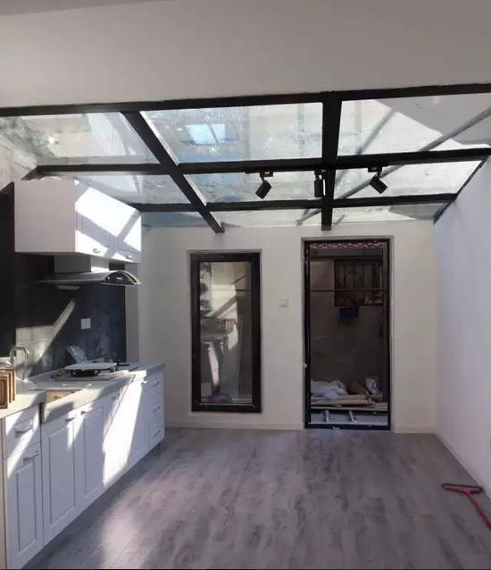
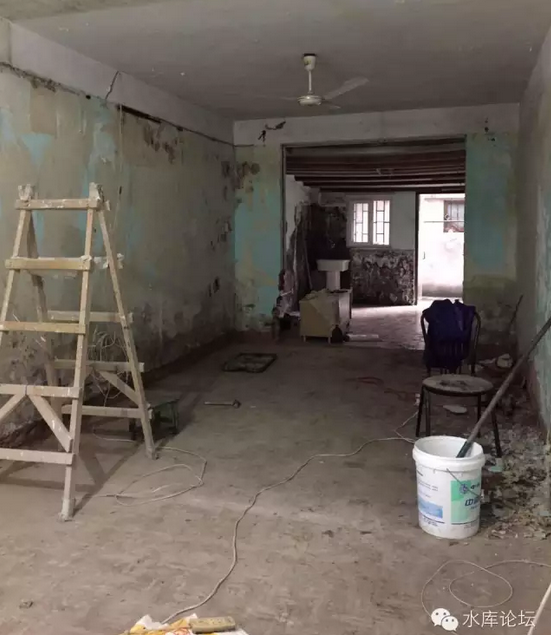

# 炒房客的流派（三）\-\--法租民宿派 \#480
---------------------------------------

yevon\_ou [[水库论坛]](/) 2015-11-12

 炒房客的流派（三）\-\--法租民宿派 ~\#480~
====================================================================================================================================

\*\*\*\*\*\* 因法租派反对，本文为删节版。完整版请在水库隐匿版找
\*\*\*\*\*\*

优雅地赚钱。

一）鱼和熊掌

职业炒家的第三个流派，是法租/民宿派。

在之前的文章中，我们说道"大面积低单价"流派防止破产的最后防线是"成本足够地低"，买来就是七折。

而老破小流派不注重资本利得。却特别地注重"租金%"，只要持续地有5%现金回报，长线收租天塌下来也不怕。

好了，现在有一个流派，他兼得二派优势。比二派都强。

当老破小流派绞尽脑汁，谋求"3.5\~4.0%"租金回报标的时，有一个流派，他的纯租金回报可以做到8\~10%

而且这个流派，他还不耽搁你赚钱。在资本利得方面一样很强，壮牛狂奔。

这个流派，就是法租/民宿派。

二）法租派

我们说过，要获取高额租金%，有二种方式：

1）最最最低端。以至于基本生活需求无法压缩。最最极小面积户型。

2）做外国人生意

法租流，其实做的是外国人生意。

做外国人生意，有专门只做外国人生意的地域板块。譬如古北，虹梅，碧云，主打的都是国际社区。

如果你的房子买在了古北，碧云，那么很不幸，你的房子，可能是过去十五年涨幅最低的房子。古北从1997年\$2000美金，到今天就没涨几倍。

炒古北不是流派。因为死亡的不是多军流派。

多军流派，都是指赚钱的流派。

所谓的"法租流"，主要是指买湖南路，天平路，武康路，衡山路一带，传统法租界，绿树成荫的地方。

这几乎是上海最好的地区。康办也在这里。

而法租流之所有可以胜出，则是他在获取高额租金的同时，控制了成本。

就总体而言，法租派的内功心法，可以归结为以下几条：

1）选择湖南天平街道，传统法租界地区。但是购入房价又很低，是跟土著价走，而不是外销房走。

2）进行极为专业的改建和整修

3）出租给老外。

4）或出售

因为法租界并没有古北那种成片，成规模的名都城外销房小区。在法租界选筹，主要是：

-   50\~60平米老公房

-   新里

-   独院小洋房（之部分）

"法租派"这一系列的领航人物是网友□□□□□□□，譬如他在2013年分享的一个经典案例：

-   47平米老公房，原2500租金。

-   经过改造之后，月租10000。

看清楚，是47平米租10000！

房子在□□□□□□，□□□□年老公房□/□F，实在是普通得不能再普通。

（本处删除NNN字）

在水库论坛（Shuiku.net）当年转载了他的文章：

文字版：

《□□□□□□,□□□□》

http://www.shuiku.net/forum.php?mod=viewthread&tid=□□□□

图片版：

《□□□□□□□□□□□□》

http://www.shuiku.net/forum.php?mod=viewthread&tid=□□□□□

}

（图片只放一张，余下图片不共享）

为了□□□□□□这套房子，水库论坛专门组织了一次规模上百人的大型考察团。专门去了一次实地观摩考察。

学习下来的总结，只有五个字："魔鬼在细节"。

这里面的门道太多，就是你毫不在意的一二个细节，打动了老外的心，一下子俘获了欧美人的审美观。

再强调一次，Marketing是分类的，一千个人有一千个哈姆雷特。你觉得不喜欢不重要，关键是打动"目标客户"的心。

真正的内功心法不传之秘，LZ是隔壁门派的，俺也一知半解。

请自行找"法租流"高人学艺拜师。

三）法租派的升值

当你2500-\>10000房租翻四倍，法租派在"租金回报"上就已经超过了老破小流派，甚至达到8\~10%的境界。

可是你以为法租派只擅长赚租金么，你又错了。2015年，□□□□□□又一次分享了他在买卖上的巨大斩获。

2015.04 □□□□□□□□买入"□□□路/□□□□路"42平米一楼老公房，

价格130W

破限购15W

装修10W，税费5W

2015.09 出租9000

2015.10 售吉230W

也就是短短六个月之间，130W-\>230W。

闲话少说，直接上图：

（图片只共享一张）

是不是有一种惊艳的感觉。等我们再上一张装修前的照片：

这张装修前的照片，才是重点中的重点！

也就是目前我们这个社会，我们这个民族，我们这些国民；

你扑上去第一眼看见的，就是这么破破烂烂的房子，然后你"啐，垃圾"。

你不善于挖掘事物背后的价值，你看到一些很肤浅表面的东西。

如果你想要精致，优雅的生活，你并不懂得如何去创造。

你只会硬扛。花六万，八万单价，去买别人包装设计好的精装一手品牌CEO，然后再哭诉抱怨房价怎么这么贵。

而我们，则是那个设计好六万八万，然后再卖给你的人。

巧劲之道，借力打力。

攻城最下。

现在，让我告诉你一个真正秘诀中的秘诀。

你回看照片"未装修的状态"，其隔壁那套，还仍处于这种破破烂烂的状态。

而且，也还是卖130W小加。

上士闻道,勤而行之。现在你知道该怎么办了么。

四）法租派的局限性

法租流拥有非常好的租金，而且投入也很低。远远不到专业外销房的一个零头。

法租流拥有非常良好的升值能力，在极短时间内，房价就能涨50%\~80%

那么，法租流是不是集所有的优点于一身。他是不是无敌的呢。

从某种意义上讲，法租流的确是无敌，无懈可击的存在。

法租流唯一的问题，是他始终做不大。

法租的生存范围十分有限，基本就局限于湖南，天平二个街道。

47平米租10000元的客户有，但你绝不可以认为满大街都是。

这只有在极少数城市极少数区域的极少数房源的环境下，才有法租流的生存市场。

他是最典型的"小众市场"。

法租流是优雅的流派，是绅士的流派。是少而精的贵族流派。

他和大众市场是分开的。适合豪门贵芥公子玩二套排遣寂寞。而如果你拿了几十套几百套想做大，那就没可能了。

最后，分享一段视频：

http://video.weibo.com/show?fid=1034:5af135868630f3b92bfecb303b973327

这段视频告诉我们的是，像我们这样一个国家，需要多少家"牙签厂"。

这样一个圆筒木，短短一截木头，可以制造多少人用的牙签。

答案是2100W套。

五）民宿流

随着法租流的描述，我们要讲讲另外一个流派："民宿流"。

民宿流可以视为法租流的"全面加强版"，它在各个指数方面都要胜过法租流。

曾经有人说，奋斗的真谛就是："35岁之前拼命地压榨自己，35岁之后享受人生，35周岁整退休"。

这句话到了没心没肺的某多军口里，就变成了："既然有人可以35岁退休，为什么不可以28岁退休"。

28岁退休，很NB么。

不，我们还是低估了中国90后的威力。这句话到了某90后的嘴里，又变成了"既然可以28岁退休，为什么不可以23岁就退休"。

于是某人一毕业，毕业第一年就退休了。

她退休的主要方法，是搞"民宿"。

民宿是什么，没见过猪你至少知道国外Top
20中有一个Airbnb网站，国内有蚂蚁(mayi.com)，小猪（xiaozhu.com）等山寨跟风。

民宿就是短租。其主要的特色，是把房间装修成非常有特色温馨之所。

然后在空间上分割：出租一个卧室，提供早餐。

在时间上分割：提供1\~3天的短租。

民宿的主要竞争对手是酒店和长租，但是；

1）虽然民宿和住酒店都是800元/晚，并不便宜。但是酒店标房一般只有25平米，行政套房37平米。

而800元住民宿，可以住到80\~120平米的二房。几乎比酒店总统套房更宽敞。

2）虽然酒店有更标准化的洁净服务，但民宿一般可以通过房东的温馨，聊天，导游指引，提供更Face
to face的人性化体验。

3）虽然民宿比月租要贵，一般贵三倍左右。但是民宿灵活。可以提供1\~3天的超短租赁。也能提供一个卧室，甚至一个储藏室的超廉价产品。

4）如果形成Hostel类似群体，则在民宿中可以结识新的朋友。

民宿一般租得很贵。如果按照房间数\*天数，则它的总租金，可以租到整租月租的300%左右。

也就是你普通月租6000的三房；

如果搞民宿，则是800一天。

可是，这是非常非常高的利润。也很容易赚钱。

论租金，民宿甚至比专门做外国人生意的"法租派"还要高。

论升值，鉴于"出售时品相一定要好"理论，民宿和法租派都极佳流派。民宿甚至更好一点。因为软装花团锦簇。

论适应性，法租派严格地被局限在法租界以内。浦东和郊环都根本没有这种生态。而民宿派则相对宽松得多。最佳民宿虽然仍是在Downtown，但其他区域也是有移植活下去的可能。

民宿相当于"法租流"的全面加强版。

六）民宿派的缺点

民宿派的弱点是什么。

在悲观主义者的眼里，他们几乎想也不想就列出来了：

1）持牌旅馆的灰色地带，警察的骚扰

2）如家七天等经济型酒店的竞争

3）门槛低，同业新对手竞争

但我们要说，这几个问题都是麻烦，会削弱你的利润率。但绝对不是灾难。

民宿有其市场定位，在五星级酒店/经济型酒店/普通住宅之间，的确能划出这么一片细分市场。

他兼有五星级酒店的高bigger，经济型酒店的价位，和民间住宅的宽敞。

从细分市场而言，这一个划分是有效的。所以民宿市场，是可以活下去的。

至于竞争，天下哪行没有竞争。只要仍处于灰色角落，竞争没有刺刀见血狂打价格战就可以了。

那么"民宿流"的真正瓶颈和缺陷在哪里呢。

在于"心力"。

你如果真的管过这事就知道了。假设一个房子有三个房间，一个月30天，理论山最多有90批客人。

实际算个对折45批吧。这45批人的Check In，CheckOut，

来之前会在网上问你一堆的问题，这房子好不好。

来之中会打电话和你说找不着路，接飞机的人没赶上。

走之后每个人要结算看看有没有损坏，设施要重新添补维修。

这些事都不难。就是破。一堆破事。

眼睛一睁，就是一堆破事。一直到你眼睛闭上，梦里还是破事。

这还仅仅是一个场子的例子。如果你有4个场子，8个场子呢。

这事，也就只有精力充沛的小姑娘折腾得动。90后折腾得动。

象我们这种半截入土的大叔，即使知道分割出租赚钱，花簇软装赚钱。可是我们每天睡醒10:45，成功击败全国99.999%网友，想想再躲回被窝睡回笼觉。折腾不动啊。

大叔们的时间，是要用来打游戏和睡懒觉的。

"民宿流"对心力消耗太大。

想想就觉得犯怂。还不如交给助理和手下干吧。助理其实还得要你看着，能省一部分心，但绝对不是不操心。

所以，这钱我们赚不动。留给斗志昂扬的90后赚吧。哥哥睡觉去了。

（yevon\_ou\@163.com,2015年11月11日剁手节）
