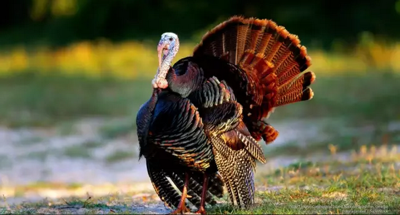

# 列兵和阶层 \#540

原创： yevon\_ou [水库论坛](/) 2015-11-27

列兵和阶层 ~\#540~
=============================================================================================================

拿破仑说："不想当元帅的士兵，不是好兵"。

好了，现在问题来了。你见过士兵当元帅的么？

一）列兵

有一次，我看南京军区的专业科目表。里面有一科叫做"蛙人科"。

这一科培训出来的，都是"水下特种作战"战士。能够在水底潜伏很长的时间，汹渡较长距离，执行复杂的作战任务。

训练极其艰苦，因为海盐，战士们个个晒得像黑炭一样。

好了，假设你是一个热心上进的青年，一心想出人头地，向上爬。

别人训练八个小时，你就付出二倍，三倍的努力。

最终你成为蛙人之霸，成为整支队伍中最精锐，最出色的战士。

请问你的前途会怎样。

答案是，你会成为蛙人小队长，中队长，大队长。对应职位排长，连长，营长。

可是，你做到蛙人大队长之后，你的职业基本上也就到头了。

军区以陆军为主，以炮兵和机械化步兵为主。要产生师长，也只会在这二个兵种中产生。

你不可能以一个蛙人队长身份，去率领三个师的。

最优秀的列兵，并不一定可以当元帅。

二）列兵和阶层

那么，你这个故事，和炒楼又有什么关系呢。

我们要说的是，你的世界观不对。

传统的世界观，以为人生就是一个"打怪升级"的路线。譬如你最初的时候，经验值是50点。

升到1W点时，可以给你个科长干干。

生到10W点时，可以给你个处长干干。

升到100W点时，可以给你个局长干干。

所以大伙老老实实努力去工作上班当老黄牛，评"三八红旗手"争先进吧。

而事实上，我们这个真实世界的世界观，是如下图的：

这是一张完全不精确，纯粹示意的图表。但意思是明确的。

对于跑步，射击，负重投弹等技能。其实只对列兵有效。

对于高级将领，实话你是完全不需要枪法的。你找张又侠，问他徒手格斗能力如何。肯定还不如一个20岁毛头小伙愣头兵。

这完全不是"官越大武功越强"的思路。

正相反，官越大，职位反映的是什么呢。

反映的是你管的事情不同。

对于列兵一等兵二等兵，你考核关心的指标，主要是"单兵作战能力"。

对于尉官，主要是"列队"和贯彻指令。

对于校官，主要是火力搭配，战术级的技巧。

对于将军，主要是队伍的服从，派系的哥哥尊称。

对于元帅，则无论如何和宫廷扯不开关系。

你单兵作战能力再好，枪法再好，你注定就当个连长。再也升不上去了。

因为升团营，主要看你的管理能力。

如果你不从专业性人才，转为管理型人才。则提干终身无望。

三）想当元帅的士兵

如果你是一个二等兵。刚从农村乡下被募兵加入军队，你心怀大志，把人生的目标定在了"元帅"上面。

那你要做到些什么呢。

首先，你要是一个优秀的列兵。你必须枪法非常非常好，你才能在"列兵"的竞争中脱颖而出，当上排连。

其次，你必须是一个优秀的连长。当进入战术展开，要迅速地占领一个山头阵地。你必须比其他人更快地判断地形高低，判断火力点位置。具有"战术"才能。这样你才能升营团。

第三次，到了团级。你必须表现出具备非常的"领导力"才能。身上王霸之气侧漏，让身边的桀骜不驯的军人们都服从你，奉你为大哥。大伙江湖义气\~\~水里来火里去。这样你才有资格升"将军"，做到师军级。

最后，到了师军级，你必须"讲政治"。你必须在文官政府中，找到一个常委做主人。而且主人官运亨通步步高升。同时你的治国理念，鹰派或者鸽派还要符合文官政府的本届当前需求。这样你才会被升到元帅。元帅最主要的工作，不是军事，而是"宫廷"。

可见，在不同的阶段，你需要不同的才能。

你不是打一份工，你是打四份工。

在每一个阶段，你都要脱胎换骨。从拼枪法切换到拼地形切换到拼酒量，完全不同的生态环境。

别人过一生，你是过四辈子。

当你还是排连的时候，你吹嘘自己很能带兵，比韩信还厉害。那是没有用的。

你首要的工作是枪法和40kg拉练。否则，仅仅"排连"阶段选拔，就把你给灭了。

插播一句题外话；

完全的纯粹的彻底的"从士兵到元帅"，历史上是非常少的。

但也有很多"士官生"，他们从陆军军事学校毕业。一毕业就是少尉副连，然后可以几乎无阻力地升到正营副团。

和大头兵相比，他们相当于少走了一段"班排连"的路。农民兵要修炼四辈子，士官生只要修炼三辈子就够了。

同样道理，还有更高一级的"Red二代"。他们可能一开始就是营团级，然后直升师军级。别人修炼四世，他们修炼二世，具备二种面目技能就够了。

因为真正拥有"四种力量"枪法管理带队和政治，四条线都做得好的人非常非常少，几乎像怪胎一样少。毫无疑问，"Red2"具有巨大优势。

这就是魏晋士族门阀的原因。

四）楼市模式

吹牛扯得远了，我们还是说回正题。本文始终是一个炒楼id。

我们要说的是，"人生其实是分模式的"。

"决定你上升的，不是你本职工作的勤奋程度。而是你的框架模式"。

一个枪法百环的神枪手，和一个枪法巨烂的陆军学校士官生，后者更容易升营长。

在之前的《流派终结者 \#530》中，我们说道炒楼九个流派，其实是1：8的分类。

  流派                 规格
  -------------------- ------
  大面积低单价         A9
  老破小，最低总价流   A8
  法租流，民宿流       
  药单，法拍，银主流   
  周转流               
  使用权，小产权流     
  疯魔流               
  转租流               
  贵妇流               

赚钱这种事，和当兵吃粮很类似。

赚钱分A6，A7，A8，A9，A10

当兵分连长，营长，团长，师长，军长。

你想赚A6怎么办。很容易，初中毕业就缀学。跟你妈到菜市场卖鱼，划鳝丝去。

你想赚A7怎么办，读到大学毕业，老老实实外企上班。赚工资做白领。

你想赚A8怎么办，八大流派。

你想赚A9怎么办，囤房资产流。

你想赚A10怎么办，□□□□□□□□□

五）A8流

我们一直说，多军是一个团体。是一个互换资源的网络。

可是你仔细观察多军内部的话，就会发现一个非常有趣的现象。

以2000\~5000W资产为一条线。在这条线内，聚集了众多的多军网友。

可是再往上呢，在7000\~8000范围，发生了"大断层"。大A8和小A9是不存在的。

再往上A9.2\~9.3，又开始有了不少人。

为什么会这样呢。因为你们对炒楼的"赚钱速度"没概念。

炒楼这一行，以最简单入手的"凤姐变冰冰"为例。他大概是150W-\>200W的数量级。

150W进，200W出，耗时三个半月。

扣除税费大概净赚25\~30W左右，一年周转三次。

对于这样一个流派，每年赢利可以稳定在70\~80W之间。如果复流水线，则效率还要高。

而普通的白领，上班可以赚多少呢。"年薪三十万"，已经算是一个职场精英白领了。

"冰冰+本职工作"当你年收入百万之后，复利+积累，1000万身家对你来说已经不是遥远的事。

纵观多军八大流派，无论药单流法租流还是老破小流，基本都可以维持"几十万一张单"的赢利水平。

按照这个赢利水平去套。普通人奋斗个六七年，在"八大流派"第一线，基本都有一二千万身家。

可是你想一想，如果你想赚A9，把人生目标定在一亿。

按照你这样"每单40W"的速度，你想一想，你需要多少年才能赚到一亿。

数字是很现实的。

40W-\>10000W，大约是250笔。

如果给你十年浸润时间，则完成度最多只有20\~30%，即2000W\~3000W总身家。

这就是A8多，A9少。

你根据"八大流派"，赚A8是很容易很快的。

可是赚A9几乎无望。

7000\~8000W之间身家的多军网友，是"大断层"。

六）转职

假设你是一个三四线城市，在菜场里卖鱼划鳝丝的小贩。例如湖北孝感，天门，随州等没听说过的地级市。

你辛辛苦苦，攒了60W元。然后你和母亲羡慕地说，"妈，我也要像隔壁二狗一样，有500\~600W"。

隔壁家二狗，当年是你的初中同学。可区别是，你初二没毕业就跟着了父母在菜场里卖鱼。划鳝丝。

二狗含辛茹苦，坚持读完了北邮大学。目前在企鹅做码农。买了北京房子，拿几十万一年。

在人生最初的15岁\~22岁岁月里，你的收入远远高于二狗。二狗还是负支出。

可是等二狗踏上工作岗位，渐渐收入反超。这二年更是远远把你抛在脑后。

你还想追上二狗，可以么。

答案是"没法做"。

无论你划鳝丝多么勤劳，哪怕你每天加班工作时间延长一倍。可是收入的差距是无法弥补的。

三四线城市菜场卖鱼，永远就只是A6档次。几乎没指望升阶。

如果你想像二狗一样收入。首先你得去读个大学，其次你得离开湖北，到北上深去打拼。最后还需要年龄岁月履历，总之是无法回头的。

这就是模式之残酷性。

模式的残酷之处在于，他不是一件事，而是一整套事。

"大学文凭+北京打拼+北京定居"，这几件事是环环相扣的。绝不是你解开一个锁扣就行。

我们经常会讲一个故事，一个"弯道超车"的故事。

一般而言，大学里的班长学霸，都不是混得最好的人。

毕业之后，那些"起薪"最高的人，通常也不是混得最好的人。

毕业三五年之后，第一次聚会，那些收入最高行业最火热的同学们，八成也属于炮灰。

真正的竞争，要到三十岁以后。三十岁后才会有第一批崛起着。

而整个长跑，可以一直维持到30\~45岁左右。在整段岁月内，突然就有一个同学"弯道超车"，突然就有一个同学发了，突然就有一个同学当了大官。

最终全班40个人，谁是赢家谁是输家，毕业照片里是绝对看不出来的。

为什么会这样，关键还是一个"模式"的问题。

譬如上班最早的一二年，收入最高的明星，往往是进外企或者BAT，工薪高。而终其一生，他们的角色就是一个打工仔。

而到了三十岁之后，做生意的，创业的，炒房子的，那些有望成为A8的人，才会冒出来。

到了四十五岁以后，做实业的，混官场的，搞人脉的，那些A9的模式人才会冒出来。

模式决定了人的最终高度。*别看人家前几年不发财，那是在做准备！*

七）炒楼之模式

炒楼这件事，关键是模式。

如果你一辈子只想A6，那你初中缀学去卖鱼划鳝丝。

如果你一辈子想要A7，那你大学毕业进外企做白领拿工资。

如果你一辈子想要A8，那么八大流派。

如果你一辈子想要A9，那么资产流。

如果你一辈子想要A10,那么□□□□□□□

当你从一个模式切换到另一阶模式时，你要注意；

1）虽然收入翻10倍，可劳动量并不增加10倍

2）辅助资源增加约1.5倍

3）复杂度增加1.5倍

你要是以为，收入翻10倍，劳动量翻10倍。[靠增加人手，或者多开分店]来完成。那就大错特错了!

如果你人手增10倍，这正说明你做错了。而且一定会破产。[\[1\]]

收入增加10倍。关键是靠"升阶"来完成。

同时，各位对"升阶"也要有足够的准备和了解。

升阶之后，[辅助资源的需求会增多，业务的复杂度会增加]。尽管不是10倍增加。

你在湖北孝感菜场卖鱼划鳝丝，那你只需要一片刀片就行了。

而如果你做Python码农，你就需要大学文凭。而且你只有投奔北上深，那里才有互联网公司。

如果你炒楼，你需要房票贷款资格首付月供能力银行流水周转筹措装修打滚嗅觉笋盘。

如果你象现在那些"A10玩家"，一亿一亿地赚钱，十亿百亿的身家。

则他们主要依靠资本市场。

你需要做实体，或者做科技股，VC，O2O，买流量，IPO上市.........

这整套流程走下来环节就更多了。

赚钱这种事，关键看模式。

框架比勤奋更重要。

（yevon\_ou\@163.com，2015年11月26日夜）

[\[1\] ]如果你模式不变，单纯靠分店数量增加。则边际效益递减，毛利率一定会下降。最终会搞到你破产。人生，归根到底还是要靠创新驱动。
