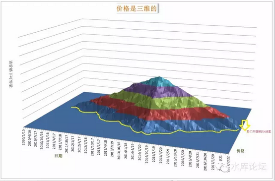

# 价格（一）\-\-\-\-- 三维价格 \#550

原创： yevon\_ou [水库论坛](/) 2015-12-01

价格（一）\-\-\-\--三维价格 ~\#550~

对价格的理解，是区分菜鸟和专业的重要特征之一。

一）迷惘

99%的人，对"价格"的理解是错误的。

对于绝大多数的人，他们所谓的"价格"，是"最后一次成交的价钱"。

好比他们跑到新开发的远郊，花60000/m买下一套品牌CEO房。然后他们就认为自己的房子"值"六万。

理由很简单。他们刚花六万买的，真金白银的交易。

如果改天KFS再推一批房源，定价70000/m，他们就会弹冠而庆了。互相摆酒庆祝你的房子"升值"了。理由是现在有了七万的成交。

而事实呢，由于"处房情结"。一手和二手是严重割裂的市场。绝大多数CEO盘在二手市场根本抛不掉，或者要深深的折价，长久的套牢。

这是第一个问题。

第二个问题，则是"价格"完全无法预测。

绝大多数人有过这样的体验，甚至有IT理工男费尽心机，想找一幅"楼市K线图"出来。

他们试图看技术指标分析楼市的走势，试图分析"K线图和涨跌"。最终却总是无功而返。

楼市对于他们来说，简直是诡异的，混沌的，无理性的。

从现有的价格，现有的数据，理工男完全无法推测"未来"。一错再错。

而炒楼赚的是什么呢。炒楼赚的就是预测未来，并且押对了。

二）三维价格

理工男最大的问题，在于他们一开始的"世界观"就是错的。三观就是错的。

世界不是那样的。

他们老师教给他们的模型根本就不对，框架错了，以后怎样的分析都是错的。

为什么，你首先需要知道一个至关重要的词："价格深度"。

Price Depth，价格不是二维的，是三维的。

举个例子，假设一个小区，有100套房子，100个业主。

Step 1：100个业主，全部都挂30000元/㎡出售价。

Step 2：70个业主，要价30000元/㎡，30个业主，要价50000元/平米

Step 3：30个业主，要价30000元/㎡，70个业主，要价50000元/平米。

Step 4：1个业主，要价30000元/㎡，99个业主，要价50000元/平米。

Step 5：1个业主，要价30000元/㎡，99个业主，要价80000元/平米。

请问，房价涨了么？

在这个例子里，你可以清晰地看到，Step
1\~5，每一个步骤房价都是上涨的。而且涨幅还不小。

可是在"傻空"的嘴里，这个小区，最近五年，是完全没有任何涨幅的！

在傻空嘴里，他们是怎样看待这个世界观的呢。

Step 1：只需要30000元/㎡就可以买到该小区。

Step 2：只需要30000元/㎡就可以买到该小区。

Step 3：只需要30000元/㎡就可以买到该小区。

Step 4：只需要30000元/㎡就可以买到该小区。

Step 5：只需要30000元/㎡就可以买到该小区。

Step 6：OMG，房价一夜之间从30000涨到了80000，涨幅巨大！

价格是三维的，不是二维的。你所看到的二维，仅仅是三维价格在边际上的一个投影！

你们必须清楚地知道，"K线图"是二维的。其中X是时间，Y是价格。

Y仅仅代表的是"最低一套抛盘"，而不是全部的价格信息。他仅仅是一条边。

如图，价格是三维的。他其实像一座山一样。

而我们理解的"K线图"。仅仅如图2中的黄线，他仅仅是山脚边际。

当你认为价格始终"维持稳定"在三万的时候，其实上面的99位已经提价，一骑绝尘。

你完全不知道。你没有花一丝一毫心神，来关心那99位业主们的想法。关心那些甚至从来都不挂牌的业主们的想法。

而这股力量，99人要比1个业主更庞大，更不可撼动，更无可逆转。

大势如山岳。

等你醒过来的时候，你已经被屠杀。

我们一直很喜欢一句话，"当你发现差距时，差距已无可逆转"。

当傻空最后发现"房价在涨"时，往往已经到了Step 5。

三万扫光，是没有三万一，三万二的。

甚至也没有四万一，五万一。

直接上六万，"跳涨"。

绝望，屠杀。

如果我们的经济是一天一夜，缓慢连续变化的话。

那我们的事物"价值"，一定也是缓慢连续变化的。

任何一个模型，必然是缓慢渐变的价格走势。如果你目瞪口呆，一夜之间30000涨到了80000，那一定是你的模型不对。

三观需重塑。

三）预测未来

未来是什么样的，未来是可以预测的。而非门外汉看楼市，雾里看花"无法理解"。

价格分"总体价格"和"边际价格"。

-   99个业主的想法，就是总体价格。

-   最低最低那1个业主的抛盘，是"边际价格"。

中国人往往稿混淆掉了其中的区别。市场上弥漫的楼市分析，包括中央政府报告，他们讲的全部都是"边际价格"。

你看链接，搜房，爱屋及屋的网站数据，反应的也是"边际价格"。

"边际价格"当然很重要，因为他代表目前在市场上切实可以成交的价格。

可是"边际价格"不能预测未来。预测未来，主要看"总体价格"。也就是那99个业主们的想法。

我们常常有这样的体验，一个小区，卖得最便宜的"卖一，卖二，卖三"。

当你把卖一扫掉，房价上涨5000元。

当你把卖二扫掉，房价上涨5000元。

当你把卖三扫掉，房价上涨10000元。

三套房子扫掉，整个小区均价上升了二万元。均价一下子就从六万涨到八万了。

中介天天打电话给你，"便宜的卖掉了，剩下的就贵了，快买快买"。

你不屑一顾，把电话挂掉。其实中介说的却是实话。

这种情况怎么解释呢。解释就是：整个小区的"总体价格"，97个业主都是挂80000的。

有且仅有三个神经病业主，卖一60000，卖二65000，卖三70000.

把三个神经病扫掉，整个小区就全是正常人了。

\* *浙江人比较大概率担当神经病角色。*

所以职业炒家有时候和"踢馆的"很难通气沟通。

职业炒家："又涨了，又涨了"。

踢馆的："你那小区还有20000的抛盘"。

职业炒家："又涨了，又涨了"。

踢馆的："你那小区还有20000的抛盘"。

职业炒家："又涨了，又涨了"。

踢馆的："！@\#￥%......&\*（）"。

四）总体价格

踢馆的已经忍无可忍了。"你那是诡辩"。

"既然成交的都是最低价格，你凭什么说99个人都在提价。你能代表这99人的想法么，三个戴表么"。

我们的确不能代表99个人的想法。

但我们大致知道9999999人的想法。

在过去五年，无论你如何嘴硬，有一句话是无论如何否定不了的："大势在涨"。

大势在涨，如果2010年上海楼市是5/3/2，则2015年上海楼市逐渐实现了8/5/3的布局。

不仅仅大势在涨，而且我们可以很明确地和你说："未来在涨"。从目前拍卖的几个地块来看，很明显三年之后，上海就是一个"普遍十万"的局面。

中环线附近，无论是大宁，新江湾，汶水路，还是杨高路，锦绣路，甚至上南，全部都是逼近十万。

大势在涨，逼空在即。

而另一方面，房地产又是一个高度"同质化"的市场。

房地产不是股票。医药股和电信股的走势，可以完全没有关联。

房地产其实是"一个市场"，尤其是同一个城市之内。板块之间存在比价效应，存在尊卑阶梯，内环永远比中环贵，中环比外环贵。逆袭可能，但是很难。

如果以指数描述的话，则房价=大盘指数+板块指数+小区指数。

而他们的比重，几乎可以看作：房价=大盘70%+板块20%+小区10%

另一方面，"房东的实力在增长"。

很多人忽略的一个方面，不仅仅买家的实力在增长，每年增加几十万存款。

而且房东的实力也在增长，每年也增加几十万存款。

房东越来越不差钱，也就越来越不把几百万的房款放在眼里。

这些因素集中在一起，我们可以有很大的把握说"99个人在涨价"。市场的重心在不断上移。

你如果看不见这99个人，把目光死盯在1个不调价降价的可怜虫温州钢贸厂厂长。你就很有可能面临"3万-\>8W"的突变式上涨。

其实不是涨，是笋盘没了。

五）所谓笋盘

然后说一下笋盘的问题。在傻空眼里，他们是无法理解"笋盘"的概念的。

因为傻空是单细胞生物，他们观察这个世界，价格是二维的。是K线图。

你和他们说，"这套房子很笋，500W的房子只卖300W"。

傻空会反过来问你，"据我的理解，价格就是最后一次交易的价钱"。

"如果这房子卖给我300W，*为什么我不可以理解成这房子只值300W呢*"？

所以傻空永远无法炒楼。他们根本无法判断价值和未来中枢在哪里。

而真正职业炒家的理解方式呢，职业炒家眼里，是有二个价格的:

-   总体价格，99个业主们的心理价位

-   边际价格，最便宜的1个奇葩价位

当这二个价格发生冲突的时候，我们就认为是笋盘。

是笋盘就买入。

然后偏执地认为，他不应该是20000/m，而是50000/m。

让时间发酵一切。

六）高频市场

"笋盘"是一种很不正常的现象。

*Step5：1个业主，要价30000元/㎡，99个业主，要价80000元/平米。*

RT，很多人会问，如果市场价80000，别人都卖八万的话。

为什么会有一个业主卖三万呢。

这个问题问错了。错在因果倒置。

正确的说法，应该是"市场上永远有8W卖3W的现象，问题的关键是，为什么会给你遇到"。

如果你学习真正的经济学，你就会知道，经济学所谓的"完美均衡状态"其实是不存在的。

市场上永远有人卖贱货，买贵货。永远有人不领市场行情。

不领行情是正常的，常态化的。人人都领行情才是不正常的。

问题的真正反面，是市场上还存在很多"套利者"。简称"商人"。

市场永远有起伏的，而套利者就是鲨鱼。

当一旦发现市场的"套利机会"时，套利者就会杀入。夺去利润，互相厮杀。

你每天吃的大米，洗发水，电脑配件，真实都存在价格起伏现象。只不过"套利者"足够多，商人足够多，竞争的结果价差被抹平了。

而房地产这个市场，关键是"套利者"\~\~我们称之为"职业炒家"人数极其稀少。

水库论坛之前有近七篇文章讲《职业炒家1\~6》，讲的就是这一行人数之少。全国可能不到1000个人。

买卖房产，本身就是一件门槛巨高的事情。

而一套1300W的房子打折700W，你纯粹是因为他低估而买入。把一千万的房子当"生意标的"。这还不是你唯一资产。

能做到这一步的人就更少了。

在目前"限购限贷高营业税"的大环境之下，每天都有贵妇和破产老板在贱卖贵买资产。

傻子太多了，鲨鱼不够用。

笋盘太多了，炒家赚到手抽筋。绝对蓝海。

七）三维价格的实际分析

最后，我们说几个实际例子。

第一个例子，是深圳的房地产市场。

今年深圳张了近60%。而到了年底，被打压一整年的文课生小编终于又忍不住了，跳出来喊"深圳楼市开始下跌"，"业主削价10%抛盘"，"花园小区大降五千"。

深圳楼市有跌么，我们可以告诉你一个例子。"*当所有的业主都在提价时，整体房价却是下跌的*"。

Step 1：ABCDE挂盘20000元/平米，FGHIJ自住不卖

Step 2：ABCDE挂盘30000元/平米，

Step 3：ABCDE挂盘40000元/平米

Step 4：ABCDE挂盘50000元/平米，F卖45000

Step 5：ABCDE挂盘60000元/平米，F卖60000

Step 6：ABCDE挂盘60000元/平米，F卖60000，G卖55000

你仔细看这个模型中，对于单个的A，单个的B，ABCDEFGHIJ每一位，其价格都是"越提越高"。

然而：

Step 5的小区售价是：60000元

Step 6的小区售价是：55000元

这一步中，小区价格却是下跌的。

为什么会这样呢，你采访一下业主G，问问他是怎么想的。

"这套房子是我几年前二万买的"

"买了之后醉心工作，也没怎么关心房价"

"前几天我去中介问了一下，哇塞，中介说现在市价快到六万了"。

"我想想，我也不那么贪心。就挂个55000，咱也不要挂到尽，赚二三百万很知足了"。

这就是楼市中常出现的现象。每当一轮大涨涨完，常常有一些原先"不卖"的业主改为出售。

而这些业主的挂牌，通常比长期拼搏在第一线的炒家们要低。一般是九折。

然后我们再说第二个例子：上海市场。

今年上海涨得没有深圳多，但平均也有30\~50%。大致是六万均价的房子涨到八万。

很多人感到绝望。但我们可以跟你说，"你还能买到去年价格的房子，现在是笋盘最多，发财最容易的时刻"。

道理也是类似的，市场不是一个人，是100个人。

价格不是一个价格，是100个价格。

中国学生受传统教育的毒害太深。总是以"整体"看待问题。却完全不知道"细分结构"。

当整体大势涨了40%之后；

你能确定每一个楼盘，每一个小区，每一个业主，所有人都提价了40%？

你能确信市场如此有效率，讯息如此准确无误直达每一个人?

答案肯定不是的。市场无序才是主流，价格混沌才是主流。直到商人重新把他整理到"均衡市场"。

所以每一次大涨之后，肯定有业主跟不上形势。

肯定有别人都卖8W了，某无知小白业主，还保留着6W的售价。

这等于在已经确定涨幅之后，再给你一个去年的价格。

所以"捡漏"始终是一种低风险的交易策略，只要你花心思去做，在任何已涨的区域内都可以发掘出懵懂的业主笋盘。

低风险高收益，捡漏流。

（yevon\_ou\@163.com，2015年11月30日晚）
