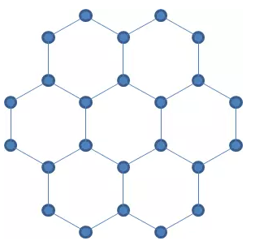
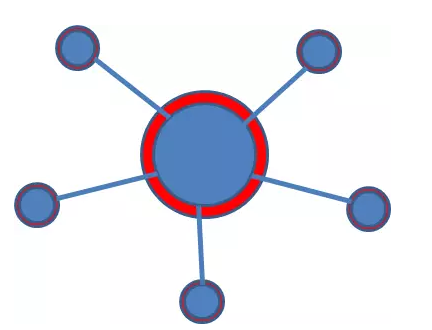

# 城市规划导论（二）\-\-\-\-\--不可预测 \#590

原创： yevon\_ou [水库论坛](/) 2015-12-08

城市规划导论（二）\-\-\-\-\--不可预测 \#590
======================================================================================================================================

政府拥有强大而可怕的力量。

最可怕的是，这股力量还不可预测。

一）城市生长

中国和外国房地产市场最主要的一个不同，在于中国的增长率非常快。

中国的GDP年均复合在8%左右。按照这样的速度，实体国力每九年翻一番。

因为城市和建筑本身就是实体财富的一种。中国速度，部分意味着中国的城市和城镇建成区，每八九年翻一翻。

如果各位熟悉上海历史的话，就会知道二十年前，1995年，上海所谓"郊区"的边缘是什么。

是徐家汇!

是中山公园。是浦东南路。

而到了金桥，已经全部都是养鸡养鸭的农田了。

如果是北京老土著的话，则对于北京修三环，尘土飞扬记忆尤深。过了三环，一般就是荒郊野岭可以飙车的地方了。

大约十年之前，上海的边界扩展到了莘庄。到了2015年，莘庄已经成了不折不扣的市中心。郊区的概念，成了泗泾，松江。

我们常常说笑话，某移一代给家里寄家书。说是已经在上海落脚，住进了市中心。家人问，"市中心哪里啊"。

"黄金地段，宝山大华"。

我们举这个例子，主要是告诉各位，中国正处于急剧的"城镇化"过程中。

所有的中国大中型城市，都在飞速地成长。

作为城市定义的无论"人口"还是"建成区"，这二项指标都在飞速发展。

城市每隔十年就扩大一倍。

二）政府的力量

政府具有强大的力量。通过中央金融，政府每年可以取走全社会10%左右的财富。

再加上税费，垄断牌照，舆论和媒体机器。政府力量强到如Levithan一样大怪兽。

政府力量有多强。一句话可以形容："花十年时间，政府可以把中国所有城市全部都打造一遍"。

因为中国的国力，每过八九年就翻一翻。城市每过八九年就大一倍。

你给政府八九年的时间，政府的力量甚至可以大到打造一个新的郑州!

在上一篇中，我们说到了十八蜂巢图：

然后我们"煞有其事"地分析，在各大CBD确定的情况下，哪一些地理位置到各大商圈距离最短。哪一些地理位置对于固定行业（如IT，航运，宝钢）来说，生活半径最短。

但其实这些分析，都是酸臭腐儒，盲人摸象。

因为社会变迁实在太快了。等你分析了半天，抬头一看，全社会的商圈可能已经变成了如图：

那你还玩什么呀，赶紧洗洗干净，往东奔吧。

当时代剧烈变迁时，重要的不是现有资源的优化。

而是尽量抓住变迁的节奏。

三）三面临水

政府的力量实在太庞大了，宛如大象闯进了瓷器店。

他完全可以平地打造一个深圳，而把千年华南中心城市广州，贬为一个副手。

他也可以打造重庆，目前重庆GDP已接近成都1.8倍。西南核心早已易主。

但是，真正令炒房客畏惧的，不是这股力量之庞大。而是这股力量之不可预测。

有一件事你一定要清楚知道，"政府做决策，绝不是最经济最有效率的"。

如果政府做事，是"聪明"的。是有效率，有理智的。

那政府的"下一步"是可以预测。智者可以推算的。

如果政府做事是低效率，愚蠢，烧钱的。

那神仙也猜不到他下一步会做什么。

举个例子，1990年的"浦东开发"，上海人就想破头也想不到，他究竟要干什么。

熟悉那段历史的人一定都知道，当年上海旅行社还有一个旅游节目："二龙戏珠"。

专门带外地人来参观南浦大桥+杨浦大桥+东方明珠。

说是1991年投资8.2亿。南浦大桥是全世界排名第三的叠合梁斜拉桥。技术难度领先，工艺复杂。如何如何雄伟云云。

上海人就想不懂了。你如果真的要搞一个"xx开发"，你为什么不放在松江？

松江四面全是陆地。你要去松江，拉二条高速公路很容易。

何必搞跨江大桥这么麻烦。

你觉得"二龙戏珠"如何宏伟，如何工程复杂。其实经济学上都是浪费。

陆家嘴本身是一个半岛地形。几乎三面临水，进出陆家嘴极不方便。

当"开发陆家嘴"之后，剩下的事几乎全都是在给它打补丁。

进出延安路隧道，每天都堵塞得快死人。为了缓解陆家嘴交通难题，才陆续修了复兴路隧道，人民路隧道，新建路隧道。

这些隧道，再加上彼此之间的换乘和并轨，把陆家嘴搞得象个大迷宫。没导航几乎不能开车。

可即使这样，陆家嘴还是交通死地。他本身的半岛地形，就决定了交通绝不可能方便。根本不适合做大型CBD。[\[1\]]

在此以后，浦东陆续拉了十九条过江通道，消耗了无数无数银两。

"开发浦东"的珍贵投资，就这样全浪费在大桥隧道上了。

其实浦东根本就不应该开发。你开发松江多好。建设成本绝对大大省钱。

如果你按照"效率"原则。你是绝对猜不到政府会开发哪里的。

因为开发浦东的资金，不是上海市政府的。是中央给的。领导觉得陆家嘴风水很好，颇有王霸之气，于是就圈了一圈。这叫考虑重点不一样。

四）不可预测

如果一个城市的规划是"有效率"的，那么他大致是可以预测的。

譬如说，一般认为，较有效率的是"摊大饼"模式。

如图，新城绕着老城的边缘，一圈圈建设出去。

这样的方式，可以最有效的利用老城的资源。成本很低。

同时，每一个决策尽量由"民营企业"来做。尽量让个人选择成本最低的地方。则市场自然会根据交通成本，来配置合理位置。

另外一种模型，则是认为应该大力发展卫星城。然后靠高速通道和市中心交通。

例如：

}

这其中的每一个卫星城，都可以尽可能地在内部实现"工作\-\--生活\-\--沟通"。而不用赶往市区。减轻交通压力。

这个模型的缺点是，一般能活得下去的卫星城，都是"功能单一"的产业。

例如宝山钢铁，金山石化，外高桥电厂。一个宝钢就是一个小城市，自然不用往返市区。

但是真正的现代Metropolitan，往往是一个复杂的[创新综合体]。他体现在复杂性，而不是单一性。

只有在数千万人的市中心，才能产生伟大的文学，艺术，创意，新产业，VC，宗教思想，理想和勇气。而卫星城，简直和农村差不多。

所以大城市的核心还是要靠"母体"。还是要靠当中那个圆尽可能地大。堵车还是不可避免。

复杂生态才能产生高等文明。

以上都是正常城市。可是在中国，我们还能发现"2B城市"。

2B城市的含义，是领导突然一拍脑袋。在无数"规划系高才生"师兄的抗议反对声中，非要搞新区，非要搞上千亿的大工程。

按照官场标准的说法，"规划就是一张擦靴纸"。

市场导致的城市扩张模型：

2B领导导致的城市扩张模型：

我们知道下一种模型是没有效率的。可是领导喜欢啊。

"全新规划，彻底平整，多漂亮啊"。

"上千亿的工程，投资不怕大，投资只怕不大。原因你懂的"。

市场的力量是微弱的，缓慢的。

我们说"银川新城"，双子城之间会被缓慢填满，因为效率。

可是这个效率，是精打细算，是一分一毫，是润物无声的。

而政府的力量是"爆裂"的。高层官员一挥手就是千亿投资。平底上可以兴起一座座百米大厦。一拉就是几平方公里的新城。

亏损，亏损怕什么。政府最不怕的就是亏损。

最关键的是，他还拥有大量力量。力量大到了每过八九年就可以重建一套老城区。

又有钱，又任性。

超级超级有钱，超级超级任性。

既然这样，你还精打细算研究什么地段啊。

大家费尽心机猜"政府的下一步"不是更好。

如果我们能看到政府内部文件，这其实并非完全保密的。

如果我们能预先料到下面的投资重点，岂不是可以赚大钱。

在人民广场市政府边上，在这寸土寸金的地方，却有一座"上海城市规划馆"。

炒楼客可能是全上海最早一批参观，也是最认真一批，而且去了二次三次。

各区内部定期有"十三五"规划白皮书。

房地产业的同行，例如"上海房地产观察"可以拿到未来6个月的土地拍卖计划。

可是这一切有帮助么。

下篇再说。

（yevon\_ou\@163.com，2015年12月7日晚）

\[1\][ ]其实小陆滨江做CLD，世纪公园铲掉做CBD，效率可能还更高一点。
