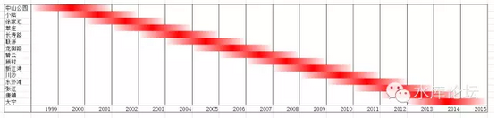
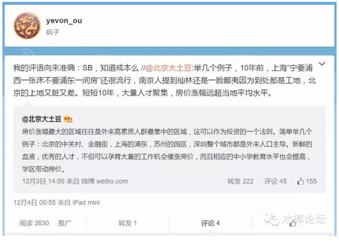
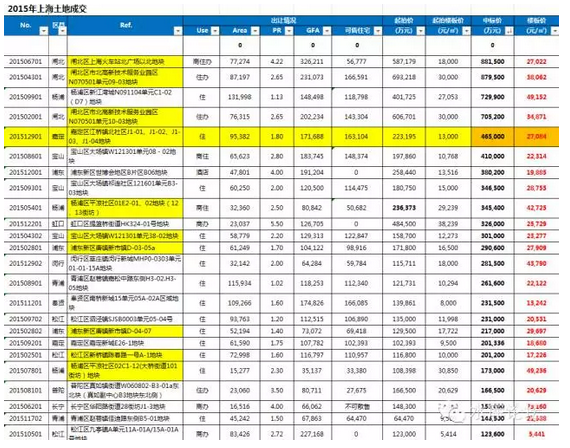

# 城市规划导论（四）\-\-\--板块轮动 \#610

原创： yevon\_ou [水库论坛](/) 2015-12-11

城市规划导论（四）\-\-\-\--板块轮动 ~\#610~
======================================================================================================================================

上海楼市呈现清晰的"板块轮动"现象。

一）起承转合

中国人写八股文，讲究"起承转合"。意思是做一件事，你要有铺垫，有炒作，有高潮，有收尾。

凡事要一步一步来，打拳要打全套。

所以炒作一个板块，通常需要3\~4年的时间。而绝不可能一触即就。

在过去的十五年内，上海楼市大致轮动炒作了15\~20个板块。其彼此之间会有重叠，但是高潮部分绝不撞衫。

\
这是一个大致的示意图，并不精确。请勿苛责。

我们仔细观察这张图表，能得出几个结论：

1）一个板块的炒作时间，约是3\~4年。

2）最前面的一年造势最后面的一年退潮，高潮在中间2年。

3）当一个板块达到高潮时，舆论媒体宣传报道，会极大关注。同时开盘卖地等事盛行。但是高潮过后，就会逐渐沉寂。

4）同一时间段，高潮并不重叠。以免发生二个板块打架。

二）半成品

严格地说，我们对宣传炒作并不反感。

卖商品总要吆喝，商场开幕要剪彩，电影首映要典礼。你卖几百亿的一个楼盘，吆喝吆喝，本属正常之举。

我们真正烦恼的，是"价格"。

为什么。因为如果你是宇宙中心的话，你是宇宙中心的价格。

如果你是半成品的话，你是半成品的价格。

如果你是失败品的话，你是失败品的价格。

最怕的，就是[明明失败品，却卖了一个宇宙中心的价格]。

我们对政府开发新区，开发新土地的行为并不反感。这本来就是人家的权力，竞争无所不在，土地的竞争也无所不在。

竞争，新地段对旧地段的挑战，本来就是人权。

真正令我们烦恼和困惑的，是"价格"。

那些新开发的区域，通常都是"鸟不拉屎"的地方。而且时间短，投入少，即使有些规划，也多处于纸上谈兵的阶段。

但是这些新区，却卖得非常贵，非常贵。

用平移对比的话，大约比他们"20年后"发展成熟状态的那些地段，卖得还要贵。

你譬如说张江吧，张江现在炒得那么高。

可是你知道孙桥么，孙桥离张江只有2KM。房价才二万出头。

政府过二年在孙桥炒作一下，扔二个"学区"分校。炒作点概念还不容易。

那你张江又有什么稀缺性呢。你本来就是一个荒郊野岭的地方。既没有生活设施也没有娱乐设施。

你所谓的"学区房"，成立只有一二年。只有SB才相信那是名校。

如果现在持有张江五六万的二手房。你给我个理由，凭什么晚上我能睡得着。凭什么我看不见孙桥。

今年的IT Bubble，程序员都很滋润，自信心极大鼓舞，觉得程序员无所不能。

但是从全社会角度看，码农并不是一个很高阶生态位的物种。

码农聚集地，也没什么指望成为"宇宙中心"。

象这样产业高度单一，消费群体高度单一的社区，万一遭遇Bubble
Burst......后果不堪设想。

然而，那些花了500\~600W买市区20KM远二房的码农，倨傲地对我说，"俺们新区就是涨得快"。

\@北京大土豆
骨子里就是一个傻空，而且这人最要命的是完全没有任何实战经验。

朋友，那不是涨幅大，那是你成本高。

什么叫涨幅，你买进1W，卖出6W，这个叫涨幅。

而什么叫蠢货呢：你买进价6W。

新区从来就很贵，政府一块块板块炒过去。在二三年的时间内，达到极盛。

最终我只看见你们为数不多的工资，都到了ZF手中去。

从没看见任何一个新区规划建设完成。

三）如何赚钱

即使我们能看穿"板块轮番炒作"的真相，可是我们如何从中赚钱呢。

有三件事至关重要：

1）你手中的板块，政府不会炒

2）涨的是一手价，不是二手价，"处房情结"

3）可怕的交易成本

如果你观测我们目前"中国股市"的话，你就知道事情早已乱糟糟了。

股市之中，股价和业绩，其实已经关系不大。

虽然每一个人都说："价值决定价格"。可是今日股市，真正决定股价的，绝对不是业绩。

决定股价的，主要是有没有"庄"，有没有力量拉扯它。

在楼市中，游戏规则也是一样。

我们常常看见某些板块如凤凰穿天般的拉升，短短几月之间可以涨一倍。原本杂乱破败以为毫无希望的建材市场，莘庄一拍地就是7.5W。

*洗白一句啊，"炒作"这种事，绝对不是炒家干的。*

*虽然政府一直试图把"帽子"扣在炒家的头上，咳咳，真相大家都懂的。*

所以，你手里的货色，哪怕货再好，没轮到你这个板块动，也是不会大涨的。

那我们接着问，"追逐热点，追涨杀跌"可以么。

首先，你不一定能猜中热点。

其次，和所有的"坐庄"一样。拉升这种事，意味着80%的筹码在政府手中。

有时候你可能很看好一些板块，譬如前滩，后滩，东大名路，徐汇滨江。

可是你根本没有筹码！

那些地方，根本就是一片空地，要么是厂房，或者农民房。

你根本找不到切入点筹码。

在《职业炒家（四）\-\--买进》中深刻地讲到了这个问题。

最后，哪怕真的是蒙中了你这个板块，你又正好"捡漏"在旁边有套前几年的板式楼，品质很好，和新的一样。又或者是你买了某个板块"刚开盘"的第一期。

这时候，你还面临二个问题：

1）高得可怕的交易税收。

2）处房情结

价格需要发酵，板块需要时间。你如果在二年之内抛售，税收会非常非常高。而如果你在二年之后抛售，该板块可能又不热了。

四）未来板块

未来24个月，最有可能被热炒的是：

A级选择：大场，江桥

B级选择：南桥，青浦新城，平凉，周浦，新桥

一般根据拍地记录，可以部分预测"下一轮爆炒"之区域。同时，拿地是哪一类开发商也严重影响风格。

\
\
然并卵，提前"预测"到下一个热点在哪里，真实对你的利润并没有太大的帮助。最多多一点饭桌上吹嘘的英明罢了。

当然，你可以试试。毕竟里面还有很多利益和玩法。[\[1\]]

五）理论上限

炒股的人，绝大多数跑不赢大盘。

因为庄家只会拉升自己手里的筹码。所以你的选股，必然落后大势。

同样道理，炒楼这一行，99%达不到理论涨幅。

哪怕你是一个从2035年穿越回来的人，哪怕你掌握了上海楼市的所有涨幅细节，你也是达不到"理论涨幅"的。

因为楼市的上涨，并不是A-\>A，而是A-\>B

         2000年   2015年
  ------ -------- --------
  幻想   A=1      A=15
  实际   A=1      B=15

或许这张表更明确一点：

+------+--------+--------+--------+
|      | 2000年 | 2012年 | 2015年 |
+======+========+========+========+
| 幻想 | A=1    | A=12   | A=15   |
+------+--------+--------+--------+
| 实际 | A=1    | A=10   | A=12   |
|      |        |        |        |
|      |        | B=12   | B=15   |
+------+--------+--------+--------+

幻想中，人们以为楼市有15倍的涨幅。

而实际中，楼市只有12倍的涨幅。无论你穿越回来再聪明也没用。

而如果你追逐热点呢，光税就把你交死。

提这张表有什么意义呢。

因为有很多"冒充"楼神的大神，譬如[zjjzsb]，[业余套利]，或者我同学我朋友我听说。

拜托，请不要动辄说我在楼市赚了一百倍，也不要象写小说一样，翻个三十倍很容易。

楼市和所有行业一样。赚钱不易。你不要看到B=15，可能人家最便宜时就是12。

你也不要以为A=15，可能A最高就能到10。

现实生活永远比理论中的更困难，发动机功率永远比图纸上的要低。认识到这一点，才是你人格长大的开始。

目前市场上"吹嘘"的楼市传奇小说，绝大多数在职业炒家眼中一看就是个坑。吹牛是件系统工程。

（未完待续）

（yevon\_ou\@163.com,2015年12月10日晚）[\[2\]]

\[1\][ ]感谢X提供数据

[\[2\]] 2003年我第一篇被广泛阅读的文章是《用板块的眼光看楼市》
