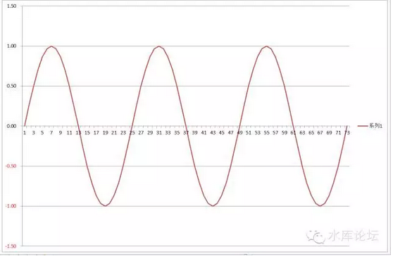
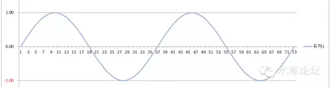
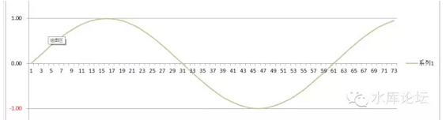
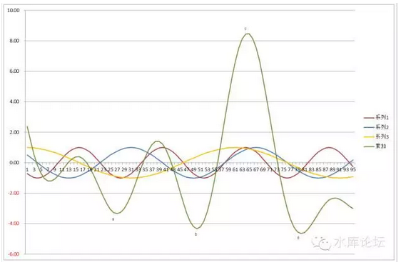
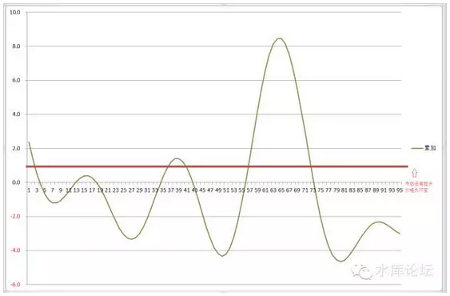

# 三重顶 \#640

原创： yevon\_ou [水库论坛](/) 2015-12-20

三重顶 ~\#640~
========================================================================================================

天时，地利，人和

一）三重顶

在之前的篇幅中，我们用了大量地序章，讲述了楼市市场中几种力量的起伏。

-   人口。本地人/外地人/外国人，各人群势力的消弱，户型的变迁

-   板块轮动

-   季节性

现在让我们来看一个高度简化的数学模型：

\
这是一张非常典型的"正弦曲线"。其波动的频率是二年。

譬如说，你可以把他理解为"市场热度"。热了一段时间，又冷了一段时间。

其次，我们有这样一张图。

\
这是一个三年的起伏。

这是一个五年的起伏。

好了，现在我们将A+B+C，看看三种波叠在一起。会产生什么样的效果。我们有下图：

\
D=（A+B+C）\*3

二）波的解读

我们仔细看这张图表。发现哪些问题。

原本很普通的"二年""三年""五年"正弦起伏，当他们互相凑在一起时，形成了一个更复杂得多的波图（绿线）。

当几股力量交叉影响时，会产生一些低点，如a，b

但另一方面，他也会形成一个绝对的高峰。如图中的c点。

如我们看c点的话，他其实是"三重顶"。也就是红线，蓝线，橙线，三股力量正好都处于"最顶峰"。

三者叠加，瞬间将楼价炒到了极高的顶点。然后就急剧下滑。

如果换算成楼市语，比较象人话的地球话，则是：

"在市场最狂热的月份，在最热门的板块，销售最畅销的房型"。

三）三重顶和三重底

天时，地利，人和。三者同时凑在一起的机会并不多。

大部分情况下，你可能会凑齐其中的二项。譬如在单数年的春季，持有一个非热点的小区。

或者热门的板块，热门的小户型。但是恰好遇见限购限贷加息加准宏观调控。

只有在极少数的情况下，你才有机会见到"三重顶"。例如2005年三月时的徐家汇。或者2009年秋的仁恒河滨城北岸。

在"三重顶"的时候，物业会创出极高的价格。这样的价格，之前没有见过，之后也要很久未见。简直成为了传奇。

许许多多年后你回过头来想，还要惊异当年怎么会这么疯狂，就买了2000倍PE三百元一股的科技股。

三重顶的时间并不长。因为天时，地利，人和都在移动，要三股力量同时吉星高照照耀在你的上空，这样的神眷时刻自然不久。

绝大多数的屌丝三观有问题，他们的缺陷，对于"价格"的理解不对。

在屌丝的侏脑容量中，他们总是以为价格对应于"最后一次交易的数值"。

这样的理解是绝对错误的。价格是三维的，是一个曲线，不是一个点。

"三重顶"时成交的价格。往往是很长一段历史时段最高的价格了。

不幸的是，这个"三重顶"Price，往往是贵妇流，理工科屌丝最有可能充当"买家"的时候。

于是他们就被狠狠宰了一刀。就像300元接盘科技股。此后价格一路下泄。热点不再，关注不再。

价格绝不等同于价值。你买的货，不值那个价。

与"三重顶"相对应的，还有一个概念，则是"三重底"。

三重底的意思，则是在某一个阶段，"时间，板块，人观"全都对某个物业不利。

但这个时候，该物业是被低估的。"**衰到底**"的状态。

而投资客该做的呢。简直已经不言而喻了。

"尽可能地选择三重底买入，至三重顶抛出"。

一般而言，要选择绝对的完美主义，三底三顶抛出是不太现实的。

能在二重底买入，二重顶抛出，已经算是不错的操作了。

四）力量趋势

在实际操作中，"三重顶"这样纯学术的概念是很难落实的。曲线图线也不好画。

但是我们可以心里有底，支持楼市的几股力量大致如何：

-   金融，货币滥发还是紧缩

-   人口，人口流入城市还是流出

-   板块，板块热炒初期还是末期

-   物业，物业类型受宠初期还是末期

每一个人心中都可以有一个小本本。各股力量的正负兴亡，大致还是猜得出来的。

当四股力量全部为正，而且楼价已经涨了很多一截。而且各个热点隐隐有转换落幕之意时；

你基本就可以判断，目前正处于"三重顶"的状态。眼下是该物业峰值。

如果可能的话，可以考虑换筹（在交易成本可控下），换成看好的被极度低估衰到尽的"三重底"物业。

没有一股力量是永恒持久的。除了纸币之外，其他任何指标，都可以认为是在一个大周期内起伏。而不会无限上涨。

沧海桑田

五）炒楼业的基础

炒楼是一门手艺，一门很本分的手艺。

炒楼这一行，讲究的是楼宇的买卖。高抛低吸，估值价格。

其本质，和大豆交易员，小麦交易员，贱金属交易员，并无任何不同。

你在郑州商品交易所，每天都有无数的交易员，无数的电话，在研究着华北平原的降雨情况，在研究着巴西大豆的病虫害发展。在研究着化肥，农药，汽油运输等上下游的价格。

那么多的研究，最终只是为了在CZCE下单买卖大豆小麦。所有的研判，只是为了对商品价格的估计更准确一些。

炒楼业同理，炒楼只是普通的商人。和门口卖水果的小贩并无任何不同。

商人想要生存下去，商业想要对这个社会有所贡献。关键是要研判"波动---起伏"，研究价格背后的规律。

我们首先要知道，价格是由几股力量合力组成的。金融+人口+板块+小区

在此基础上，再作"细分"。

-   将楼市的消费者群体细分成六个类型。其各自的喜好兴衰如何。

-   将板块细分成轮炒，踏板节奏如何。

-   将季节细分成春夏秋冬。

-   ............

随着研究的深入，我们对各大影响因素的理解还会更深入。

你越是深入，越是能理解楼市的波动频率。楼价是"有逻辑的"，不是无逻辑的。不是小白领不能理解的疯狂诡异目瞪口呆看不懂的。

炒楼本身是一门手艺，是一个行业，是一类商人。

只要大豆存在，大豆交易员就永远存在。

只要住房存在，炒楼业就永远存在。

这是一门手艺，可以子子孙孙传给后来人的。也可以著书立作传给外人的。

炒楼就是商人，没什么神秘之处，也没什么可抹黑污蔑的。

研究波动曲线，高抛低吸。像绣花针一样地精心判断每一件权重。

这就是我们的工作。

《1942》片尾张国立对栓柱说，"成为富人的法子我知道，只要活着到陕西,给我十年,爷还是地主"

只要大众一直仇视敌视炒楼业，用一种扭曲的宣传环境看待炒楼。则再过十年，爷还是地主。

六）道火不熄，炒楼不灭

在炒楼业的眼中，市场是一个曲线。高抛低吸，三重底到三重顶。这就是我们生存的基础。

可是什么时候，市场会形成一条"直线"。如图中的红线，完全没有套利的基础。

没有起伏，也就完全没有炒楼这个行业生存的基础。

\
这个答案是难，很难，非常难。

如果市场从2000年\~2015年，完全是一条直线（扣除通胀因素）。

则意味着市场是"高度有效"的。

所有的人，都具有"高瞻远瞩"的目光。都知道目前大热的板块，过几年会不再热。

都知道目前热捧的户型，过几年会不再捧。

都知道目前炒热的概念，过几年不算是概念。

都知道处房情结。

都知道拆骨法与折旧。

都知道并理解人口趋势。

都精算回报率。

这些要素全部都满足。几乎是不可能的。

经典的经济学教科书理论，也仅仅是写"当市场上炒家足够多，炒家之间的竞争会扯平套利利润"。

可是如果我们深入想一想，一个"完全有效"，彻底没有起伏的市场，意味着什么。

意味着今天热捧的区域，他价格不能高。

今天冷门的区域，他价格不能低。

月租金10W的商铺，和月租金1W的商铺，其售价可能是一样的都是500W。

一个月租金3W的热门住宅，和月租金3000的荒郊野岭，其售价应该是一样的。

这几乎是不可能的。当前热门的区域，其价格必然会高。当前冷门的区域，其价格必然低。

要热点不高，冷点不低，则前提是"至少50%的买家是投资客"。

*消费讲究的是当前，投资讲究的是未来。*

*投资本来就是基于未来的判断，未来和现在必然是不重合的。*

所以，每当我们听见住建部高层大喊："要提高住房的自住属性，削弱投资属性"。我们就忍不住想笑。你真的懂经济学么。

提高自住属性，必然使得价格[只反映现在，不反映未来。]

你越是强调一个楼盘99%自住，则价格必然越扭曲。波动必然更大，获利空间更强。炒楼更昌盛。

这种做法，就好像强迫所有的股票上市都是15倍PE。然后宣布价值投资，打击炒作。

公司的赢利发展方向本就不同，怎可强制统一15倍估值。

你越是强调自住，市场越是投资空间巨大。

这就是经济学。

（yevon\_ou\@163.com，2015年12月20日午）
