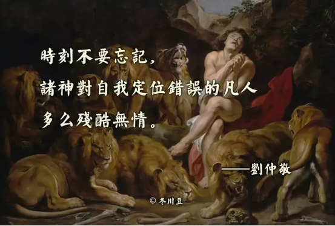
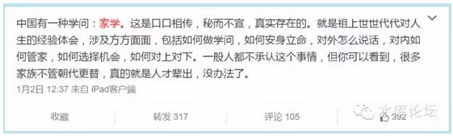

# 中二病 \#670

原创： yevon\_ou [水库论坛](/) 2016-01-09

中二病 ~\#670~
=========================================================================================================

你TMD是不是中二病又犯了。王子病公主病，以为世界绕着你转啊。

一）伟大的舵手

中国人有一句老话："伟大的导师,伟大的舵手"。在鼎盛时期，大约有20亿人在齐声欢呼着这句口号。

为什么要用"舵手"这个称号，和导师统帅领袖并列呢。

因为治理大国，有时候的确就和舵手差不多。

你就象是驾驶员。开着一辆汽车，有时候需要加加油门，有时候需要踩下刹车。转弯或者上下坡要特别处理。

当然铅笔社认为政府最好"完全不要干预"经济。这是另外一个话题。在此处，我们仅仅是说，政府对经济的影响是巨大的。

十年调控，其实就是政府在开车，刹车和踩油门。

二）七月一日

研究房地产"宏观调控"，有一个关键性的节点日子，是无论如何也绕不过去的。我们很奇怪诸多史学研究怎么会忽略这个日子。或许社科院都是稿费小偷。

2003年7月1日，香港爆发了50万人"沉默大游行"。大约相当于总人口的8%。

七月一日这一天，秀相正好在香港。

这甚至是他上位之后的第一次外交访问，第一站外出访问。秀相去了香港，庆祝回归日，然后他就遇上了五十万人大游邢。

那一天，铺天盖地丧尸般的人群，占领了中环广场。他们口戴口罩，一言不发。其人数和规模都创了香港记录。

更要命的，这些人还不是底层贫民，外来人口，偷渡客之类社会底层。

这五十万人，基本上全部都是香港的中产阶级。也就是整个社会的核心。

是执政的基础。

中产阶级的诉求很简单，非常清晰，只有一条。

"我要房价涨上去，楼价不能再跌了！"

那一天，董建华站在城楼上，面如土色。

那一天，秀相访问香港。就站在董身边。

2003年7月2日，董建华宣布因身体原因。婉辞香港SARS特首职务。

这是一个决定性的日子。用多少词语强调它的重要性都不够。所谓"节点---路径"，这就是节点。

遗憾的是，中国国内的普通小白领，傻空，楼市"分析家"。几乎没有任何一个人注意到了这件事。

他们唯一能获得的外媒资讯，也无外乎"七月一日香港爆发欢庆游行"。

"游行是在欢快热烈的气氛中进行的"。

"进行了友好热烈的对话"。

资讯上的距离，从一开始就注定了某些人的输局。

三）做官的人

对于做官的人，他最重要的行为准则，甚至全部的核心利益，概括起来就是："把这官当下去"

贬官丢乌纱帽，才是当官人最害怕的事。除此之外，其他皆可抛。

2003年7月1日，董站在城楼上，面如土色。

温就站在他的身边，兔死狐悲。

对于秀相而言，从那天起，他就订下了一条原则，这也是未来十年**房产调控主线轴**：

"绝不让董建华的故事在他身上重演"。

这个才是理解整个历史故事的核心。所谓"正三观"，你只有先把三观洗干净了，后面的分析才能继续。

源头，线头找到了，整条线索才可以依次剥开。

我们说，对于大国的领导。他其实象个舵手，象个驾驶员。当动力衰竭时，他就加一点油门。当速度太快时，他就踩一点刹车。

2003.07.01事件的后果。就是秀相特别喜欢踩油门。他无论如何也不肯踩刹车。

四）只涨不跌

秀相的心，在2003.07.01就已经定型。而智者，早在2003年时就已经把他看得定死，无论如何翻不出手掌心。

秀相的心思是什么，"不能跌"。

房价维持现状，那自然是最好的。天下太平，上上大吉。

可如果房价一定要波动，有起伏，那怎么办。

那只能往上走，绝对不能往下跌。

-   房价上涨的风险是可以接受的。

-   房价下跌的风险是[不可以]接受的。

因为房价上涨，最多是老百姓不满，老百姓骂娘。骂娘就骂吧，虽然也不是好事。

但如果房价**下跌**。那就是五十万人上街，就是和董伯伯喝下午茶去，二个人一起做退休工人了。

对于一个官员来说，他看中他的政治生命。做官，做大官，继续做官，才是他的核心利益。

骂娘总比下台好。

所以房价可以平，可以涨，但就是不能下跌。尤其不能大跌。

好了，现在问题来了。房价有50%概率上涨，50%概率下跌，请问你该如何决断？踩刹车还是踩油门。

[秀相绝大多数情况下，面临的是如此选择。]

我们常常说"政令不出中nan海"。但同时也说"天子久居九重之中，不知民间疾苦"。

对于皇帝来说，其实他受的蒙蔽也很厉害的。

我们常常开玩笑说，便连最高级别领导，也不知道经济运行的实际情况。

因为你看到的数据，都是下面基层层层报上来的。不知道经过了多少层加工，多少层注水。

你想要试探查访一些民情，不知道经过了多少重安排，遇见的人都是事先排定好的。

所以天子其实并不知道民间的真实情况。

对于秀相来说，他面临的情况很类似。

秀相并不知道市场的真实情况。当他要做决策，做舵手的时候，一样面临抉择。

譬如说，秀相拿到一份报导，是叶檀，牛刀，或者易宪容写的。

上面说中国的房地产大量积压，投资客纷纷跳楼，秋后的蚂蚱没几天了。房地产市场濒临崩溃。北京楼价要跌50%。

秀相一看，那个急啊。跌50%还得了了。岂不是和董伯伯喝下午茶去了。

于是赶紧出政策，收紧土地供应，收紧KFS贷款，紧守18亿亩红线。这就是"国五条"啊。

"国五条"的意思是什么，意思就是减少供应，让房价大涨。

而事实的真相呢，2005年的时候，房地产一点都不冷。一点都没有崩盘的危险。一点都没有"北京跌50%，上海跌70%"。谢国忠纯粹就是一个SB。

而秀相在抉择之中，再踩了油门，再添了一把火。于是楼价就飙上去了。[\[1\]]

也就是说，同样在油门与刹车的选择之中，秀相更倾向于选择油门。

同样在上涨的谣言，和下跌的谣言之中；秀相更倾向于相信下跌的谣言。

这在心理学上称为选择偏好。当年张伯伦就是这样相信希特勒的。

而秀相，对于"房价大跌，濒临崩盘"的谣言特别敏感。特别容易相信。动不动就要出个政策减少供应。

而市场呢，却是大旺。于是踩了油门干脆就爆涨了。

五）邪恶的媒体

水库论坛，在很早的编号\#80时，就写到了《邪恶的媒体 \#80》。

为什么要特殊提取媒体鞭打二句，为什么要在总纲的位置就写道"邪恶的媒体"。因为这一个事的确很重要。

媒体的职责，有且仅有一个，就是报导事实。

中国的媒体小编们，一方面受"抗日青年"剧毒害太深。一方面又受欧美法律伦理体系的教育太少。

中国的媒体小编们，对于"报导事实"这件事，职业操守实在不高。

而另一方面，媒体小编对于"伸张正义"。却有着不符合其身份的热情，为此不惜捏造偏袒谎制新闻。

在媒体小编们的眼里，那些接近于文盲的文科生，他们当然认为"房价上涨"是不对的，是邪恶的。是需要打倒的。

而对于他们捏造假新闻的事，却是自我感觉"崇高的，伟大的，正义的"。

自2003年开始，我们就没有在正常的官方媒体上，看到过任何**中立**的楼市报导。

我还真奇怪了，一场连续十几年的超级大牛市，累计涨幅十四五倍。

平均每个月上涨1%。

半年涨幅超过50%的，至少五六次。

这么大的一个特特特特特大牛市，到了媒体小编的嘴里，怎么就变成了"楼市大跌"呢。

你去看看媒体报道。从2000年到2003年，从2003年到2016年。

哪一个月份，哪一篇报道，哪一份新闻，不是"楼市大跌""楼市萧条""炒房客跳楼"。

你这个选择性报道，已经选择性到了[无耻无脸]的地步。一个特特特特特大牛市，居然能被你宣传成每一个月都是下跌的，每一个月都是负面新闻。

更为恶劣的，除了倾向性报导。你还制造"假新闻"。

包括CCTV2《经济半小时》，其重磅专题报道中，有多次大规模造假行为。外行人文科生编出来的故事，在内行人眼里破绽百出。

职业炒家一看就知道你整个故事都是虚构的。以后章节会细说。

冬川豆说，"所有的恶行，在神的面前都会遭到惩罚"。而报应来的是极快的。

文科生小编捏造事实，谎报新闻。而他们的报应非常非常之快。

对于秀相来说，他是高度高度关注"下跌"的。

房价上涨虽然是一个坏消息，会导致民怨愤怒，但至少不是立即致命的事件。

但一旦听说到"房价摇摇欲坠"的消息，秀相立刻睡不着觉了。要找董伯伯喝下午茶去了。

所以新闻媒体CCAV上越是报道"房价大跌""炒楼客跳楼"；

对于中央层面的政策，越是要暖风频吹，尽一切的努力，再把这个房价托上去。

你以为"国五条""国七条""国九条""国九条新"是降房价的么。

拜托，麻烦你再仔细看一遍法律文本，一条一条地仔细地看，掰开来认真用经济学算算。

他其中的每一条，都是烘托房价的。

所以这形成了一个循环。

-   越是楼价上涨，文科生小编喊得越是凶

-   网上充斥着房价即将崩溃的新闻，到处都是假新闻炒楼客跳楼，KFS破产

-   秀相一看KFS破产，赶紧出救市政策

-   房价继续涨

道德是一切的基础！新闻从业者*有且仅有一个任务，就是报道事实真相。*

*不需要你们去"申张正义"。经济太复杂，政治太复杂，这些事你们搞不懂*。你们所主张的，或许反过头来反害了你自己。

造谣，本身就是违反道德的事。你们因此而买不起房，乃是天谴。

在一个真正的有品德，有知识，有正义感的人眼里；

他对于这个"新闻\-\-- 下跌 \-\--
阻止下跌"的循环，是看得极为清楚的。从一开始他就摸清了秀相的全部心理。

所以过去十年，职业炒家全部估中了所有上涨，傻空和文科生们全部踏空了所有涨幅。这是有道理的。

归根到底是知识和品德的代差。

六）中二病

水库论坛，从一开始就说《毁三观，竖新生》。

三观十分重要，因为这是你认识世界的基础。你先认清楚了F=ma，然后再求牛顿力学。事物的运动轨迹就清清楚楚。

而如果你是中世纪地心论，方程式就一塌糊涂。

对于宏观调控这件事，最基础的就是你要认清楚"羊，狼，虎"的定位。

傻空为什么会踏空，因为他们的"三观"错误。

我一直很困惑，为什么有人会以为"宏观调控是降房价"的呢。

为什么有人会以为，政府是REN MIN政府呢。

为什么有人会以为，当官的都是父母官。当皇帝的，爹亲娘亲比不上m主席更亲呢。

因为宏观调控，所以房价飞涨。

因为宏观调控，所以房价飞涨。

因为宏观调控，所以房价飞涨。

重要的事情说三遍。

作为一个沿海省份，当我们接触到内地省份漂一代时，这个差距就更为明显。

对于内地大学生来说，"当官的"就是父母官，就是青天大老爷，就是100%为民服务的。

[对于这样的观念，简直是根植内心，天经地义的]。甚至从来没反醒过。

所以一当听说秀相宣布要"宏观调控"时，所有内陆省份大学生，（99%是傻空），不约而同立刻解读为"政府要帮忙降房价"。

[对于这个逻辑，他们是如此地顺畅，如此地平滑过渡]。直接毫不眨眼就跳过去了。

我还真奇怪了，谁告诉你"虎"是你的朋友。

财上海置顶微博中有所谓"家学"。家学通常是父母老人，口耳相传，不传之秘。

有了家学传世，哪怕wenge把你家产敲光。不出几代人，有钱人还是有钱人，书香门第还是书香门第。泾渭依然分明。

在我看来，我们这个家族虽然没流传下来什么木匠手艺，也没有中医药方。但有一句话是祖传流下来的；"娃啊，明天你就要去上小学了"。

"你要记得，课堂里说的一切的话，都是骗你的！"

当学校里教授着m主席万岁之时，家学却在传授着"三年自然灾害"时的悲惨场景。传授着1966年资本家跳楼，统一战线的背信弃义。很多事并不如"官方教育"中的伟光正。

家学的作用，是我们从一开始，就对"宏观调控"存疑的。

我们从任何时候，从来就没相信过宏观调控是为了降房价，[从来没相信过政府是人民的亲娘]。这里面是有巨大的逻辑断层的。

谁告诉你政府官员都是焦裕禄[\[2\]]，一心一意为民办事的。

谁告诉你县长就是父母官，比父母还要亲。

谁告诉你老虎是不吃羊的，是绵羊的亲爹，是羊最亲最亲的公仆。

你TMD是不是中二病又犯了，王子病公主病，以为世界为你好绕着你转啊。

（yevon\_ou\@163.com,2016年1月9日暮）[\[3\]][\[4\]]

\[1\][ ]秀相没有做过大省书记，原因雀巢咖啡。

[\[2\] ]焦裕禄事迹有巨大水分。此为注。

[\[3\] ]参考阅读：《十年调控主线轴》http://www.shuiku.net/forum.php?mod=viewthread&tid=25268

[\[4\] ]《有利益的地方，就有犯规 \#F260》已发布
