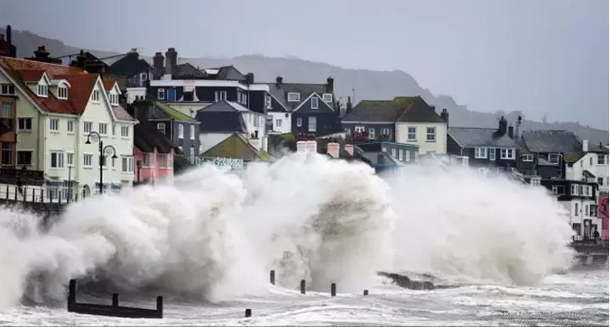

# 所得税和土增税 \#710

原创： yevon\_ou [水库论坛](/) 2016-01-13

所得税和土增税 ~\#710~
================================================================================================================

在搞破坏方面，政府的能力是无限的。

一）所得税

按照目前的政策，卖房要交2%的所得税。

当然有一些减免政策，但我们不愿意纠缠于屌丝心态。你反正记住，轮到你的时候，就是2%逃不掉。

这样，交易一次房屋，总成本大约是5.55%+3%+2%=10.55%，再加若干中介费。

那么，我们为什么要把"所得税"单独作为一轮调控政策呢。

这就牵涉到三观的不同。因为庸人和智者，看待这个社会的思维角度是不同的。

对于庸人来说，"营业税"和"所得税"是完全不同的二样东西。

营业税是5.55%，相对于普通/非普通住房，满五/不满五，有四种算法。

而所得税相对于普通/非普通，满五唯一，又有三种算法。

你如果按照这个思路去思考问题。鸿篇巨著"专业性分析"房地产市场；

恭喜你，你一辈子是一个穷鬼。

为什么呢，因为"所得税"和"营业税"其实是同一个税种。一个税率7.55%的税种。

你直接按照7.55%的"理解方式"去思考，则所得税和营业税是高度相同的。你干脆[直接把营业税的税率设想成7.55%]，岂不是极大简化了么。

那么"所得税"真实面目是个什么东西呢。所得税是一场大杀器。

二）大杀器

什么叫大杀器。所得税的真正威力，在于他理论上还可以按照"差价的20%"来征收。

朋友们，上海楼市从2000年\~2016年，累计涨幅接近15倍。

也就是原始成本6%

也就是差价=总价的94%

在一般情况下，"差价的20%"等同于总价的20%，"差价的5.55%"等同于总价的5.55%。斩肉没区别。

在一般情况下，20%我们都是直接拿来就用的。着意味着什么呢。

意味着你2000年买入的一套房产，捂到2016年抛售；

你需要缴纳的税费是总价的20%+3%+5.55%=28.55%

加中介费后30%。

30%，交易一次！单次的车马费成本30%！！！

这个才是大杀器，才是吓死人的东西。

你股票交易一次0.1%印花税，你加到11%，加到30%试试，看看要死多少人。

好比北京很多学区房。譬如万柳吧，你当年80W买的房子，现在涨到十万一平米，1000万一套。

你要抛售的话，给政府交300万的税，净到手700万。

你如果真的抛的话，家里老人恐怕是要哭死。

"败家子啊，吃鸦片的速度啊，眼睛一眨交了300万的税，我一头撞死算了"。

我们说过，我们是贸易流通环节，不是生产制造环节。

30%的交易成本是完全完全不可能承受的。

除了家里生病死人，被逼到绝处了。否则不可能有人在这个税率下卖房，卖房的都是血泪。

三）计划经济

我们说过，2005.06.01秀相第一次宏观调控的时候，他根本没安好心。

营业税根本不可能降低房价，反而使得一手盘螺旋式上升。

等到2006\~2007，回过头来一看，房价已经比二年前高出了一大截。

在这样的情况下，就要"深化调控"。

而错误的思维会依然错误，愚昧的官吏会继续愚昧。任何人都不可能在二年之内变聪明。

对于2006\~2007年的舆论市场，谢易曹时组成的智囊圈，他们认为；

-   房价是炒楼团炒上去的。

-   房价还在继续涨，是因为税率还不够高。

其典型的言论，就是当年CCAV播出的"要剥离房产的投资属性，强化居住属性"。

炒楼是降低房价的。

炒楼是降低房价的。

炒楼是降低房价的。

重要的事情讲三遍。

你打击炒楼之后，房价开始暴涨。

朋友们啊，从这个角落，我们可以清楚地看出，和帝朝和高宗朝的重大区别。市场经济和计划经济的重大区别。

-   对于计划经济官僚，他们认为不愿意让你买楼。就试图把税率上调。最好把所得税加到100%。这样你买楼[毫无任何利润]。以为你就会不买了。

-   对于市场经济，朱镕基思考的方式，"房价为什么会涨"。明明就是你丫滥发纸币，楼涨即使是常凯申也压不住的。

这里面是"计划经济"和"市场经济"的重大区别。

对于计划经济官僚，他是从来不反思"房价为什么会涨的"。他只会用控制扭曲的方式，强制拐向经济。

而从来不反省自己的"滥发纸币行为"。

四）地方政府

2%所得税并不是5.55%的加强版。并不是7.55%加强版和5.55%普通版的区别。

所得税的真正威力，是在于他以"20%税率"实际征收时，这就形成了大杀器。

我们要说的是，所得税"20%税率"真正实施的时间，其实没几天。

因为他遭到了地方政府的强烈反抗。

世人评论Dictator体制，总是说集中容易犯错误。

而地方分散为三十一个省，整体犯错误的几率就小得多。

秀相有可能犯糊涂。但省级大员清醒得很。懂经济学的，也不乏其人。

地方政府清楚地知道，5.55%营业税加了以后，库房的收入，并不是随税率增高的。相反是严重减收。税率增加四倍，交易减少十倍。

如果你真的实施5.55%+20%+3%=30%的税率，那唯一的结果只能是鱼死网破。

在30%的**真**税率环境下，是不可能有任何交易的。

即使有交易，那也是人家生癌症生绝症要救命的。这时候征税也是不道德的。

所以地方政府是非常非常反抗这个20%的"所得税"税率的。尽一切可能将其软化。软化成2%

如果我们看2005\~2008年的历史，他就是一个中央发文强调，地方申请反抗。中央再强调，地方再反对；

这样来回拉锯的一个过程。

内陆省份的大学生们先别急着别喷。

按照政治伦理来说，实施细则本属于地方政府管辖范围。所以这事理亏的还是秀相。

五）土增税

土增税是"所得税"的一个加强版。

其具体的税率更高，最高可以达到60%。

  赢利比例     税率
  ------------ ------
  0\~50%       30%
  50%\~100%    40%
  100%\~200%   50%
  200%以上     60%

他相当于另一种"企业所得税"。纯粹是计划经济的残留。

中国在1984年时有所谓的"投资方向调节税"。

意思就是国家计委，特别不喜欢某一个产业得到发展。也不愿意对整体资源合理配置。

计委看见一个不顺眼的产业，就对他征收"投资方向调节税"。直到把他搞死为止。

"投资方向调节税"在2000年被废止征收。

但是"土地增值税"是1994年为了抑制海南房地产炒作而临时设出来的一个税种。

因为种种原因，后来就忘记了废除。

这个税种很小众。征收的范围也不大。但是对产业却造成了非常大的影响。

以后讲KFS的时候会有专门的篇幅。

和"营业税"一样，"土地增值税"最初只明文规定了对企业征收。而个人要不要交土地增值税，这是一片空白。

2007年"加税抑制炒楼"恐怖舆论最顶峰的时候，有人提出了土地增值税。并得意洋洋地宣布"政策储备是丰富的，炒家不要心存侥幸"。

我这里列出一张图表，各位可以看看。我的评价只有二个字：

"国耻"

土地增值税征收过一段时间，按0.5%收取。后来在地方政府的强烈抗议中免收。

六）国耻

按照官方的说法，如果实打实，你将所有的税种全部都交足。

上海楼市从2000年\~2016年，翻了大约15倍。40万的房子涨到600万。

则你需要交：

第3行：营业税28万

第4行：附加税3.08万

第11行:土地增值税302.2万

第12行：个人所得税44.96万

以上合计420万

卖掉600W的房子，交税70%，净到手180万！！

我想我只有二个字可以形容：

国耻

七）暴政

2005年的宏观调控，如果你去翻阅当时的舆论媒体，几乎是一面倒的赞扬欢呼声。

如果你去屌丝穷人访问，几乎是100%的明君青天声。

但是在知识分子，在士大夫的眼里，在那些懂事物背后本质的人的眼里，看到的是深深的厌恶。

秀相充分地显示了"对人的不尊重"。

回顾他的执政口号，还真是讽刺得紧。

你居然可以对一个商业征收70%的税率。这和强盗土匪有什么区别。

就因为你不喜欢一个行业，你可以肆无忌惮地加到70%税率。

更糟糕的是，房子可能完全没增值。这房子还是房子，十几年来唯有更破旧。

真正让40W涨到600W的动力，是滥发纸币。

如果换算成肉包子的话，购买力并没有丝毫变化。

这样情况下600W房子卖掉，到手只有180W，良心简直都被狗吃了。

对"虚拟收入"征税，你这不是卖房子，是卖命！

哪怕日本人来了，都没有这样的吃相。

而秀相如此的行事风格，充分地证明了他不尊重别人，不尊重经济，不尊重规律。

唯我独尊，肆无忌惮，无法无天。

房地产只是中国众多行业中的一行，我们比较熟悉的一行。

在其他我们不知道的行业，更不知道还有多少苛捐杂税，苛刻规定，苛政猛于虎。

难怪有人说，中国离彻底崩溃，永远只留一步。

（yevon\_ou\@163.com，2016年1月10日晚）
