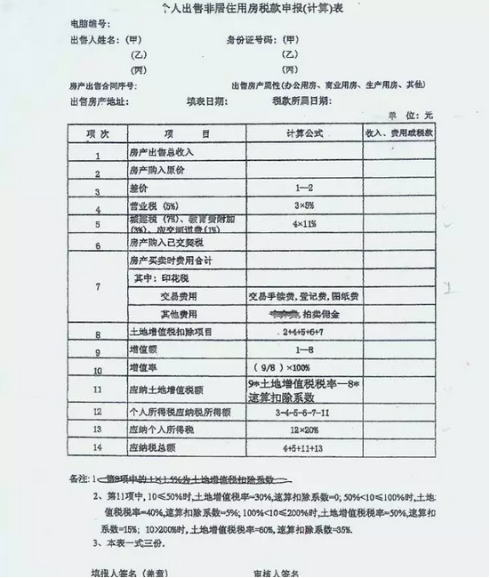
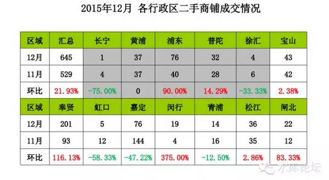
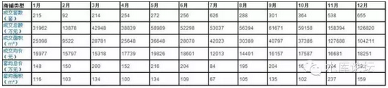

# 杀死商铺 \#720

原创： yevon\_ou [水库论坛](/) 2016-01-18

杀死商铺 ~\#720~

你是不用交土地增值税。

可是有些人要交。

一）受害者

上一篇中，我们讲到了高达"总价70%"的土地增值税。

你这是交易环节，买卖一次羊，只剩羊毛带回家了。

这么高的税率，在人类文明史上也是可数的。将来可以钉在柱子上的，考古学家千年耻笑的。

但是，还有人会说，"土地增值税不是没按实征收"么。

对的，目前"个人住宅"买卖，的确是一片空白。

但你不征，有人征啊。

目前征收"土地增值税"的物业类型，主要是：

-   商业。商铺+写字楼+厂房

-   一手开发商

二）商铺

上海这样一个2500W人口的国际性大都市。

-   2015年住宅销售1800万平米，商业销售300万平米。

-   2015年住宅二手交易34万套，商业二手交易0.6万套

从这个数字上看，我们可以看见全市"住宅/商业"的比例，大致是6：1

可是一旦进入了二手市场呢。他们的"再交易"比例是60：1

也就是商业的交易比住宅少十倍。

我们知道，目前上海的住宅交易已经属于非常非常"稀少"了。一个500户居民的小区，诚意卖的可能还不足5套。也就是1%。

目前上海的二手交易，平均每套面积仅80平米。也就是2/3以上集中在"老公房"交易。

老公房才是流动性如水随时可以变现的品种。而次新房几乎是没有人抛出没有交易的。

这事实的背后，"交易成本"起到了很大的作用。

因为"普通住房"基本上只有二三十年楼龄的老公房才能满足。而次新房几乎100%没有可能普通。

如果你是"非普通住房"，则10%的交易税收是逃不掉的。800W的房子卖了交80W的税。

你没事交五年的工资当国税，你脑子有病啊。

但即使是这样的败局，相对于"商铺"市场，地狱之下还有地狱。

上海这样一个2500W人口的国际性大都市，"商铺"交易已经扭曲到匪夷所思的地步。

上海目前每个月的"工商铺"交易仅仅只有500套左右。

考虑到上海有十区十县，20个交易中心，则这样平摊下来；

每个区每天交易一单！

商铺交易之稀薄，之冷淡，已经到了匪夷所思甚至是闹新闻的地步。

一旦某个交易中心有商铺交易，则工作人员都要围上来围观，啧啧称奇，说好久都没有见过呢。

商铺交易为什么稀少。因为商铺交易是严格地按照"土增税"来征收的。

我们知道，过去十年，商铺其实并没有多大涨幅的。

名义上，你这个铺子价值从100W涨到了1000W。但其实这是幻想。

事实的真相，是馒头包子由0.3元一个，涨到了3元一个。

全社会普遍的滥发纸币，通货膨胀。

真的要论购买力，你这商铺并没有多换几个包子。

可是当你去到税务局，开始进行税务交易核算的时候。

刀笔小吏，苛刻税吏，就会拿出官样文件。实打实要你按照"文件精神"来交税。

这个税率是多少呢。我们之前算过，1000W的商铺，交税700W。

卖掉到手仅有300万！

这导致什么样的结果呢。导致就是根本+完全+彻底+绝对，没有交易！

任何一个90年代的商铺，都不可能参与交易。都不可能进入市场。

目前商铺市场的实际现状如何呢。

-   能交易的，都是2000年以后，KFS"虚高"坑人的铺子。譬如买进价4W，挨了十年，咬咬牙5W卖了。仅拿回成本。

-   老铺子不交易。仅收"顶费"。

所谓顶费，相当于"租赁权转让"。

譬如说你盘下一个餐饮小店，每个月固定交3000元給大房东，但是一次性拿出20W给上一个租客。

这个20W就是顶费。而租约通常是漫长的还剩十几二十年的。

对于商铺市场来说，他的"产权"几乎永远不交易。

而换来换去，全都是"顶费"交易。出几十万，买下租赁权，换掉上一手租客。

可见，这样的商业模式，是非常之不安全的。

-   首先，顶费不能贷款

-   其次，顶费缺乏法律保障。大房东/二房东之间的利益划分，类似于小产权。

-   第三，无法对房屋改建。

三）垂死的商铺市场

商铺不能交易，导致了一系列的恶果。

我们知道，经济学第一定律"dT\>0".

财富产生于交易。交易越多，财富越多。交易越少，财富越少。

政府征收匪夷所思不可理喻的高额税率。其导致的结果就是所有人都是输家。

譬如说，你本来在云山路有一个餐饮铺子。

可是老夫妻年岁渐老，子女不想接班。要出国读书。

那最好的办法，就是把商铺卖了。把经费拿去当学费。

可是在现有的政策下，你的子女还是只能开大排档。

又譬如，一整条街道上，小店普遍档次不高。但是人流还可以。

这时候比较有利的做法，是把沿街几间铺子都买下来。进行整体改造"凤姐变冰冰"。

可是在现有的政策税率之下。这事没法做。

最后，一些大型的商业扩张计划需要拥有完全产权的商铺。

可是"顶费"不能贷款。

你要是盘个会所，盘幢小洋楼改建私房菜，你就得"全款"买下顶费。

这使得许多商业计划无法执行。

如果我们放眼全上海的整体商业，我们可以清晰地看见。他们呈现一个逐步"腐坏"的情况。

也就是一条商业街，一条美食街；当他们的业主不再擅于经营，烧出的菜馆不再好吃；

这个时候，该商铺并不是被收购。并不是Revitalizing。

相反的，反而是逐步地"腐坏"。无声的腐坏。

许多商业街，商业区，就是这样一步一步腐烂下去。最终烂成渣的。

而事实上，如果他们可以交易。可以充分换手，换更好的主人。

资源是可以更好配置的。

四）价格与投资

首先说一下对商业市场的看法。

很多人认为"酒店式公寓"万年不涨。高昂的交易成本阻断了他的炒风。

我不同意这种看法。

你们要知道，"商业产权"他其实是存在二种市场的。

-   一种是卖20000元的业主。因为税实在太高，又等钱用。干脆平进平出，尽快卖掉。认赔算了。

-   一种是卖70000的业主。而且还是到手价。因为税收实在太高。我又不缺钱。怎么肯平卖。

当税率实在太高，交易实在太少。全市约200,000,000平米工商业存量，你每月500套的成交量：**不代表任何意义，不传递任何信号。**

当量太少的时候，你这个价格是没有意义的。价格是"三维"的，这是基本常识。

我们一直所说的"酒店式公寓"涨不动，商业涨不动。

因为他的交易量实在太少，价格高度失真。一二套成交量往往就会以偏概全。

人们往往只看见了一二套20000元/平米的抛盘。而忽视了他背后199,999,999平米的庞大业主心理。

你跑到IFC四季汇里，出二万向他们收购。看看会不会被赶出来。

和几乎所有的市场一样，"吃吃亏，咬咬牙，逃出来算了"这一类的心态。几乎全部都是浙江人温州人。

这个容量是很浅的。一旦这薄薄一层"认栽"盘被扫光。后面的走势是谁也不知道的。

五）对政府的建议

商铺市场，是典型的"政府失灵"一个例子。

政府规定了一个高得吓死人，完全不科学，完全无理性的税率："70%"。

交易一次，收总价的70%，秀相脑子有病。

按照70%的税率，收到的税，是不是1%税率的七十倍呢。

答案当然不是的。

不仅仅没收到七十倍。甚至连一倍都没有。甚至比1%税率时收到的钱还要少。

[我们给政府的建议]，是你按照上图"个人出售非居住用房税款申报表"，逐项汇总计算所有税收之后:打一折！乘以10%

这样，哪怕你理论算法税赋的上限是70%，打完一折之后，你实际征收的就是7%。

如果要说最合理的税率，应该是：

-   统计所有应收税款，然后打一折。

-   不满一年再次交易的，上限1%

-   不满二年再次交易的，上限2%

-   不满三年再次交易的，上限3%

-   不满四年再次交易的，上限4%

-   第五年及之后交易的，上限5%

交易的税收，应该和持有的时间成正比。

持有时间越长，税收越高。

而上限保护是5%。

有些人或许会奇怪了，"咦，你这不是鼓励炒楼么"。

对的。炒楼降低房价。如果你真的想通了其中的理由。你才算是入门了。

文官治国，才是治世。

（yevon\_ou\@163.com，2016年1月17日午）

\* 要值得注意的，这数字仍需细分。其实主要是一二个"坑爹"楼盘交易密集。并非平均分布。

如浦东洋泾名门世家（单月19套）。闸北不夜城（半年50套）。

\* 泱泱大国，全上海二月份商铺成交一共只有92套。
