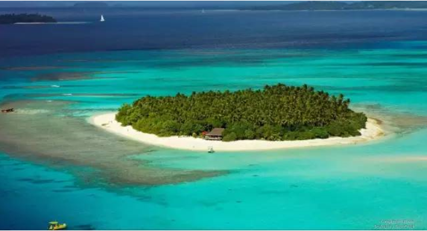

# 第三轮宏观调控（上） \#750

原创： yevon\_ou [水库论坛](/) 2016-01-23

第三轮宏观调控（上） ~\#750~

 

第三轮宏观调控：

形式：表现为对KFS的迫害

结果：房价大涨

 

 

一）第三轮宏观调控

 

第三轮宏观调控，主要是对KFS的调控。包括但不限于；

 

-   切断对KFS的银行信贷

-   切断股市，信托，理财产权等各渠道向KFS的输血

-   更苛刻的盖章审批流程

-   收紧18亿亩红线

-   严打土地二年囤积

-   严加KFS税费稽查

-   监管预售资金，提高预售资格

-   舆论上对KFS破产的不利宣传

 

这些事的结果有且仅有一个：房价大涨

 

 

二）决策

 

我们再三强调，看问题要看实质。对于秀相来说，他全部的利益，就在于董伯伯的悲剧不能在他身上重演。

保住个人的官位，是超过一切的需求。

 

当2004年时，秀相被一帮无耻小人包围。

他本人的品味就不行。众所周知，经过60年代m的清洗，中国的学术界其实是很"弱"的。

外电批评中国缺乏一个健康的学术市场。而现在留在清华北大中科院社科院的教授们，不是被吓得了不敢出声，就是老朽昏庸。象易宪容一样当个SB。

迫害学术界的结果，则是"宰相"身边也没人才。把领导自身给坑了。

 

 

2004年时，秀相读报告的感觉，是"房地产快要完蛋了"。充满了泡沫；

价格虚高。2000元土建成本的房子，卖到了20000元/平米。民怨沸腾，于凌罡都要打倒KFS了。

炒风炽烈，到处都是温州炒房团。房价完全是炒房团炒上去的，据说。

 

 

你设想一下，假如市场恢复"理性"。房价大跌。KFS纷纷亏损。

而且KFS又是无效率的暴利商人，在20000元/㎡时也就赚10%。假设房价跌个"北京30%，上海50%"。

那么KFS全行业会不会几万亿的坏账，会不会拖累国民经济？

 

 

当2004年时，秀相面临的就是这么一个情况。当他通过他自己挑选的那些"智囊"，谢国忠叶檀牛刀基本就是这样和他阐述房地产市场的。

而秀相最关心的是什么呢。"做什么也不能触动他的官位"。

 

许多人对2003年的社会大环境或许已经没有了概念。90后尤其没有记忆。

其实2003年，整个中国政坛，乃至于整个国际舆论，最关心的是一件事"中国崩溃论"。更确切地说"中国金融体系的总崩溃"。

 

以2003年的实际现状而言。当时普遍认为，工建中农四大国有银行，已全面破产。中国的金融体系。充斥了坏账。整个银行业资不抵债。

而"银行业"被称为百业的脊梁。是主干道。是枢纽行业。

 

 

在"稳定压倒一切"的时代，2003年主要考虑的是金融业不能跨。金融业一定要用全力维持住。然后其他行业可以慢慢想办法。

其后的故事，大家也知道了。信达东方等四大资产管理公司成立，剥离了1.4万亿不良资产。

 

然后M2货币供应量增加了20倍。银行业又纷纷上市。

最终这场危机是以印钞机的方式解决的。

(虽然2016年金融危机又快来了)

 

 

回到我们的话题，在2003年，秀相决策时，"第三轮宏观调控"看似他做了很多事。

但其实千变万化，万变不离其宗，归根到底秀相只做了一件事"切断房产和金融业的联系"。

 

 

三）胜与负

 

2004年时，秀相的行为目的其实非常非常的明确。明眼人看他的行径，就象看手心掌纹一样落入毂中。

 

秀相全部的目的，就是"切断房产和金融业的联系"。

当时以秀相身边智囊团的分析，房地产简直无法无天，到了"快崩溃的边缘"。房价即将从9000元/平米跌倒3000元/平米。

 

 

而秀相最担心的，是房地产业一旦产生数万亿的坏账，会不会传递传导到银行金融体系。

正值此金融业改革重生的关键关头，秀相是[绝对绝对绝对不允许再有几万亿坏账]，冲击正在准备上市的四大国有银行的。

所以怎么办呢，"拒绝给KFS们贷款"。

 

这个才是第三次宏观调控的大图景背景。

我实在不能理解，傻空小白文青们，怎么能把"宏观调控"联想成"中央降房价"的。

你TMD是不是中二病又犯了。以为自己是王子，以为秀相是你家公仆，以为政府里的如狼似虎都为你谋福利青天大老爷。

你丫就是羊。政府是虎。

 

 

四）抉择

 

2004年时，秀相面临二个选择。

 

A）切断房地产与金融业的联系。坚持不给KFS一分钱贷款。其结果是房价可能会暴涨。供应减少，成本增高。

B）继续给房地产贷款。万一"楼市泡沫爆裂"，产生几万亿坏账。金融业崩溃。秀相下台。

 

这A和B之间选择。就非常考验领导人的功力了。

我们总结出至少有三点。

错误的情报+愚蠢的领导+暗地里私心=决策错误

 

 

-   秀相身边全是一群小人。给了他错误的信息。当然，"技术性官僚"是你自己排斥的，小人是你自己选的。物以类聚，没法怨别人。

-   秀相没做过大省书记。经验水平不行。

-   秀相"董伯伯"严重倾向性选择。

 

 

凡事均有权衡。当A和B二个选择时，首先你不知道其各自的概率是多少。情况恶化到哪一步。

这牵涉到情报系统和媒体舆论。中国的学术圈和媒体圈，都xxxxx.

 

其次，当你综合手头情报，做决策时。考验的是领导人本身的能力。这点秀相也是不及格。

 

最后，秀相本身有严重的"倾向性"。当"可能涨"与"可能跌"二个选择摆在面前。秀相是无论如何不肯选择"可能跌"的。绝不和董伯伯喝下午茶。

 

 

这三个缺陷同时发力。秀相选择A，是必然的，是注定的，逻辑上高度确定的。

 

 

五）房价大涨

 

当秀相切断给KFS的银行业贷款，房价大涨。

供应减少，成本增加。价格大涨。

 

我们说过，在几个历史关头，秀相都选择了"踩油门"而不是"踩刹车"。

因为宏观调控，所以房价飞涨。

因为宏观调控，所以房价飞涨。

因为宏观调控，所以房价飞涨。

 

你如果没有2004年开始对KFS的一系列迫害。

如果搞个房产公司开发楼盘，象海尔、格力、长虹、美的新增加一条流水线一样简单。

那房价一定可以象家电一样便宜。

 

 

六）政策细则

 

我们仔细分析第三轮房产调控的具体细则。

 

a)切断银行业对KFS的贷款

答：KFS大幅减少。KFS建房大幅减少。

供应减少，成本增加，房价大涨。

 

时至2016年的今天，"房地产开发贷款"仍然处于银行分类系统的黑名单。属于限制型类别。

 

这使得KFS取得贷款的能力大幅削弱，并且要支付更高的利率和隐形成本。

同时KFS门槛大大提高，中小开发商几乎不可能冒起。

只有极大巨头，甚至具有"政治影响力"的KFS们才能继续获得贷款。知名不具。

 

 

b)切断股市，信托，理财产品等向KFS的输血

 

答：生命是多样性的。当你切断了"银行贷款"这一个主要血管渠道。KFS们就会转向次选，备用的管道。

 

在这方面，最初秀相政府的反应是迟钝的。这也就是2006-2008年信托业爆发式增长，房产信托满世界飞舞的原因。

可是此后秀相政府反应过来。并认为；

"信托业虽然不是银行业，可是搞大了捅出篓子也不好"。

 

于是秀相针对KFS的管制，从银行业。逐渐扩散到银行，证券，信托，其他金融。包括但不限于；

-   所有的房地产类企业不许上市

-   房产类不许借壳

-   不许增发，配股，融资

-   信托业整顿

-   信托业大警告

-   严控信用卡刷房产类。降额，停用，销卡。

-   (工行)信用卡房产类不许分期

 

整个事件，以"绿城围剿战"达到了最高潮。

最惨的时候，绿城实在是被逼得走投无路。他在海外发的债券给出了28%的年利率，真的是为筹款流尽了最后一滴血。

 

其实，绿城是一家很经营不错的企业。有点门道，有点花巧。"创造附加值"，将郊区不值钱的土地卖出了很好的价钱。

但是，绿城被卡断了脖子。针对其自有资金太少，展开了一场围剿战。

 

 

因为绿城资金不足，他要融资发债。因为银根抽紧，他要给出很高的利率。因为给出很高的利率，侵蚀了财务报表，他就显得更为黯淡。

因为赢利能力下降，下一轮融资就必须给出更高的债券利率............这就形成了恶性循环。

 

 

当秀相政府整体的银根收紧。象绿城这样的集团，是最受打击的。

因为他融不到钱，10%，15%，20%，28%，一步一步的资金成本，就把他给逐步绞死。

 

而与此同时，北京有一个知名KFS。名气很大，却几乎没有过任何成功的销售案例，几乎没有过任何大型的销售回款。

在这个"银根最艰难"的岁月，一下子就获得了几百亿的银行贷款，以低到不可思议的利率。

 

然后他就在市场上大肆扩张，别人都没钱和他抢估值很低。他从从容容地拿着钱四处收购，一下子吃得盆满钵满。

不说了，说多了都是雀巢咖啡。

 

但是事情也是有转机的。所谓"德隆垮台，股市大涨"。

"绿城垮台，楼市大涨"。

S胖子你是一个没主人的人。当这场围剿战结束，尘埃落定。赵家人自然就允许松银根楼市大涨了。

 

 

（未完待续）

 

 

（yevon\_ou\@163.com，2016年1月23日午）
