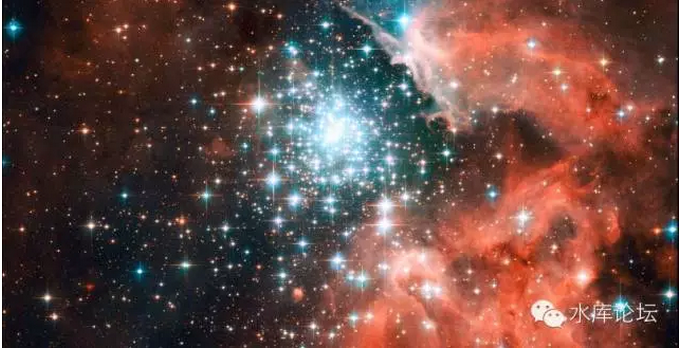

# 邪恶的媒体 \#80

yevon\_ou [[水库论坛]](/) 2015-04-15

邪恶的媒体 ~\#80~

权力导致腐败，绝对的权力导致绝对的腐败。

媒体虽然只有一点点微不足道的权力，却已令他们足够腐败。

一）无冕之王

很久很久以前，当我们第一次听闻启蒙时，我们听说的是：

"*媒体是无冕之王，是对权力的监督。他们揭露事实，捍卫正义，每一年无数的新闻媒体人员牺牲在真相的第一线*"

当时，我们对"媒体"充满了崇敬。当年轻人痛恨政府的腐败，以及自己"地命海心"烤串涨价时，媒体的形象，益发高大了起来。每每幻想媒体会象白衣骑士，击破这个黑暗的社会，让阳光和温暖洒满大地。

很多年以后，隐隐约约的觉得不对。隐隐约约的觉得不对。

[你们发现逻辑上的悖论，出在了哪里么？]

媒体"正义，光荣，无冕之王"的形象，是谁告诉你的。

哦，是一本杂志。

二）醒悟

媒体"正义，光荣，无冕之王"的形象，是谁告诉你的？

是媒体。

那么，这句话还值得相信么？！

很多很多年以后，我们才从这个大坑里爬出来。好大的一个坑。

那么，媒体的真正面目是什么。

媒体既不正义，也不善良，更不会挺身而出和强权作斗争。揭露真相，披露事实，媒体人对啥毫无兴趣。

除了在电视电影作品中，我们从来看不见《塘鹅暗杀令》之类的媒体英雄。

媒体舞弄事实，引导舆论。编造谎言。奉迎强权，敲诈勒索，见钱眼开，对强权的遏制力几乎为零，却大规模制造谎言。

比较典型的。譬如CCAV2的《经济半小时》。

因为我们本身是做房地产的。我们对这一行了解非常非常之深。在房产这一个狭小范围领域内，几乎一眼就可以看出真伪。

2005年加营业税，这是对市场致命的打击和破坏。而媒体小编给出的标题却是《全国人民喜迎营业税上涨》。

交易成本从2%增长到8%，是对交易量的毁灭性打击。

可到了CCAV2《经济半小时》口中，却变成了成交量极大放大。人群挤满了整个房产交易大厅。

中央领导一看，加税了四倍，交易量还能放大，税收大大滴，龙心大悦。

可你为什么不说真相。真相是5.1开始执行营业税。几乎所有的公民，都暴燎火烧般的赶紧在节前交易掉。交易中心几乎人人都在骂娘。

短暂的高潮过去之后，之后是整整三周，整整21天完全的0交易。创造了房产交易中心寂静岭的奇迹。

媒体人在欺骗了全国人民的同时，又欺骗了高层领导。

一直到2009年时，《经济半小时》再做新一轮的房产宣传高峰。

当时，他找了二个群众演员。介绍他是深圳的"炒楼客"，并摇头晃脑地说"房子呀，是再也不能炒的了"。

拜托，你找群众演员的话，胶鞋不要找一个开裂的好么。

媒体人的邪恶行径，罄竹难书。被抓进去的中央台主管，因为主持"3.15"消费者日，短短几年积聚数亿身家。

每到消费者日，他就向各企业发文。给钱的就唱赞歌，不给钱的就污蔑你泼脏水。什么陷构都可以编造捏出来。

打开卫视，清一色的"老中医"广告，卖保健品和限量版奥运纪念章。近期莆田系和电视台闹翻，丑事掀出一大堆。有兴趣者可以自己去搜索。

媒体不是白天鹅。那么，媒体究竟是什么。

三）邪恶的媒体

权力导致腐败，绝对的权利导致绝对的腐败。

媒体虽然只有一点点微不足道的权力，却已令他们足够腐败。

\-\-\-\--yevon\_ou

媒体究竟是什么。

媒体是"人"，一群群活生生有血有肉，有自己利益的人。

媒体人和其他所有人类并无不同，都是追求自我利益的人。都是"理性人"。

你以为媒体人会追求"正义"，会捍卫社会的公理，会和恶势力搏斗。

没有那回的事，纯粹是你自己YY。

媒体究其本质，可以称为"信息贩卖业"。

他们的工作，就是有一大群的人。四处东逛逛，西逛逛。然后看见了第一手的新闻，赶紧发到网上来。

"专门追逐新闻"这也是一门挺细分挺专业的行业。

但是，媒体人往往会搭售私货。在新闻之外，他们还会要搭售评论。

媒体人选择的评论，往往是对他们自身这个"小团体"有利的。他们会精心地选择倾向性的专家，并剪辑选择性的片段。

譬如，"媒体小编"绝大多数都是20\~30岁，北漂屌丝，左倾文青粪青，所以他们特别指望"房价大跌"。

当他们选择"评论员专家"时，谢国忠出场的几率就特别地高。谢+易+曹三剑客，哪怕这几位已经声名狼藉臭不可闻。

CCAV2已陷入内部人操纵。可怜[国家公器]，竟沦为一部一族谋私利之物。

更为恶劣的是，或许是教育的缺失，或许是传统精神被破坏。中国的媒体人，比西方媒体人还不如，更少了一阶底线。

在中国的媒体，更下下流的一层，他们还会"伪造新闻"。

有很多时候，许多新闻甚至不再是倾向性的问题。也不是断章取义的问题。

而是彻彻底底的假新闻。整部**事实**都是假的，都是伪造摆拍出来的。

媒体不是白衣天使，他们是恶魔。

四)对待媒体的态度

我们无事可怨。

如果将媒体视为一个商人，贩卖的商品是"News"。那这本来就是一场平等的买卖。爱买不买。

我们对媒体，并没有额外的道德要求。

我们想说的是，当你购买"媒体"时，多一个心眼。

媒体有可能是在骗你的，有可能在误导你。有可能请的是选择性的嘉宾，有可能甚至都是假新闻。

每一个人都会骗你。包括本id。

虽然水库论坛循循善诱，但我们也是可以被收买的。而且还不贵。

真正能帮助你的，是；

1）认清"邪恶的媒体"这一个事实。

2）学会独立思考。

上水库，毁三观。认清楚媒体这一个谎言和大坑，对你日后重塑三观十分有用。

(yevon\_ou\@163.com，2015年4月15日晚)

五）补充发言

正当我们将这篇文章，以微信群发发布的时候。我们见到了大象工会的新文章《没有专业的工作》\[1\]

文中，对新闻工作者推崇备至。并介绍一个合格的新闻工作者，要具备综合的，多方面的学识。包括但不限于机械工程学，物理学，教育学，法律系，历史，文学，社会学.........

不，千万别!

千万不要，千万不要让我们的"媒体小编"成为多方面的全能手。

你一定要搞清楚，媒体究竟是干什么的。

媒体的工作，是"新闻贩卖机"。他们的专业，专注着的，是 "最快拿到新闻"。

和综合化相反，真正的媒体发展方向，应该是"制评分离"。

媒体，你就是发掘，公布，分享新闻的。新闻的质量决定你的一切。

不要，不要，千万不要试图于"评论"。

我们见到了充分的惨剧。媒体小编致力于"评论社会"，妄图想要"改变社会"。

他们并不擅长做这事。同样一个经济现象，在三脚猫手里的分析，和专家手里的分析截然不同。

譬如说，媒体小编长期以来，以为"房价太贵祸国殃民"。他们所做的事，就是持之以恒"鞭打房价痛斥暴利"。

这样做的结果，和他们预料的正好相反。

因为觉得房价会下跌，生产商放缓了建造的步伐。购房者却被一再耽误。最终导致整个社会的房子更少，房价更高。

经济学是一门高深的科学。不是这些三脚猫的"小编"们，凭借着一腔热血可以评论的。同样道理，相信工程机械，水坝设计，环保方案，核能电力，等等学科，也不是这些三脚猫文科生所能够评论的。

每一个人都应该做他专注的事情。"制评分离"才是未来发展的方向。

媒体人所具有的最重要能力，就是传播[事实]。除此之外，你们什么也不要添加。

至于评论，闭嘴吧。滚远点。

\[1\]《没有专业的工作》http://mp.weixin.qq.com/s?\_\_biz=MjM5NzQwNjcyMQ==&mid=212476237&idx=1&sn=62caf8257ad62d538cd6fc260bf9a297&scene=1&key=1936e2bc22c2ceb53bd3590224c77c86c0b351d2c76bc1f5c9588724e0000d962f3b95ec679f8371a8bc45fd905db4d3&ascene=1&uin=NDkyMjg2OTM1&devicetype=webwx&version=70000001&pass\_ticket=hsyMXT0x1nsSTZdxzMGSK81pxYPQX%2FH7DZr8qAC2bknNtRST0s%2B0N0Nu7sgkCGoC
