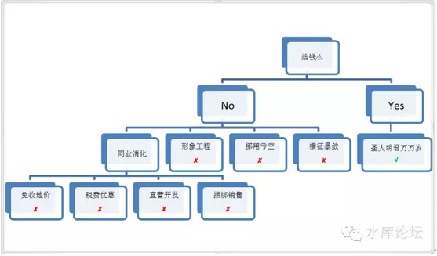
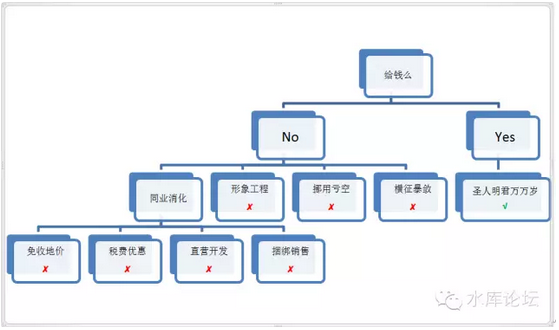
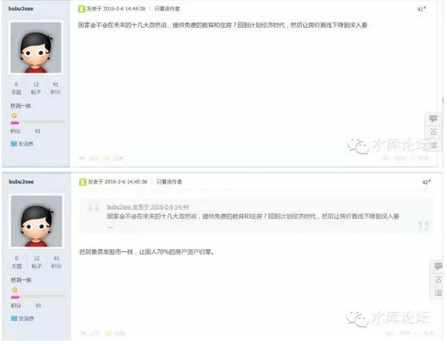

# 免费的才是最贵的 \#800

原创： yevon\_ou [水库论坛](/) 2016-02-18

免费的才是最贵的 ~\#800~

2006年时，发生了一件节点级的大事。但却是没有在市场上留下任何涟漪。

 

这是什么。"成立五大国有开发商集团"。

 

 

一）肉糜

 

 

如上图；当秀相不给钱，而却要地方政府变出一千万套经济适用房，那县官就快要绝望了。

 

中国古代有一个皇帝，听到这种地方反应之后，回复了一句千古流传的名言："何不食肉糜"。

当秀相听见地方的反对声音之后，他也回复了同样一句话，"何不食肉糜"。

 

当地方哭穷艰难崩溃纷纷表示事情不可行之际，秀相心里其实是非常有把握的。

他想是："[你们傻啊，KFS不是有暴利的么。炒房团不是有暴利的么。我们直接把中间环节跳掉，搞农超对接。空间不就是省出来了么]"。

 

秀相想，手下的人智商就是笨。不能和他高层领导相比。

秀相相信谢国忠，易宪容，叶檀的说法，相信开发商是有暴利的，相信房价是被炒上去的。相信"农超对接"是可以降低物价的。

 

那他采取的办法是什么。

商人既然是黑心的，那我搞"国有开发商集团"。

2006年，人民日报宣布，将对房地产行业进行大规模改组。并将长远目标定为合并成"五大国有"开发商集团。以国营KFS为开发主体。

 

 

二）内部挖潜

 

"五大国有"巨型舢板还没有下水，仅试了一下水温。顿时就分奔离析了。

 

为什么，因为秀相错了。全错了。

"房地产开发"并不是一个暴利的行业，而是一个刺刀见红的行业。

房产商并非一个奸商的行业，而是充满效率的行业。

"合作建房"于凌罡必死。

 

 

中国古代的孔孟之道，儒教伦理道德还有"不与民争利"之说。

而在秀相这里，是完全没有这个羞耻感底线的。

 

真正讽刺的，是他准备要来"争利"了。结果反被打脸。

中央直属的国营企业试了一下水温，顿时知道不对了。面粉价格还高过面包。

如果让国营企业来开发的话，不仅赚不到"暴利"的钱，反而是亏钱的。成本就比面包贵。

 

 

三）税费减免

 

 

我们看回这张图。

可见，这张图内，全部都是红色的**X**。

通篇只有一条生路，一个绿色的出路**√**，就是圣人明君万万岁。

 

 

秀相当年夸下海口，要做人民的大救星，要造一千万套经济适用房。

可是他不给钱。

不给钱的话，你就全部都是**X**，全部都是死路一条。

这是符合"能量守恒定律"的。

 

秀相一开始听叶檀等人的蛊惑，"何不食肉糜"，以为房产开发是暴利。那干脆以国营KFS取代"奸商"。

可当他听手下人说，[国营开发商根本做不了，面粉还比面包贵]。

 

这下子秀相就被打脸了。牛皮吹爆了。

可下面的人，还等着你发经济适用房呢。几千万的大学生屌丝，还在欢呼"什锦八宝饭"呢。

 

那怎么办，又有人提出了一个建议:"税费减免"。

税费减免的意思，就是经济适用房。你[土地出让金就不要收了。又或者是减收]。

税费方面，经济适用房一路大开绿灯。"利润率3%以下"，所得税增值税就免了。

 

 

朋友们啊，税费减免意味着什么。税费减免=国有资产流失。

对于这件事情，地方政府是一百个不愿意。

 

"土地出让金"免收或者减收，轻飘飘的一句话。你以为是eBay卖二手闲置物品啊。

土地出让金是什么，这是[早已纳入预算]的命根子。土地还没有拍卖，钱款的用途早就安排好了。教师医院退休养老护路绿化，不知道多少个部门排队等在后面了。

 

不仅仅这块土地出让金，早已经被预算完毕。

就连下块土地；

下下块，下下下块土地，也早已经被瓜分完毕。排队早就排好了。

 

 

所以幕僚们给秀相献的这一条计策，"土地减免""税费减免"。也是走不通的。根本推行不下去的。

 

 

四）题外话

 

插播一句题外话。有内地来的屌丝问：

"土地是公有国有，为什么人民住房土地，还要收土地出让金"。

 

 

这个问题问得真有道理。那我还想问你，"工商银行上市IPO，凭什么还要花钱买呢"。

论无限分割，股票还比土地好操作一点。这样的话，工行上市，凭啥还要IPO掏钱。凭啥不是十亿国民，每人分个300股呢。

 

 

哦，原来你说全中国有股票账户的不过5000W人口。而分享红利的也是这5000W人。

股票有分红，能享受ICBC的利润。所以IPO你得花钱买，谁掏钱谁受益。然后股票IPO募集到的钱集中存入国库。

 

 

对于土地市场，也是一样的道理。

东三环朝阳区出让一块土地，可以建造500户住宅。

那这土地出让金要不要收呢。

 

十三亿人民的共同财产，凭什么让你500户居民入住。我还想住国贸CBD呢，谁去住青海，贵州？

所以公平的方法，土地出让金一分不可减少。而拍卖款入国库即可。

 

 

五）捆绑销售

 

当你不给钱，你就要受"能量守恒定律"约束。步步红X，每一条都是死路。

天上不会免费馅饼。

 

最后，我们说一说，高压政策之下，地方政府扭曲生存，整个行业被迫应付，最终演化的结果。

 

目前，相对于全国的"经济适用房"政策。各地政府主要是采取"捆绑销售"方式来应对。

所谓捆绑销售:

-   土地出让金还是40亿，一分钱不能少。否则地方政府喝西北风去。

-   总建设1000套。其中商品房70%，经济适用房30%

-   经济房免费赠送给政府

 

 

"上有政策，下有对策"。基层干部们的创新能力是无限的。58年"大跃进"也捱过来了。

[你既不给钱，又要造1000W套经济适用房]。基层干部充分发挥主观能动力，这不是帮你设计出来了。哈哈。

 

你仔细观察这套"捆绑销售"的逻辑。你就会发现，经济适用房是个毒瘤。

经济适用房造得越多，商品房越贵。

如剥丝抽茧，一层一层，我们终于把这个道理讲清楚了。

 

 

那或许还会有屌丝问，"我反正也买不起商品房，万一撞大运呢"。

这句话在北京是成立的。

因为在北京，政府收取了30%的经济适用房。然后是拿出来摇号的。只要你运气足够好，车牌总是能摇到的。

人还是要有一点幻想，否则和咸鱼有什么区别呢。

 

只不过我的建议是这么麻烦干什么。还不如门口买2元的彩票。

或许今天晚上开奖，直接就有500W了呢。

 

 

而对于上海深圳这样的城市，连这个"摇号"的诱惑事实上都没有了。

对于我们来说，这个30%其实是保护政府"内部人"的。

因为"体制内"还有许多手心手背自己人。房价飞涨，总不能逼到局长处长去住棚户。

所以这个30%是保护GWY的。老百姓就别多问了。偶尔也是会摇号的，您就回去等吧。

 

而无论北京上海深圳广州南京杭州成都重庆。

"捆绑销售"，经济适用房都是推高商品房房价的。

经济适用房造得越多，房价越贵。"能量守恒"。

 

 

六）你怎么就不害怕

 

当《绝望的县官 \#790》一文发文后，有人在水库论坛下面跟帖：

 

国家马上就要提供免费的住房和学区了。你怕不怕。

国家马上就要提供3000元/平米的内环线房子了，你怕不怕。

 

好啊，我害怕啊，我怕得要命。

国家要造3000元/平米的内环线房子，那你造啊！你放马过来。

如果"五大国营开发商"能比任志强更省钱，那你来呀。

 

 

如果你可怜的颅容量中有"能量守恒定律"，你就不会说这样的胡话。

政府并不能创造物资。秀相不可能给你"免费住房"。

能量守恒，丫的又不是发电厂！

 

 

正相反，因为目前普遍采取的"捆绑销售"模式。你每多建设一套经济适用房，就意味着少一套商品房。

而且商品房要平摊经济适用房的费用。

这最终演化成"1张彩票+更贵的房价"模式。

免费的才是最贵的。

 

我怕，我怕得要命。我怕房价涨到天上去。

政府一喊"经济适用房"，房价就要大涨。

经济适用房造得越多，房价越贵。你越是鼓吹免费，房价越是暴涨。傻空在等房价暴跌，多军在趁这个消息拼命买进。

 

 

1840年发生在珠江口的鸦片战争，在整个人类战争史上，也是非常奇葩的案例。

一方是天朝上国。

一方是洋枪大炮。

双方都对自己的胜利，怀着毫不犹豫"必胜"的信心。

 

战争爆发的前一夜晚上，双方指挥官辗转反侧。但难得想的考虑的都是同一件事：

"对方，他怎么就不害怕呢！"

 

 

 

（yevon\_ou\@163.com，2016年2月18日暮）
