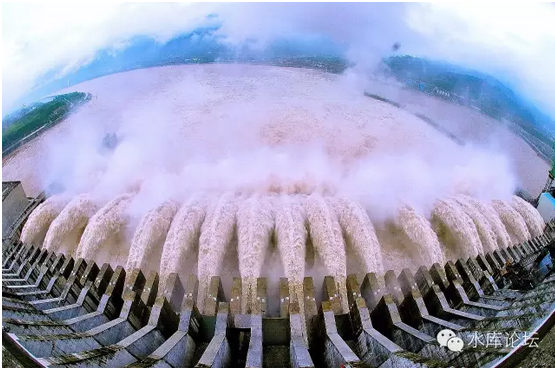

# 从来不存在四万亿 \#850

原创： yevon\_ou [水库论坛](/) 2016-02-24

从来不存在四万亿 ~\#850~

从任何一个数字来看，2009年都不是很特殊的年份。

 

 

一）逻辑难题

 

和傻空辩论讲道理，是一件很困难的事。因为他们的逻辑断层太多，多到了难以批改作业的程度。

 

譬如一篇典型的傻空作文。写到了"因为A，所以H"的分析。

他是这样写的：A-\>B-\>C-\>D-\>E-\>F-\>G-\>H

 

但是你和他说，A-\>B是错的。加营业税并不能抑制房价，反而会使房价更高。

B-\>C也是错的。房价更高并不会使国际热钱加快流入，反而会使投资流出。

 

所以A-\>"Not B"-\>C，

也就是A到C的逻辑反而是顺畅的。负负得正。

唉，这都什么事啊。

 

 

对于"四万亿"，他是同样一个例子。傻空的ABCDEFGH，他们是这样写的。

-   2008年KFS已经快撑不住了。

-   宏观调控是降房价的。只可惜，在最后的决战前夕，突然遇见了四万亿。

-   房价因此掉头上涨。

-   痛骂四万亿

 

我们要说的是，他的A-\>B，B-\>C, C-\>D, D-\>E全部都是错误的。

上面的逻辑链，哪一条都不成立。

错误实在太多，以至于甚至都完全无法批改。

 

 

二）四万亿

 

2009年房价的确是涨得很多。

 

可是，正如我们之前《楼市的季节性效应》一文中说的，从廿一世纪迄今，房价大涨的年份还有很多。

累计：2001年，2003年，2005，2007，2009，2013，2015这些都是大涨年。

 

 

如果以涨幅而论，2009年也不是最高的。其中2003/2005都有50%以上的春季涨幅。

纯粹以涨幅论，2009最多排第三第四。

 

也就是说，以年份序列而言。2009本来就"应该是"大涨年。他既没有显示出特别的涨幅，也没有显示出特别的板块特性。

 

 

那么，以"信贷"而言，40000亿是不是值得津津乐道呢。

2010年的信贷总量，超过4.5万亿，你知道么。

2011年，超过6万亿。

2012年，超过7万亿。

2015年，超过11万亿。

这些事情你知道么。

 

事实上，因为中国是一个"纸币爆炸"的国家。中国的M2以及货币，都在以+20%的速度飞速增长。

所以你2009年的信贷，肯定是比2008年大的。

2010年的信贷，肯定是比2009年大的。

 

您坐稳了，别趴下。2016年的总信贷投放，很有可能超过14万亿。

仅仅刚过去的春节元旦，一二月信贷就有望 \> 4万亿。

您吓趴下了么。

 

也就是说，中国的信贷投放，本身就是以"指数"增长的。

在整体逐年图表上，2009并不是一个特别尖锐的突起。甚至也不是值得一提的年份。

 

我们的意见非常明确，从来就不存在四万亿。

2009年并不是一个特殊的年份。从任何一个统计数字来看，都和之前之后没什么区别。

 

秀相说"信心比黄金更宝贵"。

为什么我们要大张旗鼓宣传四万亿呢。因为这其实是"香炉灰"安慰药。

 

秀相执政，还是有一点底线的。

他虽然宣称是"四万亿"。但其实印钞并不多。

口号大于实质。主要还是靠忽悠，把底下人热情给煽动起来了。信心比黄金更重要。

不水的。

 

 

三）四万亿和房产调控

 

为什么舆论媒体要反复提"四万亿"，为什么傻空小白领提到"四万亿"要痛哭失声哀拗。

因为他们被打脸。

 

 

作为一个奥派经济学，我们深刻地知道："因为宏观调控，所以房价飞涨"。

加营业税，所得税，土增税，并不能降低房价，反而会使得房价更高。

而且恶果会发酵，06年的政策，危害会二三年后显现。

 

但是傻空们不是这样想的。他们认为的是，中二病"宏观调控是专为屌丝降房价的"。

当调控变成空调，继而变成鼓风炉。屌丝们慌了。

 

 

他们需要一个借口，需要一个解释，需要一个精神寄托。

于是故事就变成了：

-   宏观调控是降房价的

-   KFS已经快撑不住了。

-   在2008崩溃的前夕，突然迎来了四万亿。于是KFS绝处逢生。

 

这个故事纯粹是编出来的。纯粹是鸦片性质的。纯粹是傻空自己骗自己。

 

而对于多军来说，"2009年上涨"是按照季节性概率，早就推算出来的。2009年这一年也并没有发生过特别的事。

筹码，建仓，我们早已把口袋布好。然后钱果然如预料"嗡嘛呢呗咪吽"

 

All money go my home.

 

 

四）四万亿的善果

 

结下来讲C-\>D逻辑中的逆转。

 

傻空痛哭四万亿，痛骂四万亿，认为四万亿救了KFS的命。

他们是善恶不分。

你喂他们吃补药，他们还以为是砒霜。

 

 

虽然秀相对房地产一百个看不顺眼，但"四万亿"阶段，房产调控的确是有放松的。包括但不限于；

1）营业税五年改二年

2）普通住房调整

3）降息

4）降准

5）给KFS更宽松贷款

6）银行贷款"资格"的放松

 

这些政策，对屌丝们有利还是不利的。答案是：有利的。

我们用了巨大的篇幅，再三解释"宏观调控"的邪恶之处。因为宏观调控，所以房价飞涨。

我们就是要正本清源。告诉你哪些才是砒霜，哪些才是人参。

 

 

而屌丝们的逻辑，是极度混乱的。他们认为"打击炒房"是对他们好。

认为"四万亿"是历史转折。

认为"放松调控"，是对他们的不好。为此咒骂痛骂，恨不得批斗游街。

 

屌丝啊，你让我怎样拯救你。

 

 

 

五）货币政策之诅咒

 

"未来应该是确定的，而不该是赌博" \-\-\-\-\-\-- yevon\_ou

 

 

2003年之后开始的房价上涨，很多人视之为一场赌博。

对他们来说，"明天"房价会涨还是会跌。他们是无法确定的。各自50%vs50%概率。

如果博中了，他们就认为自己英明神武。富有投资眼光。

如果博错了，不幸做了傻空。他们就骂娘："谁知道突然冒出来一个四万亿，本来俺是完全估中的，房价快要崩盘了........."

 

 

政府会不会滥发纸币，会不会以20%以上速度供应纸币。

这并不应该是一场赌博与猜测，而应该是理想，逻辑和推理。

 

正是因为我们早已算定了这一切会发生。我们才会去买房，建仓，等待。

这一切都是理性确定的，而不是赌博。

 

 

为什么，这一切都该从吏治开始。

秀相2003年上台，我们就开始观察他。政治人物因为曝光率实在太强，积累了大量原始数据。

 

秀相的问题，是他要搞"福利"。想要收买人心，想要搞以人为本。

这是一件非常非常糟糕的事情。

 

另一方面，则是秀相缺乏能力。这从"铁本冤案"和"SARS"表现得很清楚。当然,不是人民日报写的分析三观。

具体不展开。

 

 

"想要搞福利"和"不懂经济"这二件事撞在一起。

几乎立即可以得出"大放水"滥发纸币的结论。

虽然不知道哪一年。但迟点早点总会来的。

 

 

为什么，因为政府首先是一家"企业"。他和企业的资产负债表，逻辑并没有什么二样。

一方面，是你的收入。财税收入。这一项和你的能力成正比。越是懂经济，搞市场经济的总理，"政府收入"就越高。

另一端，是你的支出。支出无非是二项，军费或者福利支出。

 

而秀相呢，他二项都是低分。

这个打分是我们偷偷躲在地下室，用小黑板打的。而不是CCAV上的公开评分。如果是公开的场合，那肯定是十分。

我们对他打分之恶劣，几乎和八宝饭造神运动同步的。

 

 

秀相不尊重市场经济，他收入必然少。

秀相想要搞福利收买人心，他支出必然多。

这其中，就是财政赤字缺口。

 

 

你有了赤字缺口，你就必然滥发纸币。

不要相信什么"国债理论"。也不要相信央行一大堆SLF，SLO玄之又玄的专业术语。

赤字到了最后，就一个字，"\_\_\_"。参见财上海的口型。

 

 

所以秀相的命运，从他上台那一天就决定了。你最多观察他一年，到2004也看得很清楚了。

因为看得清楚，所以你才敢博房价上涨。而不是当他"圣人明君降房价"。

这一切都是算出来的，而不是博出来的。

 

多和空的命运，从你"信仰"那一刻，就已经决定。

 

 

对于我们来说，每过三五年，突然来一次"如图"。这事是预料中的，而不是措手不及的。

至于有人问，今后几年呢。

咳咳咳，呵呵呵，这咖啡好好喝呀。

 

您不会自己躲在角落，用小黑板打个分么。

 

 

（yevon\_ou\@163.com,2016年2月20日暮）
