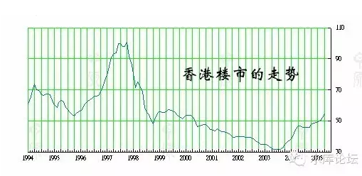
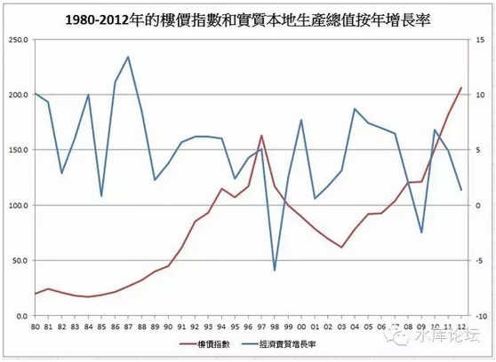
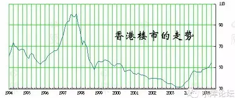

# 香港楼市崩盘始末（上） \#970

原创： yevon\_ou [水库论坛](/) 2016-04-11

香港楼市崩盘始末（上） ~\#970~

香港房价最低谷，也就跌到1995年的价格，Over

一）郁金香泡沫

 

2000年，有一个古怪的德国老头Peter
Garber，突然心血来潮。决定去考察一些著名的历史事件来源与出处。

 

细究的结果让人大吃一惊，以最为著名的荷兰郁金香狂热而言（1634～1637）。该事件常作为典型案例，告诫人们不要投资冲动，避免于追涨杀跌投机性市场。

 

综合所有的郁金香故事，辗转抄录，但最早的起源，都来源于1929年再版的一本回忆录《荷兰往事》，由股神巴鲁克作序。当时因为股灾不久，投资人亲历悲剧始末，所以对书强烈共鸣。

 

而这本回忆录，最初是由苏格兰律师兼诗人，查尔斯·马克，在1841年将十一则投资往事集合成书。名为《回忆录》。

1850年再版，并改名《公众的幻想与疯狂的公众》，畅销一时。值得注意的是，这是本故事书！

 

再之前的追溯，是荷兰政府在18世纪印刷的一本基督教单行宣传册《贪心不足与实话实说》。当然，这是一本追求"新闻导向"的小册子。

 

德国教授继续追踪下去。发现所谓的"郁金香花茎"，其实有很多种，从最贵的100万美元一支，到最便宜的1美元一枝，种类繁多。如果将最贵和最便宜的品种混合在一起，自然得出了崩溃1000000倍的结论。

 

事实上，早从14世纪起，欧洲荷兰，比利时，德国，奥地利等宫廷贵族，就喜欢用鲜花装饰衣料。上流社会的贵妇人，用郁金香花瓣打扮衣物或者帽子，在当时是很平常的一种举动。

 

2001年，阿姆斯特丹，鲜花拍卖市场，一株非常罕见的郁金香花球，成功地拍出了60万英镑的天价。这样的价钱，可以在全世界任何一个地方，买一幢顶级别墅。

 

传说中的1633～1637年，郁金香价格从几十荷兰盾飚升至万余荷兰盾。荷兰盾是金币，50盾大约含有1盎司黄金，按今日排价，折合8万美金。对于当时的公爵侯爵夫人来说，这仍只是一瓶香水的价格。

　　

Peter
Garber考证了大量的历史资料，最后写下了《泡沫的秘密------早期金融狂热的基本原理》一书。由MIT
Press出版。

 

这个故事告诉我们的教训是，不要盲信传统，其实很多事纯属以讹传讹。

 

 

二）香港楼市泡沫

 

2001年，当我们刚踏入这行时，我们听说得最多的是"楼市泡沫"。

 

几乎所有的舆论媒体，厌厌不休地向我们教育"日本房地产泡沫""香港房地产泡沫"。

日本房地产怎么崩盘的，香港房地产大跌七成。当年的荷兰郁金香泡沫啊，老吓人呢，我告诉你。

 

 

当然，很多年以前你没有被唬住。在炒楼的这一条道路上走了下去，然后房价翻了十几倍。

随着见识阅历的增长，我们渐渐地知道了身边存在一种空气叫做"毒教育"。

 

"毒教育"的意思，当你还在懵懂无知的时候，直接把你带到沟里去。直接把你洗蠢掉，把你三观洗掉。

以致于许多人20岁之后，并不知道自己生活在一个Matrix谎言时空之中。意识到"幻相"是最关键的一步，所有的觉悟均由怀疑开始。

 

我们的一个怀疑，"到底有没有香港房地产崩盘"。

荷兰的郁金香故事，我们现在知道是假的。是一个基督教修士会捏造出来的"净化风气"宗教宣传小册子。

而香港房地产崩盘呢，到底是不是跌了70%？

 

 

三）香港楼市泡沫

 

\* 首先申明一下，20年前本人亦未入行。只能追求大致精准。下同。

 

香港的房地产，从1960年开始起飞。如果从"起步价"开始计算，则一共大概升了200倍。

你将它平摊到56年的时间中，平均每一年正好涨约10%

 

 

但是，毫无疑问的一件事。一般认为1991\~1997这六年中，楼市升得特别厉害，大概升了四倍。或每年25%

事情的真正高潮，发生在1995年。仅仅最后的十八个月，楼价就升了+50%

 
1995年，英国人大肆抛售在香港的资产，并形成一个向下缺口（如图）。英资怡和，置地，太古，嘉道理家族，大规模抛出手中核心资产，渡海西游。

而这些资产谁在接手呢。华人大亨接了一部分，更多的是有很多"红筹"在接。

 

当时，出于TG的"天朝"形象，以及我D一贯的要面子传统。1995年红筹大肆托盘，接了英国人不少工商铺大厦。并给市场留下深深的"土豪"印象。

 

 

随着97临近，市场开始狂热。香港人的口号是什么呢，"大陆一定会接盘的"。

不要怀疑，这句话你们的确没在任何中国媒体上听见过。

 

于是香港人拼命地炒高楼价，熊心豹子胆。当时最著名的是沿着九铁沿线，矗立着一幢幢"省长楼"联排别墅。约一千多万/套（97物价）。

市场传言，中国有31个省，每个省都有十几个省级干部。每个干部都要在香港置一套别墅。这是数不清的需求。

 

我们知道，香港在1995\~1997，是一个急剧上升的曲线。涨幅接近+50%

你甚至可以换一句话说，"香港楼市之后的跌幅，都是1995\~1997二年内涨出来的"。

 

 

四）三个70%

 

70% \* 70% \* 70% = 33%

 

香港楼市从顶峰下跌到最低处，大约跌剩三成。按照我个人粗浅的看法，他大致可以划为三波。每一波都是七折。跌去-30%

当然，香港不是我的主场。谈上海楼市我能确信100%符合历史，香港毕竟隔远了一层。若有更专业大师，轻打勿拍。

 

 

三个30%，"CEO 30%"+"暴涨30%"+"真跌30%"

它楼市中的第一个-30%，是CEO盘-30%。

 

我们知道，所有的楼盘，并非同步同涨同跌。

楼盘之中，本身有笋盘有洼地，也有CEO盘和严重高估的陷阱。

 

香港的第一个-30%，是CEO盘跌30%

市场并非完美协和。尤其是大势急升的时候，会有一些区域一些板块"炒风"特别炽盛。

这些板块和楼盘，或许是KFS特别擅长炒作搞话题，或许是目标人群特别无理性，或许是外来人口刚需急。

 

我们综观香港1997下跌，发现跌得最狠的是"伪豪宅"。具体的定义是：新晋社区想要开发成高档住宅区但又未完工尚未被市场接受的原有烂泥地郊区。

譬如当时九龙塘，石硖尾，东涌，乃至深水湾都跌幅十分严重。这些区域以新盘为主，人口填入。本身的凝聚力不强。

而到了1998\~1999下跌第一年，KFS集体"劈价抢跑道"，一手盘最多的地方又是受害重灾区。

 

 

另外一个方面，"学区房"跌幅也十分严重。1997.6月最著名的一件事，就是有豪客坐直升机睇楼，全港轰动。

"何文田"卖22000/尺。其结果自然是跌得惨不忍睹。

 

 

五）第二个-30%

 

第二个-30%，是抹去了"去年的涨幅"。

 

我们知道，56年平均，香港算大牛市了，年均涨幅不过10%。

而1996\~1997最后一年，受"红筹托市"的感染。仅仅最后一年就涨了约+50%

其中，普通的大盘大势仅涨了约30%，还有30%是特别的"明星爆炒盘"额外涨上去的。也就是部分盘涨了60\~70%.

 

楼市下跌的第二个-30%，是把这一段涨幅摸去。

我们看回第一张图。

 

我们可以看见，1995年的这一个价格，形成了一个明显的"底部"，或者称之为箱体。

也就是1995年的价格，原本是经过充分换手，市场充分接纳，是"夯实"的。

 

 

所以我们看图中这个图形，他从1995\~1997是"急升"。但是1997\~1999是"急跌"。

急跌的时候，怎么升上去就怎么跌下来，图形几乎是完全对称的。

 

可是到了1995=1999的这个价格平台，他就跌不下去了。就获得了喘息。

因为这个价位是有"支撑位"的。是经过充分换手市场比较接受的。所以在这个位置足足盘了二年。

 

 

六）第三个30%

 

从2001年开始，市场终于开始破位。跌掉了第三个-30%。

这第三个-30%，是"真跌"。

 

 

因为从1997\~2001，市场已经阴跌了四年。人气和野望低迷之至。终于是会有人"熬不住"，撑不住的。

从2001年开始，逐渐有一些资金链崩裂，或者对前途极度悲观的人士，开始按照"亏本价"抛售手中房产。并形成了一个破位下跌走势。

 

这个走势的最大下跌大约是-30%。持续的时间大约是二年。

这一段是真跌。真刀割肉。

 

 

七）分析与解读

 

如果你是一名房东。你每天晚上都睡不好觉。

你每天思索三个问题，"吃早饭的时候房价会不会下跌"。

"吃午饭的时候房价会不会下跌"

"吃晚饭的时候房价会不会下跌"。

 

 

好了，那我现在反过来问你几个问题。

-   问题一，你是买在传统成熟地段，还是"新兴"开发地段。你是买的二手老破旧，还是一手CEO。

 

如果你的回答是"新兴"地段。好比6W的唐镇，7W的张江，6W的森兰。

买的又是仁恒，万科，绿地之类磨刀杀粉KFS。

则你很有可能是"CEO盘"的牺牲者。你很有可能会比别人多跌一个-30%.

 

而如果你回答7W买的小陆家嘴。恭喜你，你过去本关了。

 

 

-   问题二，你是在2015.10之前买的，还是2016.02之后买的。

 

众所周知，2015.10\~2016.02是一场+50%的巨型涨幅。当然，我并不是说这是我们的最后一个涨幅。

但是，套入到"三个70%"理论中去。如果你是大涨之后刚刚买入的"高位接盘"，则你会比别人多一个-30%的危险。

 

如果你不是顶峰买入的，恭喜你，第二关你也过去了。

 

 

-   问题三，如果回撤-30%，你能扛二年么。

 

如果问题一，问题二都难不倒你。则你的风险应该说已经不大了。

我们可以认为，房地产市场，最大的回撤大约可能估计或许妹比不超过-30%。

房东并不愿意劈价卖。

 

最寒冷的严冬，也不过下跌-30%，持续的时间约二年。

此后就逐步回升。

而且回升的速度还不慢。跌下来用了六年，升上去也只用了六年。连泡带沫全都还给你。

 

 

（未完待续）

 

 

（yevon\_ou\@163.com,2016年4月10日晚）
