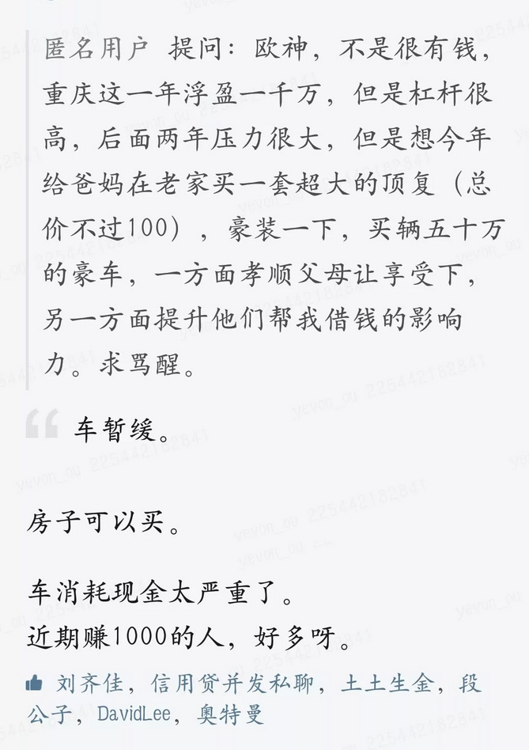

# 水库相亲 \#1000

原创： yevon\_ou [水库论坛](/) 2018-10-14

**水库相亲 ~\#1000~**

 

媒婆业的辉煌事务

 

 

一）垃圾粉

 

"水库论坛"社群，是一个矛盾混合体。

 

一方面，无数无数广告商吐槽过，水库"垃圾粉"没有购买力。

哥哥天天被金主吊起来打。十篇投诉十次。

 

-   p2p卖不动，俺就不说了。

-   股票课也卖不动

-   英国旅游卖不动。

-   卖海参也不行。

-   卖红酒也不行。

-   唯一一场"大卖"，是卖米。足足获得了20倍广告费的销售额。

-   大米商高兴坏了。推荐了隔壁的枸杞。枸杞好啊，补肾。

 

结果呢，水库垃圾粉，连"枸杞"都卖不动。

一群米奴，超出了基本生活需求，什么都卖不好。

 

  

但是另一方面呢，水库又可能是全中国"净值"第二高的社群。

水库有钱人铺天盖地，简称"A8.5满天飞，A8.1多如狗"。

 

你想，水库研究的是房地产。而且不是第一套房子，是第五，第六、第七、第八套房子。

 

房子这玩意多贵啊，动辄几百万。

能一把"手顺"♣AKQJ1098765432配齐的，去到任何一个战场，都是第一流的人物。

《有人寂寞每个人都寂寞》兰亭来自水库论坛00:0005:12

 

天底下做生意，无非：

-   低价高频

-   高价低频

-   低价低频

-   高价高频

四种模式。

你看京东多NB。可是京东递交给"美国SEC"的报告，一共只有2000W个有效客户。估值320亿美金。

 

也就是说，你坚持每月上京东买200元东西，就算"高价低频"了。

在华尔街的眼里，你这个"客户"就价值1600美金=RMB 10000 

（您价值1w么）

 

 

而另一种公司，它的"客单价"非常低。

最典型的，如Mobike，摩拜单车。

每次骑摩拜，收费只有0.5\~1元。

 

但是摩拜基数大，它有1亿注册。每天有100W次打开。

因此摩拜的账面估值，也有28亿美金。

 

但是，天底下从来都没有"高价高频"。

"客单价"几百万元，吃豆子一般，每年不停地买。

 

这样的商业模式，从来都没有出现过。米缺索。

一旦出现，哪怕你象"京东"，做一个通道商。提供一些中间服务。

那也是了不得的钱景。

 

 

汇聚菁英，"水库"是一个非常有"价值"的社群。

按照我们内部的愿景，全中国大概可以排到第二。

第一名No.1谁呢，是"SCC超跑俱乐部"。

 

水库是蕴涵着巨大价值的，质朴的金矿。

我们要做的，则是把水库的"广告价值"挖掘出来。

 

 

之前我们做的，卖枸杞，卖大米，卖洗发水，卖海参，细说全部都是错误的。

我们真正应该做的，应该是：

 

卖人

 

 

 

二）男性粉

 

上次我和"贪心记"的晴予聊天，谈起水库读者的构成。我说是：

 

-   67%男性

-   33%女性 

晴予惋惜地，摇了摇头。"男性粉不如狗"。

女人 \> 小孩 \> 老人 \> 狗 \> 男人

 

许多年后我才明白，自媒体的定位中，是存在"歧视链"的。

男性粉丝，默认价值为零的。

甚至有很多自媒体开会。大家互相盘讪，只回答"女粉丝"的数量。

 

男粉，默认是狗剩的。

水库到了聚会场合，就只能上报："粉丝16.8W，其中一半是女孩子"。 

 

身为药渣，粮渣，豆粕渣，哥哥对此表示异议。

男人怎么了，男人具有更高等的智慧，更坚强的毅力。

男人胸怀宽广，如草原上的雄鹰。

 

天下大事业，全都是男人做出来的。

白手起家，骈手砥足地赚到1000W。水库核心心法，只有男粉才承受得住如此苦难深重的砥砺前行。

 

漫天黄沙掠过

走遍每个角落

行走在无尽的苍茫星河

 

白天黑夜交错

如此妖娆婀娜

蹉跎着岁月又蹉跎了自我

 

当然，赚了钱.........最终替你花的，还是女人。 

 

当你嘲笑"中年油腻"时，铁汉子正在不声不响地，为你赚取生活费。

地表上最强动物，只是待你好，才穿一件潦倒的皮夹克。

 

更何况水库的男粉，还不是"恐怖直立猿"这么简单。

哥哥仔细算了一下，具备三个优点。

 

说"男粉"不值钱，是你没有找到正确的打开方式。

 

 

 

三）剩斗士

 

21世纪什么东西最稀缺

\-\-\-- 好男人

 

 

花好月圆，哥哥一手的Waiting List.

"这么多女孩子，都是未婚的么"。

"对呀，你不知道，现在京沪深的男生有多稀缺！"

 

我真的是脱离这个市场太久了。

从来不知道，我们的社会，已经发展到如此地步了。

 

在"北京，上海，深圳"等城市，未婚女性：未婚男性比例；

-   不是1：1

-   不是3：1

-   不是5：1

-   而是10：1

 

 

当然，天底下不缺男人。缺的是王俊凯。

90%的男人，都是王大锤。剩下10%是王一博。

 

在"白领，骨干，精英"女性眼中，她们显然是不会嫁给王大锤的。

无论任何条件，都不会嫁的。

 

韩国政府为了刺激生育，补贴开得象锦鲤清单一样长。

你就算补贴十万，也是没用的。

打死也不会嫁给王大锤的。

这怎么啃得下去嘛。

在"白骨精"眼中，她们只看得见Top的男性。

 

 

"百合网"，"世纪佳缘"，"珍爱网"搞了好几次"高端""高高高端""高高高高高富豪端"相亲聚会。

-   相亲网站高端，定义是：年薪20W

-   高高高端，定义是：20W+有车

-   高高高高高富豪端，定义是：净资产500W。

 

为了这样一场"500W净资产男士见面会"，她收取你高额门票。

邮票，门票，最高级别甚至可以达到30000元/次。

 

《我只嫁有 5000 万资产的富二代，不然我的灵魂就被毁了\...\...》

哥哥大手一挥，A7.5什么玩意，开除开除。

水库圣阶多如狗。

7.5都不好意思见人。

 

水库变现，最适合搞的，是"相亲节目"。

我们这里密度最高的，是"高净值帅哥男粉"。

 

 

 

四）最佳女婿

 

-   男性

-   A8

-   年轻，发财足够早，足够快

-   老实诚恳可靠

 

哥哥掰着指头数。

"水库男粉"的优点，可真数也数不清。

 

 

天底下的"有钱人"很多。你到三四线去，多的是膀大腰圆，戴金链子撸串唆蒜的"土豪"。

但是大部分的"胖子"，面目非常可憎。

 

有钱了以后，他就吃喝嫖赌，花天酒地。

哪怕不赶夜场，至少也是狂妄傲慢，空虚肤浅。

 

 

可是"水库男粉"不同。水库男粉不仅有钱，而且勤勤恳恳。

人生的唯一爱好，不停地往家里搬房产证。

每天的主要工作，任劳任怨攒钱还房贷。

 

水库男粉不仅是"有钱人"，而且是"好男人"。老老实实走正道的。

勤奋，储蓄，耐苦。无形中把"富人"又筛了一遍。

含金量更为突出。

 

 

其次，发财这种事，发财要趁早。

一般的民营企业家，等你赚到了1000W。至少得要35\~40岁。少年都老了。

对于30岁的人口，奋斗的目标不是1000W，而是200W。

 

若真的嫁一个"老头子"，那也没什么趣味。

但是"发财早"的男士，哪里去找，无形中又提高了好几个难度数量级。

 

 

而"水库心法"，发财极快。常常有2016\~2017二轮，就能赚1000W的。

在充满青春的岁月中，早有了钱，才是人生幸福呀。

 

如果这二点还不能说服你的话。让我们来想一下，"财上海"的核心诉求是什么：

 

加名字

 

-   全上海，有几个人肯给你加名字。

-   净资产1000W的人，肯不肯给你加名字。

-   你要熬到几岁，才能加名字。

 

 

但是在"水库粉"这里，我们的回答是：

 

加名字，当然是不能加的。

婚前买一套，只写女方一个人名字！

 

台下惊叫一片。贵妇们，淑女们，疯狂地扑打着折扇。

好几位名媛昏厥。

 

 

水库男儿继续宣布：

表现好的，婚前买二套

 

丈母娘们越过人群，踩着女儿的头纱和围裙，凌空飞跃，扑向大猪蹄子。

快抢啊。

 

水库男，继续宣布第三条：

极品S级，丈母娘也赠送一套！

 

场面已经完全无法控制了。

水壶都要烧开了。

 

见《[[丈母娘问他三个房产问题]](https://mp.weixin.qq.com/s?__biz=MzI4NDA1NTYzMw==&mid=2650440374&idx=1&sn=9723dde18971fda83ed6e55319fdb2ad&chksm=f38f6388c4f8ea9e4cffbe4123cdf59a388c33108bfcfd3a7c3ec52df925c50e9b71f9571c03&scene=21#wechat_redirect)》\#C09

 

 

 

五）水库相亲

 

为了广大旷男怨女的福祉，顺便也赚点小钱，"水库相亲"产品线，轰隆隆地上线了。

我们不卖枸杞，我们卖人。

 

2019市面上最高端，最精华，年轻富人密度最高的相亲活动，华丽丽地冷启动了。

 

 

鉴于哥哥一贯的"marketing臭脾气"。俺们还要定二条规矩，以区别于市面上"普通相亲"的不同。

 

丑话说在前头，您先看看，接受得了否。若是伤了圣母的"玻璃心"，您就别来了。

 

1）对女性收费

2）N:1形式

 

"对女性收费"，是我们一条基石级的，不可改变的原则。

 

我知道，女性已经习惯了"优待"。

在许多夜场酒吧，都有Lady\'s Night，女性免费，携女友半价。

 

相亲约会，女性连AA制都不肯。有大量的4分女，要求男人出所有的费用。

女人是貔貅，只进不出。

 

 

但"水库相亲"，我们的基石原则，是女性付费。

您要是"情感上"难以接受，您干脆就别来了。女权婊就是来了，也不会是水库男心目中的"好女人"。

 

因为市场上的"供需关系"，就是女多男少。

既然你供大于求，你是弱势一方，为什么不是你付费呢。

 

事实就是事实！

蒙上眼睛，否认事实，是没有任何意义的。

正视现实，才是"幸福人生"的开始。

 

 

"水库相亲"第一条核心逻辑，就是女方付费。

 

我们会发放"好感卡"，每张价值50元。每位女士赠送二张。

女士赠送给心仪的男嘉宾。

男嘉宾兑换车马费。

 

"水库相亲"活动，将会是"女士打赏，男宾收钱"。

以充分显示，目前市场上艰苦的供求矛盾。

维护男性的尊严。

 

 

 

水库相亲的第二条基石，是N:1

我们计划组织一场55人规模的活动。但是我们的女:男比例。

 

-   不是27：28

-   而是50：5

 

每10个女人，对应一个男生。

50个女生，围绕5个男生，莺莺燕燕。

 

看到这里，"女权愤斗份子"又要拍案而起了。污言秽语地，什么泼妇脏话都骂出来。

你这不是侮辱女性么，你这不是大男子主义么。

 

我又怎么侮辱女性了。我阐述的是事实。

是事实！

是事实！

 

 

事实就是，这个市场，严重地"女多于男"。

白骨精市场，大约10:1的剩女比例。

若把男性门槛放到A8，很可能是30:1的供需。

 

事实高于一切！

 

既然是事实，为什么你不尊重科学呢。

 

 

殷鉴传统的1：1活动，注定守旧失败。

哪怕A8精英男，每个女生聊5分钟。30人也得排一个下午。有趣的灵魂无法展示。

 

而我们的活动，会尽量安排N:1，许多人可以一起参加的"集体竞赛"。

-   例如跳舞。

-   抖音舞

-   踩气球

-   烘培品尝

 

  我们的业务模式是：   女性门票599元\*50人
  -------------------- ---------------------
  男嘉宾返利           -2000元\*5人
  酒水场地：           -10000元
  人员耗材：           -5000

 

我们不贩卖"成功率"。

我们只贩卖"希望"

给你一次"机会"。你，就是主角。

 

 

六）报名

 

我们对男嘉宾的要求是：

 

1）未婚

2）净资产A8（1000W RMB）

 

所有想报名的男士，请联系相亲大主管："喵喵喵"。

 

水库会要求，男士提供A8"实力证明"。一般是房产证，定存证明，证券公司版股票明细。

水库尽能力核查资料的准确性，但不做出保证。

 

女方若有心仪男士，可付费购买"资料副本"。自行核实。

男方同意资料泄露的风险。

 

我们对女方的要求是： 

-   没有要求

付费的就是大爷。女方不需要提供任何资料。

 

 

正常活动，会由13:30进行到17:00。

水库不管17:00之后的事情。男女情爱各耍心机。

我们只是简单的一个："舞蹈爱好者俱乐部"。

 

第一场活动，会在上海举行。

 

时间：2018.11.04下午，13:30\~17:00

地点：上海市长宁区遵义路122弄66号2-L108，（南丰城）音乐餐厅

 

关于活动的细节，晚点还会再发一篇《水库相亲细节》。请持续关注。

报名链接是：

 

男士：联系大管家"喵喵喵"。 

女士：点击"阅读原文"，进入网页购票。限量52张。

 

 

 

（yevon\_ou\@163.com，2018年10月13日午）
