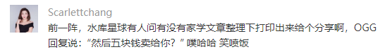
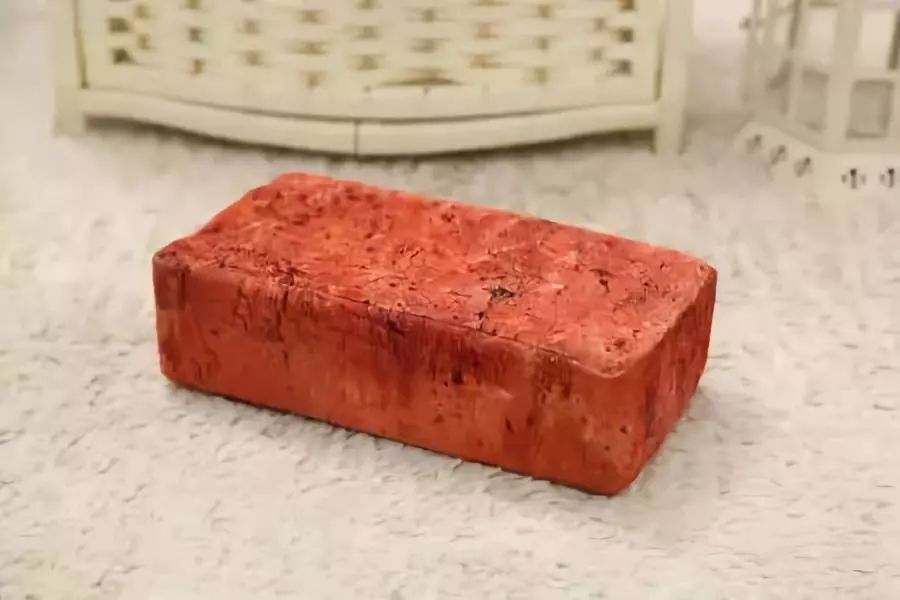
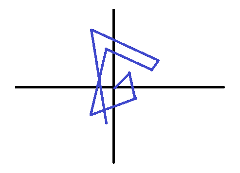

# 为什么有些知识付费这么贵 \#C28

yevon1ou [水库线下](/) 2018-08-13

为什么有些知识付费这么贵 ~\#C28~

 

 功法有毒

 

一）       定价

 

这二天突然想到一个很有趣的话题。

为什么有些知识付费这么贵。可以拿出来一说。

上个月"喜马拉雅"的老总，下了一条死命令。喜马拉雅所有的音频课程，原则上定价不得超过2.99元。

喜马拉雅希望打造"亲民"的形象，同时也标榜自己价廉物美。降低消费者的成本。

 

另一个屌丝社区知乎，知乎Live的定价，基本上都是19.9元及以下。

当然还有我们声名卓著的"得到"。罗振宇十分得意，得意在于，他为业界竖立了"标杆"。

每一节课199元。不分男女，童叟无欺，统一199元。罗振宇几次三番在公众场合强调，他为整个知识付费行业"竖立了标杆"。

 

水库的知识付费，直接起步就是5500元/人。

什么2.99，19.99，199，不存在的。

永远都不可能199的。

 

 

 

二）       醉步

 

为什么有些知识付费可以这么贵。5500元的课程包，比199元的几十万字，到底多了什么。

就算你文笔好点，口才好点，论字数算，你的"干货"就那么浓？

 

再往上，甚至还有68000，168888的理财包。它们又都讲了些什么。

 

 

我想，绝大多数人的一个误区。它们以为"知识付费"是一块块"砖石"般的模型。

 

在普通人的记忆里，乃至乡村屌丝的三观里。科学是一座无比宏伟的大厦。人类已知的知识，车载海量。

而"知识"和"学习"，则是一块块再普通的红泥板砖。 

屌丝们或许比较穷，起点比较低。读不起硕士，博士。请不起名家大儒。

但是他可以买"板砖"啊。

每买一块板砖，是不是觉得自己的知识库藏，更"富有"了一点。

 

有时候赶到"618"大减价，搞一些满300减150的礼券，更是感觉赚到了大实惠。看着Kindle里面满满几千本电子书，心里都是满足感。

 

 

因此，屌丝认为知识付费的价格，就应该是0.99元/篇。

象"喜马拉雅"这种场所，便民装0.99，普及装1.99，豪华装2.99元。

绝不能高于2.99，否则你"每千字"性价比就低了。

大家都是红泥板砖，凭什么你的砖石就比别人贵一点。

 

这样的思路想法和三观，大错特错。

 

 

并不是这样的，屌丝的脑袋，愚蠢又幼稚。俗称韭菜粉，连蒜泥都比不过。

屌丝默认了一个事实："砖瓦的质量，是没有问题的"。

 

水库曾经写过一篇文章，叫做《[中二病
\#670](http://mp.weixin.qq.com/s?__biz=MzAxNTMxMTc0MA==&mid=401668087&idx=1&sn=94dc27a4eb39acf7cc7adb10e6df7d73&scene=21#wechat_redirect)》

讲的是中产阶级家庭教出来的孩子，单纯而且又小白。

对整个世界的理解，就象是小白兔。卡通，童话，巨婴。

 

他们居然愚蠢到以为，只要凑满足够的砖头。就可以建筑大厦。

你现在不够富裕，是因为你工作还不够努力，加班还不够勤奋。 

我只问你一句话，"你凭什么相信，知乎Live嘉宾们说的就是对的呢"。

小白领宛如雷霆劈顶，喃喃地说，"老师，公开出来售课的老师，难道还能是不对的"。

 

 

从小到大，你默认受的一种教育，"教科书总是对的"。

你不需要去思辨，不需要去辨别真伪，不需要怀疑，批判，突破。

不需要经过浴火重生般的自我否定。

 

你只需要背书。"教科书上就是真理"，凡是和教科书不符的都是伪经。

你背诵了小学，中学，大学。

一路"背诵"上去。凭借着填鸭式背诵能力，你考上了研究生。

 

 

在进一步深造"知识付费"的领域中，你依然中二纯粹。

你默认以为"每一块砖石，质量都是保证的"。只要收集起足够多的砖石，就可以建造起真理的大厦。

并进一步洞察资本市场先机，股市涨跌，经济命脉，踏上人生商业巅峰。

 

可是，万一你买的"知乎Live"是错误的呢。

万一嘉宾满嘴跑火车，对理论理解得并不深刻呢。

万一嘉宾本身就是错误的。甚至是有害的呢。

 

 

真正的"知识付费"，其实更类似于一种"随机漫步"模型。

如图，假设一个醉鬼，从原点出发。

他向前的每一步，步子有长有短（知识付费的浓度）

但是步子的方向，是完全不可预测的（知识付费的准确度）

则他最终，并没有离开原点多远。

 

 

对于"知识付费"这个领域，真正的问题是，它其实是存在大量"错误"的。

好比你听某些老师对于股市，楼市，汇市。

宏观经济，中美逆差，特朗普贸易战等分析。

你简直听不下去，恨不得撕了他的嘴巴，送给他四个字"以上全错"。

 

这样的"知识付费"课程，不管是定价1.99元，19.9元，199元，

[听了对你有害无益。甚至是越听越糊涂的。]

 

 

好了，那么你要问，"正确"的知识付费，问答在哪里。

问题就在于，不存在正确的知识付费。

人类的文明，花费了几千年的时间。最终才奠定了牛顿力学三定律，门捷列夫化学元素周期表。

 

这些"数理化"基础学科，千锤百炼。在科学的进步史上，不知道流了多少血，多少汗。再要大错的概率不大。

 

而出了"数理化"三课。哪怕教科书上的历史，政治，语文，错误立刻急剧增加。在奥派经济学眼里看来，糟粕实在不少。

 

出了"教科书"，目前市面上卖的"知识"，就更加良莠不齐，鱼目混珠了。

 

你无力判断，哪一部才是真经。

 

 

三）       光子

 

太阳是个大火球。半径70万公里。

一粒光子，从太阳的内部诞生，一直到射出边界，只需要2秒钟。

 

而在现实生活中，哪怕光具有30万公里/秒的极速。

从太阳内部，到射出边界，却需要1000年时间。

 

为什么，因为"光"并不能走直线。

光一直被各种碰撞，折回。太阳的内部，一直在进行着激烈的氢氦反应。光子被无数无数次转向。

最后，要靠积累足够多的运气，才能逃逸太阳表面。

 

 

对于"知识付费"这个领域，道理也是一样。

你读了大量的课程，购买了大量的1.99元。但其实，这些"知识"真知和谬误并存。坑外有坑，没有任何人知道"真正的真理"在何方。

 

重要的，并不是课程的数量。而是课程的"准确性"。

五虎断门刃，你连上几十年，依然只是江湖的三流高手。

并不是你练功不勤，而是你姿势不对。

 

玄门内功，关键是《玄功要诀》，框架要对。

玄门弟子，进展迅速。十几年下山，就是一流高手。

 

 

 

四）       结语

 

江湖上一本《五虎断门刃》刀法，就只能卖1.99元。

而《九阳真经》就要卖5500元。

 

你练的，都是互相矛盾的抵消功。

而我练的。是"准确度"更高的直通道。2秒可到太阳表面。

 

 

有时候，我们会遇到一些朋友来问，"老师，我体内已经有18股真气。可是相互冲突，令狐冲走火入魔"。

这种高手看病，最是麻烦。相当于张三丰为张无忌矫正武功。

 

这18股真气，一一解开。哪些是对，哪些是大毒草。

为你量身定做，使得你五虎断门刃长老，迅速转变为一流高手。

这种服务，收费168888.

 

 

（yevon\_ou\@163.com，2018年6月4日子）

 

\* 以上咨询服务，均为戏言。并没有真正开展。
