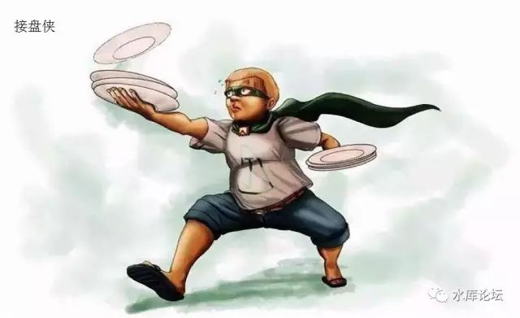

# 交易是不是聪明人的屠杀 \#C40

原创： yevon1ou [水库线下](/) 2018-11-20

**交易是不是聪明人的屠杀 ~\#C40~**

 

在最新一期"知识星球"问答中，有人提到了这样一个问题：

这个问题实在是很有趣，也很有价值。

值得我们展开解释一下。

 

 

 

一）交易

 

首先，我们要问，"何出此言"。

对面立刻一个大蛋糕飞了过来，砸在水库众的脸上，"你都知道，你还好意思问"。

 

譬如说，我们本来身处于一个"平均"的社会。若无意外的话，大家都是死工资。也就是平均15000\~20000/月。

 

 

但是，这个时候，冒出来一个奇异物种"炒房客"。

别人70W的房子，他贷款买进。

过了几年，70W涨到700W，他再反手"抛售"给小白领。

 

一进一出，炒房客净赚630W。

如果多操作2N的话，迅速就可以积累上千万身家。

于是我们的社会，就多了一个"富人"。

 

而相对应的呢，产生了一批"接盘侠"。

别人70W的房子，涨到了700W。

你去700W接盘。祖孙三代，六个钱包，三十年按揭，全部都扑上去，为了一套房子。

 

在民粹份子的眼中，交易放大了贫富差距。

 

几乎每一个田园牧歌的民粹份子（包括你），在上初中的时候，都曾有过不切实际的想法。

要是世上没有交易，或许就好了。

 

大家都说"工商业"致富。然后拼命谴责"贫富差距"。

如果我们在整个社会中，彻底禁止掉"企业家"，禁止兴办工厂，岂不是割了资本主义尾巴。

如果我们在整个社会中，彻底禁止掉"商业"。禁止一切"交易"。那炒房客岂不是不能剥削我了。

 

 

有一群人，将自己的定位放在了"弱者"的位置。

他们认为，和"聪明人"做交易，是肯定会吃亏的。虽然说不出为什么，但终究会被聪明人算计。

全社会的财富，终究会通过"不断交易"，归并到那1%的人手中。

 

如果我不想成为"玩牌输家"那个人。

那我是不是干脆就不要下场。拿紧我的筹码，永远也不要交易？

 

 

 

二）种田

 

如果找一个标准的"奥派"来回答此类问题。例如布尔费墨或者菁城子，他大致会从dT\>0的角度来阐述。

-   虽然富人赚了钱，但你也获得了好处。

-   整体蛋糕做大了。哪怕富人赚99%，你赚1%

-   就算富人占有99%，但全社会的财富，增长不止1000倍。

 

我们应该说，他们的回答都对。也完美地解释了"dT\>0，交易永远有利"这个道理。

但是，今天我们不想从这个角度入手。我们换个角度，从"社会达尔文"的角度，重新阐述"交易"这个概念。

 

因为我们的社会，有一群偏执狂。他们喊出的口号是："哪怕我过得不好，也要害你死"

 

 

今天我们举的例子，是"种田"。

种田，就是最基本的种田。华北是小麦，华南是水稻。

彻底的第一产业，完全不涉及工业，服务业。

 

假设一个村子，它是如此地田园牧歌。所有人种田的水准都差不多。地力贫瘠也差不多。相应的产出、富裕程度也差不多。

这个时候，产生了一个变量："经济作物"。

 

 

经济作物，例如西红柿，西瓜，南瓜，苋菜，橄榄菜，香菜。

请问，"经济作物"你种还是不种。 

答案是，村民之中，肯定一部分人种，一部分人不种。

 

 

"不种经济作物"的人，当然有他们的重重顾虑。

-   以前没见过这些种植物，怕担风险。

-   怕学不会侍候施肥拔草技术

-   怕没有销路，无法对接销售渠道。

 

以上种种，都是需要"复杂技能"的。

对于一个村庄来说，冒失种植"新产品"绝对不是容易的事。销售渠道需要开拓，很容易烂在地里。

而且植物属性不了解，很容易发生大面积死亡。

最后，某些前期投入较大的品类，还需要一笔贷款。

 

因此，村庄里的村民，肯定会分成二派，"改革派"和"保守派"。

 

 

然后你再问，"改革派"和"保守派"谁会占上风呢。

这个还真不好说。

 

因为"创新"这种事，就是失败和胜利并存的。

你看前二年养鸵鸟，养蝎子的，基本全军覆没。但是种黑莓，树莓的，却活得不错。

 

但是，无论怎么说，我们知道村民中，"分出了胜负"。

-   这个胜负，和知识与眼界有关。

-   和沉稳与毛躁有关。

-   和交流与沟通能力有关。

-   和运气有关。运气也是一种强实力。

 

概括来说，就是"优异者上升，无能者下垂"。

 

 

 

三）养猪

 

好了，我们把问题再向前一步。当你开始"养猪"呢。

"经济作物"搞完了。你开始养猪呢。

答案是，"村民"会分化得更厉害。

 

稍微有一些农业知识的人都知道，"养猪"是一门技术活。

养猪，绝对不是每户三五口这样养法的。

 

养猪是绝对依赖"养猪大户"的。猪非常娇嫩，非常爱干净，比女人还爱干净。

养猪，一定要把地面冲刷得干干净净。所有草料彻底晒干，没有霉菌。

 

 

当我们把科技树拨到"养猪"这一栏时，就已经发生剧烈的"阶级分化"。聪明人一定比你成功，比你有钱。

这是生产力发展的趋势，阻挡不住的。

 

然后，你再想一想，把指针继续往前拨到"打铁"，"制造机器"，"远洋贸易"呢。

 

 

 

随着人类生产力的发展，人类使用的工具越来越先进。

只有体力时代，诸人的收入，才是分别不大的。

脑力时代，人类收入，一定是高度金字塔的。

 

什么叫"交易"。做金融的，做博彩的，做地产的，也是一门"高级服务业"。

它和种田，养猪，打铁之类，并没有本质区别。

 

人类可以从事的行业越多，生产力越是外沿。

聪明人越容易找到自己的战场，越容易发挥十倍威力。

 

 

这整件事，是完全拦不住的！

马克思说，生产力必然挣脱牢笼，打破生产关系。生产力无可阻挡。

民粹份子，还妄想取消交易，削足适履，这又怎么可能成功。

 

 

 

四）结语

 

有钱人可以赚那么多钱，是因为在知识时代，"聪明的大脑"，可以发挥普通大脑100倍的威力。

远远超过类人猿在体力上的差异。

 

这个趋势是拦不住的。任何调控或者税收，只能滞碍这个趋势，但完全无力逆抗大势。

 

 

如果你不想被时代淘汰，你就赶紧放弃掉"拉聪明人后腿"这种想法。

而是努力让自己也去当一个"聪明人"。

 

 

 

(yevon\_ou\@163.com，2018年11月19日晚)
