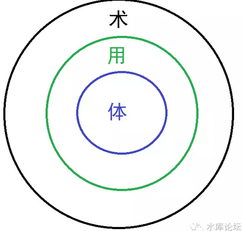
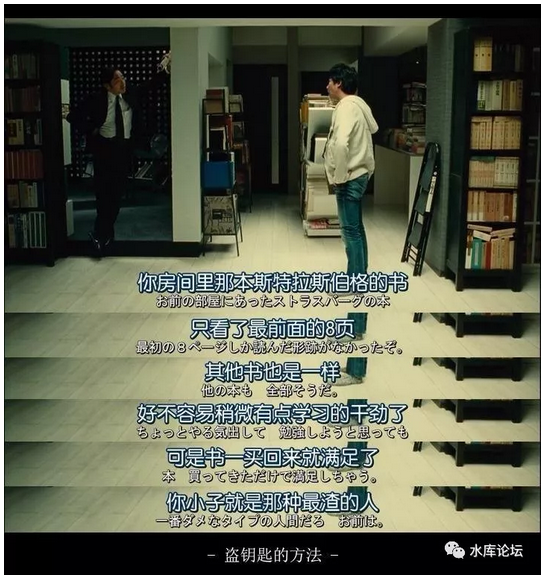
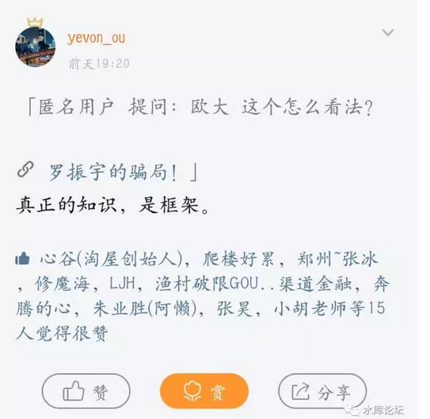
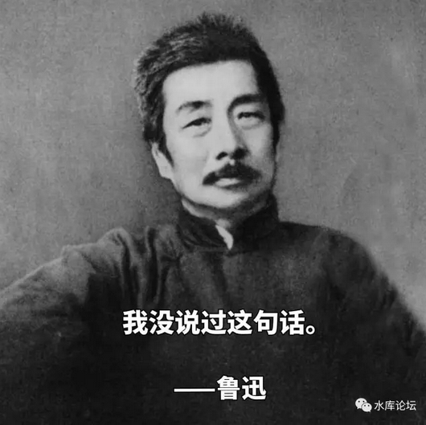

# 知识付费 2.0 \#D01 
-------------------

yevon\_ou [[水库论坛]](/) 2017-11-03

知识付费 2.0 ~\#D01~

最近在《功夫财经》开了一个专栏，所以有了\#D01系列。原文在[[这里]](https://mp.weixin.qq.com/s?__biz=MzIzOTA3NTA5Mg==&mid=2652445912&idx=1&sn=a73f2d830b36a96f54017f5e58a94a39&chksm=f2c216a3c5b59fb5c8a45ca3a544234ad97042307de9b2ff51f88e4d08e44a966ec6247bee64&mpshare=1&scene=1&srcid=1030OhydHxDy4aFKMEWsnDcx&pass_ticket=9F%2B)，延迟一周发水库。

 

为什么你听过很多道理，仍过不好一生。

 

 

一）知识付费

 

前天，朋友圈一篇《[[罗振宇的骗局！]](https://mp.weixin.qq.com/s?__biz=MzI4NTg1Nzc2NQ==&mid=2247483679&idx=1&sn=7780d42830adfb8a0f86cd6dc843856e&pass_ticket=hzTHs8LXsRjiV0QTfDOuVxLcV%2FTofpHcM7AbVU52%2BGA6vgzwN%2FpVZfsTQyXEYQrm)》刷屏了。

作者写了一段很有趣的话：

 

叮铃铃------早晨闹钟响起。

 

他眼一睁，立马抓过手机，打开"得到"，倾听60秒罗胖教导。刷牙与吃早饭时，打开"喜马拉雅"，"完成了30分钟的音频学习。"然后，他出门上班。地铁上，再点开"知乎live""听了三个知名答主的经验分享。"中午吃饭与午休的时间，他又点开了"在行"，"抓紧学习了《如何成为写作高手》。"下班路上，他又打开"得到"，"我在上面订阅了5个专栏。"吃完饭，上床，打开"直播"，"听了李笑来的《普通人如何实现财富自由》。"

 

然后刘刚带着满满的充实感，终于无比欣慰地进入了梦乡。

 

 

你拼命地学习，购买了十七八款"知识付费"产品。

然后你发财了没有，没有。

然后你成功了没有，没有。

你变聪明了有木有，还是没有。

请问，哪里出了问题。

 

和"刘刚"们不同的。我并不看淡"知识付费"产业的前景。

 

我想说，并不是"知识付费"不对。

是你们打开的方式不对。

你们打开的是，"知识付费"Ver 1.0版本

 

 

 

二）国产凌凌漆

 

在周星驰电影《国产凌凌漆》里面，他委托罗家英帮他设计一款"终极武器"，以对抗邪恶的文物贩子。

战斗进行到最激烈的时候，罗家英匆匆赶到，掏出秘器。 

这串是啥，简称辣椒水石灰粉电击棒蒙汗药硝镪水敌敌畏。诸大武器混合在一起，请问你怕不怕。

反派哈哈大笑，那显然是不怕了。

 

反派当时穿了一套刀枪不入的铠甲。

反派最怕的是什么。是周星星手里那把无坚不摧的屠龙刀。

 

 

学问之道，分为"体，用，术"。

 

对于周星星来说，他唯一可以对反派进行杀伤的，只有手里这把"屠龙刀"。

屠龙刀是核心，所有的战术，都应该围绕着屠龙刀展开。

 

然后周星星还会"凌波微步"，他闪闪闪，在枪林弹雨中，硬是没有被打到。最后欺进身去。

这个"凌波微步"，是配合的身法。但靠轻功，打不死反派。轻功是辅助"屠龙刀"的。君佐臣辅之道。

 

而辣椒水胡椒粉之类的，只能起到非常轻微的作用。对于整个体系来说，可有可无。彻底的边缘外围。

 

 

 

三）创业

 

说回到职场和创业。你需要怎样创业？

 

想创业，你首先要找到一个"痛点"。某件事必须是极其极其不合理的，千万人吐槽，而你，想要改变世界。

 

譬如说，你认为每次吃饭，都要找地方停车，是非常不合理的行为。

吃顿金拱门，找停车位来回得半小时，就图买个汉堡。

因此催生了共享单车。

 

 

当你决定了"共享单车"，你接着还需要：

-   自行车设计和制造。

-   物联网USIM定位

-   IT界面的前台和后台

-   财务VC融资

-   企业内部的管理

 

对于这些功能，有一些是你知道的。有一些是你还不擅长的。

不擅长怎么办，外购啊。

 

知识，是一种商品，和京东没什么二样。

根据你的需求，然后再去采购的。

 

 

战略优先于战术。商场上的成功者，一定是先有"战略"。

根据战略，再细化拆解。

你需要哪些战术。哪些功能还不足。哪些知识需要外购。

 

有了屠龙刀，屠龙刀砍人是战略。

但是你无法近身，所以你需要盾牌，或者轻功。这就叫战术。

 

 

 

但是我们回过头来，看《知识付费》1.0的生态呢。

知识付费1.0，就象是罗家英手里的"辣椒水大联盟"。

 

对于篇头的"刘刚"们，他们是不假思索地"乱买东西"。

你说你买了40堂Live课，其实这些课程之间，有什么前后递进秩序，是平行还是分叉关系。

"刘刚"们是一点都不明白的。 

 

《知识付费》1.0的消费者们，怀着忐忑而激动的心情，把市面上所有能买的课程全部都买下。

这种行为，严格地说，应该叫IB，而不是学习。

双鱼座伪装勤奋好学，其实却是懒惰和粗疏。

 

好比一个"三好学生"，跑到书店里，买下几十本名家书籍。

买书如山倒，看书如抽丝。

每一本书，只有能力看完最前8页。这和作秀有什么区别。 

以前有一个说法，作为一个普通人，你一辈子能接触到"干货"最多的，是哪一本书。

是初中物理书。

其次是初中数学和初中化学。都是人类经历无数摸索，火炬和文明。

 

对于真正的知识，他一定是一个"体系"的。

一定需要几十堂课，上百篇的篇幅，才可以把事情说清。

而且还需要老师不断考试，以确保你学会，和跟上进度。

 

 

那些Live，"三分钟学会八大技巧"，都是边缘化的小"术"。

单独的每一篇，或许都很精彩。为了销售，也憋足了噱头。

可是珠玉不能成串。它们是连不起来的。

都是皮毛，搭不出骨骼，更搭不出巨兽。

 

碎片化学习有用的话，还要大学干什么。

 

 

 

四）知识付费2.0

 

什么才是真正的知识。

真正的知识，一定是有"框架"的。

漫无目的的知识，那不是学习，那是玩。

 

 

真正的知识，首先你需要一个"咨询"。

需要有一个人，根据你的情况，根据你的性格，根据你手里的牌。

升学，求职，创业，结婚。

设计出一个"战略"。 

 

-   想要去澳大利亚留学。

-   英语考试，是要考IELTS还是STIC

-   学分需要到多少。如果不足，从哪一课补足入手。

-   怎么写课外活动，要不要去做义工，或者练习篮球。

-   学费需要多少，需要打工么。

-   海外有没有亲戚，叔伯前辈可以照顾。

 

根据这个"战略"，然后确定你的短板，有意识地去购买。

缺什么，补什么。

千万不要胡乱乱买。除了[浪费你的时间]精力，没有任何裨益。而时间，是很宝贵稀缺的。

 

你必须对自己购买的每一项知识，都心知肚明。

 

人生就象一幅拼图，或者一座钟表。

技能是一块块拼上去的。赘肉并不需要。

 

 

 

五）战略

 

战略值多少钱。

我们的回答是51%

战略不对，终身无效。

 

 

很多人都有这样的经验，你的工薪族父母，省吃俭用，几年不买羊毛衫。

400元/小时，让你去学钢琴。

你也不喜欢钢琴。忍受重重枯燥无聊，耗费了你大半童年，才考出专业九级。

 

很抱歉，这个就是"无用功"。

我可以很明确地告诉你，"弹钢琴"和上流社会，是没有半分联系的。

弹钢琴，和陶冶情操，也是没有半分联系的。

在上流社会眼里，钢琴就只值四个字："娼妓之道"。

  

从你母亲决定让你去学钢琴那一刻起。

你家所有的省吃俭用，你的所有童年青春，都已经注定了毁灭。

而这件事，是不随你弹得更认真，学得更认真，会有任何改变的。

战略上的疏忽，是不可能靠战术上勤奋来弥补的。

 

 

战略有多值钱，51%

战略的价值，比"战术"的总和49%还要高。

关于"战略"的知识，才是真正的知识。或者说，全人类有一半以上的知识，你全然无知，懵懂无知，连天外天都不知道。

 

 

从小到大，你们家的"战略家"，是你妈妈。

你母亲以她[中年妇女，家庭妇女]的眼光，为你制定下了一生的"战略"及总体规划。包括但不限于；

 

-   首先，高价买个学区房

-   学钢琴，学芭蕾，学上流社会的一切作风

-   重点小学，重点中学，考大学

-   可能的话，"出国"是最高荣誉。

-   学成归国，做个白领。

-   体会"轻奢"，过有品位的生活。

-   信奉女权，独立，坚持择偶规格

-   上知乎回答问题，做大V

 

恭喜你，如果你成功做到以上一切的话，你就是一个：

 

24K纯屌丝

 

你的人生，惨淡无光。一辈子没有任何成就和出息。

对于你的家族，你就是个巨大的悲剧。

你父母在你身上倾注了无数的成本，"回报比"极低。一个中产阶级，烧光毕生积蓄，锻到炭心，只剩下一个："白骨精剩女"。

 

 

 

六）结语

 

战略才是真正的知识。

对战略的学习，才是《知识付费》2.0，然后再依次补充血肉，缺啥补啥技能。

 

你的母亲，是最拙劣蹩脚的"家庭战略师"。

只有贵人大师，才会调教出你的武林秘籍。

 

有钱人真正赚钱的方法，那是不卖的。

 

 

这次《功夫财经》邀请水库来开一个专栏。\#D01系列，这是第一篇，共十篇。

台下观众伸长了脖子，"铺垫这么久，是不是要教战略啊"。

 

对不起，我没说过这话呀。亲。

我说的仅仅是："别人全部都是错的"。

 

 

（yevon\_ou\@163.com，2017年10月26日晚）
