# 赚多少钱，才能带给你安全感 \#D04

yevon\_ou [水库论坛](/) 2017-12-06

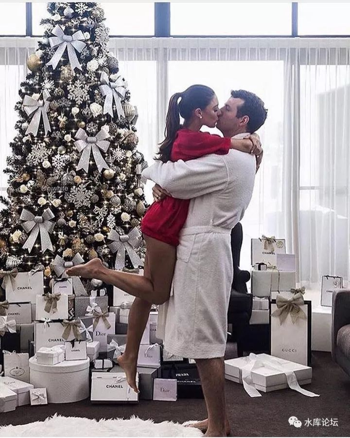

赚多少钱，才能带给你安全感 ~\#D04~

做完这一笔，就收手。

 

 

一）财富自由

 

今天这篇，又是命题作文。因为《功夫财经》的小妹妹，问我"[40岁时，要攒下多少钱](https://mp.weixin.qq.com/s?__biz=MzAwNzM3NzU4OQ==&mid=2650701452&idx=1&sn=48c51f5d616373f58f008ebc435cb533&chksm=8375d956b402504008c533df53e90a557edc89b6cb55ecdcb986d560e77434f25b8004a6be48&mpshare=1&scene=21&srcid=1128BxoyXmrc78k4iTtyolX5&pass_ticket=Ga5kb#wechat_redirect)"，才能有安全感。

 

俺感到奇怪，我说你连30岁都不到。问这么遥远的事干嘛。

她说，她要买一个回形针。 

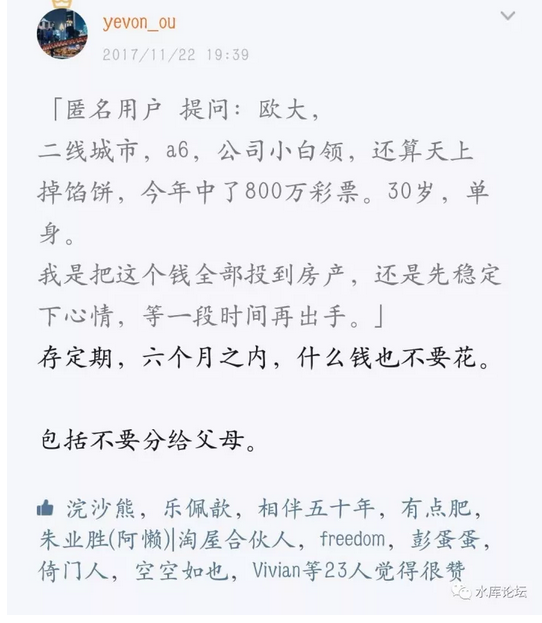

坦白说，我一直很羡慕知乎上那帮人，过着神仙般幸福的日子。

知乎上有一个很热的帖子，讨论"多少钱才可以实现财务自由"。\[1\]

 

讨论的结果，是100万。人民币。

支持的一方，振振有词说道，将100万元存放于银行，吃定期利息。

找一个"诚实可靠"的投资理财，每年获得5%回报。

一年就是5W利息。

 

知乎众列出了巨长的报告，证明一个月4000元，在中国的"人均排名"，已经到了xxxx位。

证明北京上海平均工资，只有6378元。

证明自己买块猪肉回家煮，比饭店里吃得更好，更健康，更卫生。

 

"我下面给你吃吧"，菜场买菜买猪肉。平平淡淡的日子，宅在家里不是挺好的么。

省一点花，4000元/月，可以过小日子了。

 

 

哥哥得出结论是，丫个屌丝社区，几百个跟帖的人，连100W都没见过。实在惨不忍睹。

你别说100W了。就算是"一个月赚100W"，难道能收获幸福么。

 

"王者荣耀"团队，年终奖发了120个月奖金。

后来辟谣了，码农含蓄而矜持地笑道。没那回事，纯属谣言。

明明发的是"季度奖" 

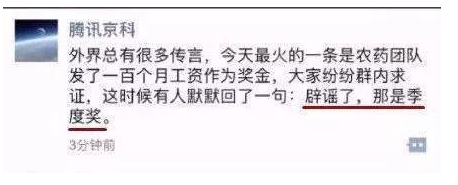

请问，大彩票中800W，感觉是什么。

一个月"奖金"100W，感觉是什么，

快乐么，豪富么，幸福么。算暴发户么。

好像也不见得么。

 

800W元，买套豪宅都不够啊。

 

 

上个月，南京，还不是上海，河西"十盘齐开"。

由于政府的限价，KFS太过于热销。财大气粗，规定不许贷款。

想进售楼处，先开贰佰万的本票"存款证明"。

 

亲，您有100W，只能去门口挪共享单车。

全款买房的往里走，按揭的不要堵门口，公积金贷款的请把共享单车挪一挪。

 

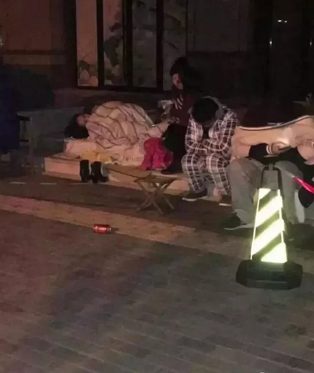

KFS说好了"九点开盘"，半夜里就有人前来排队。

1000万一套的房子，千万富翁。全款

大富翁就带着牙刷牙膏脸盆，毛巾被套睡袍。

大冬天就睡在马路上。

 

我不和您说。

城管大队还以为是乞丐呢。

 

 

曾经，你的愿望是吃饱。你的"财务自由"标准是有猪肉白菜。

你计算4000元/月就够了。能买三斤猪肉就够了。

 

可是等你一个月赚二三万，一年赚50W，甚至一次性单笔赚100W以上。

你突然又发现，人生中还有很多比"猪肉饭"更重要的事。

例如，买套房子。

 

屌丝时代是想也不敢想房。

现在敢想了，只不过买得很吃力。

 

 

 

二）A8.5

 

好了，我们继续升阶。

房子的事Over，买房再也不是你投胎中的一道坎。

 

人生就像游戏

哥打怪升级二十载，至今买不起坐骑啊！！！！！！！！！！

我卡在买房那关了，兄弟们有秘籍没啊\~\~\~

ls你输入作弊码my father is ligang了没？

求hard模式掉落物品表！\[2\]

 

比A8更高一阶的，是A8.5 \[3\]

5000W净资产。也是很多意义上的京沪"财务自由"。

 

当你初刚到A8时，你是尴尬而犹豫的沮丧。

你站在富人的门口，能透过门缝，看见一条线。但本身又不属于其中一员。

人生的洗刷，莫过于此。

待富者还不如王大锤的心态平和。

 

"中产阶级"几乎费尽了一切心机，来模拟上流社会。

在所有的社会阶层之中，"贫民上层"是最注重道德的。

而"中产中上"，是最注重bigger的。 

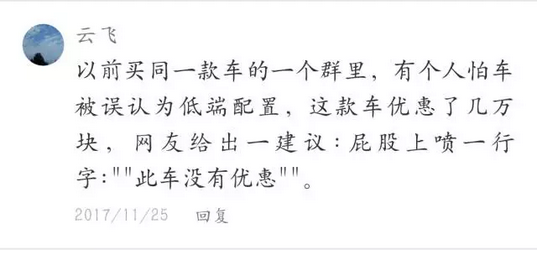

但是A8和A8.5之间，区别也是巨大的。

具体来说，你可以"偶尔"模仿尝试一下。但绝不敢真正使用。

 

一个人净资产达到了5000W，他就可以完全脱离生产。

再也不用上班。

每天去古北水镇，喝冰镇红酒，夜观司马台长城。纵情笙歌，享受不尽。

 

而一个1000W身家的人呢，他只能选择"长假期"的时候去一次。

黄金周七天，待得正舒服。

你在那里心急火燎地打包行李回北京。人家悠闲地继续"放假"。

这股心情，就象是8月31日"暑期开学"，别提多难受了。 

 

"闲暇"，她是如此芬芳。

一经体验，就沉醉再难以自拔。

别和我谈什么理想，我的理想是不上班。

 

 

 

三）通货膨胀

 

等你终于赚到了5000万。等你终于靠吃利息，也能在"京沪"等城市，过上每天花五千的日子。

"钱"够不够，能不能让你过上安心的日子。

 

答案是：还不够。

你反而更焦虑了。

 

 

对于A8.5来说，他焦虑的是"通胀"。

 

没钱的时候，想吃肉。有了钱以后，想买房子。

买好了房子，想富贵。拥有了富贵，想长久。

 

2004年我写"大排面30元一碗"。当时的普通肉酱面，大约5\~6元即可。

到了2017年，康师傅牛肉面，味千拉面，随便一碗面，就是38元。加碟溜醋木耳，就是44.

 

很多朋友问我对未来怎么看。我说："100元啊"。

一碗面条100元的时代，迟早来临。

 

 

穷人的弱，是全方位的弱。

富人的强，是全方位的强。

 

知乎那群蠢蛋在讨论着"100万元放银行，每年利息5%"

哥哥嗤之以鼻。

 

等你爬到了，等你爬到更高的社会阶层。

放眼望去，你会知道，远方还有更多不可知的危险。

 

那些山坳里兴高采烈烤浆果的愚夫。

在我们眼里，就和猴子野人没什么区别。 

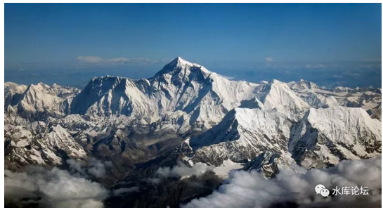

雪峰将倾，天地洪荒压迫过来时，没有什么力量可以抗拒。

 

 

通货膨胀的速度，大概是"每10年三倍"。

水库论坛曾经说过，财富每差三倍，社会差一个阶级。\[4\]

你付首付的压力，别人可能就是全款。

 

当"通货膨胀"存在时，每过十年，你就下降一个"阶层"。

二十年时间，A8.5退化成A7.5

 

2002时，有几位叔伯高官，退休攒下2000W。当时觉得高不可攀。

放到了2017年，已经彻底泯然众人。

 

 

当你真正爬到A8.5，五千万富人这种"社会精英"的层次。

你心里明镜般的明白，富贵不能持久。\[5\]

 

你眼前的富贵享受，如过眼云烟一般。

1980年代的万元户，坟头都不知道换了几波草了。

 

一不留神，一个风口没赶上，例如没投资房地产，或者没看好互联网。

分分钟被淘汰为二流富豪。

 

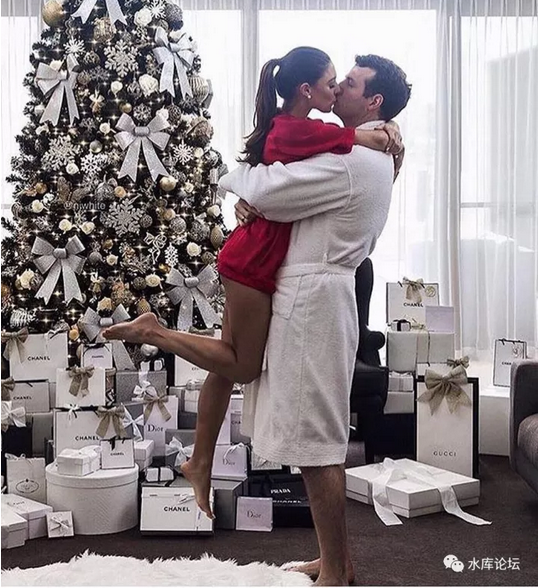

那怎么办呢。你有二个办法；

 

1）继续工作，努力跟上时代的步伐。其实这种情况，你并没有"退休"。

2）赚足够多的钱，败到你这一辈子也败不完。

 

譬如说，我们想多活30年的话，则"通货膨胀"应该是30倍。

大排面1000元/碗左右。

 

"体面退休"的阈值是RMB15亿。

 

 

 

四）首富

 

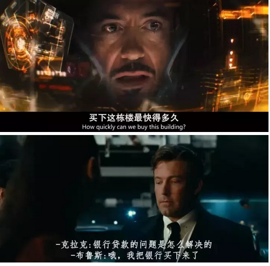

假设有一类更强的富人。例如思聪少爷。

他的钱已经多到了如此地步，再怎么败，也不可能把全国各地一百多个万达广场都败完。

 

这类雄踞人类"财富"顶端的稀有人群。

他们钱够了么，能获得充足的安全感么。

 

 

这二天，全世界几乎所有的外媒媒体，都被一颗叫Oumuamua的小行星刷屏了。

这颗小行星，刚刚擦过了水星轨道。

会以一条极其诡异的轨道，经过地球，火星，土星，木星。

 

距离非常非常近，贴身而过。

但又完美地不和任何一颗大行星发生碰撞。

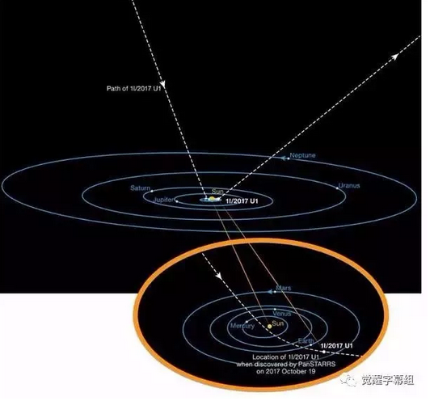

更神奇的是，这块小行星，有着前所未有的形状。

长宽比大概是10:1，而不是球型。

 

他不是彗星，本身是石块表面。这已经十分罕见。

而它的密度，又和岩石对不拢。其内部很可能是中空的！

 

这么细长杆的雪茄型，还绕着自身飞速旋转。

学物理的人立刻就知道，人造重力！ 

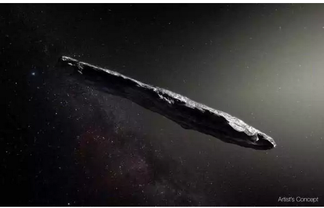

这样一枚飞行器，一经飞入太阳系，天文界顿时就炸锅了。\[6\]

全世界的长枪短炮，对着Oumuamua一顿狂拍。

这是啥东西，外星人摄像艇啊！

 

可惜的是，由于人类科技实在太过于落后。

Oumuamua再过一个月，就要脱离人类的跟踪视线范围。

 

但是我想对于比尔盖茨，唐纳德·特郎普这样的人来说。

应该也会睡不好觉吧。

 

 

曾经有人问小布什，美国的国家目标是什么。

布什回答说：Security

中文译：安全。

 

对于一个国家，一个财团，当他已经如此富有。一切的物质财富不可再缺。

他要追求的，依然是"安全"。

 

永恒的富贵，永恒的享受。

美国的军舰造成，用途是打外星人的。

  

而事实结果呢。美国能享受安全么。

不能。

无论你多么强大，始终不会有100%的安全。

 

 

 

五）结语

 

赚钱这种事，就象是升级打怪。

你充了200点人生值进去，以为升了装备，正科提副处，从此过上幸福的人生。

 

而事实的结果呢，你升完处级，你就会认识"处级"的朋友。

在和他们的交往中，你的灵识会打开，见识会扩展。

"哦，还有这样的天地"。

 

 

象网游打Boss，Boss打不完的。

《魔兽》曾经最高等级40级。40级升完又有60级，60级后面还有80级。

 

随着你越爬越高，你的眼界越来越高。

越高的眼界，带来更多的不安全感。

 

佛教说，"四大皆空"，五色令人迷。

因此哥哥教你一个秘诀。

 

要不您把钱给我吧，你的烦恼，我来承担。

让贫穷，限制你的想象力。少知少恼。

 

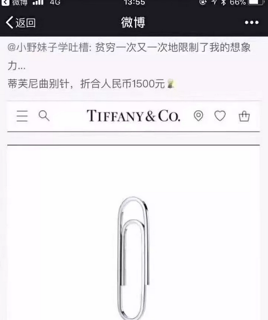

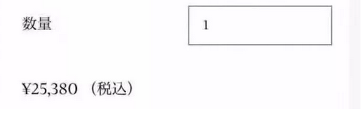

 

 

（yevon\_ou\@163.com，2017年11月28日晚）

 

 

\[1\]《300万存款在四线城市能实现财富自由吗？》https://www.zhihu.com/question/57430325

\[2\]《我卡在买房那关了，兄弟们有秘籍没啊\~\~\~你懂的》http://blog.renren.com/share/220972864/5134036045

\[3\] A8指Asset 8位数，即1000 0000元。A8.5指5000 0000元。

\[4\]《[向上爬](http://mp.weixin.qq.com/s?__biz=MzAxNTMxMTc0MA==&mid=206545656&idx=1&sn=3aefae067586f6dba726a16ddaaeeceb&scene=21#wechat_redirect)》https://mp.weixin.qq.com/s?\_\_biz=MzAxNTMxMTc0MA==&tempkey=OTMyXytUMW5kUHNaVUlmaSsvcHdhSlRsTUxsaGN4Q202RFdEOG1hN3dPZWcyZEpwSU1jTzFFYkhGX24wa0VYY1JISEQxVWFoTF9KeDcxdVdDZmgxc3VKTXIxeEl2clNxd0FfdFR6VkdmR2ZJMS16Uk00VFVxT3VIekZvX2pQT1VaT2pxdWc1OC1JdllHRDZNeTdKaW1pY2JwVjFrWG5rd1B3TlllSDJiOUF%2Bfg%3D%3D&\#rd

\[5\]《红楼梦中贾府衰败都是哪些原因导致的？》https://www.zhihu.com/question/68685110/answer/266718381

\[6\]《今天世界主要媒体被 Oumuamua 刷屏了，你怎么看？》

https://www.zhihu.com/question/68420451/answer/265688344

写在后面的话：

 

\#D04这篇，是给《功夫财经》的专稿。

如果你仔细研究的话，你会发现，\#D04从"标题，选材，内容"都是精心挑选的。目的就是针对《功夫财经》中产阶级。原文链接在[此](https://mp.weixin.qq.com/s?__biz=MzIzOTA3NTA5Mg==&mid=2652447283&idx=1&sn=f1f9f12cea99faf56c954e1a336a5cbc&chksm=f2c22848c5b5a15e1856b5023a1f50b57e9b6e2a6501033ce57170ffa6045fb70008be2db013&mpshare=1&scene=21&srcid=1205dnQ4z4Fe3Az3wbjjC4fi&pass_ticket=uqe0D#wechat_redirect)。

 

而这篇发出之后，截止发稿之时，阅读很不理想，只有85000。没有冲破100000+

和《功夫财经》小妹复盘之后，小妹提出，她们的读者"比较脆"。

 

比较脆，这是什么意思。

意思就是，你不能捧着他好好说话。你要大声地呵斥，老师的地位崇高无上，要抽学员的脸，越疼越好。

就象罗振宇上台说，"你们全是错的，一个新的时代，从此开始了"。

李笑来推销Press One，说"反正白皮书你们也看不懂，不如不解释了"。

然后学员们会鼓掌，心悦诚服。老师就是NB。

 

哦，这样Masochism的人设，倒是很少见啊。

Marketing的最主要一条原理，就是根据不同的消费者，提供不同的产品。

此后的\#D系列，会不断加以摸索调整。直到找到最适合的路线。
