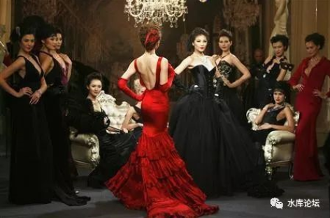
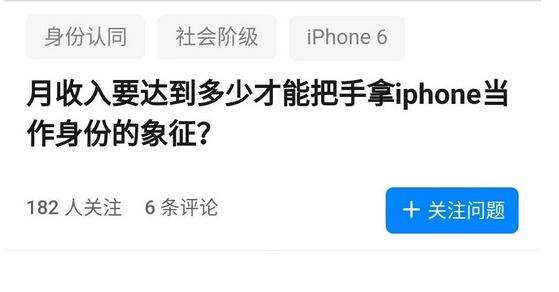
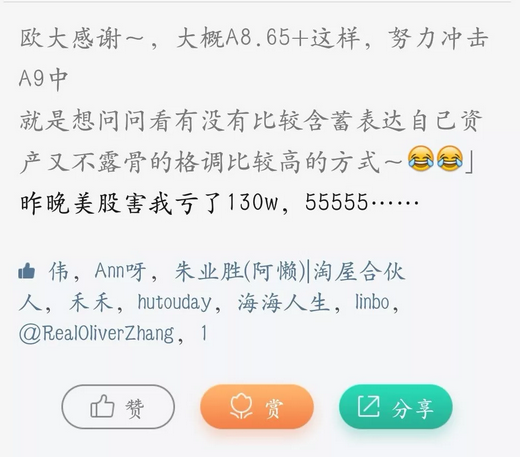

# 你的眼神背叛了你的钱 \#D05 
---------------------------

yevon\_ou [[水库论坛]](/) 2017-12-22

你的眼神背叛了你的钱 ~\#D05~
============================

 

水库论坛，连续写了二篇《[[代持流]](http://mp.weixin.qq.com/s?__biz=MzAxNTMxMTc0MA==&mid=2651016603&idx=1&sn=3bfcc1a0051b41242d545861b089f93b&chksm=80721b88b705929e1092b16595bddc1fdcfb01403ea4e883da1cc3e0bb93646bb257789ba00f&scene=21#wechat_redirect)》和《[[拖延流]](http://mp.weixin.qq.com/s?__biz=MzAxNTMxMTc0MA==&mid=2651016620&idx=1&sn=8069f3b9580598d13ba67e0b6d3edb0e&chksm=80721bbfb70592a94abba6201a528d285457baea95f7c31d6727a4d9cabced2fc6e8a75f2c55&scene=21#wechat_redirect)》文章。

可是流派干货，阅读量并不见涨。

 

《功夫财经》小妹问，"老师，要不你写写有钱人的生活，和平民有什么不同"。

"无论我怎样伪装，为什么你一眼就可以识穿"。

  

 

一）走秀

 

四年前，我飞了一趟越南。

对于哥哥这样的人，越南的意义，仅限于总统府周边，很小一块区域。凡是没有大理石铺面，一概都不会去的。

 

因此到了晚上，百无聊赖，俺就缩在宾馆里看电视。

电视节目，大概相当于中国80年代的水平。

那天晚上，正好是一个"走秀"的时装花饰节。

 

 

看着看着，我就觉得不对劲。

也说不出哪里不对。总之就是怪怪的，总是就是浑身别扭。哪里也不对。

 

国家级的模特儿，颜值实在不低。

越南最高等级的时装秀，一步一颦都是拿钱堆出来的。灯光效果，看来也砸了血本。可就是不对。

 

看着看着，一直看到"泳装"部分出场。

二个裹着棉袄一般的少女，手里拿着网球拍，走到T台尽头，低头对你一笑。

哥哥猛地一拍大腿，"是了"！

 

 

哪里不对劲，因为模特儿的眼神，太"媚俗"了。

她们穿着裙子，低着头笑。

她们穿着冬装，低着头笑。

她们穿着晚装，还是低着头笑。

就象中国80年代的大妈，不管拍什么照片，永远挂着拘谨而羞涩的微笑。

 

她总是试图想要取悦你

 

衣服是很容易换的。硬件是很容易换的。可是"软件"无法模仿。

越南没有独立的模特业。

当地模特的一姐，也没有每年几千万的收入。走到哪里都挺胸昂腹，姐自己就是豪门。

 

越南的模特儿，在人格上是不独立的。

因此她就走不出那股"女王范"。

 

真正的高级模特，走路应该是"空灵"的。

姐本身就是公主，我不需要取悦任何人。我就是高兴，我就是喜欢，所以在这里T台走秀。

模特的眼神中，泛着冷漠。

  

而你无论拍照，走秀，社交。

你一旦试图"取悦"别人，一旦换上那副谄媚的笑容，你的境界就低了。

就和80年代国营百货商店售货员大妈毫无区别。

 

 

 

二）朋友圈

 

说回到微信的"朋友圈"。

在朋友圈内，要甄别谁是有钱人，谁是穷人，是非常容易的。

 

-   如果你不是千万富翁。

-   想要模仿千万富翁的生活方式，那是千难万难。

 

 

朋友圈怎样算上流生活，开Audi A6的算不算。

拎着Hermes限量版Birkin，算不算。

秀地中海隐秘海岛度假，算不算。

 

答案是，以上都不算。甚至正相反，这些都是穷人。

朋友圈判断贵富的标准，主要是"赞叹"。

 

永远不要炫耀

永远不要炫耀

永远不要炫耀！

 

炫耀的意思，拍照发朋友圈的意思，是你以为"这件事"很重要，值得拍照留念一下。

因此这件事，就成了你的"上限"。

 

 

譬如说，漂亮小女孩子，拍照秀五星级酒店高档的食厨。

新天地酒吧吃顿饭很贵么，几百元而已。

你拍照了，你"赞叹"了。说明这件事对你"很珍贵"。

因此你的档次，月薪五六千最多了。

 

飞一趟法国，拍几百张照片。

是胶卷少么，还是出国太稀缺。

 

 

又譬如说，你买了辆60W的C级车。

你激动万分。又是拍轮胎，又是拍内饰，一天发八次朋友圈。

那只能说明一个问题，LowB。

 

当然，集大成者，还是知乎上的这个问题；

 

炫耀这种事，核心在于"秀什么缺什么"。

永远也不要跪舔任何事，你赞美了，就说明这事对你很重要。就说明你的上限。

 

因而，正确的姿势是什么："冷漠"。

炫富的正确姿势，永远是冷漠。

 

 

真正的贵族，看待这个世界，态度应该是"厌倦"。

山珍海味，吃的喝的，都见识过了。"深深的厌倦"。

 

不管是五星级酒店，豪华跑车，海景别墅，盛大的宴会，股票翻十几倍，总统接见，企业上市，你的反应，永远都是冷冰冰的。

"哦"

 

 

 

三）秀场

 

可还是有人说，老师啊，不行啊。

俺就是忍不住，俺就是想炫啊。

 

如果你一定想要低调而豪霸地炫富，辗轧身边不长眼的。

那应该怎么办：炫亏损。例如这样：

 

聚餐，一桌人围着吃饭。

有一个人，炒股炒汇炒比特币，吹嘘他一个晚上赚了100W。

你冷冷夹起一块牛肉，眼神空洞说："昨天晚上亏了100W，真搞笑"。

 

你说，谁档次更高。

谁立升更强。

 

 

"赚钱"的那个人，他把赚100W拿出来说，那就落了"下乘"。给自己设了一个上限。

譬如说，普通人不会在乎每晚涨跌1W。

乘以十倍，这人的财富，估计也就5000W数量级。

 

但是讲"亏钱"的人，那是深不可测啊！

财富要到了什么级别。才可以一个晚上亏100W。丝毫不觉得心疼，反而觉得很有趣，很好笑。

能拿出来当个段子说。

 

要是有这个胆子的话，

换作您，哪怕亏1.3W，也要胸痛郁闷好一阵子吧。

 

 

-   不触发财富上限

-   不引发众人妒忌，引发同情

-   留无限想象空间

 

真正的A9朋友圈，他们是绝不可吹嘘自己"赚了100W"的。

你一吹嘘，一肯定，就落了下乘。

他们一定是竞亏了多少钱。

 

"上周又亏了一辆宾利"

"昨晚美股暴跌，身家缩水几百万"

"某个项目没有投，亏了好几个亿啊"。

 

 

 

四）装备

 

"装富，炫富，混迹于富人圈"是一个系统工程。

中产阶级通常，很难为富人圈接纳。因为他们不懂富人圈的游戏规则。

普通的白领小女孩，想要嫁给社长，那是千难万难。

 

对于小女孩来说，最大的忌讳，是浑身上下只有"一件"名牌。

这里面的关键词是"一件"，而不是品牌。

贫穷，会从每一个角落散发出来。

 

 

一般来说，目前主要流行二种趋势；

-   要么你浑身上下，全部都是名牌。

-   要么你浑身上下，一件也没有名牌。纯为穿着舒服。

 

有钱人分二种，讲究的和不讲究的。

讲究的是前者，不讲究的是后者。

 

 

中产阶级最大的忌讳，是身上只有一二件名牌。而刻意"突出"名牌。那真是衰得一塌糊涂。

在保罗·福塞尔所著，著名的《[[格调]](http://mp.weixin.qq.com/s?__biz=MzAxNTMxMTc0MA==&mid=2651015503&idx=1&sn=8d40f458b2aa846f91860f5fbff04be9&chksm=80721f5cb705964a738e55c262aba8e436bf908c6550ef578398fc7313e4602b923df5b1fc26&scene=21#wechat_redirect)》一书中，他写道：

 

确定某人究竟是中产阶级还是上层贫民成员有一条普遍适用的原则：此君的工作服和"最好"的衣服悬殊越大，所属等级就越低。

 

简单点来说，你身上最好的一件衣服，和最差的一件衣服，其差距倍数。决定了你的阶层。

倍数越大，阶层越低。

 

穿衣打扮，不是看你用什么名牌。

而是衣裤鞋帽包，看你最好的一样，和最差的一块，差距越大阶层越低。

 

 

插一句题外话。

-   乔布斯几乎永远穿同一件裤子。因为他这个颜色的Jeans，一共有52条。

-   我们这有个叫恰空的，买了31件衬衫。

 

 

 

五）花钱

 

如果你一切安置妥当，从头到脚，每一件衣服指甲都合乎典范，无懈可击。

有钱人还是可以轻易地把你踢出"同类"。

 

因为他们从你身上闻到了大葱葱油饼的味道。

你是坐地铁来的，而不是有专职司机。

有钱人还有最后，也是最难过的一道关："花钱"。

 

 

上一次，俺LP公司开年会。美国大老板突发奇想，把会议地点设在了河内。

哥哥作为"陪读家属"，懒洋洋地一起蹭飞机去。缩在酒店里看电视，整一副内务奶爸样子。

 

一直到某天晚上，六个贵妇相约出去喝酒。喝到有点醉不动了，再让我去接。

五个贵妇再赶下一场。便让我买单。哥哥看也没看，2000W越盾。

于是她们知道了，社交场合平起平坐。

 

 

有钱人的世界，充满了意外和挥霍。

那天晚上，如果你没有出去喝酒。又或者喝酒的时候，哥哥手机不在身边。又或者有其他同事熟人。

走开了，碰巧了，你就不用付这2000W越盾的账单。

 

但是碰到了，便付了。

你只有在一切小节上，全都云淡风轻。千万不要斤斤计较，也不要挖空心思算计躲避。

 

这样一种"缺乏效率"的生活模式。

才是有钱人的根本差异。

换句话说，如果你只有一二万的工资，你根本不敢这样花。

 

会让中产阶级彻底破产的无效率生活方式，

才是有钱人的真正壁垒

 

有钱人和中产阶级的区别，不在于有钱人可以去蔚蓝海岸度假。你也去得起，也能发朋友圈。

而在于有钱人，可以承受一场"说走就走的旅行"。

 

今天晚上大家说法式蜗牛不错。

后天早餐，他已经出现在欧洲的古堡了。

"说走就走的旅行"，意味着你不可以等很久，去抢一张打折很深的机票。

意味着酒店，食宿，全都没有预定折扣。有时候甚至是溢价。

能承受原价的才是有钱人，打折的大衣不算。

生活中的这种无效率，才是构成有钱人的真正壁垒。

 

年轻女孩子混有钱人圈子，就要准备这种￥3000\~5000的无效率行为。

每年，一百多次吧。

 

然后你再想一想，有钱人还有一个杀手锏。"想多待几天，就多待几天的旅行"。

你一个工薪上班族，凑什么热闹啊。

 

上海人有一句老话，"判断一个人是不是小开，不是看他的头发梳得多光亮，而是看他的皮鞋擦得有多亮"。

在有钱人的圈子，从来不是看你的"豪车"有多贵。而是看你有没有独家司机。

 

 

六）结语

 

中国的媒体小编，传统叫"月薪8000的小编，教导月薪3000的人，月薪20000人该如何生活"。

《功夫财经》小妹问，"那知道了这些游戏规则，是不是就可以包装，带着有钱富二代一起玩了呢，拉伙做生意"。

 

 

哥哥叹了口气，随手指了一张照片。

"你看这一桌人吃饭吧"。

"A全部的身家，最值钱的，可能就手里那部iPhone X"

"B不动声色地，把Chanel包包，转到正对光照面"

"C把YSL唇膏放桌面上干什么"

"D一直在捏手中的Tiffany戒指"

[整桌人全是装的。]

[\
]

 

你身边都是一群A7.5，哪怕知道有钱人的规矩，你做给谁看啊。

 

洗洗睡吧。

 

 

 

（yevon\_ou\@163.com，2017年12月14日晚）

 

基于水库次文"一半是广告，一半是文章"的原则，我们混杂着发。

今天引介的，是奥派经济学一位新起之秀：张是之

他上周写的《[[欧洲已死，有事烧纸]](https://mp.weixin.qq.com/s?__biz=MzA3MzQxNTE4Ng==&mid=2651567717&idx=1&sn=824d42d116f1b6171a873009fd592dbc&chksm=84f07918b387f00eef677f2e56bd33a58664062a8b2336b387fd3ee423354ff81195d3e8e901&mpshare=1&scene=1&srcid=1221YYlKdgAj2H4QsNg30OJX&pass_ticket=RlXCSSozZ1j0Hg6TsLeUpAb%2F5hEWZmvKPLe%2FI5GkrajKI2BoKj1lXb88ReqaWVT7#rd)》令人惊艳。可是这家伙实在太穷了，后半段贴了广告，令我没法转发。

今天次文，转了他另外一篇文章。欢迎关注奥派。
